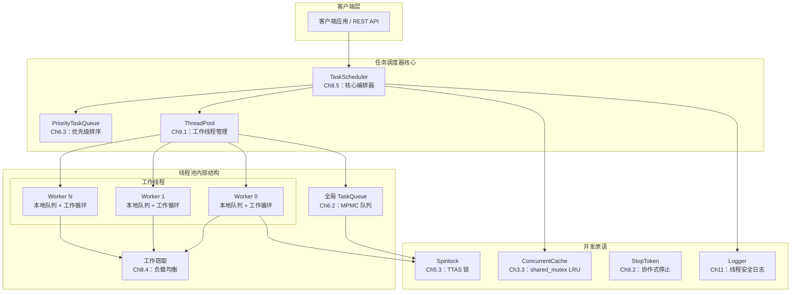
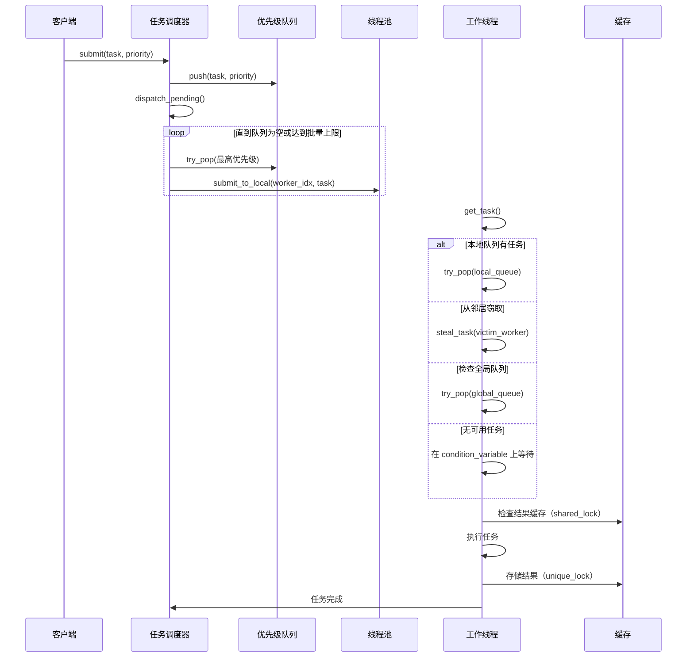
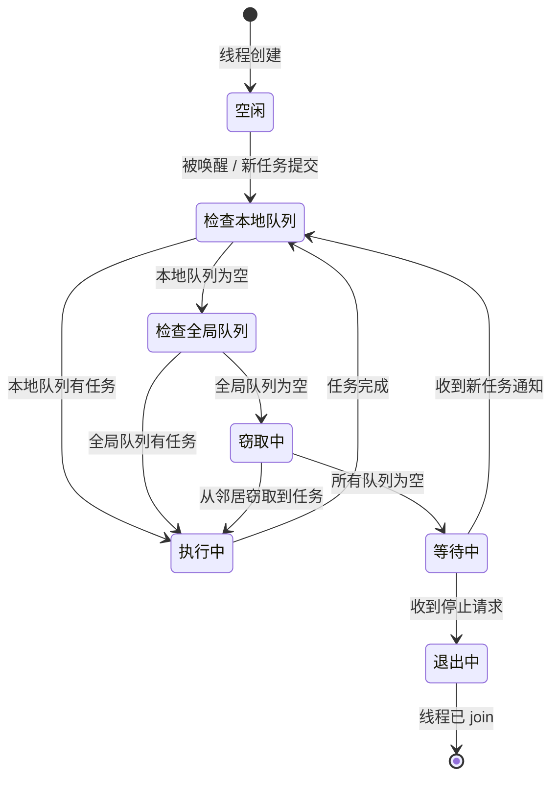

# 架构文档

## AI/ML 算子推理任务调度系统

---

## 1. 系统架构

## 2. 任务调度流程

## 3. 线程池工作流程

## 4. 模块与章节对应关系

| 模块 | Ch2 | Ch3 | Ch4 | Ch5 | Ch6 | Ch7 | Ch8 | Ch9 | Ch10 | Ch11 |
|--------|:---:|:---:|:---:|:---:|:---:|:---:|:---:|:---:|:----:|:----:|
| `spinlock.hpp` | | | | X | | | | | | |
| `stop_token.hpp` | | | | X | | | | X | | |
| `task_queue.hpp` | | X | X | | X | | | | | |
| `priority_task_queue.hpp` | | X | X | | X | | | | | |
| `concurrent_cache.hpp` | | X | | | | | | | | |
| `thread_pool.hpp` | | X | X | | | | X | X | | |
| `task_scheduler.hpp` | X | | X | | | | X | X | | |
| `logger.hpp` | | X | | X | | | | | | X |
| `main.cpp` | X | | | | | | | | | |
| `test_*.cpp` | | | | | | | | | X | |

## 5. 性能考量

### 5.1 锁竞争层级

| 竞争级别 | 组件 | 策略 |
|-----------------|-----------|----------|
| 极高 | Spinlock | 带指数退避的 TTAS（Ch5.3.3） |
| 高 | 任务队列（全局） | 单 mutex，批量操作（Ch6.2.5） |
| 中等 | 优先级队列 | 单 mutex，O(log n) 堆操作 |
| 低 | Logger | 原子变量快速路径检查（Ch11.3） |
| 极低 | 缓存（读操作） | shared_mutex 支持读并发（Ch3.3.2） |

### 5.2 设计权衡

1. **简洁性 vs. 性能**：选择基于锁的队列而非无锁方案（Ch7），以保证正确性和可维护性
2. **工作窃取开销**：随机选择受害线程（O(1)）vs. 顺序选择（O(n)）。随机化以较低的竞争换取更好的公平性
3. **优先级反转**：单 mutex 优先级队列避免了优先级反转，但出队操作会串行化。对于中等队列深度是可接受的
4. **缓存一致性**：TTAS 自旋锁先进行只读轮询（L1 缓存共享状态），仅在锁似乎可用时才尝试原子写入

## 6. 扩展方向

1. **无锁队列**（Ch7）：用 Michael-Scott 队列替换基于锁的队列
2. **NUMA 感知调度**：将工作线程绑定到 NUMA 节点（Ch11）
3. **GPU 任务卸载**：扩展 ThreadPool 以支持 CUDA 流管理
4. **分布式调度**：通过 gRPC 实现多节点任务分发
5. **动态批处理**：对小推理请求进行自动批处理合并
6. **性能分析集成**：纳秒级精度的每任务计时
7. **A/B 模型部署**：在推理流水线中热切换模型版本
