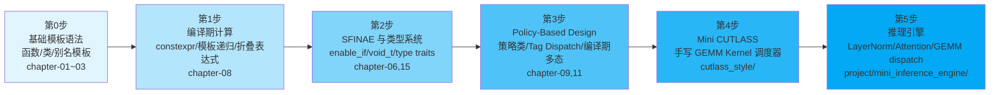

# 从C++模板到CUTLASS到AI推理框架

> **模板不是语法技巧，模板是编译期架构语言**

---

## 项目目标

本项目旨在帮助 C++ 开发者系统性地掌握现代 C++ 模板元编程，并以此为跳板，真正理解以下工业级项目中的模板系统：

- **CUTLASS** —— NVIDIA 官方 CUDA C++ 模板库，矩阵运算的极致优化
- **TensorRT** —— NVIDIA 推理优化引擎
- **TVM** —— Apache 深度学习编译栈
- **Triton** —— OpenAI GPU 编程语言与编译器
- **PyTorch C++ Backend** —— ATen / c10 调度系统

所有这些框架的核心都建立在 C++ 模板之上。不理解模板，就无法真正读懂它们的源码。

---

## 学习路径图



---

## 模板知识地图

| 概念 | 工业用途 | CUTLASS 位置 | 学习优先级 |
|------|----------|-------------|-----------|
| 函数模板 | 算子入口、launch wrapper | `include/cutlass/gemm/device/gemm.h` | ⭐⭐⭐⭐⭐ |
| 类模板 | Tile 配置、Threadblock 策略 | `include/cutlass/gemm/threadblock/` | ⭐⭐⭐⭐⭐ |
| 非类型模板参数 | 编译期 tile 尺寸、warp 数量 | `ThreadblockShape<M,N,K>` | ⭐⭐⭐⭐⭐ |
| 变参模板 | Operator 链、Epilogue 组合 | `EpilogueWithBroadcast<...>` | ⭐⭐⭐⭐ |
| SFINAE / enable_if | Kernel 过滤、平台选择 | `cutlass/platform/platform.h` | ⭐⭐⭐⭐ |
| 模板特化（全/偏） | 为 SM80/SM90 定制 Kernel | `gemm::kernel::Gemm<arch::Sm80, ...>` | ⭐⭐⭐⭐⭐ |
| Tag Dispatch | 数据类型选择、Layout 选择 | `layout::RowMajor`, `layout::ColumnMajor` | ⭐⭐⭐⭐ |
| Policy-Based Design | Collector 配置、Pipeline 策略 | `Kernel::Collector` | ⭐⭐⭐⭐⭐ |
| CRTP | 静态多态接口 | `Base<KernelDerived>` | ⭐⭐⭐ |
| Type Traits | 编译期类型推导与约束 | `cutlass/platform/` | ⭐⭐⭐⭐ |
| 折叠表达式 (C++17) | Operator 链展开 | Epilogue 组合 | ⭐⭐⭐ |
| Concepts (C++20) | Kernel 约束、类型检查 | CUTLASS 3.x+ | ⭐⭐⭐ |
| 变量模板 | 编译期常量查询 | `cutlass::gemm::kStages` | ⭐⭐ |
| NTTP 浮点 (C++20) | Epilogue scale 编译期配置 | Epilogue 参数 | ⭐⭐ |

---

## CUTLASS 架构导读

### 阅读顺序

CUTLASS 源码组织遵循"**从外到内，从配置到实现**"的层次：

```
第1层: 入口与配置（device 层）
  → include/cutlass/gemm/device/gemm.h          # GEMM 统一入口
  → include/cutlass/gemm/device/gemm_array.h
  → include/cutlass/gemm/device/gemm_complex.h

第2层: 配置组装（collective 层）
  → include/cutlass/gemm/collective/collective_builder.hpp  # 配置构建器
  → include/cutlass/gemm/collective/sm80_*.hpp               # SM80 配置

第3层: Kernel 实现
  → include/cutlass/gemm/kernel/gemm_universal.h   # 通用 Kernel
  → include/cutlass/gemm/kernel/sm80_*.hpp         # SM80 特化

第4层: Threadblock 级调度
  → include/cutlass/gemm/threadblock/default_mma.h
  → include/cutlass/gemm/threadblock/mma_*.hpp

第5层: Warp 级 MMA
  → include/cutlass/gemm/warp/default_mma_tensor_op.h
  → include/cutlass/gemm/warp/mma_tensor_op_*.hpp

第6层: 指令级（PTX 内联汇编）
  → include/cutlass/arch/mma_sm80.h
  → include/cutlass/arch/mma_sm90.h
```

### 关键文件清单

| 文件 | 作用 | 必读程度 |
|------|------|---------|
| `include/cutlass/cutlass.h` | 全局宏、平台检测 | ⭐⭐⭐⭐⭐ |
| `include/cutlass/gemm/device/gemm.h` | GEMM 入口模板 | ⭐⭐⭐⭐⭐ |
| `include/cutlass/gemm/device/gemm_universal.h` | 通用 GEMM 实现 | ⭐⭐⭐⭐⭐ |
| `include/cutlass/gemm/collective/collective_builder.hpp` | 配置组装 | ⭐⭐⭐⭐ |
| `include/cutlass/gemm/kernel/gemm_universal.hpp` | Kernel 实现 | ⭐⭐⭐⭐ |
| `include/cutlass/gemm/threadblock/default_mma.h` | Tile 配置 | ⭐⭐⭐⭐ |
| `include/cutlass/gemm/warp/mma_tensor_op.h` | Warp MMA | ⭐⭐⭐ |
| `include/cutlass/epilogue/threadblock/` | Epilogue 实现 | ⭐⭐⭐ |
| `include/cutlass/platform/platform.h` | 平台抽象 | ⭐⭐⭐ |
| `include/cutlass/arch/mma.h` | MMA 指令封装 | ⭐⭐⭐ |

---

## 如何阅读模板源码

### 实用技巧

1. **使用编译器的错误信息**：在模板候选位置插入 `static_assert(false)` 看实例化链
2. **`-E` 预处理看展开**：`g++ -E file.cpp` 查看模板展开结果
3. **使用 cppinsights**：`cppinsights.io` 可视化模板实例化
4. **IDE "Go to Definition"**：实际跳转到实例化后的位置
5. **从特化版本入手**：完整特化比泛化模板容易理解得多
6. **画出类型关系图**：用 Mermaid/Graphviz 画出类模板之间的继承与组合
7. **先看测试用例**：CUTLASS 的 `examples/` 和 `test/` 是最佳入口
8. **命名规律**：CUTLASS 模板参数命名高度一致
   - `ElementA/B/C/D` = 数据类型
   - `ThreadblockShape` = Tile 尺寸 `<M,N,K>`
   - `WarpShape` = Warp 级分块
   - `InstructionShape` = MMA 指令形状

### 调试编译期代码

```cpp
// 技巧1: 打印编译期类型
template<typename T> struct Debug;  // 声明但不定义
Debug<MyType> d;  // 编译器报错会显示 MyType 的全部信息

// 技巧2: static_assert 检查模板参数
static_assert(sizeof(Element) == 2, "Expected half precision");
```

---

## 如何看懂 TensorRT

TensorRT 的 C++ 层大量使用模板实现：

| 模块 | 关键模板用法 | 对应本项目概念 |
|------|-------------|--------------|
| Plugin API | CRTP 基类 `IPluginV2DynamicExt` | 第9章、第16章 |
| Layer 配置 | Policy 类选择 Kernel 变体 | 第11章、第18章 |
| Builder 系统 | 模板构建器模式、类型擦除 | 第2章、第14章 |
| Kernel autotuning | 编译期展开候选列表 | 第8章、第18章 |

**阅读建议**：从 `plugin/` 子目录开始，那里的模板用法最直观。

---

## 如何看懂 PyTorch Backend

PyTorch 的 ATen / c10 调度系统核心机制：

| 机制 | 模板角色 | 本项目对应 |
|------|---------|-----------|
| `TensorIterator` | 模板化 stride 计算 | 第2章、第8章 |
| `DispatchStub` | 函数指针 + 模板特化选择 | 第3章、第16章 |
| `op` 注册宏 | `TORCH_LIBRARY_IMPL` 编译期注册 | 第14章、第17章 |
| `Vec256<T>` | 模板化 SIMD 向量 | 第2章、第8章 |
| `ArrayRef<T>` | 编译期数组视图 | 第2章 |

**阅读建议**：从 `aten/src/ATen/native/cpu/` 的算子实现开始。

---

## 如何学习 HPC C++

从模板到 HPC 的进阶路线：

```
C++ 模板基础
    │
    ├─→ 编译期计算（constexpr）→ 零开销抽象
    ├─→ SIMD 模板包装 → 向量化编程
    ├─→ Policy-Based GEMM → CUTLASS 风格优化
    ├─→ 内存层级模板 → Shared Memory / Register 调度
    └─→ 编译期 autotuning → 自适应 Kernel 选择
```

**核心原则**：
- 模板让你在**编译期完成分支决策**，消除运行时开销
- 编译器可以基于模板展开进行**激进的内联和向量化**
- Policy 模式让你在不改一行 Kernel 代码的情况下切换算法

---

## 如何避免模板恐惧

### 心态建设

1. **模板不是魔法，只是"编译器填表"**
   - 编译器按照模板参数生成具体代码，就像 Excel 填充公式

2. **错误信息是朋友，不是敌人**
   - 长错误信息告诉你完整的实例化路径
   - 从最后一行往上看，最底部往往是最直接的错误

3. **先在纸上写出类型关系图**
   - 模板本质是类型之间的映射关系
   - 画出这些关系比读代码快 10 倍

4. **从具体到抽象，而非反过来**
   - 先写出一个具体的 GEMM（固定 float32, 128x128）
   - 再考虑如何用模板泛化参数

5. **模板恐惧是工程师的必经之路**
   - 每个写 CUTLASS 的人都经历过
   - 真正理解模板的人比想象中的少得多，坚持就是优势

---

## 项目结构说明

```
multhread/
├── README.md              # 本文件 —— 项目总导航
├── CMakeLists.txt          # 构建系统
├── diagrams/               # Mermaid 架构图
│   └── architecture.md     # 项目所有架构图
├── note/                   # 学习笔记（18章）
│   ├── README.md           # 笔记总目录
│   ├── chapter-01.md       # 函数模板
│   ├── chapter-02.md       # 类模板
│   ├── ...
│   └── chapter-18.md       # CUTLASS 模板架构全景
├── src/                    # 章节配套代码
│   ├── chapter-01/         # 第1章示例
│   ├── chapter-02/         # 第2章示例
│   └── ...
├── cutlass_style/          # Mini CUTLASS 实现
│   ├── include/            # 头文件库
│   │   ├── arch/           # 架构抽象
│   │   ├── kernel/         # Kernel 模板
│   │   ├── dispatch/       # 调度层
│   │   ├── policy/         # 策略类
│   │   ├── tensor/         # 张量抽象
│   │   ├── traits/         # Type traits
│   │   └── layouts/        # 内存布局
│   ├── kernels/            # CUDA Kernel 实现
│   └── examples/           # 示例程序
│       ├── gemm_basic.cpp
│       └── gemm_with_epilogue.cpp
└── project/                # 项目实战
    └── mini_inference_engine/
        ├── include/        # 推理引擎头文件
        ├── src/            # 引擎实现
        └── examples/       # 推理示例
```

| 目录 | 用途 | 目标 |
|------|------|------|
| `note/` | 18 章系统笔记 | 理解模板理论基础 |
| `src/` | 章节配套代码 | 边学边练 |
| `cutlass_style/` | 自实现 Mini CUTLASS | 深入理解 CUTLASS 架构 |
| `project/` | Mini 推理引擎 | 将模板知识应用于实际场景 |
| `diagrams/` | Mermaid 架构图 | 可视化理解 |

---

## 编译与运行指南

### 前置条件

- **C++20 编译器**：GCC 11+ / Clang 14+ / MSVC 2022+
- **CMake**：3.20+
- **CUDA Toolkit**（可选）：11.0+（如需 GPU 支持）
- **NVIDIA GPU**（可选）：SM80+（A100）推荐

### 编译步骤

```bash
# 仅编译 C++ 章节代码（不需要 GPU）
mkdir build && cd build
cmake .. -DCMAKE_BUILD_TYPE=Release
make -j$(nproc)

# 运行所有章节示例
ctest --output-on-failure

# 启用 CUDA 支持（需要 GPU）
cmake .. -DCMAKE_BUILD_TYPE=Release -DENABLE_CUDA=ON
make -j$(nproc)

# 运行 GEMM 示例
./bin/gemm_basic
./bin/gemm_with_epilogue

# 运行推理引擎
./bin/inference_demo
```

### 单独编译某个章节

```bash
# 以 chapter-01 为例
cd build && make chapter_01_examples
```

---

## 推荐的现代 C++ 资源

| 资源 | 类型 | 说明 |
|------|------|------|
| CppCon Back to Basics 系列 | 视频 | 模板、移动语义、constexpr 专题 |
| Walter E. Brown "Modern Template Metaprogramming" | 视频/讲义 | 模板元编程最佳入门 |
| cppreference.com | 网站 | 标准库参考，模板语法权威 |
| cppinsights.io | 在线工具 | 模板实例化可视化 |
| Compiler Explorer (godbolt.org) | 在线工具 | 实时查看模板生成的汇编 |
| CUTLASS 官方文档 | 文档 | `github.com/NVIDIA/cutlass` |
| "C++ Templates: The Complete Guide" (2nd) | 书籍 | 模板圣经，本项目参考其结构 |
| "Professional CUDA C Programming" | 书籍 | CUDA 编程基础 |
| "Programming Massively Parallel Processors" | 书籍 | GPU 架构与优化 |
| Nvidia GPU Technical Briefs | 文档 | SM80/SM90 架构详解 |

---

## 致谢

- **NVIDIA CUTLASS 团队** —— 世界上最优雅的 C++ 模板库之一
- **C++ 标准委员会** —— 让模板从语法糖变成架构语言
- **CppCon 社区** —— 十年如一日的技术传播
- **所有贡献者** —— 让开源 AI 推理变得更加可解释

---

*本项目是学习性质的个人项目，与 NVIDIA、Meta 等公司无关联。所有实现均为教学目的。*
