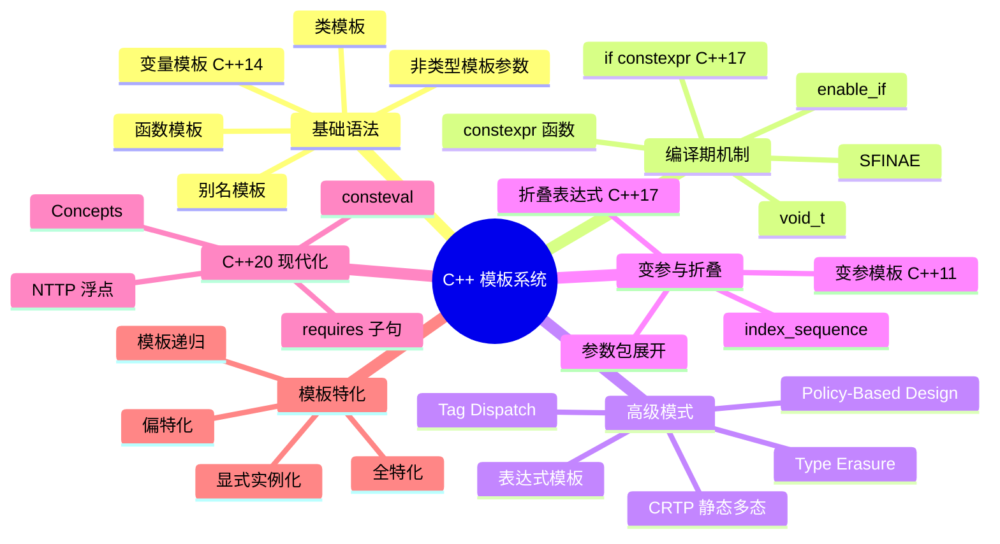
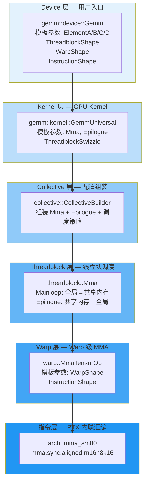
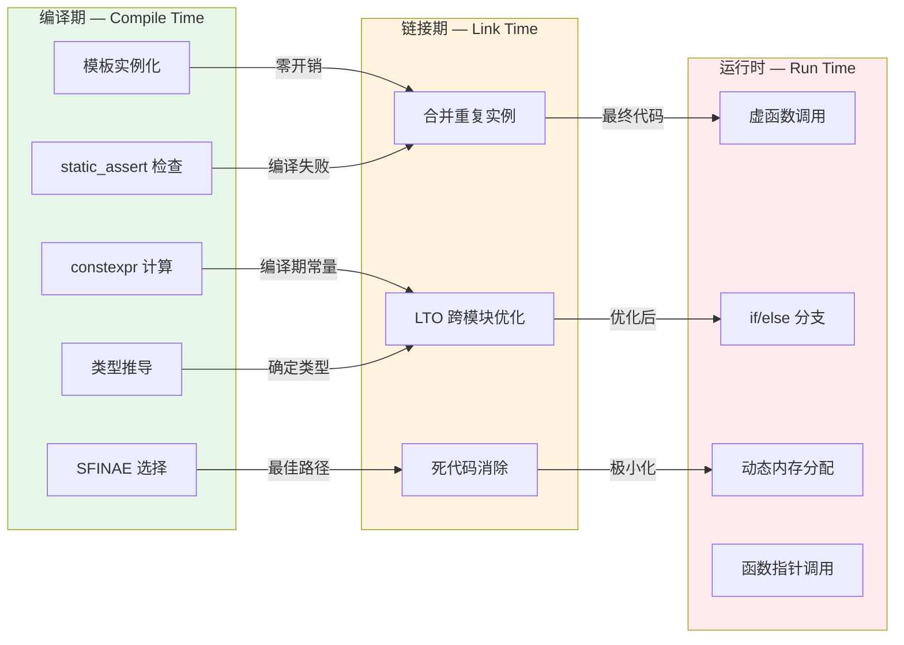

# 项目架构图集

本项目所有 Mermaid 架构图，可在支持 Mermaid 的 Markdown 阅读器中直接渲染。

---

## 1. C++ 模板知识全景图

---

## 2. 模板实例化流程图

```mermaid
flowchart TD
    A[源代码: template&lt;typename T&gt;<br/>T max&#40;T a, T b&#41;] --> B{编译器遇到调用<br/>max&#40;3, 5&#41;}
    B --> C[模板实参推导<br/>T = int]
    C --> D[实例化: 生成<br/>int max&#40;int a, int b&#41;]
    D --> E[编译实例化代码]
    E --> F[链接: 合并重复实例]
    F --> G[可执行文件]

    H[源代码: max&#40;3.14, 2.71&#41;] --> I[再次推导<br/>T = double]
    I --> J[新实例化: 生成<br/>double max&#40;double a, double b&#41;]
    J --> K[编译新版本]
    K --> F

    style A fill:#e8f5e9
    style D fill:#fff3e0
    style J fill:#fff3e0
    style G fill:#c8e6c9
```

---

## 3. SFINAE 选择流程图

```mermaid
flowchart TD
    A[模板函数调用<br/>process&#40;value&#41;] --> B{遍历所有重载候选}

    B --> C1[候选1: enable_if<br/>is_integral_v&lt;T&gt;]
    B --> C2[候选2: enable_if<br/>is_floating_point_v&lt;T&gt;]
    B --> C3[候选3: 无约束<br/>通用版本]

    C1 --> D1{替换成功?}
    C2 --> D2{替换成功?}
    C3 --> D3[总是成功]

    D1 -->|是| E1[候选1有效]
    D1 -->|否 SFINAE| F1[静默丢弃]

    D2 -->|是| E2[候选2有效]
    D2 -->|否 SFINAE| F2[静默丢弃]

    E1 --> G[重载决议<br/>选择最佳匹配]
    E2 --> G
    D3 --> G

    G --> H[实例化选中版本]

    style F1 fill:#ffcdd2
    style F2 fill:#ffcdd2
    style H fill:#c8e6c9
```

---

## 4. CUTLASS GEMM 层次结构图

---

## 5. Kernel Dispatch 流程图

```mermaid
flowchart TD
    A[用户调用 gemm&#40;problem_size, dtype&#41;] --> B{编译期配置选择器<br/>DefaultGemmConfiguration}

    B --> C1{{Tile Size<br/>128x128? 256x128?}}

    B --> C2{{Warp Config<br/>64x64? 64x32?}}

    B --> C3{{Instruction<br/>mma.sync 16x8x16?<br/>mma.sync 16x8x8?}}

    B --> C4{{Stages<br/>2-stage? 3-stage?<br/>4-stage?}}

    C1 --> D[组装配置结构体<br/>GemmConfig]
    C2 --> D
    C3 --> D
    C4 --> D

    D --> E{运行时 fallback}

    E -->|SM80+| F1[Kernel A<br/>Tensor Core FP16]
    E -->|SM75| F2[Kernel B<br/>Tensor Core INT8]
    E -->|SM70-| F3[Kernel C<br/>SIMT FP32 Fallback]

    F1 --> G[launch kernel<br/>grid/blocks config]
    F2 --> G
    F3 --> G

    style B fill:#e8eaf6
    style D fill:#c5cae9
    style G fill:#a5d6a7
```

---

## 6. 推理引擎架构图

```mermaid
flowchart TD
    subgraph 输入层[输入层]
        A[模型描述<br/>ONNX / 自定义 IR]
    end

    subgraph 配置层[编译期配置层 — 模板 Policy]
        B1[EngineConfig<br/>DataType / Layout / Arch]
        B2[AttentionConfig<br/>HeadDim / HeadNum / Causal]
        B3[LayerNormConfig<br/>Eps / Affine]
    end

    subgraph 调度层[调度层 — Tag Dispatch]
        C[KernelRegistry<br/>typename → Kernel*<br/>运行时查表]
    end

    subgraph Kernel层[Kernel 层]
        D1[GEMM Kernel<br/>Tile 128x128 / SM80]
        D2[FlashAttention<br/>Tile 64 / SM80]
        D3[LayerNorm<br/>Warp Reduce]
        D4[Softmax<br/>Online stable]
        D5[Activation<br/>GELU / SiLU fused]
    end

    subgraph 执行层[执行层]
        E[Engine::run&#40;input&#41;<br/>1. 遍历算子图<br/>2. 查表 Kernel<br/>3. Launch Kernel<br/>4. 同步]
    end

    A --> B1
    A --> B2
    A --> B3
    B1 --> C
    B2 --> C
    B3 --> C
    C --> D1
    C --> D2
    C --> D3
    C --> D4
    C --> D5
    D1 --> E
    D2 --> E
    D3 --> E
    D4 --> E
    D5 --> E

    style 配置层 fill:#e8eaf6
    style 调度层 fill:#c5cae9
    style Kernel层 fill:#a5d6a7
    style 执行层 fill:#81c784
```

---

## 7. 编译期 vs 运行时对比图

---

## 8. 学习路径图

```mermaid
flowchart LR
    subgraph 阶段0[阶段0: 基础]
        N0[模板语法<br/>函数/类/别名]
    end

    subgraph 阶段1[阶段1: 编译期]
        N1[编译期计算<br/>constexpr/递归/折叠]
    end

    subgraph 阶段2[阶段2: 类型]
        N2[SFINAE 与类型系统<br/>enable_if/void_t/traits]
    end

    subgraph 阶段3[阶段3: 设计]
        N3[Policy-Based Design<br/>策略/Tag Dispatch/CRTP]
    end

    subgraph 阶段4[阶段4: 实战]
        N4[Mini CUTLASS<br/>手写 GEMM 调度器]
    end

    subgraph 阶段5[阶段5: 工业]
        N5[推理引擎<br/>LayerNorm/Attention/GEMM]
    end

    N0 -->|chapter-01~03| N1
    N1 -->|chapter-08| N2
    N2 -->|chapter-06,15| N3
    N3 -->|chapter-09,11| N4
    N4 -->|cutlass_style/| N5
    N5 -->|project/| 目标((读懂 TensorRT<br/>PyTorch Backend<br/>CUTLASS 源码))

    style N0 fill:#e1f5fe
    style N1 fill:#b3e5fc
    style N2 fill:#81d4fa
    style N3 fill:#4fc3f7
    style N4 fill:#29b6f6
    style N5 fill:#03a9f4
    style 目标 fill:#01579b,color:#fff
```

---

## 图例说明

| 颜色 | 含义 |
|------|------|
| 🟢 绿色系 | 编译期 / 成功路径 |
| 🔵 蓝色系 | CUTLASS 层次 / 学习阶段 |
| 🔴 红色系 | 运行时 / 失败分支 |
| 🟡 橙色系 | 警告 / 中间阶段 |
| 🟣 紫色系 | 配置层 / 类型系统 |
