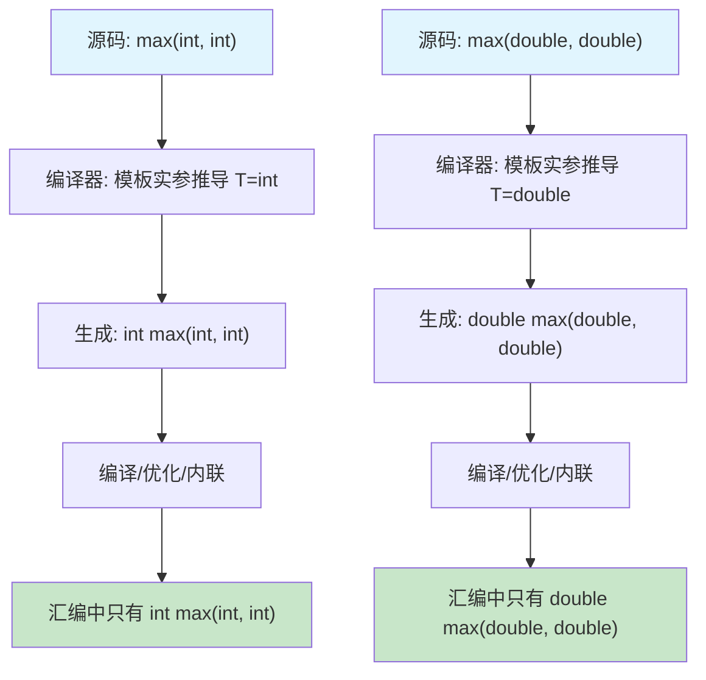

# 第1章 函数模板 —— 从零开销抽象到编译期多态

## 1. 核心问题

你有没有写过这样的代码：一个 `max(int, int)`，一个 `max(float, float)`，再来一个 `max(double, double)`，逻辑完全一样，只是类型不同？每加一个新类型就要手写一个重载，维护成本随着类型数量线性增长。C++ 函数模板就是来解决这个问题的——**你不是在写函数，而是在写"生成函数"的规则**。

更深层的问题是：传统的运行时多态（虚函数）需要在虚函数表上做一次间接跳转，这在 GPU 上代价很大。而函数模板提供的**编译期多态**，每次调用都生成一份针对具体类型的代码，编译器可以直接内联、向量化，做到真正的零开销。

用一句话说：**函数模板是编译器按照你的"蓝图"自动生成特定类型函数版本的机制**。

## 2. 通俗解释（生活类比）

想象你去奶茶店点奶茶。店员不会为"加珍珠的奶茶""加椰果的奶茶""什么都不加的奶茶"分别设计三套操作流程。他只有一套标准流程：

```
制作奶茶(配料) {
    拿杯子 → 倒茶底 → 加配料 → 加奶盖 → 封口
}
```

当你点"珍珠奶茶"时，店员把"配料=珍珠"代入流程；当你点"椰果奶茶"时，店员把"配料=椰果"代入流程。流程是同一套，但最终出来的产品是"针对具体配料特化"的。

在 C++ 里，`配料` 就是**模板参数 `T`**，`制作奶茶` 就是**函数模板**，店员每次代人具体配料的动作就是**模板实例化（template instantiation）**。

## 3. 模板展开过程（含流程图）

下面以最简单的 `max` 模板为例来跟踪编译器的行为：

```cpp
template<typename T>
T max(T a, T b) {
    return a > b ? a : b;
}

int main() {
    max(3, 5);       // 调用1
    max(1.0, 3.14);  // 调用2
}
```

编译器看到这段代码后的行为分两个阶段：

**阶段一：模板定义时的解析（两阶段翻译的第一阶段）**

编译器在第一次扫描 `max` 模板定义时，会检查所有**不依赖模板参数 `T` 的部分**的语法问题。比如 `return a > b ? a : b;` 中的三元运算符语法、`>` 符号是否存在（这里 `>` 会被正确解析为大于号，而不是模板右尖括号的一部分）。如果这一层有问题，编译器当场就报错。

**阶段二：模板实例化时的解析（两阶段翻译的第二阶段）**

当编译器看到 `max(3, 5)` 时，推导出 `T = int`，于是生成：

```cpp
int max(int a, int b) {
    return a > b ? a : b;
}
```

当编译器看到 `max(1.0, 3.14)` 时，推导出 `T = double`，于是生成：

```cpp
double max(double a, double b) {
    return a > b ? a : b;
}
```

此时才检查依赖名 `a > b`：当 `T = int` 时，`>` 是内置的大于运算，没问题。但如果你给了一个自定义类型，编译器就会去查这个类型有没有重载 `operator>`。



关键理解：`max(int,int)` 和 `max(double,double)` 在最终的二进制中是**两个完全独立的函数**，它们之间没有任何运行时的类型擦除或虚函数开销。这就是零开销抽象。

## 4. 模板实参推导与重载

```cpp
template<typename T>
T max(T a, T b) {
    return a > b ? a : b;
}

template<typename T>
T max(T a, T b, T c) {
    return max(max(a, b), c);
}
```

第一个 `max` 接受两个参数，第二个接受三个。调用 `max(1, 2)` 时，编译器只看两参数版本；调用 `max(1, 2, 3)` 时，编译器只看三参数版本。这是最直接的重载。

但这里有个经典坑：`max(1, 2.5)` 会**编译失败**。因为编译器试图从两个参数推导 `T`，一个推导出 `int`，一个推导出 `double`，矛盾了。解法有三：
- 手动指定：`max<double>(1, 2.5)`
- 用两个模板参数：`template<typename T, typename U> auto max(T a, U b) -> decltype(a + b)`
- C++14 的 `auto` 返回类型推导

## 5. 按值传递 vs 按引用传递

```cpp
// 按值传递：会触发拷贝
template<typename T>
void process(T arg) { /* ... */ }

// 按引用传递：不拷贝，且能修改原值
template<typename T>
void process(T& arg) { /* ... */ }

// 转发引用（万能引用）：保留值类别
template<typename T>
void process(T&& arg) { /* ... */ }
```

在 HPC 场景下，这个选择非常关键。当 `T` 是一个大矩阵（比如 `float[4096][4096]`），按值传递意味着在调用时复制整个矩阵——这显然是不能接受的。所以框架代码里几乎全是 `const T&`。

但注意一个陷阱：`process("hello")` 中 `T` 被推导为 `const char[6]`——如果你声明了 `const T&`，你接收到的就是一个 `const char(&)[6]`，即对数组的引用。这有时候有用，有时候会让你困惑。

## 6. 工业界真实用途

### 6.1 TensorRT Plugin 层

TensorRT 的 plugin 机制允许用户写自定义算子。plugin 层的典型模式是：

```cpp
template<typename T>
int enqueueGaussianNoise(int n, const T* input, T* output, /* ... */) {
    // 统一的算法逻辑，但 T 可以是 float 或 half
}
```

为什么用模板而不写成两个函数？因为 Gaussian Noise 的逻辑对 `float` 和 `half` 完全一样，写两遍就是重复代码。用模板，编译器会自动生成两个版本，并且针对每种类型做不同优化（比如 `half` 版本会用 `__half2` 向量化）。函数模板在这里扮演了**类型擦除的编译期实现**。

### 6.2 PyTorch C++ Extension

PyTorch 让你用 C++/CUDA 写自定义算子，入口通常是：

```cpp
torch::Tensor my_op(torch::Tensor input) {
    AT_DISPATCH_FLOATING_TYPES(input.scalar_type(), "my_op", [&]() {
        kernel<scalar_t><<<grid, block>>>(input.data_ptr<scalar_t>(), /* ... */);
    });
}
```

`AT_DISPATCH_FLOATING_TYPES` 是一个宏，它在内部展开成一个 switch-case，在运行时根据 `scalar_type` 跳转到对应的模板实例化。函数模板把"类型无关"的高层算法和"类型相关"的低层实现隔离开来。

## 7. 与 CUTLASS 的联系

CUTLASS 几乎从头到尾在用函数模板。我们看一个具体的例子。

### 7.1 cutlass/gemm/device/gemm.h

这是 CUTLASS 的入口文件之一。核心的函数模板签名是：

```cpp
template <typename Gemm_>
class Gemm {
public:
  Gemm() {}
  
  // 核心 compute 函数
  cutlass::Status operator()(Gemm_::Params const &params) {
    // ...
  }
};
```

这里的 `Gemm_` 是一个类模板参数，不是一个类型，而是一整个配置集合（包括 warp 大小、tile 大小、精度、epilogue 等）。`operator()` 被设计成函数模板调用者，它不关心 `Gemm_` 具体是什么，只要它有一个 `Params` 类型就行。

### 7.2 cutlass/gemm/device/gemm_universal.h

```cpp
template <
    typename TileShape_,
    typename WarpShape_,
    typename InstructionShape_,
    typename ElementA_,
    typename LayoutA_,
    typename ElementB_,
    typename LayoutB_,
    typename ElementC_,
    typename LayoutC_,
    typename ElementAccumulator_,
    typename ArchTag_,
    typename OperatorClass_,
    typename ThreadblockSwizzle_,
    typename Stages_
>
class GemmUniversal : /* ... */
```

这山一样的模板参数，正是 CUTLASS 强大的来源。每个模板参数控制一个维度：
- `TileShape_`：一个 tile 的大小（编译期常量，带来循环展开）
- `ElementA_`：A 矩阵的数据类型（float16、bfloat16、float32 等）
- `ArchTag_`：目标架构标签（决定用什么 PTX 指令）

所有的选择都在编译期完成，最终生成的 CUDA kernel 只包含你选中的那一套代码路径，没有任何运行时分支。

## 8. 常见坑点

| 坑 | 现象 | 解法 |
|---|---|---|
| 模板实参推导失败 | `max(1, 2.5)` 编译不过 | 显式指定 `max<double>(1, 2.5)` 或使用 multi-type 模板 |
| 头文件分离问题 | `fatal error: undefined reference` | 模板定义和声明必须在同一个头文件（单头文件模式） |
| 两阶段查找 | 非依赖名在第一阶段就查找，可能找到"错误"的函数 | 使用 `this->` 或限定名 |
| 递归实例化过深 | 编译时间爆炸甚至编译器崩溃 | C++17 的折叠表达式替代递归 |
| 模板错误信息太长 | GCC 输出几千行 | 使用 `static_assert` 提前报错，或者用 concept（C++20） |

## 9. 本章总结

函数模板不是"C++ 的一种特性"，它是**编译器内置的代码生成引擎**。你写下的不是一个函数，而是一个规则——"遇到什么类型，就生成什么版本的函数"。这种思路和 GPU 编程天然契合：我们需要为 float16、bfloat16、int8 等不同精度生成几乎相同的 kernel，但又要保证每种精度得到最优化的 PTX 指令。函数模板让这件事在编译期自动完成，零运行时开销。

> 关键认知：**模板是编译期的架构语言。** 你在函数模板里写的每一行代码，不是"执行一次"的指令，而是"对每种类型都执行一次"的生成规则。理解了这一点，你就理解了为什么 CUTLASS 的模板参数能排到屏幕外面去——因为每一个模板参数都代表一个编译期的决策维度。
