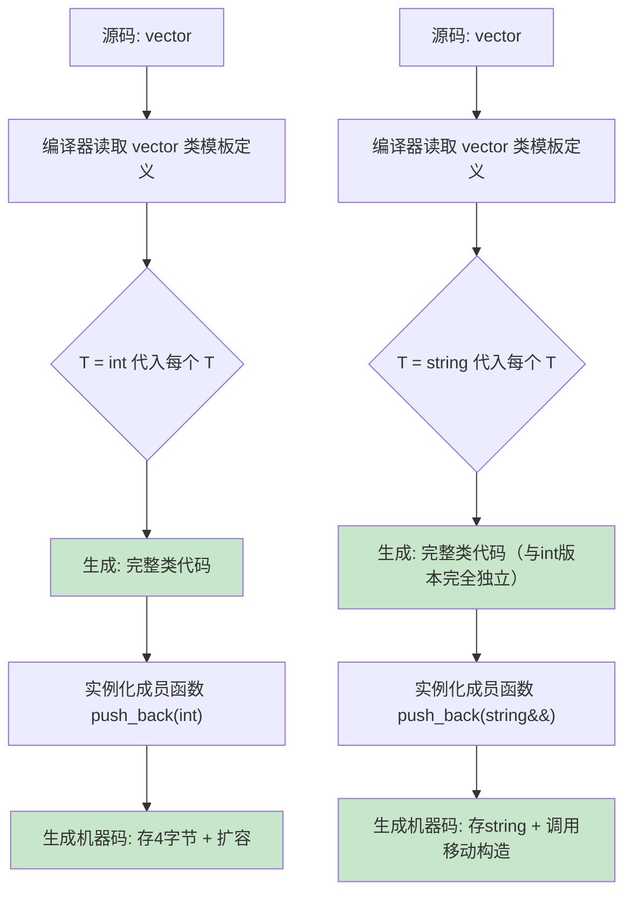

# 第2章 类模板 —— 类型参数化的容器与策略

## 1. 核心问题

如果你用 C 写过通用数据结构（比如一个 `vector`），你的选择几乎只有两种：
- 用 `void*` 做类型擦除，牺牲类型安全和性能
- 用宏 `#define VECTOR(type)`，拿预处理器硬拼

类模板给了你第三种选择：**把类型本身当作参数传给类定义**。编译器看到 `vector<int>` 和 `vector<float>` 后，自动生成两套完全独立的类代码——就像你手写了两遍，但是只用维护一套源码。

更深层的架构问题是：在 GPU 编程框架里，一个 GEMM kernel 需要同时配置十几项参数（输入类型、输出类型、累加器类型、tile 大小、warp 大小、epilogue 策略……）。如果不用类模板做编译期策略注入，你就会掉进"运行时配置的泥潭"——运行时分支在 GPU 上的代价远高于 CPU（warp divergence）。类模板把所有这些选择推到编译期，最终生成的代码只包含你选中的路径。

## 2. 通俗解释（生活类比）

类模板就像手机厂商的产线设计。

手机产线本身是一个类模板：`生产线<手机型号>`。iPhone 15 和 iPhone 15 Pro 共用的产线框架（上料→ 装配→ 测试→ 包装）是一样的，但 `生产线<iPhone15>` 和 `生产线<iPhone15Pro>` 的每一步具体操作是不同的：
- 摄像头装配工位：一个装双摄，一个装三摄
- 芯片焊接工位：一个焊 A16，一个焊 A17 Pro

产线框架就是**类模板定义**，具体的 `生产线<iPhone15>` 就是**类模板实例化**。型号就是**模板参数**。

C++ 中 `vector<int>` 和 `vector<string>` 同理——`push_back` 的逻辑框架是一样的，但实际生成的机器指令完全不同：一个在内存里存 4 字节整数，一个存 24~32 字节的 `std::string` 对象。

## 3. 类模板的基本语法与成员函数

```cpp
template<typename T, size_t N>
class FixedArray {
public:
    // 内联定义的成员函数
    T& operator[](size_t i) { return data_[i]; }

    // 类外定义的成员函数
    size_t size() const;

private:
    T data_[N];
};

// 类外定义必须带上模板声明
template<typename T, size_t N>
size_t FixedArray<T, N>::size() const {
    return N;
}
```

关键理解：每一个 `FixedArray<T, N>` 的组合都会生成**全新的**类。`FixedArray<int, 4>` 和 `FixedArray<int, 8>` 是两个完全无关的类，它们的 `size()` 函数也是两份独立的机器码。

## 4. 特化（Specialization）与偏特化（Partial Specialization）

这是类模板最强大的地方——**为特定类型组合提供定制实现**：

```cpp
// 通用模板
template<typename T>
struct Traits {
    static constexpr bool is_floating = false;
};

// 全特化：当 T = float 时
template<>
struct Traits<float> {
    static constexpr bool is_floating = true;
};

// 偏特化：当 T 是指针类型时
template<typename T>
struct Traits<T*> {
    static constexpr bool is_floating = false;
    static constexpr bool is_pointer = true;
};
```

全特化是"把通用版本的每个模板参数都填实"，偏特化是"填实一部分，保留另一部分作为参数"。偏特化在 CUTLASS 中到处都是——因为你需要对"float16 + float16 + float32 累加"和"int8 + int8 + int32 累加"这两类组合做不同的卷积指令选择。

## 5. CTAD（类模板实参推导，C++17）

从 C++17 开始，你可以不写模板参数，让编译器自己推导：

```cpp
std::vector v = {1, 2, 3};        // 推导为 vector<int>
std::pair  p = {42, "hello"};     // 推导为 pair<int, const char*>
```

这在构造复杂对象时省键盘寿命。但 CTAD 遇到某些类型的构造函数可能会推导出你不想的类型，这时候就需要**推导指引（deduction guide）**来纠正。

在 CUTLASS 的上下文中，CTAD 用得还不算多（因为 CUTLASS 支持 C++11/14），但它的精神是一样的：编译器帮你填模板参数。

## 6. 类型别名与辅助 `_t` / `_v`

```cpp
template<typename T>
struct RemoveConst {
    using type = T;
};

template<typename T>
struct RemoveConst<const T> {
    using type = T;
};

template<typename T>
using RemoveConst_t = typename RemoveConst<T>::type;
```

C++14 引入的 `_t` 和 C++17 引入的 `_v` 后缀是标准库的命名约定，目的是让你少写 `typename ...::type` 和 `...::value`。CUTLASS 也大量使用这个模式：

```cpp
// CUTLASS 中的类型辅助
template <typename T>
using remove_cvref_t = typename remove_cvref<T>::type;
```

## 7. 模板展开过程



关键点：`vector<int>::push_back` 和 `vector<string>::push_back` 在二进制中是**两份完全不同的函数**，如同你手写了两个独立的类。唯一的联系是它们共享同一套源码。

## 8. 工业界真实用途

### 8.1 TensorRT Plugin 的类模板设计模式

TensorRT 的 `IPluginV2` 系列接口本质上是一个类模板的运行时模拟。因为 plugin 需要在运行时动态加载 `.so`，不能直接用编译期模板，所以用虚函数模拟了同样的效果。但 plugin 内部实现大量使用类模板来做类型适配：

```cpp
template<typename T>
class GaussianNoisePlugin : public IPluginV2DynamicExt {
    // T 控制整个 plugin 的数据类型
    int enqueue(cudaStream_t stream) override {
        launch_kernel<T><<<grid, block>>>(/* ... */);
    }
};
```

### 8.2 CUTLASS 的 Gemm 类模板架构

CUTLASS 把 GEMM 问题拆分成了几个层级，每一层都用类模板做策略组合：

```
Device 层 (Gemm) → Kernel 层 → Threadblock 层 → Warp 层 → Thread 层
```

每一层都是一个类模板，它的模板参数来自上一层的配置。就像是俄罗斯套娃——外层的模板参数决定内层的模板参数。最终在编译期，所有层的配置全部确定，编译器生成一个高度优化的单一代码路径。

## 9. 与 CUTLASS 的联系

### 9.1 cutlass::gemm::Gemm 的类模板参数结构

打开 `cutlass/include/cutlass/gemm/device/gemm.h`，你会看到类似这样的结构：

```cpp
template <
    typename ElementA_,
    typename LayoutA_,
    typename ElementB_,
    typename LayoutB_,
    typename ElementC_,
    typename LayoutC_,
    typename ElementAccumulator_,
    typename ArchTag_,
    typename OperatorClass_,      // Simt 或 TensorOp
    typename ThreadblockShape_,   // 例如 128x128x8
    typename WarpShape_,          // 例如 64x64x8
    typename InstructionShape_,   // 例如 16x8x8
    typename EpilogueFunctor_,    // 例如 LinearCombination
    typename ThreadblockSwizzle_,
    int Stages_
>
class Gemm {
public:
    // 从模板参数推导出 Epilogue 输出类型
    using EpilogueOutputOp = typename EpilogueFunctor_::Params;
    // 从模板参数推导出 Kernel 类型
    using Kernel = gemm::kernel::Gemm<...>;
};
```

每一个模板参数都精确控制一个维度的行为：
- `ElementA_`, `ElementB_`：A、B矩阵的元素类型。`half_t` 和 `bfloat16_t` 走不同的 Tensor Core 指令
- `OperatorClass_`：`cutlass::arch::OpClassSimt` 走标量指令，`OpClassTensorOp` 走 Tensor Core 指令
- `ThreadblockShape_`：写成 `cutlass::gemm::GemmShape<128, 128, 32>`，**控制 tile 的 M、N、K 维度**

### 9.2 偏特化在 cutlass 中的应用

`cutlass/gemm/device/default_gemm_configuration.h` 中大量使用偏特化来为不同的参数组合选择默认值：

```cpp
template <
    typename OperatorClass,
    typename ArchTag,
    typename ElementA,
    typename ElementB,
    typename ElementC,
    typename ElementAccumulator
>
struct DefaultGemmConfiguration;

// 偏特化：针对 Volta + TensorOp + float16 的组合
template <>
struct DefaultGemmConfiguration<
    arch::OpClassTensorOp,
    arch::Sm70,
    half_t,
    half_t,
    half_t,
    float
> {
    using ThreadblockShape = GemmShape<128, 128, 32>;
    using WarpShape = GemmShape<64, 64, 32>;
    using InstructionShape = GemmShape<16, 8, 8>;
    static int const kStages = 3;
};
```

这里偏特化做了一件事：**为 Volta 架构 + TensorOp + float16 的组合提供了一组硬件最优的 tile 大小**。如果你换到 Ampere 架构（Sm80），就会走另一个偏特化，拿到另一组 tile 大小。这就是"编译期策略选择"的威力。

## 10. 常见坑点

| 坑 | 现象 | 解法 |
|---|---|---|
| 类模板的成员函数分开写到 .cpp | linker 报 undefined reference | 把实现放进 .h 文件，或者用显式实例化 |
| 偏特化放在错误的作用域 | 编译错误，说找不到偏特化 | 偏特化必须和主模板在同一 namespace 下 |
| 友元模板声明复杂 | 编译不过 | 先前置声明类模板，再声明友元 |
| CTAD 推导错误 | `vector v(10, 0.5)` 推导为 `vector<double>` 但你想 `vector<float>` | 加推导指引或显式指定 |
| 成员函数模板不能是虚函数 | 编译错误 | 这个限制是语言级的，无法绕过——虚函数表的大小必须在编译期确定 |

## 11. 本章总结

类模板不是"能接受类型的 class"，它是**类型参数化工厂**。你给出类型参数，编译器生成结构上相同但实现细节上完全独立的类。

在 CUTLASS 的架构中，类模板是**策略注入（Policy Injection）**的基石。Device 层把架构、精度、tile 大小等十几项参数通过模板参数传给 Kernel 层，Kernel 层再分解成 Threadblock 层、Warp 层。每一层都是编译期确定的——整个调度的路线图在代码编译完成后就不再改变。

> 关键认知：类模板的设计不是在写"一个类"，而是在写"生成类的规则"。你以为你在设计一个 GEMM 类，实际上你在设计一个**编译期 GEMM 代码编译器**。CUTLASS 就是这样一个嵌在 C++ 类型系统里的 CUDA kernel 编译器。
