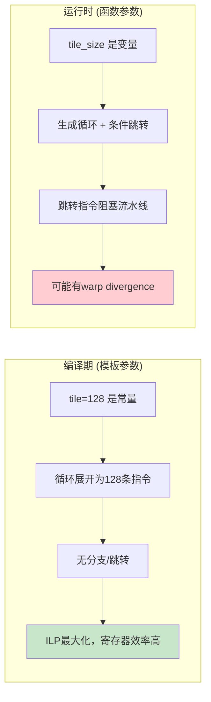

# 第3章 非类型模板参数 —— 编译期常量与性能秘密

## 1. 核心问题

为什么 CUTLASS 的 `GemmShape<128, 128, 32>` 里，128、128、32 这些数字是模板参数而不是函数参数？为什么几乎所有 HPC 框架都把 tile size、warp size、stage 数量放在模板参数里？

答案只有四个字：**编译期展开**。

当 128 是模板参数时，编译器知道它是一个编译期常量。这意味着：
- 循环可以被完全展开（loop unrolling），消除分支跳转
- 数组大小可以在栈上静态分配，无需动态内存
- 地址计算可以被常数折叠，减少寄存器压力
- PTX 指令可以用立即数地址，而非寄存器间接寻址

如果 128 是函数参数，以上所有优化都做不了。对 GPU kernel 来说，这中间的差距可能是 30%~50% 的性能差异。

## 2. 通俗解释（生活类比）

你去裁缝店做西装。有两种做法：

**做法 A（运行时参数）：** 裁缝问你"尺寸多少？"，你说"肩宽 48、胸围 108、衣长 76"，裁缝拿一把尺子在布上临时量、临时裁剪。每做一件都要重新量一遍。

**做法 B（编译期参数）：** 裁缝有一本"版型手册"：版型1 = (肩宽 48, 胸围 108, 衣长 76)；版型2 = (肩宽 46, 胸围 102, 衣长 72)。你要版型1，裁缝直接用预先算好的尺码数据套到切割机上一刀切——不需要临时量。

非类型模板参数就是"版型手册上的数字"——它在编译时就已经写死了，编译器可以基于它做各种预先优化。函数参数就是"临时量的数字"——运行时才能确定，编译器没法提前动手。

## 3. 非类型模板参数的语法

```cpp
template<typename T, int N, bool UseCache>
class Array {
    T data_[N];              // N 决定数组大小，编译期已知
    bool cache_on_ = UseCache;  // UseCache 决定是否启用缓存
};

Array<float, 256, true>  a;   // 256 个 float，带缓存
Array<float, 512, false> b;   // 512 个 float，不带缓存
```

`a` 和 `b` 生成的代码完全不同——不仅数组大小不同，`UseCache` 还会用 `if constexpr` 或 `static_assert` 在编译期裁剪掉不相关的代码路径。

C++17 引入了 `auto` 作为非类型模板参数的类型：

```cpp
template<auto Value>
struct Constant {
    static constexpr auto value = Value;
};

Constant<42>;     // Value = 42 (int)
Constant<'A'>;    // Value = 'A' (char)
Constant<3.14>;   // C++20 才支持浮点数，C++17 不支持
```

C++20 更进一步，允许了浮点数、甚至字面量类类型作为非类型模板参数。

## 4. 模板参数 vs 函数参数：编译期决策 vs 运行时决策

```cpp
// 方案A：tile_size 作为模板参数（编译期）
template<int TileSize>
__global__ void kernel_template(float* data, int n) {
    // TileSize 是编译期常量，循环被完全展开
    for (int i = 0; i < TileSize; i++) {
        data[threadIdx.x * TileSize + i] *= 2.0f;
    }
}

// 方案B：tile_size 作为函数参数（运行时）
__global__ void kernel_runtime(float* data, int n, int tile_size) {
    // tile_size 是运行时变量，循环不能展开
    for (int i = 0; i < tile_size; i++) {
        data[threadIdx.x * tile_size + i] *= 2.0f;
    }
}
```

方案 A 生成的 PTX 代码中，循环被展开为一串顺序的 `st.global.f32` 指令，没有分支、没有跳转。方案 B 必须保留一个循环，有循环计数器、有条件跳转指令。在 GPU 上，跳转指令意味着 warp divergence 的技术债务。



## 5. auto 非类型模板参数（C++17）

```cpp
template<auto V>
void printConstant() {
    std::cout << "Constant value: " << V << '\n';
}
```

这里的 `auto` 让模板参数的类型由实参自动推导。这在写泛型常量容器时非常方便。

CUTLASS 中虽然没有直接用 `auto` 非类型参数（因为 CUTLASS 需要支持 C++11），但精神是相同的：把编译期已知的常量塞进模板参数里。

## 6. 参数包中的非类型参数

非类型参数也可以出现在变参模板参数包中：

```cpp
template<int... Dims>
class Tensor {
    static constexpr size_t rank = sizeof...(Dims);
    static constexpr int total_size = (Dims * ...);  // 折叠表达式
    int data_[total_size];
};

Tensor<224, 224, 3> image;  // 一个224x224x3的"图像张量"
```

这里的 `224`、`224`、`3` 全是编译期常量，`total_size` 也是编译期常量。数组大小在编译时就完全确定了，堆栈上直接分配，不需要任何 `malloc` 调用。

这在嵌入式 / GPU 编程中至关重要——你知道为什么 GPU kernel 内部几乎从不做 `malloc` 吗？因为 GPU 的动态内存分配（`malloc` inside kernel）极其昂贵且有限。所以你在 kernel 里能用的所有存储，必须在编译时就确定大小。

## 7. 工业界真实用途

### 7.1 为什么 GPU kernel 中 tile size 是模板参数

以 GEMM 为例，假设我们把 tile size 作为运行时参数：

```cpp
// ❌ 坏的写法
void gemm_kernel(float* C, float* A, float* B, int M, int N, int K,
                  int tile_m, int tile_n, int tile_k) {
    // 共享内存大小不知道：tile_m * tile_n 是运行时值
    __shared__ float As[tile_m * tile_k];  // 编译错误！VLA
    // ...
}
```

CUDA 的 `__shared__` 内存大小必须在编译期确定。所以共享内存数组的大小必须是编译期常量。解法就是：

```cpp
// ✅ 好的写法
template<int TileM, int TileN, int TileK>
void gemm_kernel(float* C, float* A, float* B) {
    __shared__ float As[TileM * TileK];  // 编译期常量，没问题
    // ...
}
```

这就是为什么 CUTLASS 的 `GemmShape<128, 128, 32>` 必须放在模板参数里——因为所有 tile 大小都要用来声明共享内存数组。

### 7.2 TVM / Triton 的编译期 shape 哲学

在 Triton 语言里，block shape 也是编译期常量：

```python
@triton.jit
def matmul_kernel(a_ptr, b_ptr, c_ptr,
                  M, N, K,
                  BLOCK_M: tl.constexpr,   # 编译期常量！
                  BLOCK_N: tl.constexpr,
                  BLOCK_K: tl.constexpr):
    # ...
```

`tl.constexpr` 就是 Triton 版的非类型模板参数——同一个哲学，换了件衣服。Triton 编译器收到这些值后，可以生成和 CUTLASS 手写模板一样效果的高度优化 PTX 代码。

### 7.3 PyTorch 中的编译期 shape

PyTorch 2.0 引入的 `torch.compile` 把 dynamo 抓到的计算图中的张量形状当作编译期信息，用于生成特化 kernel。这是把 C++ 模板的"编译期已知尺寸"思想搬到了 Python 层。

## 8. 与 CUTLASS 的联系

### 8.1 GemmShape<128, 128, 32> 为什么在模板里

打开 `cutlass/include/cutlass/gemm/gemm_shape.h`：

```cpp
template <int M_, int N_, int K_>
struct GemmShape {
    static int const kM = M_;
    static int const kN = N_;
    static int const kK = K_;
};
```

这就是一个纯编译期常量容器。三个数字分别表示在 M（行）、N（列）、K（内积）维度上，每个 threadblock 一次处理多少元素。

然后，`cutlass/gemm/threadblock/default_mma_core.h` 里用它来计算各种编译期常数：

```cpp
// 从 ThreadblockShape 推导出共享内存字节数
static int const kSmemSize = ThreadblockShape::kM * ThreadblockShape::kN * sizeof(Element);
```

所有这些计算都在编译期完成。因为没有运行时开销，你可以把 tile 做得非常复杂，编译器照样能优化成高效的常量。

### 8.2 CUTLASS 中 Stages_ 的作用

在 `cutlass/gemm/device/gemm_universal.h` 的模板参数列表里，你会看到一个：

```cpp
template < ... int Stages_ >
```

这个 `Stages_` 控制软件流水线（software pipelining）的级数。如果 `Stages_ = 3`，CUTLASS 会生成 3 级流水线：同时维护 3 个 tile 的 shared memory buffer，用异步 copy 和同步原语做流水线调度。如果 `Stages_ = 2`，就只有 2 级。

一个 `int` 模板参数，决定了全局内存到共享内存的异步 copy 策略。这就是编译期常量的威力——你可以用一个简单的数字控制几百行复杂的流水线代码的生成。

## 9. 常见坑点

| 坑 | 现象 | 解法 |
|---|---|---|
| 浮点数做非类型参数 | C++17 不支持 `template<float F>` | 升级到 C++20，或改为整数定点数（如 `int` × 1000） |
| 字符串字面量做非类型参数 | `template<const char* Str>` 不能接 `"hello"` | 字符串字面量不是左值——要么用 `auto`（C++20），要么用字符序列 `template<char...>` |
| 非类型参数的隐式转换 | `template<int N>` 传入 `char` 可能触发奇怪的警告 | 明确使用 `static_cast<int>` 或直接传 `int` 字面量 |
| 编译时间爆炸 | 用太多非类型模板参数组合（如 `Tensor<H, W, C>`，每个从 16~512）导致上百个实例化 | 把运行时差异大的维度放在模板参数里，差异小的用运行时分支 |

## 10. 本章总结

非类型模板参数是 C++ 模板系统给 HPC 程序员的最大福利之一。它让你把"运行时的变量"提升为"编译时的常量"，编译器反过来用这些常量做循环展开、静态数组分配、常数折叠等一系列优化。

CUTLASS 正是极端利用了这一点——它把所有对性能有影响的数字（tile 大小、warp 大小、指令 shape、stage 数）全部压进非类型模板参数。结果是，同一个 GEMM kernel 源码能生成数百个针对不同场景高度特化的 PTX 代码。

> 关键认知：**性能敏感的数字应该活在模板参数里。** 当你发现某个 `int` 参数控制着循环边界、共享内存大小、或者 pipeline 深度，把它放进模板参数——你可能因此获得 2x 的性能提升。编译器的优化引擎是为编译期常量设计的，不是为运行时变量设计的。
