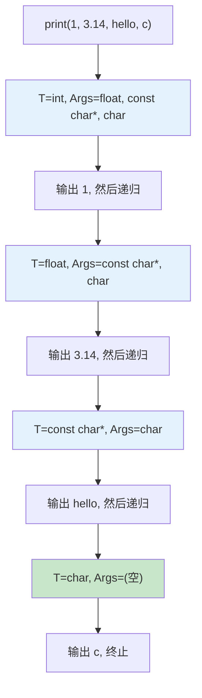

# 第4章 变参模板 —— 编译期的"任意参数"艺术

## 1. 核心问题

你有没有遇到过需要写"接受任意数量参数"的函数？C 语言用 `printf` 的 `...` 和 `va_list`，但那是在运行时解析格式串，没有类型安全，速度慢，还容易写出安全漏洞。

C++11 引入的变参模板（Variadic Templates）把这个需求搬到了编译期：**编译器在编译时逐个处理参数包中的每个类型，生成针对性的代码**。这不仅是类型安全的，而且编译期递归展开可以在无运行时开销的情况下处理任意长度的参数列表。

在 HPC 世界，这个特性用于：一次性注册多种数据类型的 kernel、编译期构建类型列表（type list）、工厂函数自动实例化多个模板版本等等。

## 2. 通俗解释（生活类比）

想象一个万能遥控器的设置向导：

```
万能遥控器.配对(电视, 空调, 音响, 投影仪, 扫地机器人)
```

你一次性把所有设备传给遥控器的配对函数，遥控器内部逐个"拆包"：

```
第一步：拿出一台设备 → 电视 → 发射配对信号
第二步：再拿出一台设备 → 空调 → 发射配对信号
第三步：再拿出一台设备 → 音响 → 发射配对信号
...
直到参数包耗尽
```

这个"逐个处理"的逻辑就是变参模板的**递归展开（recursive expansion）**机制。和 C 语言的 `...` 不同，这里的处理是编译期完成的——如果你传入了一台不存在的设备（类型错误），编译器在你运行代码之前就告诉你"这个设备没出现在设备库里"。

## 3. 参数包（Parameter Pack）与包展开（Pack Expansion）

```cpp
// 定义一个接受任意数量参数的 print 函数
template<typename T>
void print(T val) {
    std::cout << val << '\n';
}

template<typename T, typename... Args>
void print(T first, Args... rest) {
    std::cout << first << ", ";
    print(rest...);  // 递归展开
}

print(1, 3.14, "hello", 'c');
// 输出: 1, 3.14, hello, c
```

编译器对这个调用的展开过程：

```
Step 1: print(int, float, const char*, char)
    → 打印 1, → 递归 print(float, const char*, char)

Step 2: print(float, const char*, char)
    → 打印 3.14, → 递归 print(const char*, char)

Step 3: print(const char*, char)
    → 打印 hello, → 递归 print(char)

Step 4: print(char)
    → 打印 c → 终止
```



注意：每一步都是**一个新的函数实例化**。编译器生成了四个不同版本的 `print` 函数，每个的指令集都是针对其参数类型最优化的。

## 4. fold expression —— C++17 的折叠表达式

C++11 版本的变参模板需要一个递归终止条件和一个基础函数，写起来比较繁琐。C++17 的折叠表达式（Fold Expression）让这件事大幅简化：

```cpp
template<typename... Args>
auto sum(Args... args) {
    return (args + ...);  // 一元右折叠：((arg1 + arg2) + arg3) + ...
}

// 等价于在编译期展开了：
// return arg1 + arg2 + arg3 + ...;

sum(1, 2, 3, 4, 5);  // 返回 15，编译期展开
```

四种折叠形式：

| 折叠类型 | 语法 | 展开结果 |
|---------|------|---------|
| 一元右折叠 | `(pack op ...)` | `(a₁ op (a₂ op (a₃ op ...)))` |
| 一元左折叠 | `(... op pack)` | `(((a₁ op a₂) op a₃) op ...)` |
| 二元右折叠 | `(pack op ... op init)` | `(a₁ op (a₂ op (a₃ op init)))` |
| 二元左折叠 | `(init op ... op pack)` | `(((init op a₁) op a₂) op a₃)` |

在 CUTLASS 中，二元左折叠常用于类型拼接：

```cpp
// 把多个类型"压扁"成一个类型列表
template<typename... Types>
struct TypeList {
    static constexpr size_t size = sizeof...(Types);
};
```

CUTLASS 的很多 `make_xxxx` 函数最终就用到了这种折叠模式来生成类型列表。

## 5. `sizeof...` 运算符

```cpp
template<typename... Args>
void info(Args... args) {
    std::cout << "参数个数: " << sizeof...(Args) << '\n';
    std::cout << "参数个数: " << sizeof...(args) << '\n';  // 等价
}
```

`sizeof...` 返回参数包中元素的数量，这是一个**编译期常量**。你可以用它做 `static_assert(sizeof...(Args) >= 2, "需要至少两个参数")`。

## 6. 变参模板 + 继承：编译期的类型聚合

```cpp
template<typename... Types>
class MultiInherit : public Types... {
    // 同时继承了 Types 中所有的类
};
```

这个技术广泛用于"策略类"的组合。CUTLASS 中 threadblock 的定义就用了这种模式——通过多重继承把各种功能模块组装到一个类型里。

## 7. 工业界真实用途

### 7.1 CUTLASS 的 type_list 系统

在 `cutlass/include/cutlass/platform/platform.h` 中，CUTLASS 定义了一套自己的类型列表工具：

```cpp
namespace cutlass {

template <typename... T>
struct type_list {};

// 计算大小
template <typename... T>
struct type_list_size<type_list<T...>> {
    static constexpr int value = sizeof...(T);
};

// 按索引获取类型
template <int Index, typename... T>
struct type_at_index;

template <typename First, typename... Rest>
struct type_at_index<0, First, Rest...> {
    using type = First;
};

template <int Index, typename First, typename... Rest>
struct type_at_index<Index, First, Rest...> {
    using type = typename type_at_index<Index - 1, Rest...>::type;
};

} // namespace cutlass
```

这套工具在编译期提供了"列表操作"：求大小、按索引取元素、拼接、去重。CUTLSSS 用它们来：
- 管理所有支持的数据类型组合
- 为 `ArchTag` 做类型列表选择
- 在 kernel dispatch 阶段生成所有可能的 kernel 实例

### 7.2 TensorRT 的多类型 dispatch

TensorRT 在处理 ONNX 模型时，需要根据输入张量的数据类型选择不同的 CUDA kernel：

```cpp
template<typename... SupportedTypes>
class TypedPlugin {
    // SupportedTypes 就是变参包
    // 例如 float, half, int8_t
};
```

这种模式避免了写一大堆 `if-else` 或者 `switch-case`。编译器会基于 `SupportedTypes` 这个包，生成一个覆盖所有类型的 dispatch 表。

### 7.3 PyTorch 的算子注册系统

PyTorch 的算子注册宏 `TORCH_LIBRARY` 背后使用了变参宏和变参模板的组合。当你注册一个算子：

```cpp
TORCH_LIBRARY(my_ops, m) {
    m.def("my_op(Tensor a, int b) -> Tensor");
    m.def("my_op_v2(Tensor a, Tensor b) -> Tensor");
}
```

宏展开后的模板代码会用变参模板处理这些定义，生成所有需要的注册代码。

## 8. 与 CUTLASS 的联系

### 8.1 cutlass/platform/platform.h 中的类型列表

具体文件位置：`cutlass/include/cutlass/platform/platform.h`

```cpp
// 定义类型列表
template <typename...>
struct type_list {};

// type_list 上的操作：拼接
template <typename List1, typename List2>
struct type_list_concat;

template <typename... L1, typename... L2>
struct type_list_concat<type_list<L1...>, type_list<L2...>> {
    using type = type_list<L1..., L2...>;
};
```

这个拼接操作是编译期的——`type_list<A,B>` 和 `type_list<C,D>` 拼接成 `type_list<A,B,C,D>`，全程没有运行时开销。

### 8.2 make_xxxx 函数模板

在 CUTLASS 的 kernel dispatch 代码中，常见的模式是：

```cpp
// 伪代码：构造所有可能的 kernel 实例
using KernelList = type_list_concat<
    make_kernel_list<arch::Sm75, half_t, half_t, half_t, float>::type,
    make_kernel_list<arch::Sm80, half_t, half_t, half_t, float>::type,
    make_kernel_list<arch::Sm90, half_t, half_t, half_t, float>::type
>::type;
```

`make_kernel_list` 是一个模板，内部用变参模板一个接一个地生成 kernel 实例。整个 kernel dispatch 表在编译期就全部构建完成。

## 9. 常见坑点

| 坑 | 现象 | 解法 |
|---|---|---|
| 递归实例化爆炸 | 变参模板深度递归导致编译内存不够 | 用 C++17 折叠表达式代替递归，用类型列表平铺而非递归 |
| `sizeof...` 误用 | `sizeof(args)...` 是错误的语法 | 正确写法是 `sizeof...(args)` 或 `(sizeof(args) + ...)` |
| 参数包展开位置错误 | `f(g(args)...)` 和 `f(g(args...))` 完全不同 | 前者对每个元素调用 g 再传给 f，后者把所有元素打包传给 g |
| 空参数包递归没有终止条件 | 编译时无限递归 | 始终提供无参版本的基础模板或空参数包的重载 |
| 包展开符号太多 | 代码阅读性变差 | 给参数包取好名字，如 `Types` `Dims` `Indices` 而非 `T` `U` `I` |

## 10. 本章总结

变参模板是 C++ 模板系统的"自然延伸"——它让你从"接受固定数量类型参数"进化到"接受任意数量类型参数"。在 HPC 框架中，它用来：
- 构建编译期类型列表（CUTLASS 的 `type_list`）
- 一次性注册多种数据类型的 dispatcher
- 生成 compile-time dispatch table（完全替代函数指针表）

> 关键认知：**变参模板本质上是在编译期做递归。** 编译器把你的变参函数逐层展开，每一层对应一个新的函数实例化。这个过程完全在编译期完成，生成的二进制代码中没有额外的间接调用。CUTLASS 把这个特性推到了极致——它用变参模板在编译期生成了几百个 kernel 实例，运行时就只需要按索引跳转，连 switch-case 都不需要。
