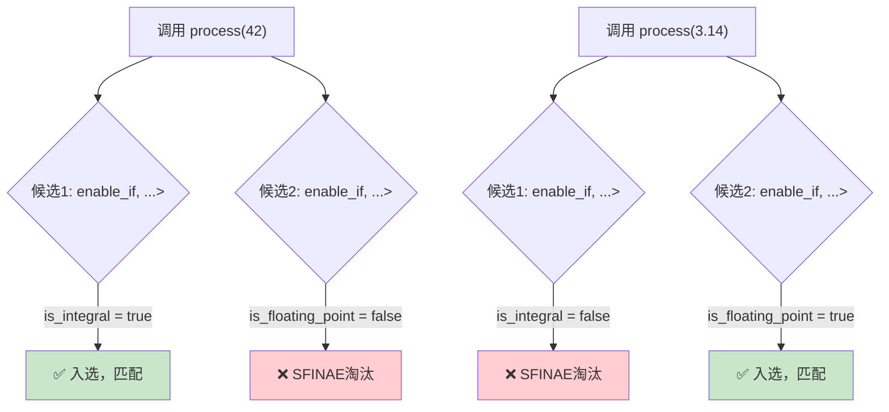

# 第6章 enable_if与SFINAE —— 编译期的"减速带"

## 1. 核心问题

你写了一个函数模板，但你想限制它只能接受某些类型——比如只接受浮点类型、只接受有 `.to_string()` 方法的类型、或者只接受满足某些条件的类型。怎么写？

直接的做法：在函数体内用 `if constexpr`（C++17）做检查。但这不够好——如果用户用错误类型调用，错误信息会出现在模板实例化的深处，报错几千行，根本看不出哪错了。

更好的做法：在函数重载决议阶段就让不合格的模板**自动退出候选列表**，编译器转而寻找其他更合适的重载，找不到才报"没有匹配的重载"。这不仅让错误信息更友好，还实现了编译期的"多路选择"。

这个机制就是 SFINAE（Substitution Failure Is Not An Error，替换失败不是错误），而实现它的核心工具就是 `enable_if`。

## 2. 通俗解释（生活类比）

想象一个高档夜总会，门口有保安，只让"有VIP卡的人"进去。

**做法 A（运行时检查）：** 所有人都先进门，然后工作人员在吧台附近拦住没卡的人，赶出去。

**做法 B（编译期检查，SFINAE）：** 保安在门口一个一个看，有卡的放行（该函数模板成为候选），没卡的直接说"你不符合条件，请走侧门"（该函数模板被 SFINAE 淘汰）。

做法 B 就是 `enable_if + SFINAE` 的设计。编译器在重载决议阶段做"安检"，不合格的函数模板根本不会进入候选集合，自然也不会被调用。

更深层的类比：SFINAE 相当于高速路口的一条**减速带**——符合条件的车可以通过，不符合的车被强制变道去其他出口。这条"减速带"在编译期运行，完全不影响正常车辆的通行速度。

## 3. `enable_if` 的基本用法

```cpp
#include <type_traits>

// 仅当 T 是整数类型时，这个重载才有效
template<typename T>
typename std::enable_if<std::is_integral<T>::value, T>::type
process(T val) {
    return val * 2;  // 整数逻辑
}

// 仅当 T 是浮点类型时，这个重载才有效
template<typename T>
typename std::enable_if<std::is_floating_point<T>::value, T>::type
process(T val) {
    return val * 3.14;  // 浮点逻辑
}
```

调用 `process(42)` 时，`int` 对第一个重载 `is_integral<int>::value = true`，SFINAE 通过，入选；对第二个重载 `is_floating_point<int>::value = false`，SFINAE 失败，淘汰。最终选第一个重载。

调用 `process(3.14)` 时，反过来，选第二个重载。

调用 `process("hello")` 时，两个重载都失败，编译器报"no matching function"。



## 4. SFINAE 的精确含义

**替换失败不是错误（Substitution Failure Is Not An Error）** 这句话的意思是：

当编译器尝试把一个函数模板实例化（即把 `T` 替换成具体类型）时，如果替换后出现了语法或语义不合法的情况（比如 `T::foo` 不存在、`T` 不满足 `enable_if` 条件），这不叫编译错误——编译器只是默默把该模板从重载候选集中移除，然后继续检查其他候选。

只有当所有候选全部被移除了，编译器才报错。

但注意：SFINAE 只适用于**模板参数推导的"immediate context"**。如果错误发生在模板定义的函数体内部（非 immediate context），那就是硬错误（hard error），SFINAE 救不了。

## 5. `<type_traits>` 常用工具

SFINAE 依赖大量的类型萃取（Type Traits）来做判断条件：

```cpp
// 类型属性
std::is_integral<T>::value         // T 是不是整数
std::is_floating_point<T>::value   // T 是不是浮点
std::is_pointer<T>::value          // T 是不是指针
std::is_same<T, U>::value          // T 和 U 是不是同一类型
std::is_base_of<Base, Derived>::value  // Base 是不是 Derived 的基类

// 类型转换
std::enable_if<Cond, T>::type      // Cond 为 true 时 = T，否则 = 替换失败
std::conditional<Cond, T, F>::type // Cond 为 true 时 = T，否则 = F
std::remove_const<T>::type         // 去掉 const
std::remove_reference<T>::type     // 去掉引用
std::decay<T>::type                // 模拟按值传递的类型退化

// C++14/17 的简化写法
std::enable_if_t<Cond, T>          // 等价于 typename std::enable_if<Cond, T>::type
std::is_same_v<T, U>               // 等价于 std::is_same<T, U>::value
```

## 6. Detection Idiom（检测惯用法）与 `void_t`

`enable_if` 能判断简单的类型属性（是不是整数、浮点），但如果你需要判断"T 有没有 `.serialize()` 方法"呢？这就需要用 Detection Idiom。

```cpp
// void_t 的定义（C++17 标准库里已有）
template<typename...>
using void_t = void;

// 检测是否有 serialize() 方法
template<typename T, typename = void>
struct has_serialize : std::false_type {};

template<typename T>
struct has_serialize<T, void_t<decltype(std::declval<T>().serialize())>> ;
```

关键机制：`void_t<decltype(std::declval<T>().serialize())>` 如果 `T` 没有 `serialize()`，`decltype` 就会替换失败。但因为 SFINAE 的存在，替换失败不会导致编译错误，只是让偏特化候选不匹配，从而回退到 `std::false_type` 版本。

如果有 `serialize()`，偏特化成功，`has_serialize<T>::value = true`。

这个技巧在 CUTLASS 中广泛使用——用于检测不同架构是否有特定的 PTX 指令、检测某个类型是否支持 Tensor Core 操作等。

## 7. `enable_if` 的多路选择与调度

```cpp
template<typename T>
typename std::enable_if_t<(sizeof(T) <= 4), void>
kernel_launch(T* data, int n) {
    // 小类型的 kernel：可以用向量化加载
    // 例如 T=float (4 bytes)、T=int (4 bytes)
}

template<typename T>
typename std::enable_if_t<(sizeof(T) > 4 && sizeof(T) <= 8), void>
kernel_launch(T* data, int n) {
    // 中等类型的 kernel：用 128-bit 加载
    // 例如 T=double (8 bytes)、T=complex<float>
}

template<typename T>
typename std::enable_if_t<(sizeof(T) > 8), void>
kernel_launch(T* data, int n) {
    // 大类型的 kernel：用 128-bit + 对齐的加载
    // 例如 T=complex<double> (16 bytes)
}
```

编译器会根据 `sizeof(T)` 的值，自动选择最合适的 kernel。没有 `if-else`，没有运行时开销。这就是编译期多路选择——CUTLASS 的 kernel 选择机制也是如此。

## 8. 工业界真实用途

### 8.1 CUTLASS 的 kernel 选择机制

CUTLASS 的核心问题之一是：同一个 GEMM 问题，可能对应几十种不同的 kernel 实例化（不同的 tile 大小、不同的 warp 大小、不同的指令精度）。如何在编译期自动选出最优的？

答案就在 `cutlass/gemm/device/default_gemm_configuration.h` 中：

```cpp
template <
    typename OperatorClass,
    typename ArchTag,
    typename ElementA,
    typename ElementB,
    typename ElementC,
    typename ElementAccumulator,
    typename Enable = void    // <-- 注意这个
>
struct DefaultGemmConfiguration;

// 偏特化：针对 Volta TensorOp + half
template <typename ElementA, typename ElementB,
          typename ElementC, typename ElementAccumulator>
struct DefaultGemmConfiguration<
    arch::OpClassTensorOp,
    arch::Sm70,
    ElementA,
    ElementB,
    ElementC,
    ElementAccumulator,
    typename std::enable_if<
        std::is_same<ElementA, half_t>::value &&
        std::is_same<ElementB, half_t>::value
    >::type
> {
    using ThreadblockShape = GemmShape<128, 128, 32>;
    // ...
};

// 偏特化：针对 Ampere TensorOp + int8
template <typename ElementA, typename ElementB,
          typename ElementC, typename ElementAccumulator>
struct DefaultGemmConfiguration<
    arch::OpClassTensorOp,
    arch::Sm80,
    ElementA,
    ElementB,
    ElementC,
    ElementAccumulator,
    typename std::enable_if<
        std::is_same<ElementA, int8_t>::value &&
        std::is_same<ElementB, int8_t>::value
    >::type
> {
    using ThreadblockShape = GemmShape<256, 128, 64>;
    // ...
};
```

这里 `enable_if` 扮演的角色是：**在编译期根据架构 + 精度组合，选择最优的 tile 大小套件**。Volta + half 拿一套参数，Ampere + int8 拿另一套参数，不需要任何运行时判断。

### 8.2 TensorRT Builder Config 选择

TensorRT 的 Builder 在构建网络时，需要根据目标 GPU 架构选择不同的 kernel 配置：

```c++
// 伪代码
template<typename NetworkDef, typename Config>
typename std::enable_if<Config::kArch >= 70, IBuilderConfig>::type
configureForVoltaPlus() { /* 配置 Volta/Turing/Ampere kernel */ }

template<typename NetworkDef, typename Config>
typename std::enable_if<Config::kArch < 70, IBuilderConfig>::type
configureForLegacy() { /* 配置旧的 Pascal 及以下 kernel */ }
```

这保证了对于旧架构，Volta+ 专属的 Tensor Core kernel 不会被误触。

### 8.3 PyTorch 的编译期类型过滤

PyTorch 的 C++ 扩展中，ATen 库大量使用 `enable_if` 来限制某些操作只能用于特定类型：

```cpp
// 仅标量类型可用
template<typename T, typename = typename std::enable_if<at::is_scalar<T>::value>::type>
T clamp(T val, T min, T max) { /* ... */ }
```

## 9. 与 CUTLASS 的联系

### 9.1 default_gemm_configuration.h 中的 enable_if 选择

上面已经详细分析了 `cutlass/gemm/device/default_gemm_configuration.h`。这里再强调一个细节：

文件中的 `Enable = void` 第 7 个模板参数，看似多余，实则巧妙。`enable_if<Cond>::type` 当 Cond 为 true 时产生 `void`，刚好匹配 `Enable = void` 的默认参数。当 Cond 为 false 时产生替换失败，偏特化被跳过，继续尝试下一个偏特化。

```cpp
template<
    // ... 前 6 个参数 ...
    typename Enable = void  // <-- 第 7 个参数，默认值 void
>
struct DefaultGemmConfiguration;

// 偏特化版本中：
template<...>
struct DefaultGemmConfiguration<
    /* 匹配前6个参数 */,
    /* 第7个参数匹配: */ typename std::enable_if<条件>::type  // = void 当条件成立
> { /* ... */ };
```

这就是 `enable_if + class template partial specialization` 的经典组合。

### 9.2 实际查找路径

你现在就可以在 CUTLASS 源码中找到这些内容：
- `cutlass/include/cutlass/gemm/device/default_gemm_configuration.h` —— enable_if 做 kernel 选择
- `cutlass/include/cutlass/platform/platform.h` —— void_t 和 type_traits 工具
- `cutlass/include/cutlass/arch/mma.h` —— 用 SFINAE 检测特定架构的 MMA 指令是否可用

## 10. 常见坑点

| 坑 | 现象 | 解法 |
|---|---|---|
| `enable_if` 放在错误位置 | SFINAE 没有生效，硬错误 | `enable_if` 必须放在 immediate context（模板参数、返回类型、函数参数默认值），不能在函数体内 |
| 两个重载同时匹配 | 重载决议歧义（ambiguity） | 用 `enable_if` 让条件互斥，或用 tag dispatch |
| `void_t` 检测失败但模板匹配了 | 偏特化候选匹配了不应该匹配的版本 | 确保 `void_t` 内的表达式精确定义你要检测的条件 |
| SFINAE 不影响命名空间内的非模板函数 | 非模板函数的名称冲突直接报错 | SFINAE 只对模板有效 |
| 条件太复杂编译变慢 | 编译时间暴增 | 把复杂判断拆成 step-by-step 的 `type_trait`，编译器缓存中间的实例化结果 |

## 11. 本章总结

`enable_if` 和 SFINAE 是 C++ 模板系统的"交通管制系统"。它们做的事情很简单：**在编译期，根据类型满足的条件，自动决定哪个模板版本能进入重载候选集**。

这套机制让 CUTLASS 能做到：
- 根据 GPU 架构（SM70、SM75、SM80、SM90）选择不同的 kernel 路径
- 根据精度（half、float、int8）选择不同的 MMA 指令
- 根据编译期条件选择最优的 tile 大小、warp 大小、stage 数
- 没有运行时 if-else，没有虚函数表——一切都是编译期的纯静态选择

> 关键认知：**SFINAE 不是"编译器忽略错误"，而是"编译器在做选择"。** 你把不符合条件的模板实例从候选集中移除，剩下的就是"最适合当前类型的实现"。这就像编译期里面还嵌了一个小型的匹配引擎——用类型信息做索引，找到最合适的代码快照。
>
> C++20 的 **concepts** 本质上是 SFINAE 的"语法糖重写"。你用 `requires` 写出来的约束，编译器最终还是会转化成 SFINAE 逻辑。所以理解了这一章，你也就能理解 C++20 concepts 的底层原理。
