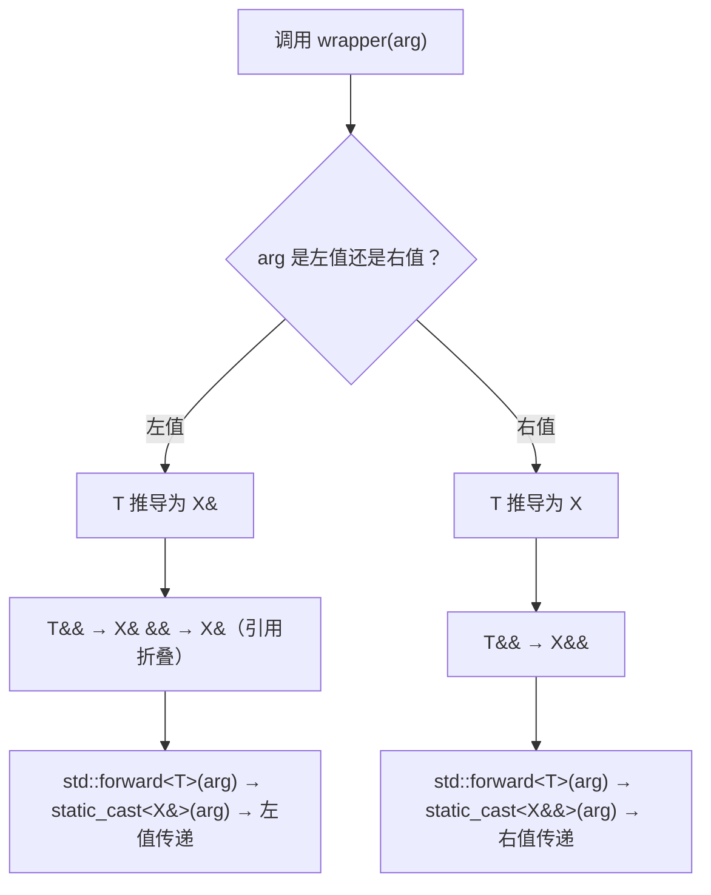

# 第7章 按值传递与按引用传递 —— 模板中的参数传递哲学

## 核心问题

在 C++ 模板中，一个参数到底是 `T`、`T&`、`T&&` 还是 `const T&`，这件事比你想象的要重要一万倍。因为这不仅影响一次函数调用的开销，更关键的是：**模板是编译期代码生成器，参数传递方式决定了编译器能生成什么样的代码、能不能内联、能不能折叠掉冗余操作**。

C++ 默认的按值传递（pass-by-value）在模板中有个臭名昭著的坑——**类型退化（type decay）**。数组退化成指针，`const` 和 `volatile` 被剥掉，引用被丢掉。这些都是编译器在你看不见的地方偷偷干的"好事"。而按引用传递则保留了类型的所有信息，代价是你要自己管理生命周期。

核心问题总结为三条：

1. **按值传递什么时候退化你的类型？** 退化不是 bug，是 feature，但你必须知道它在发生。
2. **按引用传递什么时候比你想象的危险？** 临时对象的悬空引用、转发引用的过载坑。
3. **模板如何统一处理左值和右值？** `auto&&` 和 `decltype` 的配合是 C++11 以来最重要的表达式到类型的桥梁。

## 通俗解释：快递员送包裹

想象你是一个快递员，要送一个包裹（参数）给收件人（函数）。

- **按值传递** = 你把包裹里的东西倒出来，复印一份，把复印件送过去。原件长什么样收件人不知道，复印件上的"快递单号"（类型信息）也可能被简化。好处是：原件不会被你弄坏，你把复印件扔了也没关系。坏处是：如果原件是一台钢琴，复印成本巨大。
- **按引用传递** = 你直接把包裹原封不动放到收件人面前。收件人能看到包装上的所有标签（完整类型信息），甚至能拆了原包裹（修改原值）。好处是：零拷贝成本，类型信息完整。坏处是：如果包裹在你送达前就被销毁了，收件人会拿到一个空壳（悬空引用）。
- **转发引用（forwarding reference）** = 送包裹的时候，你根据寄件人是谁来决定送原件还是复印件。如果寄件人是临时工（右值），你就把原件整包送出（移动语义）；如果寄件人是长期员工（左值），你就只给看（引用）。
- **`std::ref/std::cref`** = 你本来要复印一份，但你在包裹上贴了个便条说"别复印，直接去仓库看原件"。这个便条就是个 `reference_wrapper`，一个对象，装着指向原件的指针。

## 类型退化（Type Decay）：编译器在你背后干的"好事"

```cpp
template<typename T>
void inspect(T arg) {
    // T 是什么？不是你想的那个！
}

int arr[10];
inspect(arr);  // T = int*，不是 int[10]！

const int x = 42;
inspect(x);    // T = int，const 被剥离！

int& ref = x;
inspect(ref);  // T = int，引用被剥离！
```

这就是退化规则：**函数参数如果是按值传递的，编译器会把数组类型变成指针、把函数类型变成函数指针、剥离顶层的 const/volatile、剥离引用**。

这条规则看似烦人，但在模板中它实际上是**设计选择**。为什么 C 语言开始就这么干？因为指针可以放进寄存器（一个 word），但数组不行（函数调用约定限制）。所以退化是 ABI（应用程序二进制接口）级别的历史遗留问题。

### 工业界的"退化陷阱"

在 GPU 编程中，退化可能是致命的：

```cpp
// 这段代码在 CUDA kernel 里可能导致无声的数据错误
template<typename T>
__device__ void load_to_register(T data) {
    // 如果 T 被退化为指针，你在寄存器里存的是一个地址
    // 而不是数据本身！多一次 global memory load！
}
```

正确的做法是用引用：

```cpp
template<typename T>
__device__ void load_to_register(const T& data) {
    // T 保持完整类型，编译器知道这是数组还是标量
    // 可以生成最优的 ldg 指令
}
```

## 完美转发（Perfect Forwarding）：模板的"快递路由器"

```cpp
template<typename T>
void wrapper(T&& arg) {           // T&& 是转发引用
    inner(std::forward<T>(arg));  // 原封不动转发
}
```

核心机制：
1. `T&&` 在模板参数推导中不是右值引用，而是**转发引用**（universal reference）。
2. 如果传左值，`T` 推导为 `X&`，引用折叠后 `T&&` → `X& &&` → `X&`。
3. 如果传右值，`T` 推导为 `X`，`T&&` → `X&&`。
4. `std::forward<T>` 根据 `T` 是否为引用类型决定是 `static_cast<T&&>(arg)` 还是什么，这样就实现了"保持原值类别"的转发。

**折叠规则速查表：**

| 参数 | T 推导 | T&& 折叠后 | 值类别 |
|------|--------|-----------|--------|
| 左值 `X&` | `X&` | `X&` | 左值 |
| 右值 `X&&` | `X` | `X&&` | 右值 |
| const 左值 `const X&` | `const X&` | `const X&` | const 左值 |

### Mermaid：转发引用的类型推导流程



## 返回类型推导：auto 与 decltype 的分工

**`auto`** 和 **`decltype`** 是模板世界的"类型侦探"，但它们收集证据的方式完全不同：

```cpp
int x = 42;
int& rx = x;

auto a = rx;         // a 是 int（退化，剥离引用）
decltype(rx) b = rx; // b 是 int&（保留引用）
decltype(auto) c = rx; // c 是 int&（C++14，保留一切）
decltype((x)) d = x; // d 是 int&（额外括号强制左值引用）
```

为什么要有 `decltype(auto)`？因为 `auto` 会退化类型，而有时你需要保留引用和 cv 限定符：

```cpp
template<typename Container>
decltype(auto) get_element(Container&& c, size_t idx) {
    return std::forward<Container>(c)[idx];
    // 如果 c 是左值，返回 T&
    // 如果 c 是右值，返回 T&&
}
```

### 工业关联：PyTorch autograd 的反向传播模板设计

PyTorch 的 autograd 引擎本质上是一个计算图重放系统，而每个算子的 `backward()` 实现大量使用完美转发和返回类型推导：

```cpp
// pytorch/autograd/ 中类似的设计模式
class AutogradContext {
    // 保存用于反向传播的中间结果
    template<typename T>
    void save_for_backward(T&& tensor) {
        // 如果 tensor 是左值，只保存引用（省内存）
        // 如果 tensor 是右值，移动保存
        saved_variables_.emplace_back(
            SavedVariable(std::forward<T>(tensor))
        );
    }
};
```

这里不使用按值传递的原因很实际：**tensor 的拷贝可能涉及几 GB 的数据传输**。完美转发让 autograd 引擎可以根据调用上下文自动选择最小代价的传递方式。

### 工业关联：TensorRT memory allocator 模板

TensorRT 的 `IAllocator` 接口本质上是一个模板参数传递策略的体现：

```cpp
// TensorRT 的 allocator 设计依赖引用传递来避免拷贝分配器状态
template<typename Allocator>
nvinfer1::ICudaEngine* buildEngine(Allocator&& alloc, ...) {
    // 完美转发：如果传入临时 allocator，移动它
    // 如果传入的是持久 allocator，引用它
    auto& alloc_ref = std::forward<Allocator>(alloc);
    // Builder 内部持有 alloc_ref 的引用
}
```

## CUTLASS 关联：TensorRef 中的传递方式设计

CUTLASS 的 `TensorRef` 是理解模板参数传递哲学的绝佳案例。在 `cutlass/tensor_ref.h` 中：

```cpp
template <typename T_, int Rank_>
struct TensorRef {
  T_* data_;                    // 裸指针，按值持有
  Coord<Rank_> layout_;        // 布局描述
  LongIndex capacity_;         // 容量

  // 核心设计：返回引用还是值？
  CUTLASS_HOST_DEVICE
  T_ const* data() const { return data_; }  // 按值返回指针
  // 为什么不返回 T_*& ？
  // 因为 TensorRef 的设计语义是"轻量视图"，不拥有内存
  // 按值返回指针足够（一个 word），不需要引用的间接寻址

  // 构造——接受指针但通过引用传递布局
  CUTLASS_HOST_DEVICE
  TensorRef(T_* ptr,                    // 按值：指针天然轻量
            Coord<Rank_> const& layout) // 按const引用：Coord可能较大
      : data_(ptr), layout_(layout) {}
};
```

**关键设计决策解读：**

1. `T_* data_` 按值持有——指针本身就是一个 word（8 字节在 64 位），不需要引用包装。在 PTX 层面，这刚好是一个 64-bit 寄存器。
2. `Coord<Rank_> const& layout` 用 const 引用传递——`Coord<Rank_>` 在 High Rank 时可能是多维坐标（比如 `(M, N, K, L)`），几百字节的 POD 结构，const 引用避免栈上拷贝，直接把地址加载到寄存器。
3. 这种 `"小对象按值、大对象按引用"` 的判断**不能在运行时做**，只能由模板的作者在设计期决定。这正是"模板是编译器辅助的架构决策语言"的体现。

再看 `cutlass/tensor_view.h` 中的 `TileIterator` 构造：

```cpp
template <typename Shape>
CUTLASS_HOST_DEVICE
TileIterator(
  TensorRef ref,             // 按值！TensorRef 本身就是轻量视图
  Shape const& shape         // 按const引用，Shape可能包含多个dim
);
```

这里 `TensorRef` 按值传递因为它只是一个 `{ptr, layout, capacity}` 三元组，在寄存器中刚好放下。按值传递避免了额外的 load 指令。

## 常见坑点

### 坑1：cosnt& 与临时对象生命期延长

```cpp
template<typename T>
const T& get_max(const T& a, const T& b) {
    return a > b ? a : b;
    // 这没问题：a 和 b 是调用者传入的引用
}

template<typename T>
auto get_max_bugged(T a, T b) {
    return a > b ? a : b;  // 按值返回，安全
    // 但如果改成返回 const T& ...
    // const T& get_max_bugged(T a, T b) {
    //     return a > b ? a : b;  // 返回局部变量的引用！UB！
    // }
}
```

### 坑2：转发引用的构造函数劫持（最阴险）

```cpp
class Widget {
    std::string name_;
public:
    // 这个转发构造函数可能劫持拷贝构造！
    template<typename T>
    Widget(T&& name) : name_(std::forward<T>(name)) {}

    // 非 const 的拷贝构造被上面的模板劫持了！
};

Widget w1("hello");
Widget w2(w1);  // 调用的是模板版本！T=Widget&
                // name_ 被完美转发构造了，这碰巧是对的
                // 但如果是 Widget w3(std::move(w1));
                // T=Widget，移动了，name_ 空了
```

**CUTLASS 的做法：** CUTLASS 几乎没有这种"万能转发构造函数"——所有构造函数都是显式列出的重载，因为 CUDA 代码需要在 host 和 device 都能编译，SFINAE 和完美转发在某些 nvcc 版本下有已知 bug。

### 坑3：auto 与代理类的引用

```cpp
std::vector<bool> vb = {true, false, true};
auto bit = vb[0];  // bit 是 std::vector<bool>::reference，不是 bool！
                   // 这是个代理类，vb 析构后 bit 是悬空的！
```

在 GPU 编程中类似的坑：CUTLASS 的 `Fragment` 类型的 `operator[]` 返回代理引用，用 `auto` 捕获可能意外触发复制。

```cpp
// cutlass/gemm/threadblock/ 中的 fragment 访问
auto val = fragment[0];  // 正确：触发寄存器读
decltype(auto) ref = fragment[0];  // 可能是代理引用！注意！
```

## 本章总结

1. **按值传递会退化类型**：数组→指针、const 剥离、引用剥离。这是 C 语言 ABI 的历史遗产，在模板中必须心知肚明。
2. **按引用传递保留完整类型信息**：但代价是你必须自己管理生命周期，悬空引用是 UB。
3. **完美转发是模板的"路由器"**：`T&&` + `std::forward<T>` 实现了"原值类别转发"，是 C++11 以来最重要的模板 idiom。
4. **`auto`、`decltype`、`decltype(auto)` 各有分工**：`auto` 退化了类型（类似按值传递），`decltype` 保留一切（类似按引用传递），`decltype(auto)` 是两者的统一。
5. **选择传递方式就是选择架构**：在 CUTLASS 的 TensorRef 中，"指针按值 + 大结构按引用"的组合不是随意的，而是基于 PTX 指令集和寄存器压力做出的编译期决策。模板让你把这些设计选择编码进类型系统，让编译器在生成 PTX 代码时就做出最优决策。
