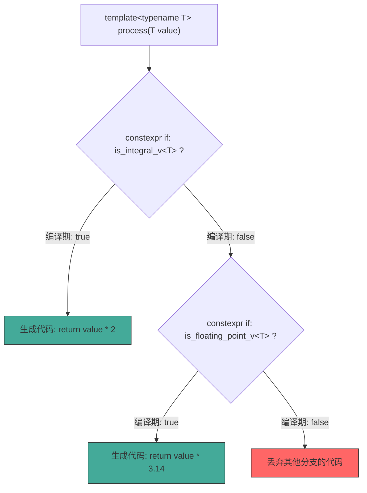
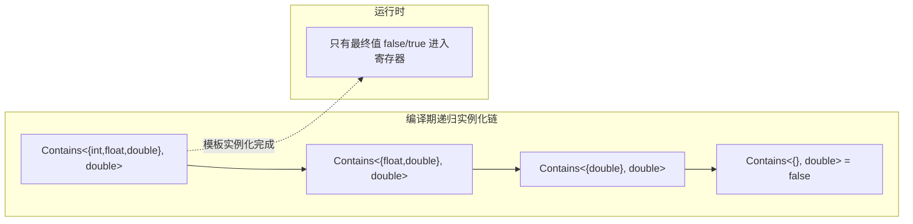

# 第8章 编译期编程 —— 让编译器为你写代码

## 核心问题

当年 C++98 的模板意外地成了图灵完备的编程语言这件事，连 Bjarne Stroustrup 自己都没预料到。一个本来只想做"类型安全的宏"的功能，竟然能写斐波那契数列、构建类型列表、在编译期做循环展开——这就是**模板元编程（TMP，Template Metaprogramming）**。

但 TMP 写起来太痛苦了：递归实例化、模式匹配、SFINAE 黑魔法，代码像外星符文。所以 C++11 引入了 `constexpr`，C++14 放宽了 `constexpr` 函数限制，C++17 加了 `constexpr if`——让"编译器帮你写代码"这件事从黑魔法变成了可读的工程代码。

核心问题：

1. **为什么需要编译期计算？** 运行时的条件判断和循环在 GPU kernel 中是奢侈的（warp divergence、指令数膨胀）。能把计算前置到编译期，就把运行时开销清零。
2. **constexpr vs 模板元编程，什么时候用哪个？** TMP 操作类型（类型列表、类型变换），`constexpr` 操作值。两者常常配合使用。
3. **`constexpr if` 为什么是革命性的？** 在 C++14 中，SFINAE 和 tag dispatch 是唯一的分支手段。`constexpr if` 让你像写普通 if 一样写编译期分支——代码可读性提升了一个数量级。

## 通俗解释：乐高工厂

把编译器想象成一个乐高工厂：

- **运行时代码** = 工厂每天开工后，工人（CPU/GPU）按照流水线组装乐高。每天做一样的事。
- **编译期代码（constexpr）** = 工厂的设计部在开工前就已经算好了：这个零件的尺寸、这个连接件的角度、这个模块需要多少个螺丝钉。这些数字直接印在图纸上（常量），开工后不需要再算。
- **模板元编程（TMP）** = 设计部不仅有数字，连零件的种类都是自动确定的。"如果客户要红色跑车，用 A 型底盘；如果要蓝色卡车，用 B 型底盘。"而且这个决策在图纸绘制阶段就完成了——生产线一开动，工人们面前已经是定制化的图纸。
- **`constexpr if`** = 设计部给图纸加上了分支："如果客户订单是 type=express，这里用碳纤维；否则用塑料。"但这个分支在渲染图纸时就"折叠"掉了，最终图纸上只有一条路径。

## constexpr：从 C++11 到 C++17 的进化

### C++11：一只脚迈入编译期

```cpp
constexpr int factorial(int n) {
    return n <= 1 ? 1 : n * factorial(n - 1);
    // C++11 的 constexpr 函数只能包含一条 return 语句
}
```

这就是个能放编译期的递归函数。限制非常严：不能有循环、不能有局部变量、不能有 if/else。

### C++14：几乎无所不能

```cpp
constexpr int factorial(int n) {
    int result = 1;
    for (int i = 2; i <= n; ++i) {
        result *= i;
    }
    return result;
    // C++14：可以有循环！局部变量！多个 return！
}
```

### C++17：constexpr if 改变一切

```cpp
template<typename T>
auto process(T&& value) {
    if constexpr (std::is_integral_v<T>) {
        return value * 2;           // 整数路径：编译期确定
    } else if constexpr (std::is_floating_point_v<T>) {
        return value * 3.14;        // 浮点路径：编译期确定
    } else {
        static_assert(std::is_same_v<T, void>, "Unsupported type");
        // 如果走这条分支，编译失败——static_assert 触发
    }
}
```

**`constexpr if` 的核心机制：** `if constexpr` 的条件必须在编译期可求值。如果条件为 false，对应分支的代码**完全不参与编译**——这不是运行时的 if-else，而是编译期的"选择保留"。



## 模板元编程（TMP）：操作类型，而不是值

TMP 的本质是用模板的递归实例化来实现编译期计算。**TMP 操作的是"类型"这个抽象值**，而不是 int/double 这样的具体值。

### 类型列表：TMP 的基石

```cpp
// 一个简单的类型列表
template<typename... Types>
struct TypeList {};

// 获取类型列表的长度（编译期计算）
template<typename List>
struct Length;

template<typename... Types>
struct Length<TypeList<Types...>> {
    static constexpr size_t value = sizeof...(Types);
};

// 在类型列表中查找类型（编译期搜索！）
template<typename List, typename Target>
struct Contains;

template<typename Target>
struct Contains<TypeList<>, Target> {
    static constexpr bool value = false;
};

template<typename Head, typename... Tail, typename Target>
struct Contains<TypeList<Head, Tail...>, Target> {
    static constexpr bool value =
        std::is_same_v<Head, Target> || Contains<TypeList<Tail...>, Target>::value;
};
```

注意这个递归模式：`Contains<TypeList<Tail...>, Target>::value` — 这不是运行时的 `head || rest.contains(target)`，而是**编译期的模板实例化链**。编译器为每一层递归生成一个新的 `Contains<...>` 特化，`value` 在编译期就被计算成了 `true` 或 `false`。最终生成的机器码中，这个判断根本不存在——它已经"折叠"进了类型系统。

### 编译期递归展开的代价



每次 `::value` 的访问都在编译期被解析为常量。这就是 TMP 的魅力：**运行时的 0 开销抽象**。但代价是编译时间和模板实例化深度——C++ 标准通常要求编译器支持至少 1024 层递归，但实际上深层递归会让编译器内存爆炸。

## 工业关联：GPU register 分配为何依赖编译期计算

GPU 的寄存器文件（register file）是静态分配的——编译器在 PTX/SASS 生成阶段就必须确定每个线程使用多少个寄存器。这不是运行时决定的，因为 SM（Streaming Multiprocessor）需要根据每个 block 的寄存器消耗来计算能同时驻留多少个 block（occupancy）。

```cpp
// 编译期计算需要的寄存器数量
template<typename ElementType, int TileM, int TileN, int TileK>
struct RegisterBudgetCalculator {
    static constexpr int elements_per_thread =
        (TileM * TileN) / 32;  // warp size = 32
    static constexpr int bytes_per_element = sizeof(ElementType);
    static constexpr int registers_needed =
        (elements_per_thread * bytes_per_element + 3) / 4;  // 每个寄存器 4 byte

    static_assert(registers_needed <= 255,
        "Exceeds SM register file limit per thread");

    // 根据寄存器预算选择最优的加载策略
    static constexpr bool use_vectorized_load = (bytes_per_element >= 4);
    static constexpr bool use_shared_memory_cache = (registers_needed > 64);
};
```

这段代码在 CUTLASS 中以不同形式大量出现（见 `cutlass/gemm/threadblock/` 中的 `Mma<...>` 模板）。所有 `static constexpr` 成员在编译期就被计算成具体数字，编译器看到的是 `if constexpr (true) { ... }` 或 `if constexpr (false) { ... }`，不满足条件的代码直接在 AST 层面消失。

### TVM 编译期调度

TVM（Apache TVM，深度学习编译器）的算子调度（schedule）本质上就是编译期决策的极致应用：

```python
# TVM 的调度 DSL（Python 写的，但背后是 C++ 模板）
s = tvm.te.create_schedule(C.op)
# 下面这些决策在 C++ 编译期通过 constexpr 确定
# - 多少 thread 做 cooperative fetch
# - 用 shared memory 还是 register
# - inner loop 展开几次
xo, xi = s[C].split(C.op.axis[0], factor=64)
```

TVM 的 C++ 后端大量使用 `constexpr` 和模板特化来做"编译期的调度树展开"，把 Python DSL 里描述的决策映射到具体的 CUDA kernel 启动参数。

### Triton 的 JIT 编译

Triton 看似是 JIT（Just-In-Time）编译，但它的 IR（中间表示）层大量依赖编译期计算来确定 tile 大小、内存访问模式和向量化宽度：

```python
# Triton 的 @triton.jit 装饰器在 JIT 编译阶段会触发
# 大量的 constexpr 求值来确定 kernel 参数
@triton.jit
def matmul_kernel(...):
    # BLOCK_SIZE 虽然是运行时参数，但 JIT 编译在 kernel 启动前
    # 就把它"烘焙"成了 PTX 中的立即数
```

## CUTLASS 关联：cutlass/platform/ 中的 constexpr 工具函数

CUTLASS 在 `cutlass/platform/platform.h` 中有一个完整的 constexpr 工具集：

```cpp
// cutlass/platform/platform.h
namespace cutlass {
namespace platform {

// 编译期整数运算——避免运行时 div 指令
template <int N, int D>
struct DivUp {
    static constexpr int value = (N + D - 1) / D;
};

// 编译期求最接近的 2 的幂（用于 shared memory 对齐）
template <int N>
struct NextPowerOfTwo {
    static constexpr int value = 1 << (32 - __builtin_clz(N - 1));
};

// 编译期确定是否需要 bank conflict 规避
template <int ElementBytes, int BankCount, int Stride>
struct HasBankConflict {
    static constexpr bool value = /* 编译期计算... */;
};

} // namespace platform
} // namespace cutlass
```

这些工具函数的共同特征：**它们的结果在编译期就是常量，汇编里没有对应的计算指令**。以 `DivUp` 为例：`DivUp<128, 32>::value` 在编译器看来就是字面量 `4`，而不是 `(128 + 32 - 1) / 32` 的机器指令。

在 `cutlass/gemm/thread/` 中，每个 thread-level 的 Mma（Matrix Multiply Accumulate）操作都会用到这些编译期工具：

```cpp
// cutlass/gemm/thread/mma_sm80.h
template <
    typename Shape_,
    typename ElementA_,
    typename LayoutA_,
    typename ElementB_,
    typename LayoutB_,
    typename ElementC_,
    typename LayoutC_,
    typename Policy = ...
>
class Mma {
    // 编译期计算每个线程需要加载的元素数量
    static constexpr int kElementsPerAccess =
        platform::min(128 / sizeof_bits<ElementA>::value, 4);

    // 编译期决定是否使用 ldmatrix 指令（SM80+）
    static constexpr bool use_ldmatrix =
        platform::is_same<ElementA, cutlass::half_t>::value &&
        sizeof_bits<ElementA>::value == 16;
};
```

## 常见坑点

### 坑1：constexpr 不等于 inline

```cpp
// 头文件中
constexpr int kMaxThreads = 256;  // OK：constexpr 隐含 inline（C++17）
constexpr int arr[] = {1, 2, 3};  // 不是 inline！可能 ODR 违规！
```

### 坑2：constexpr if 的假分支不参与编译，但必须语法正确

```cpp
template<typename T>
auto get_value(T t) {
    if constexpr (std::is_pointer_v<T>) {
        return *t;  // 对非指针 T，这条分支被丢弃
    } else {
        return t;   // 对指针 T，这条分支被丢弃
    }
}
// 这不是坑，反而是 constexpr if 的优势——假分支不需要对 T 合法
```

但要注意：`if constexpr` 的分支丢弃只在模板上下文中有效。在普通函数中，假分支仍需语法合法。

### 坑3：TMP 递归过深导致编译错误

```cpp
// 操作 2000 元素类型列表？
using result = Transform<MyList, AddPointer>;  // 2000 层递归！
// 编译器：template instantiation depth exceeds maximum of 1024
```

**解决：** C++17 的 fold expression 和 `constexpr` 函数可以替代大部分递归 TMP。

## 本章总结

1. **编译期编程的核心价值是"运行时零开销"**：任何能在编译期确定的东西，都是一条省掉的 GPU 指令。在 GPU 这种指令吞吐量 = 性能的世界里，`constexpr` 就是免费的午餐。
2. **constexpr 操作值，TMP 操作类型**：两者常常配合使用——`if constexpr` 判断类型的属性来切换代码路径，这是 C++17 以来最实用的组合拳。
3. **`constexpr if` 淘汰了 80% 的 SFINAE**：过去用 `std::enable_if` + 函数重载的 tag dispatch 模式，现在一张 `if constexpr` 就搞定。CUTLASS 的 C++17 版本大量使用了这个特性。
4. **GPU 寄存器分配是编译期计算的刚需**：occupancy 计算、shared memory 分配、bank conflict 检测——这些全都发生在编译期，因为 GPU 的硬件调度器没有能力在运行时做这些。
5. **CUTLASS 的 `platform/` 目录是 constexpr 工具函数的大本营**：`DivUp`、`NextPowerOfTwo`、对齐计算——高频出现在 gemm/thread/ 和 gemm/warp/ 的每一层模板参数推导中。
