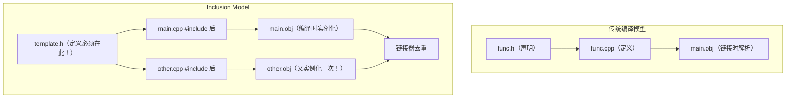

# 第9章 模板在实践中的使用 —— 从书本到工程

## 核心问题

教科书上的模板例子永远是三五行代码，但真实的模板工程（比如 CUTLASS）动辄几百个头文件、几千次实例化、编译时间以分钟计。当你从"写一个 `std::vector` 的玩具实现"跳到"维护一个模板代码库"时，你会撞上三个硬骨头：

1. **Inclusion Model（包含模型）**：模板定义必须在头文件中。这是编译原理决定的，不是设计失误。但这也意味着改一个底层模板头文件 = 重新编译整个项目。
2. **显式实例化（Explicit Instantiation）**：你知道模板能为 `float`、`double`、`half` 各生成一次代码。但显式实例化能把这个行为变成可控制的，从而在编译时间和二进制体积之间做交换。
3. **编译时间管理**：模板是编译器在帮你写代码——这个福利的代价就是编译时间。预编译头、extern template、模块化拆分——这些不是"锦上添花"，而是 CUTLASS 能编译过的生存技能。

核心问题可以浓缩成一句话：**如何在模板的"零运行时开销"和"天文数字的编译时间"之间找到工程上的平衡点？**

## 通俗解释：印刷厂 vs 手抄本

把编译过程想象成印刷：

- **普通代码** = 抄写员手抄一本书。改了一页，只重抄这一页。
- **模板代码** = 印刷厂的模板（真的印刷模板！）。你有一张母版（模板定义），每次调用 `vector<int>`、`vector<float>` 都是往母版上浇铸不同的金属液，得到不同的铅字版。
- **Inclusion Model** = 印刷厂规定：母版必须放在每个车间（翻译单元）都能看到的地方。你不能把母版锁在某个车间里，因为别的车间也要用。
- **显式实例化** = 你提前声明"今天只要印 float 版和 double 版"，然后印刷厂只浇铸这两种，不浇铸 `vector<half>`，省了浇铸成本（编译时间）和仓库空间（二进制体积）。
- **预编译头** = 把一些常用母版（`<type_traits>`、`<utility>` 等）提前浇铸好存着，每个车间来取就行，不用每次重新熔铅。
- **C++20 模块** = 印刷厂终于升级了设备，母版可以用电子版共享，不需要每个车间物理拷贝一份。可惜 CUDA 编译器还不完全支持。

## Inclusion Model：模板的头文件诅咒

C++ 的模板编译模型（Inclusion Model）的本质原因是：**模板不是代码，是代码生成器。编译器必须在实例化点上看到完整的模板定义，才能生成代码。**

```cpp
// my_template.h
template<typename T>
T add(T a, T b) {
    return a + b;
}

// main.cpp
#include "my_template.h"
// 编译器在这里看到 add<int> 的调用
// 它必须具备 add 的完整定义才能为 int 生成 add 函数
auto r = add(1, 2);
```

这跟普通函数完全不一样：

```cpp
// my_func.h
int add(int a, int b);  // 只有声明！定义在 .cpp 里

// main.cpp
#include "my_func.h"
auto r = add(1, 2);     // 链接器在链接时解析 add 的定义
```

**模板的这种"必须看到定义"的约束直接导致了三个工程问题：**

1. **编译时间爆炸**：每个 `.cpp` 包含头文件后，都在独立实例化相同的模板（虽然链接器会去重）。`N` 个翻译单元 * `M` 次模板实例化 = O(N*M) 的编译工作量。
2. **头文件膨胀**：所有模板逻辑挤在头文件里，`#include` 依赖链长得吓人。CUTLASS 的一个 `#include <cutlass/gemm/device/gemm.h>` 会拖进来几十万行代码。
3. **增量编译失效**：改了底层模板头文件的一个空格 → 所有依赖它的翻译单元重编。



## 显式实例化：掌控代码生成的开关

显式实例化让你精确控制编译器**在哪里、为哪些类型**生成模板实例：

```cpp
// 声明：告诉编译器不要自动实例化
extern template class std::vector<int>;

// 定义：告诉编译器在这里实例化
template class std::vector<int>;
```

这个机制有两个核心用途：

### 用途1：减少编译时间（extern template）

```cpp
// common_instantiations.cpp —— 唯一的实例化源
#include <vector>
template class std::vector<int>;
template class std::vector<float>;
template class std::vector<double>;

// main.cpp —— 使用 extern 声明，不重复实例化
extern template class std::vector<int>;
extern template class std::vector<float>;
std::vector<int> v;  // 编译器相信链接器会找到定义
```

效果：`common_instantiations.cpp` 编译一次（慢），其他 100 个 `.cpp` 都很快，因为它们不做模板实例化。

### 用途2：控制二进制体积

```cpp
// 只实例化需要的类型组合
template class cutlass::gemm::Gemm<
    float, cutlass::layout::RowMajor,   // A
    float, cutlass::layout::ColumnMajor, // B
    float, cutlass::layout::RowMajor     // C
>;

// 不实例化 double 版本！减少 .so 体积
// template class cutlass::gemm::Gemm<double, ...>;  // 注释掉
```

## CUTLASS 为什么编译慢又如何优化

CUTLASS 编译慢不是因为代码写得差，而是因为**组合爆炸**。CUTLASS 的设计哲学是"把所有变体编码进类型系统"：

```cpp
// cutlass/gemm/device/gemm.h 的简化示意
template <
    typename ElementA_,          // 可以是 float, half, int8...
    typename LayoutA_,           // 可以是 RowMajor, ColumnMajor...
    typename ElementB_,
    typename LayoutB_,
    typename ElementC_,
    typename ElementC_,
    typename ThreadblockShape_,  // 可以是 128x128, 256x128...
    typename WarpShape_,         // 可以是 64x64, 32x64...
    typename InstructionShape_,  // 可以是 16x8x8, 16x8x16...
    typename ArchTag_,           // SM75, SM80...
    typename OperatorClass_,     // Simt, TensorOp...
    // ... 还有更多参数
>
class Gemm { /* ... */ };
```

参数空间计算：`3 * 2 * 3 * 2 * ... ≈ 数万种组合`。其中大量的组合从未被使用，但仍然需要编译器检查语法合法性。这就是 CUTLASS 编译时间的主要来源。

### CUTLASS 的编译优化策略

1. **分层拆分（Layer Splitting）**：CUTLASS 把 GEMM 的编译拆成多个阶段——thread-level、warp-level、block-level、device-level。每层各有一个"主模板"，高层只依赖底层的接口，不依赖底层的实现。

2. **显式实例化 + 选择性编译**：

```cpp
// cutlass/gemm/device/gemm_universal.h 中类似的模式
// gemm_universal_complex.cu —— 单独编译文件，只实例化 complex 类型
template class cutlass::gemm::device::GemmUniversal<
    cutlass::complex<float>,   // 只有 complex 版本
    cutlass::layout::RowMajor,
    cutlass::complex<float>,
    ...
>;
```

每个 `.cu` 编译单元只实例化自己关心的类型组合。这样并行编译时，不同 `.cu` 文件的实例化互不干扰。

3. **编译器缓存（ccache/sccache）**：CUTLASS 的 CI 大量使用 sccache 来缓存 nvcc 的编译输出。

4. **预编译头（PCH）**：CUTLASS 在 `tools/util/include/cutlass/util/reference/` 和测试文件中使用预编译头来避免重复解析头文件。

## TensorRT 的构建系统设计

TensorRT 在模板编译优化上走得更极端——它干脆**不用模板做公共 API**：

```cpp
// TensorRT 的 API 面向 C 风格接口
nvinfer1::ICudaEngine* engine = builder->buildEngine(*network);

// 内部实现通过虚函数和运行时多态来避免模板膨胀
// 而不是 CUTLASS 的编译期多态
```

TensorRT 的构建系统（Bazel + 自定义规则）针对 CUDA 编译做了特殊优化：

- **分离 host 和 device 代码**：`.cpp` 用 host compiler（gcc/clang），`.cu` 用 nvcc。host 代码中的模板实例化频率远低于 device 代码。
- **LTO（Link Time Optimization）**：在链接阶段进行跨翻译单元的内联和设备代码去重，这是 nvcc 编译链的强项。

## 模板调试技巧

### 技巧1：用 static_assert 代替 SFINAE 报错

```cpp
template<typename T>
void process(T val) {
    static_assert(
        std::is_floating_point_v<T> || std::is_integral_v<T>,
        "process() only supports arithmetic types"
    );
    // 错误信息比 10 页 SFINAE 报错清晰得多
}
```

### 技巧2：用类型输出器（Type Printer）定位实例化

```cpp
template<typename T>
struct TypeDump;  // 故意不定义

template<typename T>
void buggy(T t) {
    TypeDump<T> dump;  // 编译错误会输出 T 的具体类型
}
```

### 技巧3：用 -ftemplate-backtrace-limit 减少噪声

```bash
# gcc/clang
-fmessage-length=0 -ftemplate-backtrace-limit=5

# nvcc 的类似选项
--display-error-number
```

### 技巧4：隔离实例化单元

创建单独的 `.cu` 文件，只做显式实例化。这样可以单独编译和测量这个文件的编译时间，快速定位编译慢的来源。

## 常见坑点

### 坑1：extern template 和隐式实例化的冲突

```cpp
// a.cpp
extern template class std::vector<int>;

// b.cpp
#include <vector>
std::vector<int> v;  // 隐式实例化！
// 如果 a.cpp 期望链接时找到定义，但没有任何 .cpp 提供显式实例化定义 → 链接错误
```

### 坑2：constexpr 变量在头文件中的 ODR 问题

```cpp
// header.h
constexpr int kValue = 42;  // C++17: 隐含 inline，OK
constexpr const char* kName = "hello";  // 不是 inline！可能 ODR 违规
```

**解决：** C++17 inline 变量：

```cpp
inline constexpr const char* kName = "hello";  // 安全
```

### 坑3：CUDA 的分离编译（separable compilation）和 extern template

CUDA 的分离编译（`-rdc=true`）和 `extern template` 配合使用时，链接器必须能找到 device code 的定义，这在多 GPU 架构编译时是个已知痛点。

## 本章总结

1. **Inclusion Model 是模板的天生缺陷也是天生优势**：缺陷是需要把定义暴露在头文件中，优势是编译器能做最大程度的内联和优化——这对 GPU 的 device 代码至关重要。
2. **显式实例化是你对编译器的"交通管制"**：不做管制 → 编译器全自动实例化 → 编译时间爆炸。做好管制 → 你指定的类型在指定的翻译单元实例化一次 → 编译可控。
3. **CUTLASS 编译慢的根本原因是参数空间的组合爆炸**：每个类型参数的每个取值组成一个超立方体，CUTLASS 通过分层拆分和选择性显式实例化来在这个超立方体里划出一片 "实际需要的空间"。
4. **模板调试是信息过滤的艺术**：编译器对模板错误的输出通常有几千行，`static_assert`、type printer、backtrace limit 是你的三大过滤利器。
5. **工程实践中，模板代码的编译时间管理比模板代码的正确性更早暴露问题**。你可能会写出正确的模板，但如果它让编译时间从 30 秒变成 30 分钟，它就不是可用的模板。
