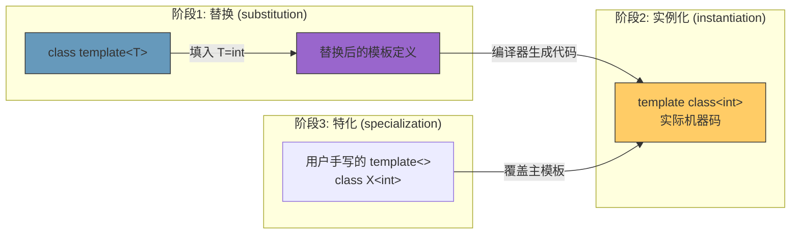
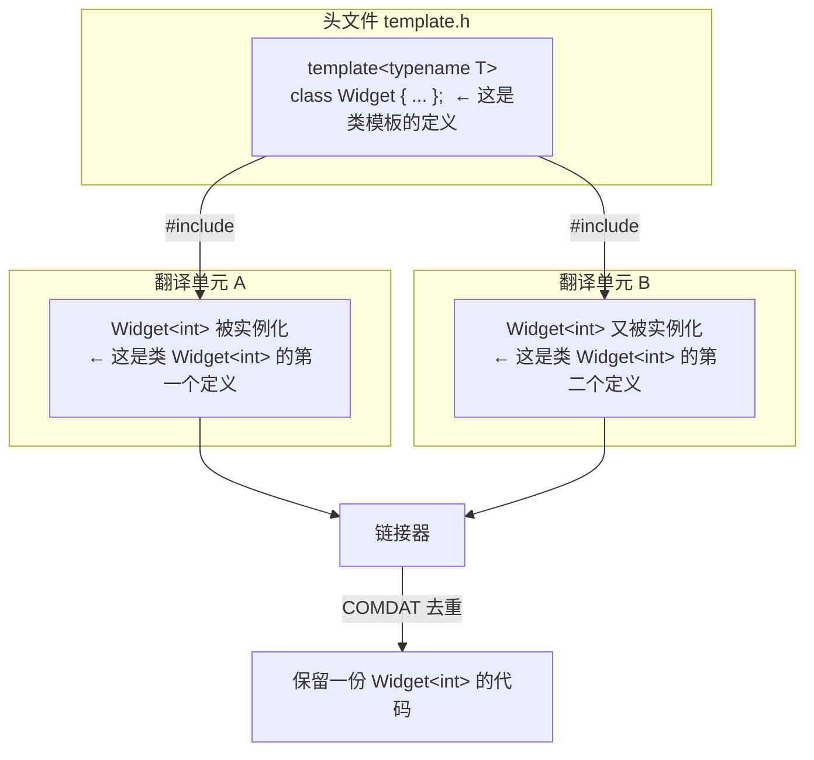

# 第10章 模板基本术语 —— 说对术语才能写对代码

## 核心问题

C++ 模板的术语是一坨历史遗留的灾难。同一个东西有三个名字，同一个名字又指三个东西。更糟糕的是，编译器错误信息里用的是这些术语的精确定义，你说错了就无法理解编译器到底在抱怨什么。

本章要解决的问题非常朴素：**让你和编译器用同一种语言交流。**

核心术语区分的要点：

1. **class template（类模板） vs template class（模板类）** — 一个是蓝图，一个是蓝图印出来的实物。你永远写的是 class template，编译器生成的是 template class。
2. **substitution（替换） → instantiation（实例化） → specialization（特化）** — 这是模板生命周期的三个阶段，很多人把它们混为一谈。
3. **ODR（One Definition Rule，单一定义规则）** — 你以为你只定义了一次，编译器认为你定义了三次。ODR 违规是链接期最隐蔽的 bug。
4. **声明（declaration） vs 定义（definition）** — 模板的"定义"不产生代码，"实例化"才产生代码。这个区分在头文件工程中至关重要。

## 通俗解释：建筑设计院

把 C++ 编译想象成一个建筑设计院的流程：

- **class template（类模板）** = 建筑图纸模板。上面写着"楼高 N 层，每层面积 S 平方米，外立面颜色 C"。N、S、C 是参数，图纸本身不是一栋楼。你有一个 `vector<T>` 的图纸。
- **全特化（explicit/full specialization）** = 你说"如果 N=10, S=2000, C=红，用这张特定的图（完全手绘的，不用模板）"。`vector<bool>` 就是手绘的——它根本不是从通用图纸生成的。
- **偏特化（partial specialization）** = 你说"如果 S>1000，用这种大平层设计；否则用标准设计"。`vector<T*>` 对所有指针类型有一套专门的图纸。
- **实例化（instantiation）** = 工人拿着图纸模板 `vector<int>`，填入 N=..., S=..., C=...，开始盖楼。每栋楼（`vector<int>`、`vector<float>`）都是从同一张图纸生成的，但它们是不同的实体。
- **ODR（单一定义规则）** = 城市规划局规定，一个城市里不能有两栋楼用同一个名字。如果 `vector<int>` 的代码在 a.o 和 b.o 里各出现了一次，链接器会报错"重名"。但实际上模板有个豁免：链接器会自动去重（COMDAT 机制）。
- **声明 vs 定义** = 声明是"这块地上将要建一栋楼"，定义是"这是楼的施工图纸"。对于模板来说，施工图纸（定义）不占土地，只有真正施工（实例化）才占。

## Class Template vs Template Class：一字之差，天壤之别

这是 C++ 模板术语中最容易混淆的一对：

| 术语 | 英文 | 含义 | 类比 |
|------|------|------|------|
| 类模板 | **class template** | 参数化的类蓝图，不是真实的类型 | 饼干模具 |
| 模板类 | **template class** | 实例化后的具体类，是真实类型 | 用模具烤出来的饼干 |

```cpp
// 这是 class template（类模板）
template<typename T>
class MyVector {
    T* data_;
    size_t size_;
};

// 这是 template class（模板类）—— 特化
template<>
class MyVector<bool> {
    // 完全不同的实现！
    uint8_t* bits_;
};

// MyVector<int> — 也是 template class（实例化后的具体类）
// 但 int 版本是从主模板（primary template）生成的
```

**在编译器错误信息中：**

```
error: no matching function for call to 'MyVector<int>::push_back(bool)'
// 这里的 MyVector<int> 是 template class（实例化后的）
// MyVector 是 class template（主模板）
```

**工程实践中的影响：**

当你说"我要写一个模板类"时，团队里的人可能理解为：
- 你要写 `template<typename T> class X {}`（class template）
- 你要写 `template<> class X<int> {}`（显式全特化）

为避免歧义，在工程文档中统一用：
- "**类模板**" = class template
- "**模板实例**" = instantiated template class

### Mermaid：模板生命周期三个阶段



## Substitution（替换）、Instantiation（实例化）、Specialization（特化）

这三个词描述的是模板生命周期的三个步骤，不能互换：

### 1. Substitution（替换）
模板参数被替换为具体类型/值的**过程**。发生在实例化之前。如果替换失败，SFINAE 会静默抛弃而非报错。

```cpp
template<typename T>
typename T::value_type get_val(T t) { return *t; }
//                    ↑ 替换时 T::value_type 必须合法
get_val(42);  // T=int，int::value_type 不存在 → 替换失败 → SFINAE
```

### 2. Instantiation（实例化）
编译器根据替换后的模板**生成具体代码**的过程。这是真正产生 `.o` 中符号的步骤。

```cpp
std::vector<int> v;  // 触发 std::vector<int> 的实例化
// 编译器此时为 vector<int> 生成构造函数、析构函数、push_back 等代码
```

### 3. Specialization（特化）
用户**手写**的、覆盖主模板的特定版本。全特化覆盖所有参数，偏特化覆盖部分参数。

```cpp
// 主模板（primary template）
template<typename T> struct Traits { static constexpr bool is_float = false; };

// 全特化（explicit specialization）—— 覆盖 float 的版本
template<> struct Traits<float> { static constexpr bool is_float = true; };

// 偏特化（partial specialization）—— 覆盖所有指针的版本
template<typename T> struct Traits<T*> { static constexpr bool is_pointer = true; };
```

### 关键区分

- "替换"是动作，"实例化"是结果。
- "特化"是用户写的，"实例化"是编译器生成的。
- 编译器错误 "during instantiation of..." 指的是在生成代码时出错（不是替换阶段）。

## ODR（单一定义规则）在 HPC 中的实际影响

ODR 规定：在整个程序中，任何非内联函数、变量、类型在每个翻译单元中最多只能有一个定义。

```cpp
// file_a.cpp
struct KernelConfig {
    static constexpr int threads_per_block = 256;
};

// file_b.cpp
struct KernelConfig {
    static constexpr int threads_per_block = 128;  // ODR 违规！
    // 两个翻译单元对同一个名字有不同的定义
};
```

### 为什么 HPC 中 ODR 问题特别严重？

1. **多个 .cu 文件各自编译后链接**：CUDA 代码经常分散在多个 `.cu` / `.cpp` 中，每个独立编译（甚至用不同的编译选项），链接时 ODR 违规可能**不产生任何编译错误或警告**，只在运行时表现出诡异的计算错误。

2. **模板在多个翻译单元中实例化相同的类型**：
```cpp
// kernel_a.cu
__global__ void gemm_kernel<float, 128, 128>(...) { ... }
// 这里触发 Gemm<float, 128, 128> 的实例化

// kernel_b.cu
__global__ void gemm_kernel<float, 128, 128>(...) { ... }
// 这里又触发了一次！
```

链接器通过 **COMDAT**（Common Data，段标记）机制自动去重。但 COMDAT 只能保证选一个，不能保证选的是"最对的"。如果两个翻译单元用不同编译选项导致了不同的机器码，链接器随机丢弃一个——这是一个不可调试的 hell。

### CUTLASS 如何避免 ODR 问题

CUTLASS 通过 **显式实例化 + 单一编译文件** 模式来规避：

```cpp
// cutlass/library/src/gemm_operation_fp32.cu —— 唯一的实例化源
template class cutlass::gemm::device::Gemm<
    float, RowMajor,
    float, ColumnMajor,
    float, RowMajor,
    float
>;

// 其他 .cu 文件通过 extern template 声明来使用
// 确保整个库中 float GEMM 只实例化一次
```

## 声明 vs 定义：一个类模板到底"定义"了几次？

```cpp
// header.h
template<typename T>
class Widget {      // 这是 Widget 类模板的"定义"
public:
    void foo();     // 这是 foo 的"声明"
};

template<typename T>
void Widget<T>::foo() {  // 这是 foo 的"定义"
    // ...
}
```

关键点：**类模板的定义写在头文件里是合法的，因为这是"类模板"的定义，而不是任何具体"类"的定义。只有实例化时才产生具体类型的定义。**

这个区分解释了为什么头文件可以有 `template<typename T> class X { ... };` 而不违反 ODR——每个翻译单元看到的是**同一个类模板的定义**，不是同一个类的多个定义。

### Mermaid：模板定义 vs 类定义的 ODR 边界



## 工业关联：ODR 在 HPC 中的具体影响

### 场景1：寄存器优化的闪存布局

GPU kernel 为了让高频访问的数据留在寄存器中，往往把数据布局定义为 struct：

```cpp
// 两个 .cu 文件各自定义了同名但不同布局的 struct
// file_a.cu
struct ThreadData {
    float a, b, c;  // 布局1：a 在寄存器 r0, b 在 r1, c 在 r2
};

// file_b.cu
struct ThreadData {
    float c, b, a;  // 布局2：与布局1寄存器映射不同！
};
```

链接器去重时随机选一个布局，另一个 kernel 的寄存器分配全乱。这不是编译错误，而是**静默的数据损坏**——GPU 上最可怕的 bug 类型。

### 场景2：__constant__ 内存的 ODR

```cpp
// config.h
template<int N>
__constant__ float kernel_weights[N];
```

如果在不同 `.cu` 中对同一个 `N` 隐式实例化，CUDA 的 constant memory 分配可能冲突——两个 kernel 认为自己有独立的 constant memory，但实际共享了同一块。

## 常见坑点

### 坑1：ODR 违规不报错，但导致 UB

```cpp
// header.h
inline constexpr int kBlockSize = 256;  // C++17: OK, inline 变量

// 但如果你写了：
constexpr int kBlockSize = 256;  // C++14: 不是 inline！每个 TU 一份定义
```

编译器**可能不会报错**。链接器可能**不会报错**。直到你在不同优化级别下编译两个 `.cpp`，发现 kBlockSize 在某些代码路径下变成了莫名其妙的值。

### 坑2：模板全特化是"定义"，不是"声明"

```cpp
// header.h
template<typename T> struct Traits { static const int value = 0; };
template<> struct Traits<int> { static const int value = 42; };
// 如果 header.h 被多个 .cpp 包含 → ODR 违规！
// 全特化不是模板，它是具体的类定义
```

**解决：**

```cpp
// header.h
template<typename T> struct Traits { static const int value = 0; };
template<> struct Traits<int> { static const int value = 42; };  // ODR 违规！

// 正确做法：
// header.h
template<> struct Traits<int>;  // 声明
// header.cpp
template<> struct Traits<int> { static const int value = 42; };  // 定义
```

或者 C++17 中：

```cpp
// header.h
template<> inline constexpr int Traits<int>::value = 42;  // inline 变量
```

### 坑3："主模板"（primary template）≠ "第一个写的模板"

主模板是最通用的那个模板声明，不是时间上先写的那个。顺序无关紧要：

```cpp
template<typename T> struct Foo { ... };  // 这是主模板
template<typename T> struct Foo<T*> { ... };  // 这是偏特化
template<> struct Foo<int> { ... };  // 这是全特化
```

编译器总是先尝试匹配最特化的版本，匹配不到才回退到主模板。

## CUTLASS 关联：显式实例化策略

CUTLASS 在 `cutlass/library/src/` 中使用显式实例化来控制编译和链接行为。以 `gemm_operation_fp16.cu` 为例：

```cpp
// 显式实例化所有需要的 fp16 GEMM 组合
#define INSTANTIATE_GEMM(ElementA, LayoutA, ElementB, LayoutB, ...) \
    template class cutlass::gemm::device::Gemm<ElementA, LayoutA, ...>;

// 批量实例化
INSTANTIATE_GEMM(cutlass::half_t, RowMajor, cutlass::half_t, ColumnMajor, ...);
INSTANTIATE_GEMM(cutlass::half_t, ColumnMajor, cutlass::half_t, RowMajor, ...);
```

这个模式的精妙之处：
1. 每个 `.cu` 文件只实例化一组特定类型组合（比如只做 fp16）
2. 不同精度的实例化放在不同文件中（`gemm_operation_fp16.cu`、`gemm_operation_fp32.cu`）
3. 通过宏批量生成，减少手写重复
4. 编译并行：不同 `.cu` 文件可以分布在不同的编译节点上

## 本章总结

1. **class template 是蓝图，template class 是实物**。说反了会导致团队沟通混乱和编译错误的错误解读。
2. **Substitution → Instantiation → Specialization 是模板三部曲**。替换是填参过程，实例化是代码生成，特化是用户覆盖。
3. **ODR 在 HPC 中不是理论问题，是实际的数据损坏来源**。尤其在 GPU 的寄存器布局和 `__constant__` 内存中，ODR 违规会导致静默的、难以调试的错误。
4. **模板全特化是"定义"而非"模板定义"** — 这意味着它和普通类一样受 ODR 约束，需要 `inline` 或分离声明和定义。
5. **CUTLASS 通过显式实例化 + 单一编译文件模式来系统性地规避 ODR 和编译时间问题**。这不是"能用就行"的战术，而是贯穿整个库的编译架构策略。
