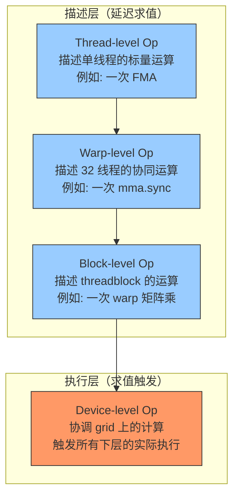

# 第11章 泛型库 —— CUTLASS 的前身

## 核心问题

STL（Standard Template Library）不只是教你用 `std::vector` 和 `std::sort`。STL 真正的遗产是一套**泛型编程的设计哲学**，这套哲学直接塑造了 CUTLASS、Thrust、CUB 等 GPU 高性能库的架构。

把 STL 的思想从 CPU 移植到 GPU，面对的核心问题：

1. **callable（可调用对象）不等于函数指针**。GPU kernel 不能接收函数指针作为参数（SM 75 以下无函数指针支持）。所以 GPU 的泛型库必须用"函数对象（function object）"代替函数指针——这就是 CUTLASS 中 thread-level op、warp-level op 的根源。
2. **`std::declval` 让你在编译期"假装"有对象**。你不需要真的构造对象就能查询它的类型属性。在 GPU 的世界里，构造一个对象可能意味着分配 shared memory 或启动 kernel——这不能在编译期做。`declval` 让你绕过了这个限制。
3. **延迟求值（lazy evaluation）是泛型库的灵魂**。你不要急着计算结果，而是构造一个"计算的描述"（表达式模板），等到真正需要值时再一次性求值。CUTLASS 的分层 GEMM 设计就是延迟求值的极致体现——thread-level 算子只是"描述了"操作，block-level 才"执行"它。
4. **完美转发在泛型库中不仅是优化，也是语义必需**。如果 callable 接受右值引用参数，你的泛型包装必须原封不动地转发。

## 通俗解释：餐厅后厨的流水线

想象一个大餐厅的后厨：

- **callable（可调用对象 / 函数对象）** = 每个厨师是一个 callable。不是每个厨师都是一样的——有人专职切菜（`struct Chop { void operator()(Vegetable& v); }`），有人专职炒菜（`struct StirFry { void operator()(Wok& w); }`）。但他们都有同一个"上岗证"：只要你能被 `operator()` 调用，你就是厨师（callable）。**这就是鸭子类型（duck typing）在 C++ 中的体现。**
- **函数指针** = 电话号码（一个地址的别名）。但后厨（GPU kernel）里不能直接用电话号码找人——GPU 的指令集不支持间接跳转（SM75 之前没有 `brx` 指令用于间接分支）。替代方案是：你把厨师直接带到岗位上（函数对象）。
- **`std::declval`** = 招聘前的"模拟面试"。你还没确定录用谁，但你先看看"如果这个人上岗，他一天能处理多少单？"（`decltype(std::declval<Chef>().capacity())`）。你不需要真的让他做一天，你只是问编译器查他的简历（类型系统中的返回类型）。
- **延迟求值** = 客人点菜时，服务员（高层逻辑）只是在订单纸上记录"宫保鸡丁 × 1"（构造表达式模板），不急着做。等到所有订单都确认（编译期检查类型匹配），一次性下到后厨（实例化 + 执行）。
- **完美转发** = 服务员上菜时，如果客人要求"大份、加辣、不要葱"，这个要求必须原封不动传递给厨师（`std::forward<Order>(order)`）。中间如果服务员自作主张改单——灾难。

## Callable：函数对象的崛起

在 GPU 泛型编程中，callable 几乎是**唯一的抽象手段**。GPU kernel 不能通过虚函数实现动态多态（vtable 在 SM 上没有意义），不能通过函数指针实现回调（无间接跳转）。剩下的只有：编译期确定的 callable。

### 函数对象（function object）的基本形态

```cpp
struct ScaleFunctor {
    float scale_;
    ScaleFunctor(float scale) : scale_(scale) {}

    __device__ float operator()(float x) const {
        return x * scale_;  // scale_ 在一个寄存器中
    }
};

template<typename Functor>
__global__ void transform_kernel(float* data, int n, Functor f) {
    int idx = threadIdx.x + blockIdx.x * blockDim.x;
    if (idx < n) {
        data[idx] = f(data[idx]);  // 没有间接跳转！Functor 类型编译期确定
        // nvcc 直接内联 ScaleFunctor::operator()
    }
}
```

这里的精妙之处：**`Functor` 是模板参数，类型编译期确定，`f(data[idx])` 没有间接调用开销。** 编译器会把这个调用完全内联，生成的 SASS 代码就像你手写了 `data[idx] * 2.0f` 一样。

### 三种 Callable 在 CUDA 中的对比

| Callable 类型 | 示例 | GPU 支持 | 开销 | CUTLASS 中对应 |
|--------------|------|---------|------|---------------|
| 函数对象 | `struct F { __device__ void operator()(...); }` | 完全支持 | 零（内联） | thread-level op |
| Lambda | `[] __device__ (int x) { return x*2; }` | 完全支持 | 零（内联） | 较少使用（nvcc 的 lambda 支持较晚） |
| 函数指针 | `void (*f)(int)` | SM75+ 有限支持 | 高（间接跳转） | 不使用 |
| std::function | `std::function<void(int)>` | 不支持 | N/A | 完全不使用 |

## std::declval：编译期的"占位符演员"

`std::declval<T>()` 是一个永远不会被调用的函数（它只有声明没有定义），它的唯一用途是**在编译期假装你有一个 T 类型的对象**，让你能查询这个对象的成员类型和返回值类型。

```cpp
// 没有 declval 的写法：必须真的构造对象，太痛苦了
template<typename T, typename U>
struct AddResult {
    T t{};  // 必须默认构造 T 和 U！
    U u{};  // 如果 T 没有默认构造函数 → 编译错误！
    using type = decltype(t + u);
};

// 用 declval 的写法：纯编译期查询，零副作用
template<typename T, typename U>
struct AddResult {
    using type = decltype(std::declval<T>() + std::declval<U>());
    // std::declval<T>() 不构造对象，只告诉编译器 "假装有 T"
};
```

### 在 CUTLASS 中的实际应用

CUTLASS 中大量使用 `declval` 来进行编译期的类型兼容性检查：

```cpp
// 类似于 cutlass/gemm/thread/ 中的计算能力查询
template<typename OperatorA, typename OperatorB>
struct CanChain {
    // 检查 OperatorA 的输出类型是否可以被 OperatorB 接受
    using OutputA = decltype(std::declval<OperatorA>().output_type());
    using InputB = decltype(std::declval<OperatorB>().input_type());
    static constexpr bool value = std::is_same_v<OutputA, InputB>;
};
```

这里 `output_type()` 可能是一个 `static` 成员函数的返回类型，也可能是一个成员类型别名。通过 `declval` + `decltype`，你不需要知道具体是哪种形式——你只需问编译器"如果我有 OperatorA 对象，它的 output_type() 返回什么类型？"

## 延迟求值：表达式模板（Expression Templates）

表达式模板是泛型库中最强大也最容易被忽视的设计模式。核心思想：**运算符不要直接计算结果，而是返回一个"记录了运算的轻量对象"，等到赋值时才一次性求值。**

### 经典示例：向量加法

```cpp
// 不用表达式模板（急于求值）
Vec operator+(const Vec& a, const Vec& b) {
    Vec result(a.size());  // 分配临时内存
    for (size_t i = 0; i < a.size(); ++i)
        result[i] = a[i] + b[i];
    return result;  // 可能触发拷贝
}
// a + b + c 会产生两个临时 Vec 对象

// 用表达式模板（延迟求值）
template<typename LHS, typename RHS>
struct VecAddExpr {
    const LHS& lhs_;
    const RHS& rhs_;
    // 没有分配！没有循环！只是持有引用
};

template<typename LHS, typename RHS>
auto operator+(const LHS& a, const RHS& b) {
    return VecAddExpr<LHS, RHS>{a, b};  // 只记录运算关系，不算结果
}
// a + b + c 只创建一个嵌套的 VecAddExpr，零分配
```

### CUTLASS 的分层设计是延迟求值的终极形态

CUTLASS 的 GEMM 算子是分层构建的：



**Thread-level op** 只是一个"运算的描述"——它定义了"这个线程做 FMA"这个行为类型。但它自己并不执行。**Warp-level op** 把这个描述分发给 32 个线程，**Block-level op** 协调多个 warp，**Device-level op** 才真正启动 kernel。

这种分层设计让你可以像搭乐高一样组合运算：

```cpp
// 伪代码：组合不同的 thread-level 算子
using Epilogue = cutlass::epilogue::thread::LinearCombination<
    float,     // 输出类型
    1,         // 向量化宽度
    float,     // 累加器类型
    float      // 计算类型
>;

// Epilogue 只是描述了"累加后加偏置"这个运算
// 它自己不做任何事，直到被 block-level 或 device-level 调用
```

## 工业关联：CUTLASS 的 thread-level、warp-level、block-level 设计

CUTLASS 的分层设计直接继承了 STL 的泛型编程思想——"策略"（Policy）和"算子"（Operator）的分离。

### Thread-level 算子（`cutlass/gemm/thread/`）

这是最底层的建筑块。在 `cutlass/gemm/thread/mma_sm80.h` 中：

```cpp
// SM80 Tensor Core 的 thread-level MMA 操作
template <
  typename Shape_,          // 单个线程的 MMA shape
  typename ElementA_,
  typename LayoutA_,
  typename ElementB_,
  typename LayoutB_,
  typename ElementC_,
  typename LayoutC_,
  typename Policy = ...
>
class Mma {
 public:
  // operator() 执行一次 thread-level 的矩阵乘累加
  CUTLASS_DEVICE
  void operator()(
    FragmentA& a,   // 线程持有的 A 片段
    FragmentB& b,   // 线程持有的 B 片段
    FragmentC& c    // 线程持有的 C 累加器
  );
};
```

这里的 `FragmentA`、`FragmentB`、`FragmentC` 是线程级的矩阵片段。每个线程只持有整个矩阵的一小部分，这一部分由 MMA 指令的布局决定（如 m16n8k16 意味着每个 warp 计算 16×8 的结果）。

### Warp-level 算子（`cutlass/gemm/warp/`）

Warp-level 将 thread-level 的算子编排进 32 个线程：

```cpp
// cutlass/gemm/warp/mma_tensor_op_sm80.h
template <
  typename WarpShape_,         // warp 的 shape（如 64x64）
  typename InstructionShape_,  // 每条指令的 shape（如 16x8x16）
  typename ElementA_,
  typename LayoutA_,
  ...
>
class MmaTensorOp {
  // 核心功能：在每个 warp iteration 中调用 thread-level 的 Mma
  template<typename FragmentC, typename FragmentA, typename FragmentB>
  CUTLASS_DEVICE
  void operator()(FragmentC& D, FragmentA const& A, FragmentB const& B, FragmentC const& C);
};
```

**关键设计：** `FragmentC` 是模板参数，可以是任何满足"累加器"概念（concept）的类型。这种"基于概念的泛型设计"正是 STL iterator 思想的直接继承——不需要继承同一个基类，只需要满足相同的语义契约。

### Block-level 算子（`cutlass/gemm/threadblock/`）

Block-level 负责：
- 将 threadblock 的 tile 分发给各 warp
- 管理 shared memory 的 tile 加载
- 处理边界条件（tile 不足时的 padding）

```cpp
// cutlass/gemm/threadblock/mma_pipelined.h
template <
  typename Mma_,              // warp-level 的 Mma 策略
  int Stages_,                // pipeline 的 stage 数量
  typename IteratorA_,        // A 矩阵的共享内存迭代器
  typename IteratorB_,
  ...
>
class MmaPipelined {
  // 使用软件流水线（software pipelining）来隐藏延迟
  // 本质上是 "迭代器 + Mma 算子" 的组合，标准的 STL 思维
};
```

## 常见坑点

### 坑1：nvcc 对 lambda 的 constexpr 捕获支持有限

```cpp
// 这段代码在 nvcc 下可能编译失败（取决于 CUDA 版本）
constexpr int scale = 2;
auto f = [scale] __device__ (int x) { return x * scale; };
// nvcc 可能无法正确处理 constexpr 捕获
```

**替代方案：** 用函数对象代替 lambda——函数对象对 nvcc 是完全透明的。

```cpp
struct ScaleBy2 {
    __device__ int operator()(int x) const { return x * 2; }
};
```

### 坑2：std::declval 在 device 代码中无法直接使用

`std::declval` 是纯编译期工具，但如果你在 `__device__` 函数中把它当普通函数调用，nvcc 可能会产生困惑。

```cpp
// 安全：在模板元编程上下文中使用
template<typename T>
using ElementType = decltype(std::declval<T>()[0]);

// 不安全：在 __device__ 函数体中写 declval
__device__ void buggy() {
    // using T = decltype(std::declval<SomeType>()); // 可能触发 nvcc 警告
}
```

**规则：** `declval` + `decltype` 组合只在 `using`、`typedef`、模板参数推导等**非执行上下文**中使用。

### 坑3：表达式模板的 auto 参数推导陷阱

```cpp
auto expr = a + b + c;  // expr 的类型是嵌套的 VecAddExpr
// 如果你 a、b、c 是局部变量，expr 持有它们的引用
// { 作用域结束 → a、b、c 销毁 → expr 中的引用悬空 }
```

这是表达式模板最经典的 bug。**CUTLASS 避免了这个问题**，因为它的分层算子（thread-level、warp-level）不持有对局部变量的引用——它们通过模板参数接收类型信息，实际数据存储在外部的 `Fragment` 或 shared memory 中。

## 本章总结

1. **STL 的泛型编程哲学是 CUTLASS 的设计蓝图**。thread-level op 对应 STL 的 callable，warp-level op 对应 STL 的算法，block-level op 对应 STL 的迭代器 + 算法组合。
2. **GPU kernel 不能走函数指针和虚函数，只能走函数对象**。这迫使 GPU 泛型库必须把整个运算链在编译期完全展开——这是约束，但也是机会：完全展开意味着完全内联，零间接调用开销。
3. **`std::declval` 是类型信息查询的"安全假人"**。在 CUTLASS 中用于检查不同层的算子之间能否连接（类型是否兼容），全部在编译期完成。
4. **延迟求值 = 表达式模板 = 零临时内存**。CUTLASS 的整个分层架构就是一套巨大的表达式模板，thread-level 只是"描述"，block-level 才是"执行"。
5. **CUTLASS 的三个核心目录映射了三种抽象级别**：`gemm/thread/` → 单线程可调用对象，`gemm/warp/` → warp 级协同算法，`gemm/threadblock/` → block 级迭代器 + 算法编排。这个三层架构可以直接追溯到 STL 的 Iterator + Algorithm + Functor 三分法。
