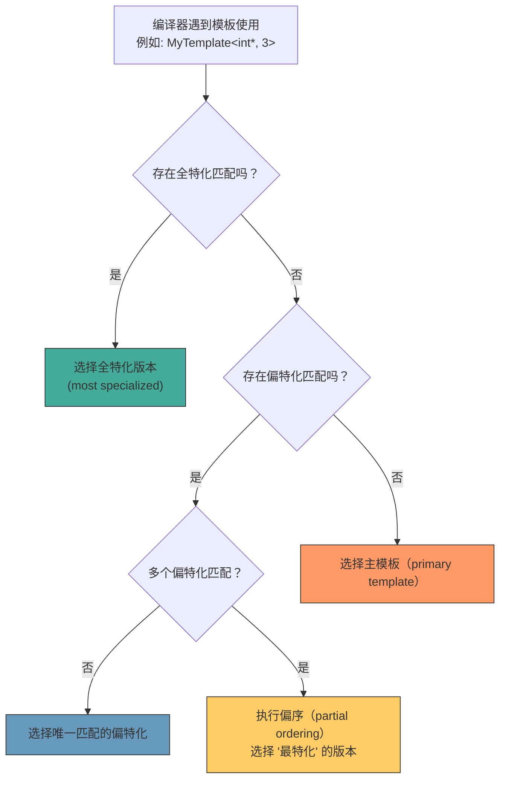

# 第12章 深入模板基础 —— 参数化声明全解析

## 核心问题

模板参数的声明方式是 C++ 最被低估的话题。大多数人只知道 `template<typename T>` 和 `template<int N>`，但模板参数体系实际上有三种完全不同的武器：**类型参数**、**非类型参数**、**模板模板参数**。掌握这三种参数以及它们的组合，是你从"模板使用者"升级为"模板框架设计者"的门槛。

核心问题：

1. **为什么虚成员函数不能是模板？** 编译器实现 vtable 的方式和模板的"必须知道所有实例化点"的编译模型从根本上冲突。理解这个限制，你才能理解为什么 CUTLASS 用 CRTP（Curiously Recurring Template Pattern）而不是虚函数做静态多态。
2. **模板模板参数是什么，为什么 CUTLASS 的 Epilogue 需要它？** 模板模板参数让你把"类型变换"本身作为参数传入另一个模板。在 HPC 框架中，这是实现"算子组合"的关键机制。
3. **主模板、偏特化、全特化的优先级规则是什么？** 当多个模板匹配同一个类型时，编译器如何选择？"最特化优先"的规则背后是偏序（partial ordering）算法。
4. **模板的链接与 ODR**：模板的实例化在链接器层面有特殊的 COMDAT 处理，但 linker 的行为因平台而异。

## 通俗解释：咖啡馆的定制菜单

想象一家极度灵活的咖啡馆，顾客（使用者）可以定制一切：

- **类型参数（type parameter）** = 顾客说"我要一杯**咖啡**"。这里的"咖啡"是个种类（类型），今天可以是拿铁（`Latte`），明天可以是美式（`Americano`）。`template<typename Drink> class Cup { ... };`
- **非类型参数（non-type parameter）** = 顾客说"我要**中杯**"。这里的"中"是个具体的值（大小），是整数字面量。`template<int Size> class Cup { ... };` —— `Cup<12>` 是 12oz，`Cup<16>` 是 16oz。
- **模板模板参数（template template parameter）** = 顾客说"不管你给我什么饮料，都要用**陶瓷杯**装"。这里的"陶瓷杯"不是一种饮料，也不是一个尺寸，而是一种**容器的类型模式**。`template<template<typename> class Container> class Cafe { ... };` —— 你用 `Cafe<CeramicCup>` 或 `Cafe<PaperCup>` 来切换整个咖啡馆的杯子策略。

三个层次逐步升级：

| 层次 | 参数类型 | 例子 | 本质 |
|------|---------|------|------|
| 第1层 | 类型参数 | `typename T` | "用什么数据" |
| 第2层 | 非类型参数 | `int N` | "多大/多少" |
| 第3层 | 模板模板参数 | `template<typename> class Policy` | "用什么策略生成容器" |

### 虚函数 vs 模板：水火不容的一对

**虚拟成员函数模板在 C++ 中是不允许的**。这不是语言设计的疏忽，而是编译原理的根本限制：

```cpp
class Base {
public:
    template<typename T>
    virtual void process(T value) = 0;  // 编译错误！
    // 错误原因：vtable 无法容纳无限多个模板实例
};
```

vtable 的实现方式是：对于每个虚函数，vtable 中有一个固定的 slot（偏移量），存储函数指针。但对于 `template<typename T> virtual void process(T)`，这个函数的实例化有**无限多种可能**（`process<int>`、`process<float>`、`process<std::string>`...）。vtable 需要预先知道所有可能的虚函数数量，但模板实例化是开放集——编译器无法在编译基类时预知所有 `T`。

**替代方案：CRTP（奇异递归模板模式）**——CUTLASS 中的静态多态基础：

```cpp
template<typename Derived>
class ThreadOpBase {
public:
    // 不是虚函数！调用被静态分派
    __device__ void execute() {
        static_cast<Derived*>(this)->impl_execute();
        // 编译期确定调用 Derived::impl_execute，完全内联
    }
};

class FusedMultiplyAdd : public ThreadOpBase<FusedMultiplyAdd> {
public:
    __device__ void impl_execute() {
        // 实际运算
    }
};
```

## 模板模板参数：让"策略"成为一等公民

模板模板参数的能力可以用一句话概括：**把"类型变换"作为参数传入另一个模板**。

### 基础语法

```cpp
// 带模板模板参数的类模板
template<
    typename T,                          // 类型参数：元素类型
    template<typename> class Container   // 模板模板参数：容器策略
>
class DataStore {
    Container<T> data_;  // Container 是一个模板，我们传 T 给它
};
```

使用时：

```cpp
DataStore<int, std::vector> store;  // Container = std::vector
// 展开后：Container<T> = std::vector<int>
```

### 在 HPC 框架中的意义

模板模板参数让你实现"策略模式"而不需要虚函数。你可以把整个内存分配策略、布局策略、运算策略作为参数传入：

```cpp
template<
    typename Element,
    template<typename> class Allocator,      // 内存分配策略
    template<typename> class Layout,         // 数据布局策略
    template<typename> class ThreadPolicy    // 线程运算策略
>
class GemmKernel {
    // Allocator<Element> → 如何分配 shared memory
    // Layout<Element> → RowMajor 还是 ColumnMajor
    // ThreadPolicy<Element> → 使用 FMA 还是 Tensor Core
};
```

**在 CUTLASS 中的对应**：CUTLASS 的模板参数矩阵（pun intended）就是这种设计。`LayoutA_`、`LayoutB_` 这些表面上是普通的类型参数（如 `cutlass::layout::RowMajor`），但实际上它们背后是偏特化的模板类，根据元素类型提供不同的 stride 计算逻辑。

## 主模板、偏特化、全特化：优先级规则

当多个模板声明匹配同一个类型时，编译器按以下规则选择：



偏序的规则："A 比 B 更特化"意味着**所有匹配 A 的类型也都匹配 B，但存在匹配 B 的类型不匹配 A**。

```cpp
// 主模板
template<typename T>   struct Foo;   // (1)
// 偏特化1：针对指针
template<typename T>   struct Foo<T*>; // (2)
// 偏特化2：针对 const 指针
template<typename T>   struct Foo<const T*>; // (3)

Foo<int*> p1;        // 匹配 (1) 和 (2)；(2) 更特化 → 选择 (2)
Foo<const int*> p2;  // 匹配 (1)、(2)、(3)；(3) 最特化 → 选择 (3)
Foo<float> p3;       // 只匹配 (1) → 选择 (1)
```

## 模板的等价性（Equivalence）

两个模板什么时候是"相同"的？这在显式实例化和 extern template 中至关重要。

```cpp
// 类型等价：以下声明指向同一个模板实例
template class std::vector<int>;        // 显式实例化定义
extern template class std::vector<int>; // 显式实例化声明
// 这两个操作的是同一个实体 (std::vector<int>)
```

两个模板实例等价的条件：
- 相同的模板名
- 相同的模板实参（type equivalence 和 non-type equality）
- **类型别名不算**：`std::vector<int>::value_type` 和 `int` 等价（它们是同一个类型），但 `using MyInt = int; template class std::vector<MyInt>;` 和 `template class std::vector<int>;` 是同一个实例。

### 非类型参数的等价性规则

```cpp
template<int N> struct Buffer {};

Buffer<2 + 3> b1;  // N = 5（编译期求值）
Buffer<5>     b2;  // N = 5
// b1 和 b2 类型相同！编译器认为 2+3 和 5 等价
```

## 工业关联：CUTLASS Epilogue 的模板模板参数用法

CUTLASS 的 Epilogue（尾声阶段）是模板模板参数最精彩的应用。Epilogue 负责在 GEMM 主计算完成后执行的操作：加偏置、ReLU、element-wise 操作等。

在 `cutlass/epilogue/threadblock/` 中：

```cpp
// cutlass/epilogue/threadblock/default_epilogue.h 的简化结构
template <
    typename Shape_,
    typename WarpMmaOperator_,     // warp-level 的 Mma 算子
    int PartitionsK,               // K 维度的分区数
    typename OutputOp_,            // element-wise 输出操作
    int ElementsPerAccess
>
struct DefaultEpilogue {
    using OutputTileIterator = /* ... */;

    using Epilogue = cutlass::epilogue::threadblock::Epilogue<
        Shape_,
        WarpMmaOperator_,
        PartitionsK,
        OutputTileIterator,
        OutputOp_,
        ElementsPerAccess
    >;
};
```

这里的 `OutputOp_` 是 Epilogue 的核心。它本身是一个**类型参数**，但它的"行为"遵循模板模板参数的逻辑——你将不同的"输出变换策略"作为参数注入。

CUTLASS 常见的 Epilogue OutputOp：

```cpp
// cutlass/epilogue/thread/linear_combination.h
// 线性组合：D = alpha * C + beta * 结果
template <
    typename ElementOutput_,      // 输出元素类型
    int Count,                    // 每次访问的元素数
    typename ElementAccumulator_, // 累加器类型
    typename ElementCompute_      // 中间计算精度
>
class LinearCombination {
public:
    CUTLASS_HOST_DEVICE
    ElementOutput_ operator()(
        ElementAccumulator_ accumulator,
        ElementCompute_ bias      // 可选的偏置项
    ) const;
};

// cutlass/epilogue/thread/linear_combination_relu.h
// ReLU 变体：在 LinearCombination 后加 ReLU
template <typename ElementOutput_, int Count, ...>
class LinearCombinationRelu {
    // ...
};
```

### 模板模板参数的间接使用

CUTLASS 的 Epilogue 设计实际上**没有直接用 `template<template<typename> class>` 语法**，而是用了 **Policy 类型 + 偏特化** 的方式。但这背后是同一个工程思路：

用户通过组合 Policy 类型的参数来选择 Epilogue 行为：

```cpp
// 用户选择 Epilogue 策略
using EpilogueOp = cutlass::epilogue::thread::LinearCombination<
    float,     // 输出类型
    128 / sizeof(float), // 每个线程的 elements
    float,     // 累加器
    float      // 计算精度
>;

// 策略被注入到 Gemm 的模板参数中
using Gemm = cutlass::gemm::device::Gemm<
    float, RowMajor,
    float, ColumnMajor,
    float, RowMajor,
    float,
    ...,
    EpilogueOp  // 这里 EpilogueOp 充当了"策略参数"的角色
>;
```

## 常见坑点

### 坑1：模板模板参数的类型参数名匹配

```cpp
// 错误：std::vector 有两个模板参数（T, Allocator），但这里只声明了一个
template<template<typename> class Container>
class Wrap {
    Container<int> data_;
};
Wrap<std::vector> w;  // 编译错误！std::vector 是 template<typename, typename>

// C++17 修复：用 auto 占位
template<template<typename...> class Container>  // 可变参数
class Wrap {
    Container<int> data_;  // OK，std::vector<int, std::allocator<int>>
};
Wrap<std::vector> w;  // C++17 可以
```

### 坑2：virtual + template = 编译错误

```cpp
// 不合法
class Base {
    template<typename T>
    virtual void f(T);  // 错误
};

// 也不合法——特化也不行
template<>
virtual void Base::f<int>(int);  // 错误
```

**原因：** vtable 需要固定的函数签名列表。编译器无法为无限多个 `f<T>` 在 vtable 中预留 slot。这个限制是 ABI 级别的，不是标准委员会的疏忽。

**CUTLASS 的解决方案：完全不用虚函数**。所有多态通过模板的编译期分派实现。CUDA 的 device 代码也不支持 RTTI 和异常，这使得虚函数的吸引力进一步降低。

### 坑3：非类型参数的"值等价"陷阱

```cpp
template<const char* Str>
struct StringHolder {};

// 以下两个是不同的实例！因为指针地址不同
extern const char hello1[] = "hello";
extern const char hello2[] = "hello";

StringHolder<hello1> s1;  // 类型1
StringHolder<hello2> s2;  // 类型2（不同于类型1！）
```

**C++20 解决了这个问题**：允许浮点数、字面量类类型作为非类型模板参数，并对字符串字面量有特殊的等价规则。但在 CUDA 中，C++20 的支持还比较有限（nvcc 12.x 开始部分支持）。

### 坑4：偏特化中的"等够特化"判断

```cpp
template<typename T, typename U> struct Foo;     // (1) 主模板
template<typename T> struct Foo<T, T>;            // (2) 两个参数相同
template<typename T> struct Foo<T*, T*>;          // (3) 两个相同的指针

// Foo<int*, int*> 匹配 (1)、(2)、(3)
// (3) 比 (2) 更特化（多了指针约束）→ 选择 (3)
// (2) 比 (1) 更特化（多了 T==U 约束）→ 但不选 (2)，选最特化的 (3)
```

## 本章总结

1. **虚成员函数模板在 C++ 中是不可能的**。vtable 的固定 slot 设计与模板的开放实例化集从根本上冲突。CUTLASS 用 CRTP 和编译期多态绕过了这个限制。
2. **模板参数有三个层次**：类型参数（用什么）、非类型参数（多大/多少个）、模板模板参数（用什么策略模式）。从 CUTLASS 的角度看，Mma、Epilogue、Iterator 这三个层的策略选择全部是模板参数驱动的编译期决策。
3. **模板模板参数是 HPC 框架中"策略注入"的语法糖**。CUTLASS 的 Epilogue OutputOp 本质上就是一种策略注入——不同的 OutputOp 改变整个 GEMM 的后处理行为，而这个选择在编译期就被"烘焙"进 kernel。
4. **偏序（partial ordering）决定了多候选模板的选择**。规则是"A 比 B 更特化"意味着所有匹配 A 的也匹配 B，但反之不成立。编译器总是选最特化的那一个。
5. **非类型参数的等价性在模板实例身份识别中至关重要**。CUTLASS 大量使用非类型参数（tile size、stage count、vector width），编译器对 `128` 和 `64*2` 必须判定为等价，否则会生成重复的 kernel 实例。
