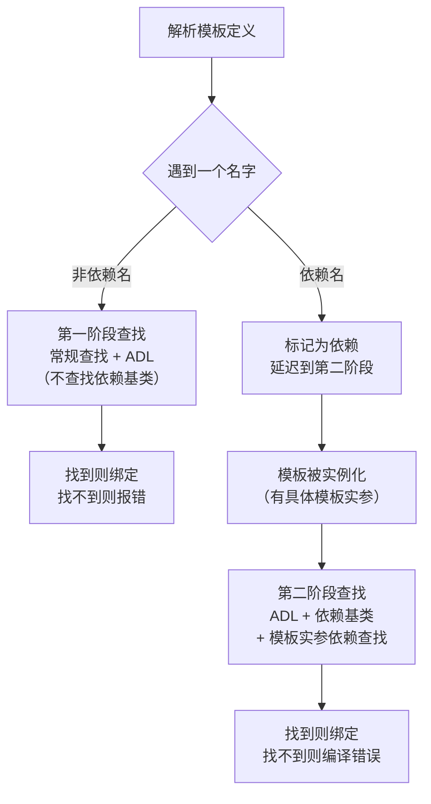

# 第13章 模板中的名称 —— 编译器如何找到你的代码

## 核心问题

当你在模板里写一个名字（比如 `shared_ptr`、`sqrt`、`value_type`），编译器在**编译期**到底是怎么找到这个名字的？更关键的是：**同一个名字在模板定义时和实例化时，含义可能完全不同**。这一章要解决的就是这个"查字典"过程的工作原理。

> 模板是编译期架构语言。名称查找就是这个架构语言的作用域规则。

## 通俗解释：两个阶段查字典

想象你在翻译一本外文小说：

- **第一阶段（模板定义时）**：你先快速浏览一遍，不认识的名字先标记为"待定"（`???`），认识的名字直接翻译。
- **第二阶段（模板实例化时）**：等收到具体上下文信息后，你再回头把"待定"的地方补上。

C++ 的两阶段查找（Two-Phase Lookup）跟这个过程一模一样。

### 生活类比：快递地址解析

```
你在上海写了一个模板 void ship(T parcel) {
    use(圆通快递);  // 非依赖名 → 立即查找，就用上海的圆通
    parcel.track();  // 依赖名 → 等发货时（实例化）再决定
}
```

- `圆通快递` 不依赖 T → 立刻查，就在当前城市找
- `parcel.track()` 依赖 T → 晚点查，看 T 到底是啥包裹

## 名称分类

| 类型 | 示例 | 查找时机 | 查找规则 |
|------|------|----------|----------|
| 非依赖名 | `int x = 5;` 中的 `int` | 第一阶段（定义时） | 常规查找 |
| 依赖名（类型） | `T::value_type` | 第二阶段（实例化时） | 需 `typename` 关键字 |
| 依赖名（模板） | `T::template get<T>()` | 第二阶段（实例化时） | 需 `template` 关键字 |
| 注入类名 | 在 `class Foo<T>` 内部写 `Foo` | 定义时 | 指向当前实例化 |
| ADL 查找名 | `swap(a, b)` | 第二阶段 | 在实参关联的命名空间中查找 |

## ADL（Argument-Dependent Lookup）详解

ADL 也叫 Koenig Lookup，规则一句话：**调用函数时，除了当前作用域，还会去参数类型所在的命名空间里找这个函数**。

```cpp
namespace cutlass {
    template <typename T>
    struct HalfTensor {
        friend void print(HalfTensor) { /* ... */ }  // 友元函数
    };
}

// 调用时不需要写 cutlass::print，ADL 帮你找到
HalfTensor<float> t;
print(t);  // ADL 在 cutlass:: 命名空间找到 print
```

### ADL 和普通查找的区别

```cpp
namespace A {
    struct X {};
    void f(X) { }        // 普通函数
    template<typename T> void g(X) { }  // 模板函数
}

A::X x;
f(x);    // OK：ADL 找到 A::f
g<int>(x); // 错误！ADL 不适用于显式指定模板实参的调用
```

**坑点**：如果你写了 `g<int>(x)`，编译器在解析 `g` 时还不知道它是模板（因为 `<` 可能是小于号），所以 ADL 不会触发。必须先通过 `using` 声明引入或全局找到 `g` 这个模板名。

## 注入类名

在类模板内部，直接写类名会被解释为**当前实例化**（带模板实参），这是个小魔法：

```cpp
template <typename T>
class Matrix {
    Matrix* next;  // 等价于 Matrix<T>* next，注入类名
    // 不需要写 Matrix<T>*
};
```

## 当前实例化（Current Instantiation）

编译器分两种情况：

```cpp
template <typename T>
class Outer {
    Outer* p1;        // ✅ 当前实例化 → 已知
    Outer<T>* p2;     // ✅ 当前实例化 → 已知
    typename T::type x; // ❓ 未知特化 → 依赖名，晚点查
};
```

## typename 关键字 —— 告诉编译器那是类型

```cpp
template <typename T>
class MyClass {
    T::subtype* ptr;  // 编译器认为这是 "T::subtype 乘以 ptr"！乘法！
    // 因为默认识别符不是类型名
};

// 正确写法：
template <typename T>
class MyClass {
    typename T::subtype* ptr;  // 明确告诉编译器这是一个类型
};
```

### 什么时候必须加 typename

```cpp
template <typename T>
void func() {
    typename T::iterator iter;       // ✅ 必须
    typename T::template List<int> l; // ✅ 先 typename 再 template
    typename std::remove_reference<T>::type val; // ✅ 必须
}
```

## template 关键字 —— 告诉编译器那是模板

```cpp
template <typename T>
class Holder {
    T obj;
    // 错误：编译器不知道 T::get 是不是模板
    // obj.template get<int>();
    
    // 正确：
    obj.template get<int>();  // template 关键字告知 get 是模板
};
```

### 典型使用场景（CUTLASS 里到处都是）

```cpp
template <typename GemmKernel>
struct DefaultGemmConfiguration {
    using OperatorClass = typename GemmKernel::OperatorClass;
    
    static constexpr int kStages = 
        GemmKernel::template GetStageCount<int>();  // template 关键字
};
```

## 依赖基类

派生类模板访问依赖基类的成员时，编译器**不会**自动去基类找：

```cpp
template <typename T>
class Base {
protected:
    int value;
};

template <typename T>
class Derived : public Base<T> {
    void f() {
        value = 5;        // ❌ 编译错误！找不到 value
        this->value = 5;  // ✅ 通过 this-> 明确是依赖名
        Base<T>::value = 5; // ✅ 也可以通过基类限定
    }
};
```

**原因**：编译器在第一阶段查找时还不知道 `Base<T>` 具体是啥（可能有偏特化），所以不能假定 `value` 存在。`this->` 强制让编译器等到第二阶段再查。

## Mermaid 流程图：两阶段查找



## 工业界真实用途

### CUTLASS 中的 ADL

CUTLASS 的 `cutlass::gemm::kernel::Gemm` 内部大量依赖 ADL。例如在 `include/cutlass/gemm/kernel/gemm.h` 中：

```cpp
// 这些函数通过 ADL 找到：
using namespace cutlass::gemm::kernel::detail;
// cutlass::gemm::kernel::detail::initialize_kernel_params(...)
// 不需要完全限定，ADL 根据参数类型自动匹配
```

### TensorRT 中的依赖名处理

TensorRT 的 Plugin 系统中，`IPluginV2DynamicExt::getOutputDimensions` 返回类型推断依赖模板参数，大量使用 `typename` 关键字处理嵌套类型：

```cpp
template <typename PluginType>
typename PluginType::OutputDimensionsType compute_output() {
    // typename 必须，因为 OutputDimensionsType 是依赖名
}
```

### PyTorch ATen

PyTorch 的 `TensorIterator` 使用了大量依赖基类模式，例如 `at::native::TensorIteratorBase` 作为 CRTP 基类，派生类通过 `this->` 访问基类加速方法。

## 常见坑点

| 坑 | 现象 | 解决 |
|----|------|------|
| 忘写 `typename` | `T::iterator* x;` 被解析为乘法 | 加 `typename T::iterator* x;` |
| 忘写 `template` | `obj.get<int>()` 中 `<` 被当成小于号 | 加 `obj.template get<int>()` |
| ADL + 函数模板 | `g<int>(x)` ADL 不生效 | 先 `using A::g;` 引入 |
| 依赖基类访问成员 | 找不到基类成员 | 用 `this->member` 或 `Base<T>::member` |
| 注入类名误用 | 特化版本里写 `Foo` 指向主模板 | 用 `Foo<T>` 明确指向 |

## 与 CUTLASS 的联系（源码位置）

### 命名空间组织

```
cutlass/                          # 顶层命名空间
├── gemm/                         # cutlass::gemm::
│   ├── kernel/                   # cutlass::gemm::kernel::
│   │   ├── gemm.h               # Gemm kernel 主模板
│   │   └── default_gemm_configuration.h  # 配置模板
│   └── thread/                   # cutlass::gemm::thread::
├── arch/                         # cutlass::arch:: 架构标签
│   └── mma.h                    # MMA 指令封装
└── platform/                     # cutlass::platform:: 平台工具
```

### ADL 实战示例（cutlass/gemm/kernel/gemm.h）

```cpp
// 文件: include/cutlass/gemm/kernel/gemm.h (约第 200 行)
template <typename Mma_,         /// 矩阵乘累加算子
          typename Epilogue_,    /// 后处理算子
          typename ThreadblockSwizzle_>  /// 线程块排列策略
class Gemm {
    // ...
    void operator()(Params const &params) {
        // 大量使用 this-> 访问依赖基类成员
        this->shared_storage.main_loop.iterator_A.load(...);
        this->shared_storage.main_loop.iterator_B.load(...);
    }
};
```

### 依赖名处理（cutlass/gemm/thread/mma.h）

```cpp
// 文件: include/cutlass/gemm/thread/mma.h
template <typename Shape_,        // 矩阵形状
          typename ElementA_,     // A 元素类型
          typename LayoutA_,      // A 内存布局
          typename ElementB_,
          typename LayoutB_,
          typename ElementC_,
          typename LayoutC_>
class Mma {
    // 以下全部是依赖名，需要 typename 关键字
    using FragmentA = typename MatrixAPolicy::FragmentA;
    using FragmentB = typename MatrixBPolicy::FragmentB;
    using FragmentC = typename MatrixCPolicy::FragmentC;
};
```

## 本章总结

| 维度 | 要点 |
|------|------|
| 核心机制 | 两阶段查找：非依赖名在第一阶段查，依赖名在第二阶段查 |
| 关键关键字 | `typename` 声明依赖类型，`template` 声明依赖模板 |
| 查找规则 | ADL 跨命名空间查找函数，不适用于显式指定模板实参的调用 |
| 实践影响 | 不写对关键字编译器要么报错要么静默错误（`<` 当小于号） |
| CUTLASS 特化 | 深度嵌套类型 + 命名空间分层 = 依赖名和 ADL 的极致应用 |

> 模板是编译期架构语言。名称查找定义了这套语言的可见性和作用域——正如运行时语言的 public/private/protected 一样重要。理解两阶段查找，就等于理解了模板世界的地图导航系统。
