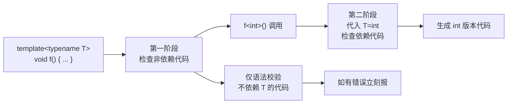
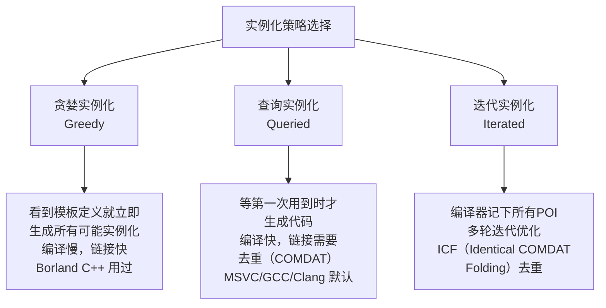
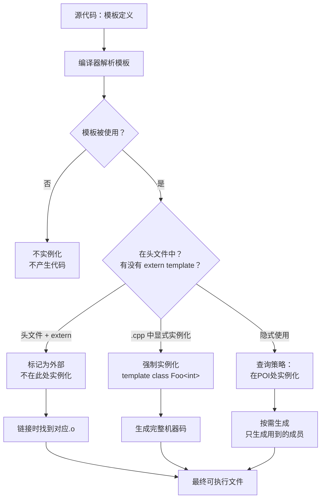

# 第14章 实例化 —— 从模板到真实代码的每一步

## 核心问题

写了 `std::vector<int>`，编译器到底干了什么？模板是一份**蓝图**，实例化是把这个蓝图变成**真实可用的机器代码**的过程。这一章深入剖析实例化的完整流程——从编译器的懒人哲学（按需实例化）到 CUTLASS 的显式实例化策略。

> 模板是编译期架构语言。实例化就是这个架构的"编译"过程，决定模板代码如何转化为运行时代码。

## 通俗解释：火锅店的菜单

想象你是一家火锅店的老板。你有一张万能菜单模板：

```
template <typename 肉类, typename 锅底>
class 火锅 { /* 烹饪流程 */ };
```

- **按需实例化**：客人点了 `火锅<肥牛, 麻辣>`，你才去准备肥牛和麻辣锅底。没人点的组合不备货。
- **惰性实例化**：即使客人点了，你也只准备客人想吃的那部分。客人只吃肥牛不喝汤？汤可以不熬。
- **显式实例化**：你知道周末很多人点 `火锅<羊肉, 清汤>`，所以提前批量准备好，周末直接上桌。

这就是 C++ 模板实例化的三种策略。

## 按需实例化（On-Demand Instantiation）

C++ 标准规定：没有被使用的模板成员函数，编译器**不会实例化**。

```cpp
template <typename T>
class MyVector {
public:
    void push_back(T const&);  // 只有被调用时才实例化
    void sort();                // 没被调用？不实例化
};

MyVector<int> v;     // MyVector<int> 实例化了
v.push_back(42);     // push_back 实例化了
// sort 从未被调用 → 不实例化
```

这意味着 `MyVector<int>` 即使 `sort` 有 bug（比如用了 `T::compare` 但 `int` 没有），只要不调用 `sort()`，就能编译通过！

**工程意义**：CUTLASS 的 Gemm kernel 有很多成员函数（不同 Epilogue、不同迭代策略），编译器只生成实际用到的路径，大量减少编译时间。

## 惰性实例化（Lazy Instantiation）

比按需更深一层：不仅成员函数按需，**类模板的成员类型**也是按需实例化的。

```cpp
template <typename T>
class Container {
public:
    using value_type = T;
    using iterator = typename T::iterator;  // 如果 T 没有 iterator...
};

// 这样用是可以的！因为只用到了 Container<int>::value_type
Container<int>::value_type x = 5;

// 但这样会炸！因为 int 没有 iterator
// Container<int>::iterator it;
```

整个 C++ 编译器都是"能懒就懒"哲学。实际中这意味着：
- 写了 `std::vector<int>` 但只用 `push_back`，那 `emplace_back`、`insert` 等都不会被编译
- 写了 `cutlass::gemm::Gemm<...>` 但只调用 `operator()`，那其他重载不会被实例化

## 两阶段查找（Two-Phase Lookup）

这在第 13 章详细讲过了，这里从实例化角度再看：

```
阶段一（模板定义时）：
    编译器解析模板但不代入模板实参
    非依赖名 → 立刻查找绑定
    语法检查 → 基础语法错误立刻报

阶段二（模板实例化时）：
    模板实参已知，代入
    依赖名 → 此时查找绑定
    模板实参相关的错误此时报
```



## 实例化点（Point of Instantiation, POI）

模板在**首次被需要**的地方实例化，这个位置就是 POI。

```cpp
template <typename T>
void print(T x) { g(x); }  // g 是啥？看 POI 处有什么

void g(int) { }   // ① 定义

int main() {
    print(5);     // POI 在这里！此时 g(int) 已声明 → OK
}
```

如果移走 `void g(int)` 的定义，`print(5)` 处就找不到 `g`，编译失败。

### POI 的微妙之处

```cpp
// 文件 A.h
template <typename T>
void foo(T x) { bar(x); }  // bar 是依赖名

// 文件 B.cpp
#include "A.h"
void bar(int x) { }   // POI 在 main() 中，但 bar 声明在 // 文件后面……
int main() {
    foo(5);            // POI 在这里
}
// bar 定义在 POI 之后 → 编译失败！
```

**教训**：模板里调用的函数最好在模板定义之前声明，否则会有诡异的"找不到"错误。

## Inclusion Model（包含模型）

这是大多数编译器的默认模型：模板定义**必须放在头文件**里。

```
project/
├── include/
│   └── mylib.h          # ← 模板定义必须在这里！
├── src/
│   └── main.cpp         # ← 实例化点
```

**为什么**：编译器在实例化点需要看到完整定义，否则无法生成代码。

两种替代方案：
1. **显式实例化**（见下）
2. **export template**（C++98 提出，C++11 移除——失败的设计）

## 三种实例化策略对比



现代编译器（GCC/Clang/MSVC）基本都用**查询实例化 + COMDAT 去重**。

## 显式实例化（Explicit Instantiation）

这是 CUTLASS 的**核心编译策略**。

```cpp
// 在 .cpp 文件中显式声明：请把下面这些实例化好
template class std::vector<int>;            // 类模板全实例化
template void std::swap<int>(int&, int&);   // 函数模板实例化

// 头文件中同步声明（extern）防止隐式实例化
extern template class std::vector<int>;
extern template void std::swap<int>(int&, int&);
```

### CUTLASS 的显式实例化实战

CUTLASS 为每个 GPU 架构生成专用的编译单元：

```
cutlass/
└── src/                              # 显式实例化所在的 .cu 文件
    ├── cutlass80_sm80.cu            # SM80 (A100) 专用
    │   template class cutlass::gemm::kernel::Gemm<
    │       cutlass::gemm::GemmShape<64, 64, 32>,  // 固定 tile 大小
    │       ...>;
    └── cutlass90_sm90.cu            # SM90 (H100) 专用
        template class cutlass::gemm::kernel::Gemm<
            cutlass::gemm::GemmShape<128, 128, 64>, // 更大 tile
            ...>;
```

**为什么要这样做？**

1. **编译时间**：泛型模板在 .h 里，实例化在不同 .cu 文件中，并行编译
2. **代码体积**：只生成有意义的组合（不是所有模板参数组合都有效）
3. **架构优化**：SM80 .cu 只包含 SM80 能用的指令（比如 `mma.sync.aligned.m16n8k8.f32.f16.f16.f32`）
4. **链接时选择**：链接器根据目标架构选择对应的 .o 文件

### 显式实例化的两种模式

| 模式 | 写法 | 用途 |
|------|------|------|
| `extern template` | `extern template class Foo<int>;` | 头文件中声明，抑制隐式实例化 |
| `template class` | `template class Foo<int>;` | .cpp/.cu 文件中强制实例化 |

```cpp
// mylib.h —— 头文件
template <typename T>
class MyKernel { /* ... */ };

extern template class MyKernel<int>;   // 告诉编译器：别在这儿实例化
extern template class MyKernel<float>;

// mylib.cu —— 实现文件
template class MyKernel<int>;          // 在这里实例化 int 版
template class MyKernel<float>;        // 在这里实例化 float 版
```

## constexpr if —— 编译期条件分支

C++17 的 `constexpr if` 改变了实例化游戏规则：

```cpp
template <typename T>
auto get_value(T t) {
    if constexpr (std::is_pointer_v<T>) {
        return *t;     // 非指针类型不会实例化这个分支
    } else {
        return t;
    }
}

int x = 5;
get_value(&x);  // T=int* → 只实例化 return *t; 分支
get_value(x);   // T=int  → 只实例化 return t;  分支
```

### constexpr if vs SFINAE

```cpp
// 旧式：需要多个重载 + SFINAE
template <typename T>
std::enable_if_t<std::is_pointer_v<T>, T::element_type> 
get_value(T t) { return *t; }

template <typename T>
std::enable_if_t<!std::is_pointer_v<T>, T>
get_value(T t) { return t; }

// 新式：一个函数搞定
template <typename T>
auto get_value(T t) {
    if constexpr (std::is_pointer_v<T>) {
        return *t;
    } else {
        return t;
    }
}
```

## 实例化完整流程图



## 工业界真实用途

### CUTLASS 的编译时间优化

CUTLASS 的 Gemm kernel 有几十个模板参数。如果每个组合都在头文件里隐式实例化，一行 `using Kernel = Gemm<Mma, Epilogue, Swizzle, ...>` 可能触发几万行代码生成。通过显式实例化 + `extern template`：

```cpp
// gemm.h
template <typename Mma, typename Epilogue, typename Swizzle>
class Gemm { /* 上千行代码 */ };

extern template class Gemm<Mma1, Epilogue1, Swizzle1>;  // 别人别重复编译

// gemm_sm80.cu（只编译一次）
template class Gemm<Mma1, Epilogue1, Swizzle1>;  // 这里生成代码
```

### TensorRT Builder

TensorRT 的 Builder 针对不同 GPU 架构做类似的事情：

```cpp
// 每个架构的 builder 实例只实例化对应 SM 版本的 kernel
if (sm_version >= 80) {
    builder->template addLayer<Sm80ConvLayer>(...);
} else if (sm_version >= 75) {
    builder->template addLayer<Sm75ConvLayer>(...);
}
// 不同 SM 的代码路径不会同时被实例化
```

### PyTorch 的 JIT 与 AOT

PyTorch 2.0 的 `torch.compile` 本质上就是：
- JIT（Just-in-Time）：动态实例化 kernel（类似查询策略）
- AOT（Ahead-of-Time）：预编译 kernel（类似显式实例化）
- `inductor` 后端生成 Triton/CUDA 代码后，用 AOT 编译保存

## 常见坑点

| 坑 | 现象 | 原因 | 解决 |
|----|------|------|------|
| 头文件里实例化 | 编译慢、二进制膨胀 | 每个 .cpp 包含头文件都实例化一次 | 用 `extern template` + 显式实例化 |
| `extern template` 忘了实现 | 链接错误 undefined reference | 声明了但没在任何 .cpp 里实例化 | 确保有一个 .cpp 有 `template class` |
| POI 可见性问题 | "未定义的函数" 错误 | 模板依赖的函数在 POI 处不可见 | 确保依赖的函数在模板定义前声明 |
| constexpr if false 分支编译 | C++17 以前 false 分支也要编译 | 旧标准不允许丢弃分支 | 升级到 C++17 或用 SFINAE |

## 与 CUTLASS 的联系（源码位置）

### 显式实例化文件

```
tools/
└── library/
    └── scripts/
        └── generator/
            └── gemm_operation.py    # Python 生成器，自动生成 .cu 文件
```

CUTLASS 用 Python 脚本自动生成显式实例化代码。例如：
- 输入：所需的数据类型组合（`{BF16, FP16} x {column-major, row-major}`）
- 输出：对应的 `.cu` 文件，里面全是 `template class Gemm<...>;`

### 实例化点与 Kernel Launch

```cpp
// include/cutlass/gemm/kernel/gemm.h
template <typename Mma_, typename Epilogue_, typename Swizzle_>
class Gemm {
public:
    struct Params { /* kernel 参数 */ };
    
    // operator() 是实例化点，只生成用到的 Epilogue 路径
    CUTLASS_DEVICE
    void operator()(Params const &params) {
        // ... 主循环，迭代器，Epilogue ...
    }
};
```

### constexpr if 在 CUTLASS 3.x 中的使用

```cpp
// include/cutlass/gemm/collective/sm90_mma_tma_gmma_ss_warpspecialized_mixed_input.hpp
// CUTLASS 3.x 大量使用 constexpr if 代替传统 SFINAE
if constexpr (kStages > 2) {
    // 多 stage 流水线
    warpgroup_arrive();
} else {
    // 少 stage 简单模式
    __syncthreads();
}
```

## 本章总结

| 维度 | 要点 |
|------|------|
| 核心机制 | 按需 + 惰性 + 两阶段查找 = 编译器只生成必要代码 |
| 关键武器 | `extern template` + 显式实例化 = 编译时间和代码体积的阀门 |
| 现代替代 | `constexpr if` 替代大量 SFINAE，丢弃分支不实例化 |
| CUTLASS 实战 | Python 脚本生成显式实例化 .cu 文件，按架构分离编译 |
| 编译模型 | Inclusion Model 是主流；export template 已死 |

> 模板是编译期架构语言。实例化就是从这个架构到机器码的桥梁——理解桥梁的承载能力（编译时间）和通行规则（惰性/两阶段），才能设计出高效又不爆表的模板系统。
