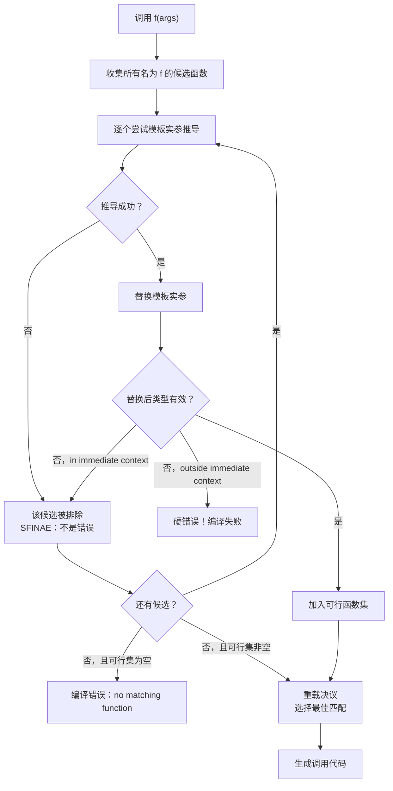

# 第15章 模板实参推导 —— SFINAE 的魔法世界

## 核心问题

`std::max(1, 2)` 编译器怎么就知道 `T = int`？如果 `std::max(A{}, B{})` 而且 A 和 B 不匹配？更关键的是：**编译器是怎么"猜"出模板实参的，又是怎么在"猜错了"的时候优雅放弃而不是直接报错的？**

> 模板是编译期架构语言。模板实参推导就是这套语言的类型推断引擎，SFINAE 则是它的错误处理机制。

## 通俗解释：自动水龙头

你去一个高端商场洗手间，水龙头没有把手。你伸手过去，水龙头**感应到你的手**就自动出水。

- **模板实参推导** = 水龙头的感应器。你传入 `(1, 2)`，它感应到"这是两个 int"，推导 `T = int`。
- **SFINAE** = 水龙头的安全机制。如果你的手位置不对（模板参数匹配不上），水龙头安静地不出水（编译器不报错，而是去尝试其他重载）。

如果你把脚伸过去（传入不匹配的类型），商场的普通水龙头会卡死（编译错误），但 SFINAE 水龙头会说"这不匹配，我跳过，试试下一个"。

## 推导过程

### 基本推导规则

```cpp
template <typename T>
void f(T param);       // 值传递：T 推导为 int（丢失 const/引用）

template <typename T>
void g(T& param);      // 引用传递：T 推导为 int const（保留 const）

template <typename T>
void h(T&& param);     // 转发引用：T 可能推导为 int& 或 int
```

| 调用 | T 推导结果 | param 类型 |
|------|-----------|------------|
| `f(42)` | `int` | `int` |
| `f(ci)` (ci 是 const int) | `int` | `int`（const 丢掉了！） |
| `g(42)` | **错误**：不能绑定右值到左值引用 | N/A |
| `g(ci)` | `int const` | `int const&` |
| `h(42)` | `int` | `int&&` |
| `h(ci)` | `int const&` | `int const&`（引用折叠！） |

### 推导失败（Deduction Failure）vs 编译错误

这是理解 SFINAE 的关键前提：

```cpp
template <typename T>
typename T::value_type f(T x) {
    return x.value;
}

int x = 5;
// f(x);  // 推导过程：T 尝试推导为 int
          // 但 int::value_type 不存在
          // → 推导失败 → 这个 f 被排除 → 如果只有这一个 f 则报错
```

**推导失败发生在 immediate context（直接上下文）中才是 SFINAE；出界就变成 hard error（硬错误）。**

## 引用折叠

这是现代 C++ 最重要的编译期规则之一：

| 实际 | 折叠结果 |
|------|---------|
| `T&  &`  | → `T&` |
| `T&  &&` | → `T&` |
| `T&& &`  | → `T&` |
| `T&& &&` | → `T&&` |

**规则**：只要有一个 `&`，结果就是 `&`；全是 `&&` 才是 `&&`。

```cpp
template <typename T>
void wrapper(T&& arg) {  // T&& 是转发引用
    target(std::forward<T>(arg));  // 完美转发
}

int x = 5;
wrapper(x);   // T = int&,  T&& = int& && = int&（左值引用）
wrapper(42);  // T = int,   T&& = int&&（右值引用）
```

## 转发引用与完美转发

```cpp
template <typename T>
void wrapper(T&& arg) {
    // arg 现在是左值（有名字的右值引用是左值）
    // 直接传 arg 会丢失值类别信息
    // std::forward<T> 恢复原始值类别：
    target(std::forward<T>(arg));
}
```

### forward 的实现原理（简化版）

```cpp
template <typename T>
T&& forward(std::remove_reference_t<T>& arg) {
    return static_cast<T&&>(arg);
}

// 如果 T = int,    T&& = int&&    → 返回右值引用
// 如果 T = int&,   T&& = int& && = int& → 返回左值引用
```

本质上 `forward` 就是利用引用折叠规则做了一次安全的条件转换。

## SFINAE 机制详解

SFINAE = Substitution Failure Is Not An Error（替换失败不是错误）

### 基本原理

```cpp
// 版本 A：适用于有 value_type 的类型
template <typename T>
typename T::value_type process(T x) {  // int 替换进来 → T::value_type 不存在
    return x.value;                     // → 替换失败 → 这不是错误，跳过版本 A
}

// 版本 B：适用于其他所有类型
template <typename T>
T process(T x) {
    return x;
}

process(42);  // T=int → 版本 A 替换失败 → 选择版本 B → 返回 42
```

### SFINAE 的条件

替换失败只在以下位置被允许（immediate context）：

```
✅ 函数签名中（返回类型、参数类型）
✅ 模板参数声明中
✅ 模板实参的默认值中
❌ 函数体内（函数体内的错误永远是硬错误）
```

### enable_if 的实现

```cpp
// enable_if 的实现
template <bool B, typename T = void>
struct enable_if { };

template <typename T>
struct enable_if<true, T> {
    using type = T;
};

// 用法 1：作为返回类型
template <typename T>
typename std::enable_if<std::is_integral_v<T>, T>::type
abs(T x) { return x < 0 ? -x : x; }

// 用法 2：作为默认模板参数（C++11）
template <typename T, typename = std::enable_if_t<std::is_integral_v<T>>>
T abs(T x) { return x < 0 ? -x : x; }

// 用法 3：作为非类型参数（C++14）
template <typename T, std::enable_if_t<std::is_integral_v<T>, int> = 0>
T abs(T x) { return x < 0 ? -x : x; }
```

### void_t —— SFINAE 的瑞士军刀

```cpp
// void_t 的实现：任何类型包进来，永远是 void
template <typename...>
using void_t = void;

// 检测是否有 value_type 成员
template <typename T, typename = void>
struct has_value_type : std::false_type { };

template <typename T>
struct has_value_type<T, void_t<typename T::value_type>> : std::true_type { };

// 检测是否有特定的成员函数 serialize()
template <typename T, typename = void>
struct is_serializable : std::false_type { };

template <typename T>
struct is_serializable<T, void_t<decltype(std::declval<T>().serialize())>>
    : std::true_type { };
```

## auto 推导

`auto` 本质上就是模板实参推导的语法糖：

```cpp
auto x = 42;        // 等价于 template <typename T> void f(T param); f(42);
                    // 规则：值传递，const 丢失
auto& y = x;        // 等价于 template <typename T> void f(T& param); f(x);
                    // 规则：引用传递，保留 const
auto&& z = 42;      // 等价于 template <typename T> void f(T&& param); f(42);
                    // 规则：转发引用
decltype(auto) w = x; // 等价于 template <typename T> decltype(x) f(T param);
                       // 保留值类别和 const
```

### auto vs decltype(auto)

```cpp
const int& get_ref();

auto a = get_ref();         // a 类型：int（丢失了 const 和 &）
decltype(auto) b = get_ref(); // b 类型：const int&（完整保留）
```

## Mermaid 流程图：SFINAE 工作流程



## 工业界真实用途

### CUTLASS 的 Kernel 选择（Dispatch 系统）

CUTLASS 的 Kernel Dispatch 用 SFINAE 筛选合适的 kernel 配置。位于 `include/cutlass/gemm/kernel/default_gemm_configuration.h` 和 `include/cutlass/gemm/device/gemm.h` 中：

```cpp
// 简化示意：用 SFINAE 选择可以用的 MMA 指令
template <
    typename ElementA,
    typename ElementB,
    typename ElementC,
    typename = void  // SFINAE hook
>
struct DefaultMma { };

// 特化：FP16 + FP16 → 可以用 TensorCore mma.sync
template <typename ElementC>
struct DefaultMma<
    half_t, half_t, ElementC,
    std::enable_if_t<std::is_same_v<ElementC, half_t> || 
                     std::is_same_v<ElementC, float>>
> {
    using type = MmaTensorOp<...>;  // TensorCore 指令
};

// 特化：INT8 → 用对应的 INT8 MMA
template <typename ElementC>
struct DefaultMma<
    int8_t, int8_t, ElementC,
    std::enable_if_t<std::is_same_v<ElementC, int32_t>>
> {
    using type = MmaTensorOp<int8_t, ...>;
};
```

### TensorRT 的 Layer 选择

TensorRT 的 Builder 通过 SFINAE 式 dispatch 选择最优的 layer 实现：

```cpp
// 伪代码
template <typename LayerConfig, typename = void>
struct LayerDispatcher { };

template <typename LayerConfig>
struct LayerDispatcher<LayerConfig, 
    std::enable_if_t<LayerConfig::kSupportsImplicitGemm>> {
    static IPluginV2* create() { return new ImplicitGemmPlugin(); }
};

template <typename LayerConfig>
struct LayerDispatcher<LayerConfig, 
    std::enable_if_t<LayerConfig::kSupportsExplicitGemm>> {
    static IPluginV2* create() { return new ExplicitGemmPlugin(); }
};
```

### TVM 的 Schedule 推导

TVM 的 AutoTVM/AutoScheduler 在编译期通过模板推导 + SFINAE 判断给定的调度是否合法：

```cpp
template <typename T>
auto schedule(T expr) -> decltype(expr.template compute<DefaultSchedule>()) {
    return expr.template compute<DefaultSchedule>();
}
// 如果 T 没有 compute<DefaultSchedule>()，SFINAE 排除这个函数
```

## 常见坑点

| 坑 | 现象 | 解决 |
|----|------|------|
| SFINAE 出界 | hard error 而不是 SFINAE | 所有 SFINAE 逻辑必须放在函数签名中 |
| enable_if 位置错误 | 无法 SFINAE | 放返回类型或模板参数默认值，不要放函数体 |
| 转发引用推导混乱 | 不期望的引用折叠 | 用 `static_assert(!std::is_lvalue_reference_v<T>)` 加约束 |
| `auto&&` 语义误解 | 误以为始终是右值引用 | 记住：`auto&&` = 转发引用，能绑定任何值类别 |
| 多个 enable_if 冲突 | 二义性错误 | 确保 enable_if 条件是互斥的 |

## 与 CUTLASS 的联系（源码位置）

### Kernal Dispatch SFINAE 系统

```
include/cutlass/gemm/kernel/
├── default_gemm_configuration.h     # 用类型特征选择默认配置
├── default_gemm.h                   # 默认 Gemm kernel 的 SFINAE dispatch
└── gemm_universal.h                 # 通用 Gemm，大量 enable_if
```

核心模式：`cutlass::platform::enable_if` 是 cutlass 自己的 enable_if 封装：

```cpp
// include/cutlass/platform/platform.h
template <bool B, typename T = void>
using enable_if_t = typename std::enable_if<B, T>::type;
```

### 类型约束实战（default_gemm_configuration.h）

```cpp
// 通过类型特征链式推导 MMA 配置
template <
    typename OperatorClass,
    typename ArchTag,
    typename ElementA,
    typename ElementB,
    typename ElementC
>
struct DefaultGemmConfiguration {
    // 核心：用元素类型 + 架构标签推导合适的 tile 大小
    static constexpr int kAlignmentA = platform::is_same<ElementA, half_t>::value ? 128 : 32;
    
    using TileShape = typename std::conditional<
        (platform::is_same<ElementA, half_t>::value && 
         platform::is_same<ElementB, half_t>::value),
        GemmShape<128, 128, 32>,   // FP16 用大 tile
        GemmShape<64, 64, 32>      // 其他用小 tile
    >::type;
};
```

### 完美转发在 CUTLASS 中的使用

CUTLASS 的 kernel launch 过程大量使用完美转发传递参数结构体：

```cpp
// include/cutlass/gemm/device/gemm.h
template <typename GemmKernel_>
class Gemm {
    template <typename... Args>
    cutlass::Status operator()(Args&&... args) {
        // 完美转发所有参数到 kernel
        return internal_launch(std::forward<Args>(args)...);
    }
};
```

## 本章总结

| 维度 | 要点 |
|------|------|
| 核心机制 | 类型推导 + 引用折叠 + 完美转发 = 类型安全的参数传递链 |
| SFINAE | 编译期的"错误容忍"机制；只在 immediate context 生效 |
| void_t | SFINAE 的终极工具，一行代码检测任意类型特征 |
| CUTLASS 应用 | Dispatch 系统大量用 SFINAE + enable_if 选择最优 MMA 配置 |
| 现代替代 | C++20 Concepts 让 SFINAE 的错误信息可读，但底层原理不变 |

> 模板是编译期架构语言。SFINAE 就是这套语言的异常处理系统——不是"出错就崩"，而是"这条路不通就走另一条"。理解 SFINAE 才能真正写出编译期就能做决策的工业级模板代码。
