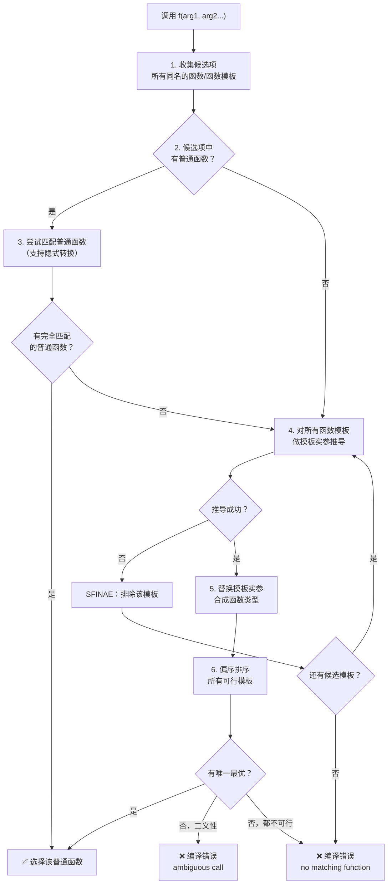

# 第16章 特化与重载 —— 为每种GPU架构定制代码

## 核心问题

一个 GEMM kernel 的模板，在 SM70、SM75、SM80、SM90 上用的是**完全不同的硬件指令**。你怎么用同一套模板代码，让不同架构走不同的实现路径？这就是特化（Specialization）和重载（Overloading）要解决的问题。

> 模板是编译期架构语言。特化就是这套语言的**多态机制**——同一个模板名，不同编译期条件，映射到不同实现。

## 通俗解释：乐高积木工厂

你开了一个乐高积木工厂，核心机器只需要一种：**成型机<材料>**。

```
template <typename 材料>
class 成型机 { /* 通用生产流程 */ };
```

但ABS塑料、PC塑料、金属粉末的成型温度完全不同：
- `成型机<ABS塑料>` → 注塑，230°C
- `成型机<PC塑料>` → 注塑，280°C
- `成型机<金属粉>` → 粉末冶金，1500°C

你不能用同一套流程！所以你要：

1. **写主模板**（通用版本）：出错时打印"不支持此材料"
2. **全特化 `成型机<ABS塑料>`**：用 230°C 工艺
3. **偏特化 `成型机<T*>`**：所有指针类型的特化版本（回收塑料用）

## 全特化（Explicit/Full Specialization）

当模板**所有参数**都确定时，写一个完全不同的版本：

```cpp
// 主模板：通用 GEMM
template <typename ElementA, typename ElementB, typename ElementC>
struct GemmKernel {
    static void run() {
        // 纯软件回退路径（非常慢）
        printf("Fallback GEMM\n");
    }
};

// 全特化：FP16 × FP16 = FP32 → 用 TensorCore
template <>
struct GemmKernel<half, half, float> {
    static void run() {
        // 使用 mma.sync.aligned.m16n8k8.f32.f16.f16.f32
        asm volatile("mma.sync.aligned.m16n8k8.f32.f16.f16.f32 ...");
    }
};

// 全特化：INT8 × INT8 = INT32 → 用 INT8 TensorCore
template <>
struct GemmKernel<int8_t, int8_t, int32_t> {
    static void run() {
        // 使用 mma.sync.aligned.m8n8k16.s32.s8.s8.s32
        asm volatile("mma.sync.aligned.m8n8k16.s32.s8.s8.s32 ...");
    }
};
```

### 关键规则

- 全特化**必须在主模板的命名空间内声明**
- 全特化是**新的实体**，不需要和主模板有任何代码相似性
- 全特化用 `template <>`（空尖括号）开头

## 偏特化（Partial Specialization）

只确定部分模板参数，比主模板更"具体"但不够"完全"：

```cpp
// 主模板
template <typename T, typename Allocator>
class Vector { /* 通用实现 */ };

// 偏特化 1：所有 bool 类型（不管分配器是啥）
template <typename Allocator>
class Vector<bool, Allocator> {
    // 位压缩存储，节省 8 倍空间
    uint8_t* data;
};

// 偏特化 2：所有指针类型（T*）
template <typename T, typename Allocator>
class Vector<T*, Allocator> {
    // 指针专有优化：批量析构时可以跳过
};

// 偏特化 3：所有类型 + 自定义分配器 MyAlloc
template <typename T>
class Vector<T, MyAlloc> {
    // 专用分配器路径
};
```

### 偏特化匹配优先级

当多个偏特化都匹配时，编译器选**最特化**的那个：

```cpp
Vector<bool, MyAlloc> v;
// 匹配：主模板 ✓、偏特化 1 (bool) ✓、偏特化 3 (MyAlloc) ✓
// 偏特化 1 和 3 都匹配 → 二义性？不！
// 编译器尝试偏序（partial ordering）→ 看谁更"具体"
// 结果是二义性错误！需要再加一个偏特化 Vector<bool, MyAlloc>
```

## 函数模板重载 vs 特化

**黄金法则**：函数模板只重载，不特化！类模板才特化。

```cpp
// ❌ 坏：函数模板特化（容易踩坑）
template <typename T>
void swap(T& a, T& b) { /* 通用实现 */ }

template <>
void swap<int>(int& a, int& b) { /* int 特化 */ }  // 不推荐！

// ✅ 好：函数重载
template <typename T>
void swap(T& a, T& b) { /* 通用实现 */ }

void swap(int& a, int& b) { /* int 重载 */ }  // 普通函数，优先级最高
```

### 为什么函数模板不要特化？

因为重载决议先于特化选择。当你有：

```cpp
template <typename T> void f(T);       // ①
template <typename T> void f(T*);      // ② （重载，不是特化）
template <> void f<int*>(int*);        // ③ 特化 ① 还是 ②？

f(new int(5));  // 调用哪个？规则复杂，极易混淆
```

**最佳实践**：函数模板用重载 + SFINAE；类模板用偏特化 + 全特化。

## 偏序规则（Partial Ordering）

当两个函数模板都匹配，选哪个？编译器通过"一方是否能实例化另一方"来判断：

```cpp
// 模板 A
template <typename T>
void f(T) { }       // 可以接受任何类型

// 模板 B
template <typename T>
void f(T*) { }      // 只能接受指针类型

// A 可以实例化成 f(int*) 吗？可以（T=int*）
// B 可以实例化成 f(int) 吗？不行（int 不是指针）
// → B 更"特化"，优先选择 B
```

### 偏序的算法（简化）

编译器构造两个虚拟类型，然后看替换结果：
1. 对 A 用合成类型 → 能否匹配 B？
2. 对 B 用合成类型 → 能否匹配 A？
3. 如果 A→B 成功但 B→A 失败，则 B 更特化

## 变参函数模板

```cpp
// C++11 的递归展开
template <typename T>
T sum(T v) {
    return v;  // 递归终止
}

template <typename T, typename... Args>
T sum(T first, Args... rest) {
    return first + sum(rest...);  // 递归展开
}

auto result = sum(1, 2, 3, 4);  // = 1 + (2 + (3 + 4)) = 10
```

### C++17 折叠表达式（Fold Expression）

```cpp
// 一元右折叠
template <typename... Args>
auto sum(Args... args) {
    return (args + ...);  // args1 + (args2 + (args3 + args4))
}

// 一元左折叠
template <typename... Args>
auto sum_left(Args... args) {
    return (... + args);  // ((args1 + args2) + args3) + args4
}

// 二元折叠（带初始值）
template <typename... Args>
bool all_true(Args... args) {
    return (true && ... && args);  // true && args1 && args2 && ...
}
```

## Mermaid 流程图：特化/重载匹配优先级



## 工业界真实用途

### CUTLASS 的 ArchTag 特化系统

这是 CUTLASS 最核心的设计模式之一。位于 `include/cutlass/arch/arch.h`：

```cpp
// 架构标签定义（每个架构一个 struct）
namespace cutlass::arch {

struct Sm50 { static constexpr int kMinComputeCapability = 50; };
struct Sm60 { static constexpr int kMinComputeCapability = 60; };
struct Sm61 { static constexpr int kMinComputeCapability = 61; };
struct Sm70 { static constexpr int kMinComputeCapability = 70; };
struct Sm75 { static constexpr int kMinComputeCapability = 75; };
struct Sm80 { static constexpr int kMinComputeCapability = 80; };
struct Sm90 { static constexpr int kMinComputeCapability = 90; };

// 偏特化：每种架构的 MMA 指令不同
template <typename ArchTag, typename = void>
struct Mma { /* 编译错误：不支持的架构 */ };

// SM75 特化
template <>
struct Mma<Sm75> {
    // FP16 MMA: mma.sync.aligned.m16n8k8.f32.f16.f16.f32
    using F16F16F32 = MmaInst<...>;
};

// SM80 特化（A100）
template <>
struct Mma<Sm80> {
    // 支持更复杂的稀疏 MMA (2:4 sparsity)
    using F16F16F32 = MmaInst<...>;
    using TF32TF32F32 = MmaInst<...>;  // TF32 新格式
    using BF16BF16F32 = MmaInst<...>;  // BF16
    using Sparse = MmaSparse<...>;    // 结构化稀疏
};

// SM90 特化（H100）
template <>
struct Mma<Sm90> {
    // SM90 引入 WGMMA (Warp Group MMA) 和 TMA
    using F16F16F32 = WgmmaInst<...>;  // 异步 WGMMA
    using FP8FP8F32 = WgmmaInst<...>;  // FP8 支持
};
```

### TensorRT Builder 的架构选择

TensorRT 的 Builder 在编译不同架构的 engine 时，本质上也是在用偏特化思路：

```cpp
class IBuilderConfig {
    // 针对不同 SM 做不同优化
    template <int SmVersion>
    struct TacticsSelector;
    
    template <>
    struct TacticsSelector<80> {  // SM80 (A100)
        static auto get() {
            return {Tactic::TENSOR_CORE, Tactic::FAST_MATH};
        }
    };
    
    template <>
    struct TacticsSelector<90> {  // SM90 (H100)
        static auto get() {
            return {Tactic::TENSOR_CORE, Tactic::FAST_MATH, Tactic::FP8};
        }
    };
};
```

### PyTorch ATen 的设备特化

PyTorch 的 `Tensor` 对 CUDA 和 CPU 用完全不同的特化实现：

```cpp
template <typename T, Device D>
class TensorImpl;

template <typename T>
class TensorImpl<T, Device::CUDA> {
    cudaStream_t stream_;
    void* cuda_ptr_;
};

template <typename T>
class TensorImpl<T, Device::CPU> {
    // CPU 专用内存管理
};
```

## 常见坑点

| 坑 | 现象 | 解决 |
|----|------|------|
| 函数模板特化 | 重载决议选了预期之外的版本 | 用重载替代特化 |
| 偏特化二义性 | 多个偏特化平等匹配 | 加一个中间偏特化或确保互斥 |
| 主模板声明顺序 | 偏特化找不到主模板 | 主模板必须在所有偏特化之前声明 |
| ArchTag 缺失特化 | 新架构编译不过 | 检查 `arch.h` 是否为新架构加了特化 |
| 偏序理解错误 | 以为是参数个数决定 | 实际上是"谁更特化"的偏序关系 |

## 与 CUTLASS 的联系（源码位置）

### ArchTag 系统源码

```
include/cutlass/arch/
├── arch.h                    # ArchTag 定义（Sm50~Sm90）
├── mma.h                     # MMA 指令的 ArchTag 偏特化
├── mma_sm50.h               # SM50 MMA 指令
├── mma_sm60.h               # SM60 MMA 指令
├── mma_sm61.h               # SM61 MMA 指令
├── mma_sm70.h               # SM70 MMA 指令
├── mma_sm75.h               # SM75 MMA 指令
├── mma_sm80.h               # SM80 MMA 指令（A100）
└── mma_sm90.h               # SM90 MMA 指令（H100/WGMMA）
```

### Gemm Kernel 特化

```
include/cutlass/gemm/
├── kernel/
│   ├── gemm.h                         # 主模板：通用 GEMM kernel
│   ├── gemm_array.h                   # 特化：Array-backed GEMM
│   ├── gemm_splitk_parallel.h         # 特化：Split-K 并行的 GEMM
│   └── default_gemm_configuration.h   # 偏特化：不同元素类型的默认配置
```

### 偏特化实战（default_gemm_configuration.h）

```cpp
// 文件: include/cutlass/gemm/kernel/default_gemm_configuration.h
// 偏特化：根据 OperatorClass 选择不同的 Tile 形状

// 主模板（不可用）
template <typename OperatorClass, typename ElementA, ...>
struct DefaultGemmConfiguration {
    // 故意不提供实现，触发编译错误
};

// 偏特化：Simt (纯 CUDA Core)
template <typename ElementA, typename ElementB, typename ElementC, ...>
struct DefaultGemmConfiguration<
    arch::OpClassSimt, ElementA, ElementB, ElementC, ...> {
    using TileShape = GemmShape<128, 128, 8>;  // K 维度小，重复次数多
    ...
};

// 偏特化：TensorOp (TensorCore)
template <typename ElementA, typename ElementB, typename ElementC, ...>
struct DefaultGemmConfiguration<
    arch::OpClassTensorOp, ElementA, ElementB, ElementC, ...> {
    using TileShape = GemmShape<128, 128, 32>;  // K 维度大，充分利用 TensorCore
    ...
};
```

## 本章总结

| 维度 | 要点 |
|------|------|
| 全特化 | 所有模板参数确定，完全定制实现 |
| 偏特化 | 部分参数确定，比主模板更具体 |
| 函数模板 vs 类模板 | 函数模板用重载，类模板用特化/偏特化 |
| 偏序规则 | 通过"A 能推导出 B 吗？"判断谁更特化 |
| CUTLASS 核心模式 | ArchTag 标签 + 偏特化 = 架构多态 |
| 变参模板 | 递归展开 + C++17 折叠表达式 |

> 模板是编译期架构语言。特化与重载就是这套语言的**分发（dispatch）系统**——在编译期根据类型信息、架构标签、编译期常量，把调用路由到最合适的实现。CUTLASS 的 ArchTag 特化系统是这一思想在 GPU 编程中最成熟的应用。
