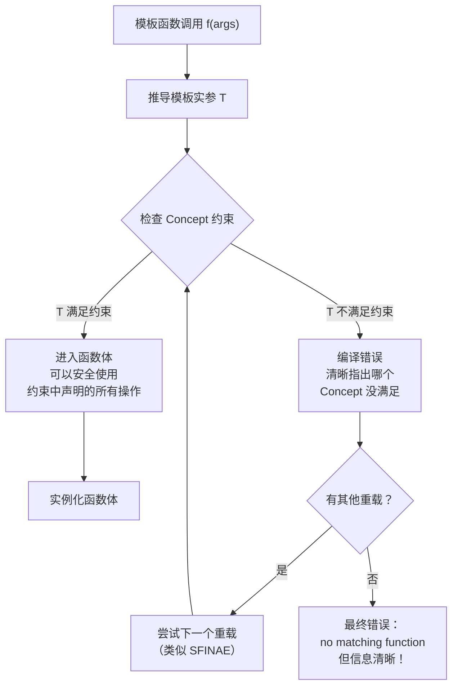
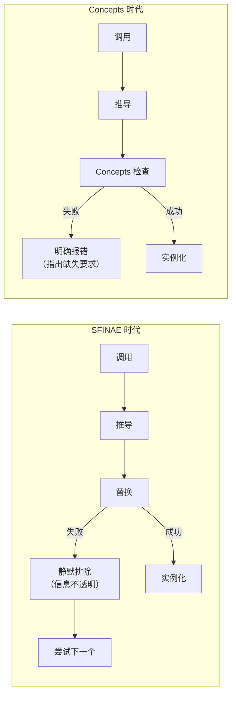

# 第17章 未来方向 —— Concepts 与现代化模板设计

## 核心问题

SFINAE 写出来的错误信息动辄几百行，全是模板展开栈。`no matching function for call to ...` 后面跟了一屏幕的模板内部类型，根本不知道问题出在哪儿。C++20 能不能让模板编程更容易读写、更好调试？答案是 **Concepts**。

> 模板是编译期架构语言。Concepts 就是给这套语言加上的**类型系统（Type System）**——模板参数终于有了"类型约束"。

## 通俗解释：身份证与安检

### SFINAE 时代（旧世界）

你去机场，安检人员没有身份证读卡器。他们只能：

1. 叫你走 1 号通道 → 你走不了？哦你腿有问题 → 换 2 号通道
2. 叫你把行李放传送带 → 放不进去？哦行李太大 → 换大传送带

每次都是"让你试，不行再换"，而且失败时的错误信息是"你无法通过 1 号通道，无法通过 2 号通道…"而不是"因为你的行李尺寸是 50cm × 40cm，超过了 1 号通道的 30cm × 20cm 限制"。

### Concepts 时代（新世界）

安检人员有了身份证读卡器 + 行李自动测量仪：

1. **检查你的类型是否满足 Concept（约束）**：你有 `.size()` 吗？你有 `operator+` 吗？
2. **不满足就在入口直接拒绝**，错误信息是："类型 `MyType` 不满足 `Sortable` 概念，缺少 `operator<`"
3. **满足才放进去**，后面的代码可以放心使用 `.size()` 和 `operator<`

## relaxed typename（C++17 引入）

在 C++17 之前，`typename` 的使用很受限：

```cpp
// C++14：必须这样写
template <template <typename> class Container, typename T>
class Adapter { };

// C++17：可以用 typename（relaxed）
template <template <typename> typename Container, typename T>
class Adapter { };  // 现在可以用 typename 替换 class
```

虽然是小改动，但语义上更统一——`typename` 本来就表示"这是个类型参数"。

## 广义非类型模板参数（C++17/20）

```cpp
// C++14：非类型参数只能是整型/枚举/指针/引用
template <int N>
struct Array { };

// C++17：auto 非类型参数（类型由编译器推导）
template <auto Value>
struct Constant {
    static constexpr auto value = Value;
};

Constant<42> c1;         // int
Constant<'a'> c2;        // char
Constant<3.14> c3;       // C++20: double (C++17 不允许浮点)

// C++20：类类型也可以做非类型参数（强 structural 类型）
struct Point { int x, y; };
template <Point P>
struct Location { };

constexpr Point origin{0, 0};
Location<origin> loc;  // C++20 允许
```

### 对 GPU 编程的影响

在 CUTLASS 式设计中，很多 kernel 参数是编译期常量（tile 大小、warp 数、stage 数）。广义非类型参数让这些更自然：

```cpp
// 旧式：每个参数都要一个模板参数
template <int kTileM, int kTileN, int kTileK, int kStages, int kWarpCount>
class GemmKernel { };

// 新式：打包成结构体
struct GemmConfig {
    int tile_m, tile_n, tile_k, stages, warp_count;
};
template <GemmConfig Config>
class GemmKernel { };  // C++20 直接传结构体
```

## Concepts（C++20）详解

### 基础语法

```cpp
// 定义一个 Concept：约束类型必须有 .size() 方法返回可转为 size_t 的值
template <typename T>
concept Sizeable = requires(T t) {
    { t.size() } -> std::convertible_to<size_t>;
};

// 使用 Concept 约束模板参数（四种等价写法）
// 写法 1：requires 子句
template <typename T>
    requires Sizeable<T>
void print_size(T const& t) {
    std::cout << t.size() << '\n';
}

// 写法 2：用 Concept 名替换 typename
template <Sizeable T>
void print_size(T const& t) {
    std::cout << t.size() << '\n';
}

// 写法 3：缩略函数模板（最简洁）
void print_size(Sizeable auto const& t) {
    std::cout << t.size() << '\n';
}

// 写法 4：尾部 requires
template <typename T>
void print_size(T const& t) requires Sizeable<T> {
    std::cout << t.size() << '\n';
}
```

### Concept 的组合

```cpp
template <typename T>
concept Numeric = std::integral<T> || std::floating_point<T>;

template <typename T>
concept Sortable = requires(T a, T b) {
    { a < b } -> std::convertible_to<bool>;
};

// 组合 Concept
template <typename T>
concept SortableNumeric = Numeric<T> && Sortable<T>;

// SortableNumeric<int>   → true  (int 是整型，有 operator<)
// SortableNumeric<std::string> → false (string 不是 Numeric)
// SortableNumeric<MyStruct> → false (没定义 operator<)
```

### requires 表达式详解

```cpp
template <typename T>
concept Matrix = requires(T m, const T cm) {
    // 简单要求：成员必须存在
    m.rows();            // T 必须有 rows() 方法
    m.cols();
    
    // 类型要求：嵌套类型必须存在
    typename T::value_type;    // T 必须有 value_type 嵌套类型
    typename T::iterator;      // T 必须有 iterator 嵌套类型
    
    // 复合要求：检查返回类型
    { m.rows() } -> std::convertible_to<int>;  // rows() 返回值必须能转 int
    { m(0, 0) } -> std::same_as<typename T::value_type>;  // operator() 返回 value_type
    
    // 嵌套要求：调用另一个 constraint
    requires Sortable<typename T::value_type>;  // value_type 必须是可排序的
};
```

### Concept 替代 SFINAE

```cpp
// === SFINAE 旧世界 ===
template <typename T>
std::enable_if_t<std::is_integral_v<T>, T> gcd(T a, T b) {
    return b == 0 ? a : gcd(b, a % b);
}
// 调用 gcd(3.14, 2.71) → 500 行错误信息，最后一行说"no matching function"

// === Concepts 新世界 ===
template <std::integral T>
T gcd(T a, T b) {
    return b == 0 ? a : gcd(b, a % b);
}
// 调用 gcd(3.14, 2.71) → 一行错误: "double does not satisfy integral"
```

## 函数模板偏特化的前景

函数模板一直不支持偏特化（因为重载已经够用），但 Concepts 引入后有了新的可能性：

```cpp
// 用 Concepts 实现"函数模板偏特化"的效果

// 通用版本
template <typename T>
auto serialize(T const& obj) {
    return "{unknown}";
}

// "偏特化"：有 .to_json() 的类型
template <typename T>
    requires requires(T t) { t.to_json(); }
auto serialize(T const& obj) {
    return obj.to_json();
}

// "偏特化"：整数类型
template <std::integral T>
auto serialize(T val) {
    return std::to_string(val);
}
```

Concepts 天然支持偏序（同 SFINAE 的偏序规则），所以多个约束版本的函数模板可以正确排序。

## 命名模板实参（Named Template Arguments）

这是尚未进入标准但讨论热烈的提案。想象：

```cpp
// 现在（位置参数，不直观）
Gemm<half, half, float, RowMajor, ColMajor, GemmShape<128, 128, 32>> kernel;

// 未来（命名参数，一目了然）
Gemm<
    .ElementA = half,
    .ElementB = half,
    .ElementAccumulator = float,
    .LayoutA = RowMajor,
    .LayoutB = ColMajor,
    .TileShape = GemmShape<128, 128, 32>
> kernel;
```

这对 CUTLASS 这种几十个模板参数的库是革命性的。

## Mermaid 图：Concepts 编译期工作流



### 与 SFINAE 的对比



## 工业界真实用途

### CUTLASS 未来的 Concepts 设计趋势

CUTLASS 3.x 已经大量使用 `static_assert` 做编译期检查，这是手动版的 Concepts：

```cpp
// 当前 CUTLASS 3.x 的做法（include/cutlass/gemm/kernel/gemm_universal.h）
template <typename... Args>
class GemmUniversal {
    static_assert(
        cutlass::gemm::kernel::detail::is_supported_kernel_configuration<
            TileShape, StrideA, StrideB, StrideC, StrideD, 
            ThreadblockShape, WarpShape, InstructionShape>::value,
        "Unsupported kernel configuration. "
        "K tile must be at least 32 for TensorOp.");
    
    // 如果换成 Concepts：
    // template <SupportedKernelConfiguration Config>
    // class GemmUniversal { ... };
```

未来可能演化为：

```cpp
// 理想中的 CUTLASS Concepts 设计
template <typename Config>
concept GemmConfiguration = requires {
    typename Config::ElementA;
    typename Config::ElementB;
    typename Config::TileShape;
    requires MatrixLayout<Config::LayoutA>;
    requires MatrixLayout<Config::LayoutB>;
    requires (Config::TileShape::kK >= 32) || 
             (Config::OperatorClass != OpClassTensorOp);
};

template <GemmConfiguration Config>
class GemmUniversal { /* ... */ };
```

### TensorRT 的 Plugin 约束

TensorRT 的 Plugin 接口本质上就是一套隐式的 Concept：

```cpp
// 隐式 Concept：所有 Plugin 必须实现这些
template <typename T>
concept TensorRTPlugin = requires(T plugin) {
    { plugin.getNbOutputs() } -> std::same_as<int>;
    { plugin.getOutputDimensions(0, nullptr, 0) } -> std::same_as<Dims>;
    { plugin.enqueue(0, nullptr, nullptr, nullptr, 0) } -> std::same_as<int>;
};
```

### TVM/Triton 的类型检查

Triton 语言本身就是一套受约束的模板系统。它的 JIT 编译器在 Python 层就做了类型推导，本质上等价于 Concepts 检查——不合法的操作在 kernel launch 前就被拦截。

## 常见坑点

| 坑 | 现象 | 解决 |
|----|------|------|
| Concepts 不是类型 | `std::vector<MyConcept> v;` 编译错 | Concept 是约束，不是类型 |
| requires 嵌套 | 层层 requires 嵌套难读 | 拆成独立 Concept 再组合 |
| `auto` vs Concept | `auto` 没有约束 | 用 `MyConcept auto` 替代裸 `auto` |
| 老编译器不支持 | `concept` 关键字不识别 | GCC 10+/Clang 10+/MSVC 19.25+ |
| CUTLASS 兼容性 | CUTLASS 3.x 锁定 C++17 | Concepts 迁移需逐步进行 |

## 与 CUTLASS 的联系（源码位置）

### CUTLASS 当前的手动 Concept 模式

```
include/cutlass/
├── arch/
│   ├── arch.h                        # ArchTag 约束（隐式 Concept）
│   └── mma.h                         # MMA 能力约束
├── gemm/
│   └── kernel/
│       ├── gemm_universal.h          # 大量 static_assert（手动 Concept）
│       └── detail/
│           └── kernel_traits.h       # 编译期特征提取（Concept 检查的雏形）
└── platform/
    └── platform.h                    # 平台兼容性约束
```

### 静态断言矩阵（gemm_universal.h）

```cpp
// 文件: include/cutlass/gemm/kernel/gemm_universal.h (约第 1500 行)
// 这些 static_assert 就是手工的 Concepts：

static_assert(
    (platform::is_same<ElementA, half_t>::value ||
     platform::is_same<ElementA, bfloat16_t>::value ||
     platform::is_same<ElementA, tfloat32_t>::value ||
     platform::is_same<ElementA, float>::value),
    "ElementA must be half_t, bfloat16_t, tfloat32_t, or float.");

static_assert(
    sizeof(ElementA) >= sizeof(ElementC),
    "Epilogue visitor expects sizeof(ElementA) >= sizeof(ElementC).");

// 如果换成 Concepts 就是：
// template <SupportedElementType ElementA, ElementC>
//     requires (sizeof(ElementA) >= sizeof(ElementC))
```

### CUTLASS 3.x 的类型特征体系

```cpp
// include/cutlass/gemm/kernel/detail/kernel_traits.h
// 编译期判断 kernel 配置是否可行
template <typename TileShape, typename StrideA, ...>
struct is_supported_kernel_configuration {
    static constexpr bool value = 
        (TileShape::kM % alignment_A == 0) &&
        (TileShape::kN % alignment_B == 0) &&
        (TileShape::kK % 16 == 0) &&  // K 必须是 16 的倍数（MMA 要求）
        ...;
};
```

## 本章总结

| 维度 | 要点 |
|------|------|
| Concepts | 给模板参数加类型约束，错误信息清晰可读 |
| SFINAE vs Concepts | SFINAE 是"出问题再说"，Concepts 是"不符合就别来" |
| relaxed typename | `template <typename> typename` 的统一语法糖 |
| 广义非类型参数 | `template <auto>` + 类类型非类型参数 |
| CUTLASS 现状 | `static_assert` + 类型特征 → 手动版 Concepts |
| CUTLASS 趋势 | 逐步用 Concepts 替换 static_assert 和 enable_if |

> 模板是编译期架构语言。Concepts 让这套语言终于有了**类型安全的接口定义**——相当于运行时语言的 `interface` 或 `trait`。对于 CUTLASS 这种极致复杂的模板系统，Concepts 不是"锦上添花"，而是"工业必需品"：几十个模板参数的合法性检查，不能再靠几百行的 `static_assert` 堆砌了。
