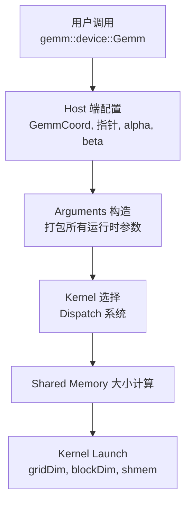
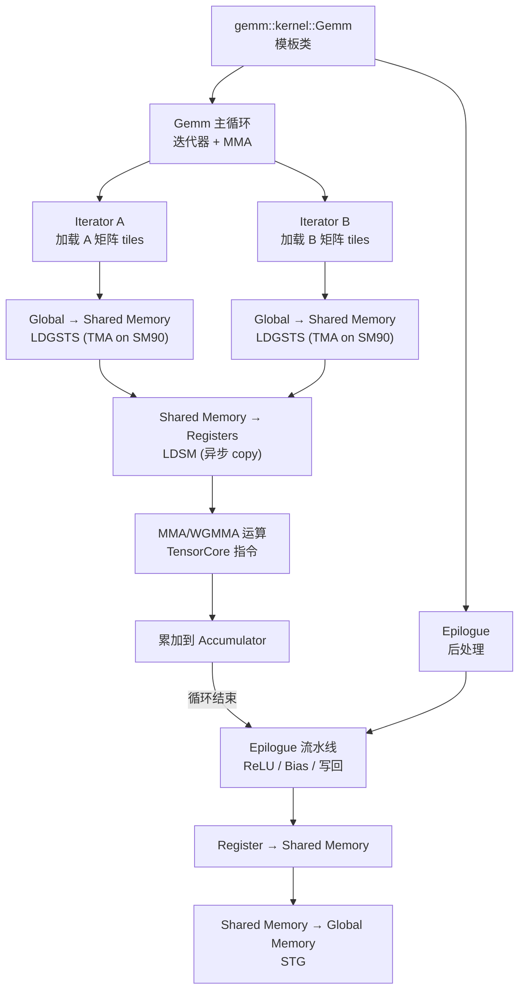
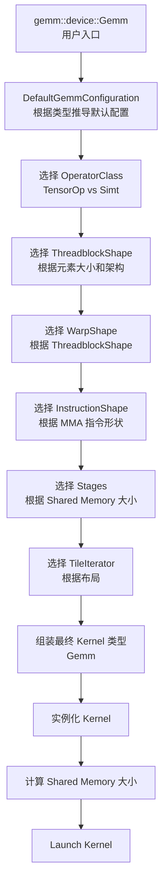
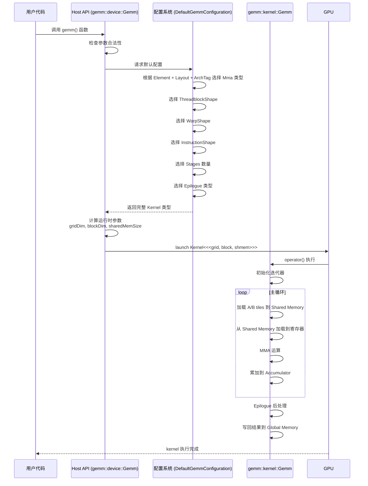

# 第18章 CUTLASS 模板架构全景 —— 从书本到工业巅峰

## 核心问题

前面五章讲了模板的名称查找、实例化、SFINAE、特化、Concepts。现在要把它们全部串起来，看一个真实工业项目——CUTLASS——是如何把它们用到极致的。这相当于一本模板教材的"毕业设计"：读完你能看懂 CUTLASS 源码，理解 NVIDIA 官方 GPU 运算库的架构思想。

> 模板是编译期架构语言。CUTLASS 就是这套语言写出来的**GPU 高性能计算操作系统**——对，不是库，是操作系统级别的高度抽象。

## 通俗解释：造一套乐高工厂

普通 GEMM 库（如 cuBLAS）像是富士康流水线：高效，但改不了。你想做点定制化？不好意思，得找 NVIDIA 谈。

CUTLASS 的哲学不同：它给你**乐高积木块和设计手册**，你搭自己的流水线。积木块是模板类，设计手册是模板元编程。

```
你的需求                          → CUTLASS 积木组合
FP16 × FP16 = FP32               → ElementA=half, ElementB=half, ElementC=float
A 是行主序，B 是列主序            → LayoutA=RowMajor, LayoutB=ColumnMajor
A100 (SM80) 上跑                  → ArchTag=Sm80
要 TensorCore 不要 CUDA Core     → OperatorClass=TensorOp
Tile 大小 128×128×32             → ThreadblockShape=128×128×32
K 方向拆成 4 块并行              → SplitKSerial=4
还要一个 ReLU Epilogue           → EpilogueOp=LinearCombinationRelu
```

编译器在编译期把所有积木拼好（模板实例化），生成一份针对这个具体组合优化过的 kernel。没有运行时开销，没有虚函数，没有动态分发。全部在编译期完成。

## CUTLASS 完整架构图（Mermaid）

### 第一层：用户 API 层



### 第二层：Kernel 核心层



### 第三层：模板参数层级图

```mermaid
flowchart LR
    subgraph 数据层["数据类型层"]
        A1["ElementA<br/>half, bf16, int8, float"]
        A2["ElementB<br/>half, bf16, int8, float"]
        A3["ElementC/D<br/>half, float, int32"]
        A4["ElementAccumulator<br/>float, int32"]
    end
    
    subgraph 布局层["内存布局层"]
        B1["LayoutA<br/>RowMajor/ColumnMajor"]
        B2["LayoutB<br/>RowMajor/ColumnMajor"]
        B3["LayoutC/D"]
    end
    
    subgraph 计算层["计算配置层"]
        C1["OperatorClass<br/>Simt/TensorOp/WmmaTensorOp"]
        C2["ArchTag<br/>Sm70~Sm90"]
        C3["ThreadblockShape<br/>M×N×K tile"]
        C4["WarpShape<br/>Warp-level tile"]
        C5["InstructionShape<br/>MMA instruction shape"]
    end
    
    subgraph 调度层["调度 & 流水线层"]
        D1["ThreadblockSwizzle<br/>排列策略"]
        D2["Stages<br/>流水线深度 2~6"]
        D3["SplitKSerial<br/>K 方向切分"]
    end
    
    subgraph 后处理层["Epilogue 层"]
        E1["EpilogueOp<br/>LinearCombination/ReLU/Silu"]
        E2["ElementwiseOp<br/>激活函数"]
    end
    
    数据层 --> 布局层 --> 计算层 --> 调度层 --> 后处理层
```



### 第四层：Dispatch 系统架构



## 各子系统的模板设计分析

### 1. Gemm 层级（Kernel）

`gemm::kernel::Gemm` 是整个系统的核心，位于 `include/cutlass/gemm/kernel/gemm.h`。

```cpp
template <
    typename Mma_,           // 矩阵乘法累加器（MMA/WGMMA）
    typename Epilogue_,      // 后处理算子
    typename ThreadblockSwizzle_  // Threadblock 排列
>
class Gemm {
public:
    using Mma = Mma_;
    using Epilogue = Epilogue_;
    using ThreadblockSwizzle = ThreadblockSwizzle_;
    
    // 从 Mma 派生的类型信息
    using ElementA = typename Mma::ElementA;
    using ElementB = typename Mma::ElementB;
    using ElementC = typename Mma::ElementC;
    using LayoutA = typename Mma::LayoutA;
    using LayoutB = typename Mma::LayoutB;
    using ThreadblockShape = typename Mma::ThreadblockShape;
    using WarpShape = typename Mma::WarpShape;
    
    struct Params {
        // kernel 参数：所有运行时指针、stride、alpha、beta...
        typename Mma::IteratorA::Params params_A;
        typename Mma::IteratorB::Params params_B;
        typename Epilogue::Params params_epilogue;  // 依赖名，需要 typename
    };
    
    // 核心方法
    CUTLASS_DEVICE
    void operator()(Params const &params) {
        // 1. 构造迭代器
        // 2. 主循环：加载 → MMA → 累加
        // 3. Epilogue：后处理 → 写回
    }
};
```

**模板要点分析**：
- `Mma_` 作为类型参数传入，编译期根据 `Mma_` 的具体类型**推导**出 `ElementA`、`LayoutA` 等
- `Params` 结构体里全是**依赖名**（`typename Mma::IteratorA::Params`），用 `typename` 关键字显式标注
- `operator()` 是 kernel 入口，编译器在**实例化**时才根据具体模板参数生成代码

### 2. MMA 系统

`include/cutlass/gemm/thread/mma.h` 封装了不同架构的 Matrix Multiply-Accumulate 操作。

```cpp
// 模板参数
template <
    typename Shape_,         // MMA 指令的形状（如 16×8×8）
    typename ElementA_,      // A 元素类型
    typename LayoutA_,       // A 的寄存器布局
    typename ElementB_,      // B 元素类型
    typename LayoutB_,       // B 的寄存器布局
    typename ElementC_,      // C（累加器）元素类型
    typename LayoutC_,       // C 的寄存器布局
    typename Policy_ = ...  // 策略（如是否使用稀疏化）
>
class Mma {
    // 关键别名
    using FragmentA = Array<ElementA, kElementsA>;  // A 的寄存器片段
    using FragmentB = Array<ElementB, kElementsB>;  // B 的寄存器片段
    using FragmentC = Array<ElementC, kElementsC>;  // C（累加器）的寄存器片段
    
    // MMA 操作
    CUTLASS_DEVICE
    void operator()(FragmentC &D, 
                    FragmentA const &A, 
                    FragmentB const &B, 
                    FragmentC const &C) {
        // 插入 PTX MMA 指令
        // SM75: mma.sync.aligned.m16n8k8.f32.f16.f16.f32
        // SM80: mma.sync.aligned.m16n8k16.f32.tf32.tf32.f32
        // SM90: wgmma.mma_async.sync.aligned.m64n128k16.f32.f16.f16
    }
};
```

**不同架构的 MMA 特化**：

| 架构 | MMA 指令 | 形状 | 特点 |
|------|----------|------|------|
| SM70 | mma.sync | 8×8×4 | 基础 TensorCore |
| SM75 | mma.sync | 16×8×8 | 更大指令形状 |
| SM80 | mma.sync | 16×8×16 | TF32、BF16、2:4 稀疏 |
| SM90 | wgmma.async | 64×128×16 | Warp Group MMA、异步 N ->∞ |

### 3. Epilogue 系统

Epilogue 负责 GEMM 结果的**后处理**，位于 `include/cutlass/epilogue/thread/`：

```cpp
// 典型的 Epilogue 模板
template <
    typename Shape_,           // Epilogue tile 形状
    typename WarpMmaOperator_, // 关联的 MMA 算子
    int PartitionsK,           // K 方向的分区数
    typename OutputTileIterator_,  // 输出迭代器
    typename AccumulatorFragment_, // 累加器片段
    typename BiasOp_,          // Bias（可选）
    typename ActivationOp_     // 激活函数（ReLU, SiLU, GELU...）
>
class LinearCombination {
    // 典型流程：
    // 1. 从累加器读取结果
    // 2. alpha * AB + beta * C（线性组合）
    // 3. 加上 bias（如果有）
    // 4. 应用激活函数（如果有）
    // 5. 写回 global memory
};
```

**Epilogue 的变体**（通过偏特化实现）：

```
LinearCombination           → 基础：D = alpha * AB + beta * C
LinearCombinationRelu       → D = ReLU(alpha * AB + beta * C)
LinearCombinationSilu       → D = SiLU(alpha * AB + beta * C)
LinearCombinationGelu       → D = GELU(alpha * AB + beta * C)
LinearCombinationBiasRelu   → D = ReLU(alpha * AB + beta * C + bias)
```

### 4. Layout 系统

CUTLASS 的 Layout 不是简单的 enum，而是**带数学运算功能的类型系统**：

```cpp
// 行主序布局
struct RowMajor {
    // 逻辑坐标 → 线性索引映射
    CUTLASS_HOST_DEVICE
    static int64_t operator()(int64_t row, int64_t col) {
        return row * stride + col;  // 对于连续矩阵
    }
};

// 列主序布局
struct ColumnMajor {
    CUTLASS_HOST_DEVICE
    static int64_t operator()(int64_t row, int64_t col) {
        return col * stride + row;
    }
};

// 交错布局（用于复杂数据排布）
template <int Interleave>
struct ColumnMajorInterleaved {
    // 每 Interleave 列交错排列
};

// 复杂布局示例
using Layout = ColumnMajorInterleaved<4>;  // 每 4 列一组交错
```

**Layout 系统的模板要点**：
- Layout 本身是**值类型**（无状态），所有操作由 `operator()` 提供
- 不同 Layout 通过**函数重载**（非模板特化）区分行为
- 编译器可以在**编译期**计算出内存访问模式，生成最优的 load/store 指令

### 5. Iterator（迭代器）系统

迭代器负责从 Global Memory 加载数据到 Shared Memory，再从 Shared Memory 加载到 Register：

```
Global → Shared Memory 迭代器（TileIterator）
    ├── gemm::threadblock::TileIterator   # 通用 tile 迭代器
    └── PredicatedTileIterator            # 带边界判断的迭代器

Shared → Register 迭代器（Warp-level）
    ├── gemm::warp::MmaOperandIterator    # MMA 操作数的迭代器
    └── gemm::warp::TileIterator          # Warp 级 tile 迭代器
```

```cpp
// 迭代器模板（简化）
template <
    typename Shape_,        // 要加载的 tile 大小
    typename Operand_,      // A 还是 B
    typename Element_,      // 元素类型
    typename Layout_,       // 内存布局
    int AdvanceRank,        // 推进方向（行 / 列）
    typename ThreadMap_     // 线程到数据的映射
>
class TileIterator {
    // 核心操作
    CUTLASS_DEVICE
    void load(Fragment &frag);  // 从 Shared Memory 加载到寄存器
    
    CUTLASS_DEVICE
    void add_tile_offset(int offset);  // 推进到下一个 tile
};
```

### 6. Tile 系统

Tile 定义了各级别运算的数据粒度：

```
Threadblock-level Tile (128×128)
    └── 分解为多个 Warp-level Tile (64×64)
            └── 分解为多个 MMA Instruction (16×8×8)
                    └── 分解为多个 Thread-level Fragment
```

```cpp
// Tile 的形状定义
template <int M, int N, int K>
struct GemmShape {
    static constexpr int kM = M;
    static constexpr int kN = N;
    static constexpr int kK = K;
};

// 典型配置链
using ThreadblockShape = GemmShape<128, 128, 32>;   // Threadblock
using WarpShape = GemmShape<64, 64, 32>;             // Warp
using InstructionShape = GemmShape<16, 8, 16>;        // MMA 指令

// 检查：Threadblock 必须能被 Warp 整除
static_assert(ThreadblockShape::kM % WarpShape::kM == 0,
              "Threadblock M must be divisible by Warp M");
```

### 7. Swizzle 系统

Swizzle 决定 Threadblock 在 Grid 上的排列方式：

```cpp
// 顺序排列
struct IdentitySwizzle {
    CUTLASS_HOST_DEVICE
    static BlockCoord operator()(BlockCoord coord) {
        return coord;
    }
};

// XOR 交错排列（提升 L2 cache 命中率）
template <int Size, int Shift>
struct XORSwizzle {
    CUTLASS_HOST_DEVICE
    static BlockCoord operator()(BlockCoord coord) {
        coord.x ^= (coord.y % Size) << Shift;
        return coord;
    }
};

// SM90 流式 Swizzle（利用 SM90 的 L2 cache 特性）
struct StreamKSwizzle { /* ... */ };
```

### 8. Policy 系统

Policy 系统决定在给定硬件上选择什么策略：

```cpp
template <
    typename OperatorClass,  // Simt / TensorOp
    typename ArchTag,        // Sm75 / Sm80 / Sm90
    typename ElementA,
    typename ElementB,
    typename ElementC
>
struct DefaultGemmConfiguration {
    // Policy 决定以下所有配置：
    using ThreadblockShape = /* 根据元素类型和架构选择 */;
    using WarpShape = /* 根据 ThreadblockShape 选择 */;
    using InstructionShape = /* 根据 WarpShape + MMA 指令选择 */;
    static constexpr int kStages = /* 根据 SMEM 大小计算 */;
    // ...
};
```

## Kernel Launch 完整流程



## 源码导读指南

### 入口点（从哪看起）

```
第 1 步（API 层）：
    文件: include/cutlass/gemm/device/gemm.h
    内容: 用户直接调用的 Gemm 类
    重点: Gemm::operator() → 了解参数 → launch 流程

第 2 步（Kernel 层）：
    文件: include/cutlass/gemm/kernel/gemm.h
    内容: Device kernel 的主实现
    重点: operator() → main loop → iterator

第 3 步（MMA 层）：
    文件: include/cutlass/gemm/thread/mma.h
    内容: MMA 运算的模板定义
    重点: 不同 ArchTag 的偏特化

第 4 步（Epilogue 层）：
    文件: include/cutlass/epilogue/thread/linear_combination.h
    内容: 后处理逻辑
    重点: D = alpha*AB + beta*C + bias → activation

第 5 步（Tile Iterator 层）：
    文件: include/cutlass/gemm/threadblock/tile_iterator.h
    内容: 数据加载逻辑
    重点: LDGSTS → LDSM 指令生成
```

### 关键文件速查表

| 模块 | 关键文件 | 看懂这个就够了 |
|------|----------|---------------|
| 入口 | `include/cutlass/gemm/device/gemm.h` | `Gemm::operator()` |
| Kernel | `include/cutlass/gemm/kernel/gemm.h` | `Gemm::operator()` 主循环 |
| MMA | `include/cutlass/gemm/thread/mma.h` | MMA 指令插入 |
| Epilogue | `include/cutlass/epilogue/thread/linear_combination.h` | 后处理流程 |
| 配置 | `include/cutlass/gemm/kernel/default_gemm_configuration.h` | `DefaultGemmConfiguration` 偏特化 |
| 布局 | `include/cutlass/layout/matrix.h` | `RowMajor`/`ColumnMajor` `operator()` |
| 架构 | `include/cutlass/arch/mma.h` | 按 ArchTag 的 MMA 特化 |
| Tile | `include/cutlass/gemm/threadblock/tile_iterator.h` | 迭代器模板 |

### CUTLASS 3.x 新增模块（SM90/H100）

```
include/cutlass/gemm/collective/
    sm90_mma_tma_gmma_ss_warpspecialized.hpp      # Warp Specialization 模式
    sm90_mma_tma_gmma_ss_warpspecialized_mixed_input.hpp  # 混合精度输入

include/cutlass/arch/
    mma_sm90.h                                    # SM90 WGMMA 指令封装
    tma.h                                         # Tensor Memory Accelerator
```

CUTLASS 3.x 最大的变化是引入了 `collective` 层，将 GEMM 抽象为 **生产者-消费者** 模型（类似 Triton 的 design），用模板实现编译期的流水线调度。

## 模板设计精髓总结

CUTLASS 的模板设计体现了以下工程思想：

| 设计原则 | 模板实现 | 效果 |
|----------|----------|------|
| 零开销抽象 | 全部编译期决议，无虚函数 | 运行时性能 = 手写 CUDA |
| 组合胜于继承 | 模板参数组合行为，而非类继承 | 灵活组合，按需裁剪 |
| 类型即配置 | Layout/ArchTag 是类型而非 enum | 编译期错误检查 + 自动 dispatch |
| 默认推导 | DefaultGemmConfiguration 自动推导 | 用户只需指定最少参数 |
| 显式实例化 | 按架构拆分 .cu 文件 | 编译时间可控 |
| 偏特化 = 架构多态 | ArchTag 特化不同 MMA 实现 | 同一套代码适配所有 GPU |

## 常见坑点

| 坑 | 现象 | 解决 |
|----|------|------|
| 模板参数组合无效 | 编译错误在模板深层 | 看 `is_supported_kernel_configuration` 的 static_assert |
| Shared Memory 超限 | kernel launch 失败（cudaErrorInvalidConfiguration） | 减少 `kStages` 或缩小 tile |
| ArchTag 选错 | 用了 SM90 的 WGMMA 但 GPU 是 A100 | 检查 `__CUDA_ARCH__` 宏和 ArchTag 匹配 |
| Layout 不匹配 | 迭代器访问越界 | RowMajor/ColumnMajor 的 stride 设置 |
| Epilogue 类型不兼容 | 编译期 static_assert 失败 | 检查 ElementC 和 ElementAccumulator 的兼容性 |

## 本章总结

| 维度 | 要点 |
|------|------|
| 架构分层 | API → Device → Kernel → MMA/Epilogue → Iterator → Hardware |
| 模板模式 | 主模板 + ArchTag 偏特化 + Policy 推导 + 显式实例化 |
| 核心设计 | 模板是编译期架构语言，CUTLASS 是其工业巅峰 |
| 学习路径 | gemm.h → mma.h → default_gemm_configuration.h → tile_iterator.h |
| 工业价值 | 理解 CUTLASS = 掌握 GPU 高性能计算模板设计的全部套路 |

> CUTLASS 不是"一个 GPU 运算库"，而是**用模板元编程构建的 GPU 计算 DSL（领域特定语言）**。每一个模板参数都是一个编译期配置选项，每一次特化都是针对特定硬件的定制优化。理解 CUTLASS，你就理解了如何把"模板是编译期架构语言"这句话变为现实。
