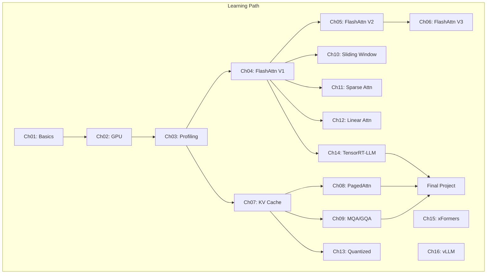

# Additional Documentation

## Architecture Diagrams

## GPU Architecture Reference

| GPU | Arch | Compute Capability | TFLOPS (FP16) | HBM |
|-----|------|-------------------|---------------|-----|
| A100 | Ampere | 8.0 | 312 | 80GB @ 2TB/s |
| H100 | Hopper | 9.0 | 990 | 80GB @ 3.35TB/s |
| RTX 4090 | Ada | 8.9 | 330 | 24GB @ 1TB/s |
| RTX 3090 | Ampere | 8.6 | 142 | 24GB @ 936GB/s |

## Key References

1. **FlashAttention**: https://arxiv.org/abs/2205.14135 (V1), https://arxiv.org/abs/2307.08691 (V2)
2. **vLLM**: https://arxiv.org/abs/2309.06180
3. **GQA**: https://arxiv.org/abs/2305.13245
4. **MQA**: https://arxiv.org/abs/1911.02150
5. **xFormers**: https://github.com/facebookresearch/xformers
6. **TensorRT-LLM**: https://github.com/NVIDIA/TensorRT-LLM
7. **Performer**: https://arxiv.org/abs/2009.14794

## Performance Checklist

For each chapter implementation, verify:
- [ ] Correctness vs PyTorch reference (max error < 1e-3)
- [ ] Latency reported in milliseconds
- [ ] GFLOPS / TFLOPS computed
- [ ] Memory bandwidth utilization estimated
- [ ] Profiling data captured (Nsight or torch.profiler)
- [ ] Roofline analysis done (AI computed)
