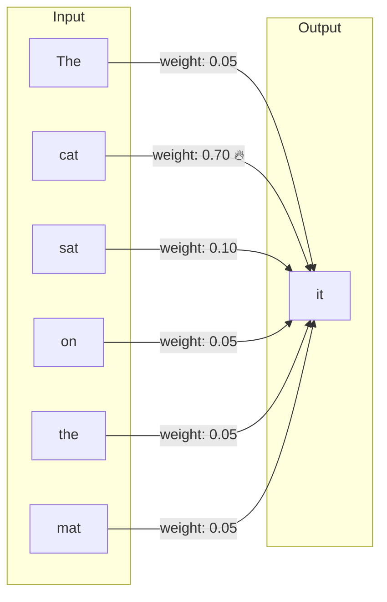
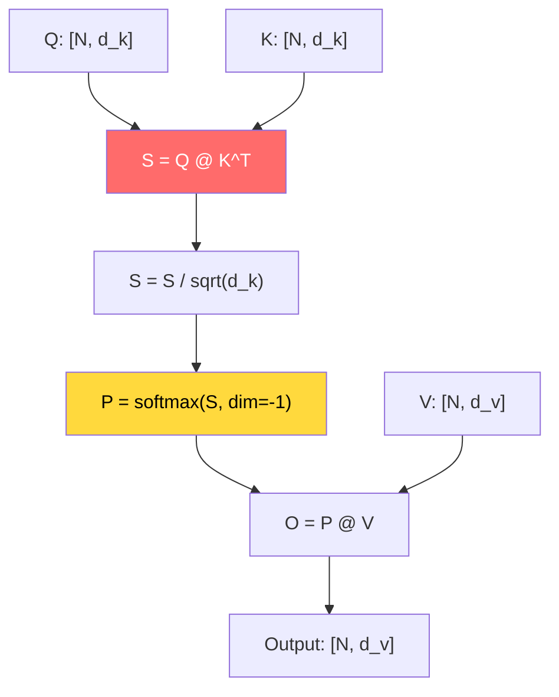
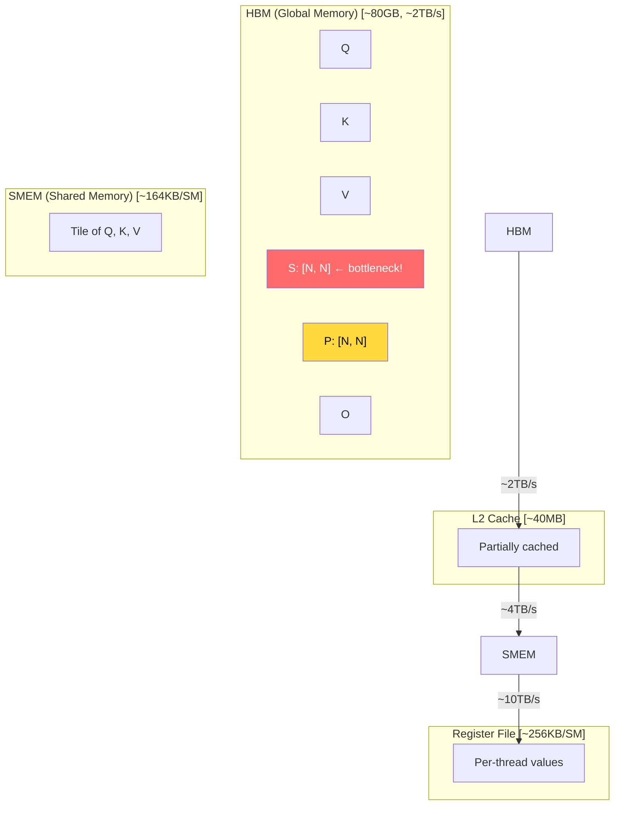
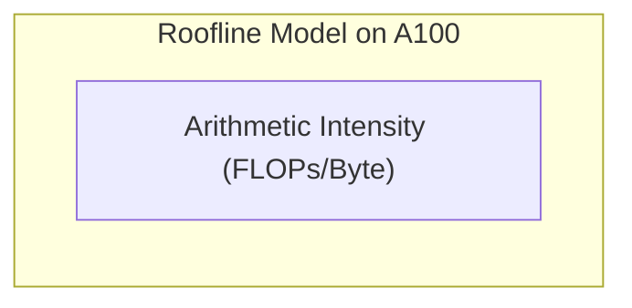
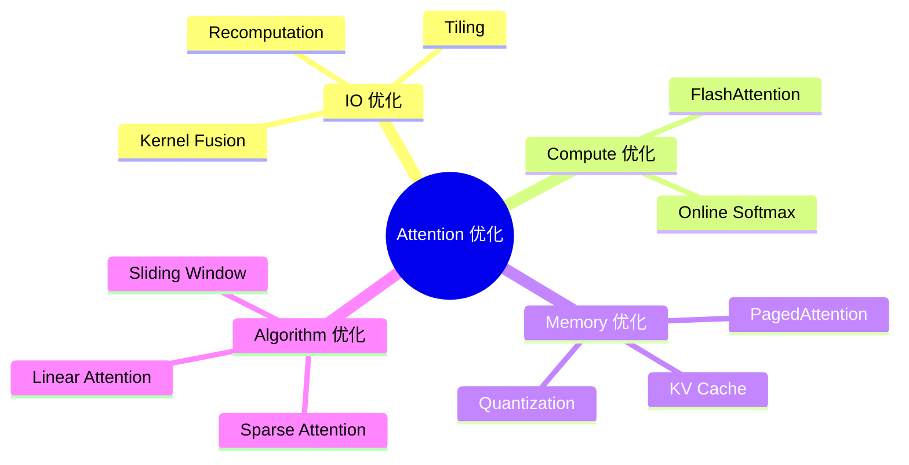

# Chapter 01: Attention 基础

## 1. 什么是 Attention？

### 1.1 直观理解

Attention 机制的核心思想是：**让模型学会"关注"输入中的重要部分**。

想象你在读一句话："The cat sat on the mat because it was tired."
- 当处理 "it" 这个词时，模型需要知道 "it" 指代的是 "cat" 还是 "mat"
- Attention 就是计算 "it" 与句中每个词的关联程度，发现它与 "cat" 最相关



### 1.2 数学定义：Scaled Dot-Product Attention

标准 Transformer 使用的 Attention 公式：

$$\text{Attention}(Q, K, V) = \text{softmax}\left(\frac{QK^T}{\sqrt{d_k}}\right)V$$

其中：
- **Q (Query)**: 查询矩阵，形状 `[batch, num_heads, seq_len, d_k]`
- **K (Key)**: 键矩阵，形状 `[batch, num_heads, seq_len, d_k]`
- **V (Value)**: 值矩阵，形状 `[batch, num_heads, seq_len, d_v]`
- **d_k**: 每个 head 的维度

### 1.3 为什么除以 $\sqrt{d_k}$？

$$\text{Var}(q \cdot k) = d_k$$

假设 q 和 k 的每个元素独立同分布，均值为 0，方差为 1：
- 点积 $q \cdot k = \sum_{i=1}^{d_k} q_i k_i$
- 方差：$\text{Var}(q \cdot k) = d_k$
- 标准差：$\sqrt{d_k}$

如果不缩放，当 $d_k$ 很大时（如 64 或 128），点积的方差会变得很大。
经过 softmax 后，梯度会非常小（**梯度消失**），模型无法训练。

除以 $\sqrt{d_k}$ 将方差缩回 1，保持梯度稳定。

## 2. 一步一步拆解 Attention 计算

### 2.1 计算流程图



### 2.2 伪代码

```
def attention(Q, K, V):
    d_k = Q.shape[-1]

    # Step 1: Compute attention scores
    S = Q @ K.T          # [N, N] ← O(N²) memory!

    # Step 2: Scale
    S = S / sqrt(d_k)

    # Step 3: Softmax (row-wise)
    P = softmax(S, dim=-1) # [N, N]

    # Step 4: Weighted sum
    O = P @ V             # [N, d_v]

    return O
```

## 3. 复杂度分析

### 3.1 时间复杂度

| 步骤 | 操作 | 复杂度 |
|------|------|--------|
| S = Q @ K^T | 矩阵乘法 | $O(N^2 \cdot d_k)$ |
| Softmax | 逐行归一化 | $O(N^2)$ |
| P @ V | 矩阵乘法 | $O(N^2 \cdot d_v)$ |
| **总计** | | **$O(N^2)$** |

当序列长度 N 很大时（如 N=8192, 32768），$N^2$ 会爆炸。

### 3.2 显存分析

浮点数计算：
- **S = QK^T**: 输出 `[N, N]`，需要 $N^2$ 个元素
- **P = softmax(S)**: 输出 `[N, N]`，需要 $N^2$ 个元素
- **总计峰值显存**: $2 \times N^2 \times \text{sizeof(float)}$

具体数字（以 FP16 为例，每个元素 2 bytes）：

| 序列长度 N | Attention Matrix | 显存占用 |
|-----------|-----------------|---------|
| 512 | 512 × 512 | 0.5 MB |
| 1024 | 1024 × 1024 | 2 MB |
| 2048 | 2048 × 2048 | 8 MB |
| 4096 | 4096 × 4096 | 32 MB |
| 8192 | 8192 × 8192 | 128 MB |
| 16384 | 16384 × 16384 | 512 MB |
| 32768 | 32768 × 32768 | 2 GB |

**问题**：单个 attention matrix 在 32K 序列长度下需要 2GB 显存，而训练时还需要存储梯度，显存会爆。

### 3.3 缓存分析

在 GPU 上做 Attention 的缓存层次：



**瓶颈**：
1. S 矩阵 `[N, N]` 必须写入 HBM，再读回做 softmax
2. P 矩阵 `[N, N]` 必须写入 HBM，再读回做 `P @ V`
3. HBM 带宽相对计算速度是瓶颈

这就是 **FlashAttention 要解决的核心问题**：避免将中间矩阵写回 HBM。

## 4. Roofline 分析

Roofline 模型帮助判断一个 kernel 是 **compute-bound** 还是 **memory-bound**。

### 4.1 计算强度

$$\text{Arithmetic Intensity} = \frac{\text{FLOPs}}{\text{Bytes Moved}}$$

对于 Naive Attention（N 为 seq_len，d 为 head_dim）：

- **FLOPs**：
  - QK^T：$2N^2 d$（乘加各一次）
  - Softmax：$3N^2$（exp + sum + normalize）
  - PV：$2N^2 d$
  - **总计** ≈ $4N^2 d$

- **Bytes Moved**（忽略 Q, K, V 加载，因为它们比 N² 小）：
  - 写 S：$N^2 \times 2$ bytes（FP16）
  - 读 S：$N^2 \times 2$
  - 写 P：$N^2 \times 2$
  - 读 P：$N^2 \times 2$
  - 写 O：$N d \times 2$（忽略，因为小）
  - **总计** ≈ $8N^2$ bytes（FP16）

$$\text{AI} = \frac{4N^2 d}{8N^2} = \frac{d}{2}$$

对于 $d = 128$：AI = 64 FLOPs/Byte

### 4.2 在 A100 上的位置

A100 理论峰值：
- 计算：312 TFLOPS（FP16 Tensor Core）
- HBM 带宽：2 TB/s

Roofline 转折点 = 312 TF / 2 TB = **156 FLOPs/Byte**



AI = 64 < 156 ⇒ Naive Attention 在 A100 上是 **memory-bound**！

这意味着：**瓶颈是内存带宽，不是计算能力。**

## 5. 工业界案例：为什么需要优化 Attention

### 5.1 实际模型中的 Attention

| 模型 | 最大 seq_len | $N^2$ 中间矩阵 |
|------|-------------|----------------|
| BERT | 512 | 0.25M 元素 ≈ 0.5 MB |
| GPT-3 | 2048 | 4M 元素 ≈ 8 MB |
| Llama 2 | 4096 | 16M 元素 ≈ 32 MB |
| GPT-4（传闻） | 32768 | 1B 元素 ≈ 2 GB |
| Claude 3 | 200K | 40B 元素 ≈ 80 GB |

长序列是趋势，N² 不可接受。

### 5.2 优化方向



## 6. 接下来

Chapter 02 会把这些计算搬到 GPU 上，解释：
- 矩阵乘法如何映射到 GPU 的 Thread Hierarchy
- Tensor Core 的本质
- Shared Memory 的作用
- 为什么 CPU 实现这么慢，GPU 实现快在哪里
