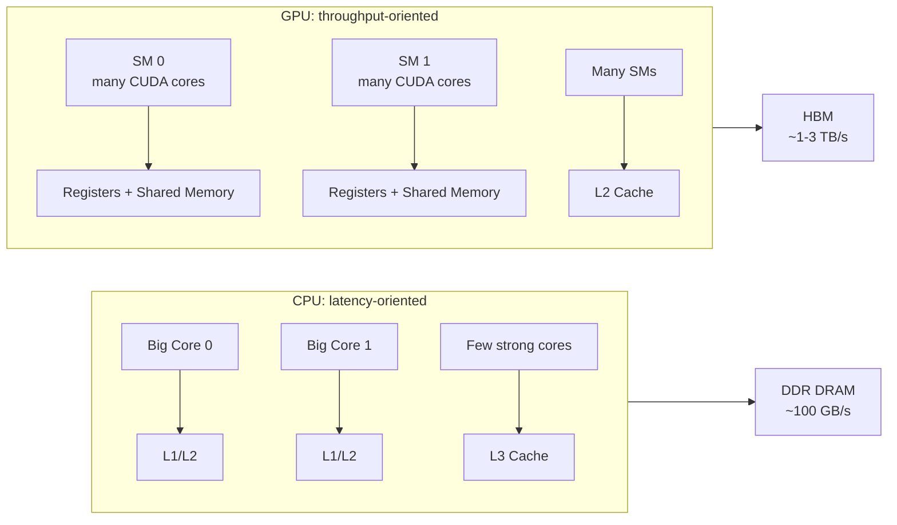
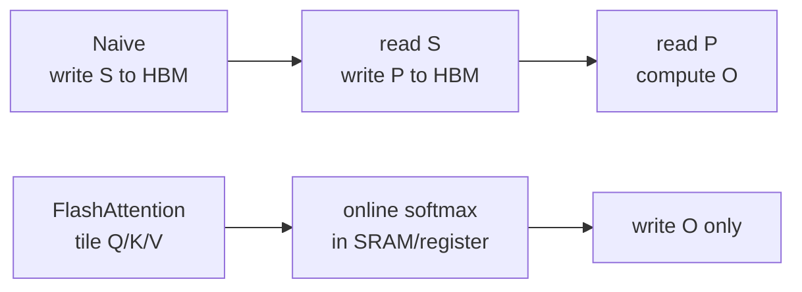

# Chapter 02: Attention 的 GPU 实现

本章目标：把 Chapter01 的 Scaled Dot-Product Attention 放到 GPU 上，理解 **GPU mapping**、**memory hierarchy**、**tiling**、**Roofline** 与 naive kernel 的真实瓶颈。工业实践里，写出能跑的 CUDA kernel 只是第一步；真正重要的是解释清楚每一次 HBM 访问、每个 block 的职责，以及为什么 FlashAttention 要做 kernel fusion。

## 1. 为什么 Attention 适合 GPU？

### 1.1 CPU vs GPU 的工程差异



Attention 的核心计算是：

$$
O = \mathrm{softmax}\left(\frac{QK^T}{\sqrt{d_k}}\right)V
$$

其中每个 query row 与所有 key row 的 dot product 可以并行，因此天然适合 GPU 的大规模线程并发。但适合并行不等于一定快：如果每个 thread 都重复从 HBM 读取相同的 K/V，kernel 会很快变成 **memory-bound**。

### 1.2 CUDA 线程层次与 Attention 映射

```mermaid
graph TD
    Grid[Grid: one kernel launch] --> B0[Block 0]
    Grid --> B1[Block 1]
    B0 --> W0[Warp 0: 32 threads]
    B0 --> W1[Warp 1: 32 threads]
    W0 --> T0[Thread: compute one O[row,col]]
```

| CUDA 层级 | 工业视角 | 同步 | 常见 Attention 映射 |
|---|---|---|---|
| Thread | 最小执行单元，持有 registers | 无显式同步 | 一个 output element 或局部 partial sum |
| Warp | 32 threads SIMT 执行 | warp 内隐式同步 | 一行 softmax、一个 tile 的 reduction |
| Block | 可共享 shared memory | `__syncthreads()` | 一个 query block 或一个 Q/K tile |
| Grid | 全 kernel 的 block 集合 | kernel 结束后同步 | 一个 batch/head 或完整矩阵 |

Chapter02 的 naive kernel 采用最直接的映射：一个 thread 计算一个 `O[row, col]`。这非常利于教学，但不是生产实现，因为它让同一行 softmax 被不同 `col` 的 thread 重复计算。

## 2. Attention 的计算与复杂度

### 2.1 三个阶段

```text
Q: [N, d_k], K: [N, d_k], V: [N, d_v]
S = QK^T / sqrt(d_k)       -> [N, N]
P = softmax(S, dim=row)    -> [N, N]
O = PV                     -> [N, d_v]
```

FLOPs 近似为：

$$
\mathrm{FLOPs}_{QK^T} \approx 2N^2d_k
$$

$$
\mathrm{FLOPs}_{PV} \approx 2N^2d_v
$$

$$
\mathrm{FLOPs}_{softmax} \approx O(N^2)
$$

当 `d_k = d_v = d` 时：

$$
\mathrm{FLOPs}_{attention} \approx 4N^2d + O(N^2)
$$

### 2.2 显存占用分析

如果显式 materialize `S` 和 `P`，训练/推理中的单 head 激活显存约为：

$$
\mathrm{Memory}_{explicit} = (Q + K + V + O) + (S + P)
$$

FP32 下：

$$
\mathrm{Bytes} \approx 4(2Nd_k + 2Nd_v + 2N^2)
$$

其中 `2N^2` 来自 `S` 和 `P`。当 `N` 增大时，`N^2` 项会迅速主导显存。例如 `N=4096` 时，单个 `[N,N]` FP32 矩阵约 64 MB，`S + P` 就约 128 MB；多 batch、多 head 后显存压力会线性放大。

FlashAttention 的关键不是减少数学复杂度，而是避免把 `S/P` 完整写回 HBM：



## 3. Naive GPU Kernel 设计

### 3.1 Global-memory naive kernel

`src/chapter_02/cuda_naive_attention.cu` 中的 `naive_attention_kernel`：

```text
block = (16, 16)
grid  = (ceil(d_v/16), ceil(N/16))
thread(row, col) -> O[row, col]
```

每个 thread 做三轮遍历：

1. 遍历所有 K，计算 `max_score`，保证 softmax numerical stability。
2. 再遍历所有 K，计算 `sum_exp`。
3. 第三次遍历所有 K，并读取 V，得到 `O[row,col]`。

伪代码：

```text
for output O[row, col]:
  max_score = max_j dot(Q[row], K[j]) / sqrt(d_k)
  sum_exp   = sum_j exp(score_j - max_score)
  O[row,col] = sum_j exp(score_j - max_score) / sum_exp * V[j,col]
```

工程问题：同一个 `row` 的不同 `col` thread 会重复计算完全相同的 softmax，导致 `QK^T` 被重复做 `d_v` 次。这是教学 kernel 的核心缺陷。

### 3.2 Shared-memory 教学版本

`naive_attention_smem_kernel` 把 K/V 按 `SMEM_TILE_K=64` 分块载入 shared memory：

```mermaid
graph TD
    HBMK[K/V in HBM] --> Tile[Load K/V tile to Shared Memory]
    Tile --> Dot[Threads compute dot products]
    Dot --> Softmax[Max/Sum/Weighted Sum]
    Softmax --> O[Write O[row,col]]
```

它展示了 **tiling** 的基本形态：用 shared memory 降低一部分 global load 延迟。但它仍然不是生产级 attention，因为：

- softmax 仍按 output column 重复计算；
- `QK^T` 在 max、sum、weighted sum 三个 phase 中重复计算；
- block 只处理一个 query row，无法充分复用同一 tile 的 Q/K/V；
- 没有使用 Tensor Core，也没有 warp-level reduction 优化。

## 4. Roofline 分析

Roofline 用两个量判断 kernel 瓶颈：

$$
\mathrm{Arithmetic\ Intensity} = \frac{\mathrm{FLOPs}}{\mathrm{Bytes\ moved}}
$$

$$
\mathrm{Attainable\ Performance} = \min(\mathrm{Peak\ FLOPs},\ \mathrm{Bandwidth} \times \mathrm{AI})
$$

对于显式 attention，理想情况下每个矩阵块被高效复用，AI 近似随 `d` 增大。但 Chapter02 naive kernel 中，每个 `O[row,col]` thread 都独立读取 K，K 的读取被 `d_v` 和多个 phase 放大。实际表现会落在低 AI 区间，接近 memory-bound。

| 实现 | 中间矩阵 | K/V 复用 | AI 趋势 | 主要瓶颈 |
|---|---:|---:|---:|---|
| CPU baseline | 显式/隐式均可 | cache 复用有限 | 低到中 | SIMD/cache locality |
| Naive GPU global | 不显式 S/P，但重复算 | 很差 | 低 | HBM bandwidth + redundant compute |
| Naive GPU smem | K/V tile 局部复用 | 略好 | 低到中 | 重复 softmax + occupancy 限制 |
| FlashAttention | 不写 S/P | tile 级复用 | 中到高 | tile shape / Tensor Core / occupancy |

一个工业判断方式：如果 Nsight Compute 里看到 `dram__throughput` 高、`sm__throughput` 低，且 warp stall 主要是 memory dependency，说明 kernel 还没有把数据搬运转化成足够多的计算。

## 5. Benchmark 指标如何读

Chapter02 benchmark 输出：

- `Time(ms)`: 单次 kernel 平均延迟，端到端调优首先看它。
- `BW(GB/s)`: 根据理论 bytes 估算的 effective bandwidth，不等于真实 HBM 事务数。
- `TFLOPS`: 根据 attention 数学 FLOPs 估算的 effective throughput。

建议配合 Nsight：

```bash
ncu --set full ./chapters/naive_attention_gpu
```

重点观察：

| 指标 | 含义 | 调优动作 |
|---|---|---|
| Achieved Occupancy | SM 上 active warp 比例 | 调整 block size、register、smem |
| DRAM Throughput | HBM 带宽使用率 | 做 tiling/fusion，减少重复读写 |
| SM Throughput | 计算单元利用率 | 使用 Tensor Core 或提升 reuse |
| Warp Stall Reasons | warp 等待原因 | 定位 memory、sync、dependency 瓶颈 |

## 6. 工程实践建议

1. 先写 CPU reference，再写 GPU kernel。小 shape 上必须 bit/close match，避免 benchmark 一个错误 kernel。
2. benchmark 不只看平均 latency，还要固定 warmup、iters、shape、dtype、GPU clock 状态。
3. 对 attention kernel，必须同时报告 `N, d_k, d_v, dtype, causal/non-causal, batch, heads`，否则数据不可复现。
4. 不要只优化单个 `N`。生产模型里 prefill 和 decode 的 shape 完全不同，prefill 更像 GEMM，decode 更受 KV cache bandwidth 影响。
5. shared memory 不是免费优化。tile 过大会降低 occupancy，tile 过小又无法摊薄 HBM 访问。

## 7. 本章代码结构

```text
src/chapter_02/
├── CMakeLists.txt
├── README.md
├── cuda_naive_attention.cu   # global + shared-memory kernels, benchmark main
└── unit_test.cu              # CPU reference vs GPU correctness tests
```

运行方式：

```bash
mkdir -p build
cd build
cmake .. -DCMAKE_CUDA_ARCHITECTURES=80
cmake --build . --target naive_attention_gpu chapter_02_unit_test -j
./chapters/chapter_02_unit_test
./chapters/naive_attention_gpu
```

## 8. 从 Chapter02 到 FlashAttention

```mermaid
graph TD
    N0[Naive GPU<br/>one thread computes O[row,col]] --> N1[Shared Memory Tiling<br/>cache K/V tile]
    N1 --> N2[Block-level Softmax<br/>avoid per-column duplicate softmax]
    N2 --> N3[Kernel Fusion<br/>do not materialize S/P]
    N3 --> FA[FlashAttention<br/>Online Softmax + SRAM Tiling]
    FA --> FA2[FlashAttention-2<br/>better work partition]
    FA2 --> FA3[FlashAttention-3<br/>Hopper TMA + WGMMA]
```

本章的结论：GPU attention 的核心矛盾不是“会不会并行”，而是 **how much useful computation each HBM byte buys**。FlashAttention 正是围绕这个问题重新组织计算图。
