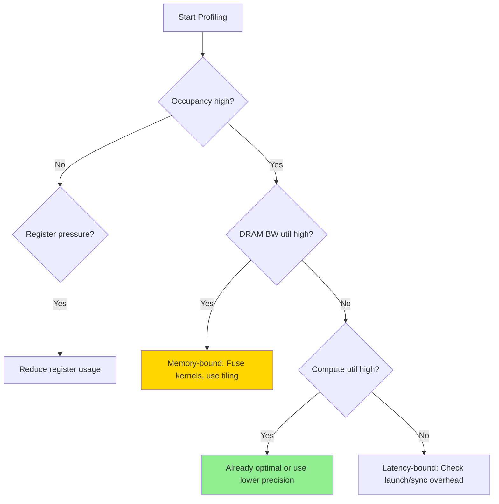
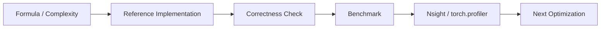

# Chapter 03: Attention Profiling

## 1. 为什么要 Profiling？

> "You can't optimize what you can't measure."

GPU 性能调优的第一步是**准确测量**，而不是凭直觉优化。

### 1.1 Profiling 回答的核心问题

| 问题 | 工具 | 输出 |
|------|------|------|
| Kernel 执行时间 | `cudaEvent` / `torch.cuda.Event` | Latency (ms) |
| 内存带宽利用率 | Nsight Compute | % of peak BW |
| 计算利用率 | Nsight Compute | % of peak FLOPS |
| Occupancy（活跃线程比例） | Nsight Compute | % |
| 共享内存使用 | Nsight Compute | Bytes/Block |
| Host-Device 同步 | Nsight Systems | Timeline |

### 1.2 工具对比

| 工具 | 用途 | 粒度 | 输出 |
|------|------|------|------|
| `torch.profiler` | PyTorch 代码 profiling | Operator 级 | Trace JSON |
| `nvtx` | 代码标注 | 自定义范围 | Nsight 带标签 |
| Nsight Systems | 系统级 Timeline | Kernel/Memcpy/API | `.nsys-rep` |
| Nsight Compute | Kernel 级分析 | 指令级 | `.ncu-rep` |

## 2. 指标详解

### 2.1 Occupancy

$$\text{Occupancy} = \frac{\text{Active Warps per SM}}{\text{Maximum Warps per SM}} \times 100\%$$

A100 每个 SM 最多 64 个 Warp。

**Occupancy 低的原因**：
1. **寄存器压力**：每个 thread 用了太多寄存器 → SM 装不下足够多 block
2. **共享内存不足**：每个 block 用了太多 SMEM → SM 装不下足够多 block
3. **Grid 太小**：总 thread 不足以填满所有 SM

**Occupancy 高 ≠ 性能高**！内存绑定的 kernel 可能 Occupancy 低但仍然性能好。

### 2.2 Memory Throughput

$$\text{DRAM Utilization} = \frac{\text{Actual DRAM Throughput}}{\text{Peak DRAM Throughput}}$$

A100 峰值 HBM 带宽：**2039 GB/s** (80GB) 或 **1555 GB/s** (40GB)。

### 2.3 Roofline 模型

AI < Ridge Point → Memory Bound
AI > Ridge Point → Compute Bound

A100 Ridge Point = 312 TFLOPS / 2 TB/s = 156 FLOPs/Byte

## 3. 常用命令

```bash
# Nsight Systems
nsys profile -o profile_output python script.py

# Nsight Compute
ncu --set full --kernel-name naive_attention_kernel ./binary

# PyTorch Profiler
from torch.profiler import profile, ProfilerActivity
with profile(activities=[ProfilerActivity.CUDA]) as prof:
    output = attention(Q, K, V)
```

## 4. 瓶颈识别流程



---

## Profiling 工业增强

本章新增 profiling checklist、Roofline 解释、Nsight 指标解读和 `profiling_benchmark` CUDA microbenchmark。

### 1. 工业视角

优化 attention 不能只看 Big-O。生产环境必须同时记录：`shape`、`dtype`、`batch`、`heads`、`seq_len`、`head_dim`、`causal`、warmup/iters、GPU 型号和 profiler 版本。对于推理系统，还要区分 **prefill** 与 **decode**，因为两者的瓶颈完全不同。

### 2. 复杂度与显存公式

标准 attention 的主要计算量：

$$\mathrm{FLOPs} \approx 2N^2d_k + 2N^2d_v + O(N^2)$$

显式保存 `S` 和 `P` 的中间显存：

$$\mathrm{Bytes}_{S+P} = 2N^2 \times \mathrm{sizeof(dtype)}$$

Roofline 判断：

$$\mathrm{AI}=\frac{\mathrm{FLOPs}}{\mathrm{Bytes\ moved}},\quad
\mathrm{Perf} \le \min(\mathrm{PeakFLOPS},\mathrm{PeakBW}\times\mathrm{AI})$$

### 3. 工程检查清单

| 检查项 | 要求 |
|---|---|
| Correctness | 小 shape 与 CPU/PyTorch reference 对齐。 |
| Benchmark | 固定 warmup、iters、shape、dtype，输出 latency 和吞吐。 |
| Memory | 说明 HBM 读写、中间 tensor、KV cache 或 block table 成本。 |
| Profiling | 至少记录 occupancy、DRAM throughput、SM throughput、stall reason。 |
| Reproducibility | README 中给出构建、运行、profiling 命令。 |

### 4. 本章实现入口

```bash
mkdir -p build
cd build
cmake .. -DCMAKE_CUDA_ARCHITECTURES=80
cmake --build . --target profiling_benchmark -j
./chapters/profiling_benchmark
```

### 5. 示意图


