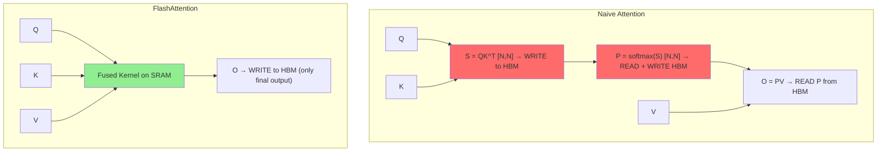
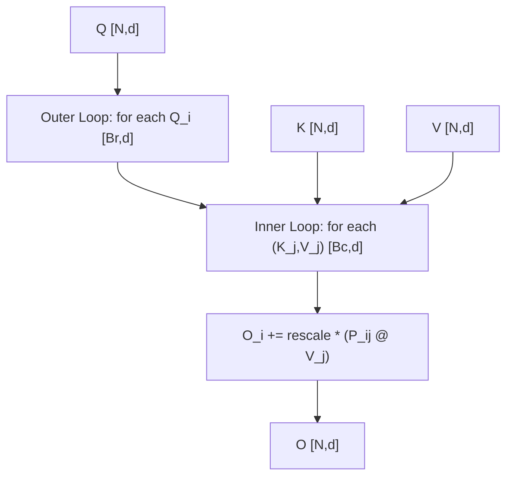
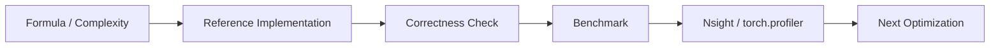

# Chapter 04: FlashAttention V1

## 1. 核心问题

Naive Attention 的最大瓶颈：$N \times N$ 的中间矩阵（S 和 P）必须写回 HBM。

FlashAttention 的核心洞察：**不要把这个矩阵写回 HBM，在片上完成所有计算。**

### 1.1 问题可视化



**效果**：将 HBM 读写从 $O(N^2)$ 降到 $O(N)$。

## 2. 关键技术：Online Softmax

### 2.1 标准 Softmax 的问题

标准 softmax 需要两次遍历：

```python
m = max(x)               # Pass 1: find max
exp_x = [exp(xi - m)]    # Pass 2: exp + sum
sum_exp = sum(exp_x)
softmax_x = [e / sum_exp]
```

在 Attention 中，这意味着必须把 S 矩阵所有元素都算出来。

### 2.2 Online Softmax 算法

在一次遍历中完成：

```
Initialize: m = -inf, l = 0

For each x_i:
    m_new = max(m, x_i)
    l_new = l * exp(m - m_new) + exp(x_i - m_new)
    m = m_new, l = l_new

Result: softmax(x_i) = exp(x_i - m) / l
```

**关键推导**（当 $x_{k+1} > m_k$ 时）：

$$l_{k+1} = l_k \cdot \exp(m_k - m_{k+1}) + \exp(x_{k+1} - m_{k+1})$$

只需用 $\exp(m_k - m_{k+1})$ 缩放旧值！

## 3. Tiling 策略

### 3.1 整体架构



### 3.2 算法伪代码

```
For i = 1 to Tr:                        # Outer loop (Q blocks)
    Load Q_i [Br, d] to SMEM
    O_i = 0, m_i = -inf, l_i = 0

    For j = 1 to Tc:                    # Inner loop (KV blocks)
        Load K_j [Bc, d], V_j [Bc, d] to SMEM
        S_ij = Q_i @ K_j^T             # [Br, Bc]

        m_new = max(m_i, rowmax(S_ij))  # Online softmax update
        P_ij = exp(S_ij - m_new)

        l_new = l_i * exp(m_i - m_new) + rowsum(P_ij)
        O_i = O_i * exp(m_i - m_new) + P_ij @ V_j

        m_i = m_new, l_i = l_new

    O_i = O_i / l_i                     # Final normalization
    Write O_i to HBM
```

## 4. 内存访问对比

| 操作 | Naive | FlashAttention V1 |
|------|-------|-------------------|
| 写 S [N,N] to HBM | $O(N^2)$ | **0** |
| 读 S from HBM | $O(N^2)$ | **0** |
| 写 P [N,N] to HBM | $O(N^2)$ | **0** |
| 读 P from HBM | $O(N^2)$ | **0** |
| K/V 重读 | - | $O(Nd \cdot T_r)$ |
| **净节省** | - | $O(N^2)$ vs $O(Nd \cdot T_r)$ |

当 $N \gg d$ 时，$O(N^2) \gg O(Nd \cdot T_r)$，例如 N=4096, d=64, B_r=128：
- Naive: ≈ 67M 元素
- FlashAttention: ≈ 16.8M 元素
- **减少约 75%**

## 5. Roofline 分析

FlashAttention V1 的 Arithmetic Intensity ≈ $2B_r$

取 $B_r = 128$：AI ≈ 256 > 156（A100 Ridge Point）

→ **compute-bound**！成功将 Attention 从 memory-bound 变成了 compute-bound。

## 6. 实现步骤

1. **Step 1**: Tiled Matrix Multiply（Q_tile @ K_tile^T in SMEM）
2. **Step 2**: Online Softmax in Shared Memory
3. **Step 3**: 合并 Tiling + Online Softmax → FlashAttention V1
4. **Step 4**: 验证正确性 + 性能对比

---

## FlashAttention V1 工业增强

补充 online softmax 推导、HBM IO 分析、tile 数据流和教学 kernel 的边界。

### 1. 工业视角

优化 attention 不能只看 Big-O。生产环境必须同时记录：`shape`、`dtype`、`batch`、`heads`、`seq_len`、`head_dim`、`causal`、warmup/iters、GPU 型号和 profiler 版本。对于推理系统，还要区分 **prefill** 与 **decode**，因为两者的瓶颈完全不同。

### 2. 复杂度与显存公式

标准 attention 的主要计算量：

$$\mathrm{FLOPs} \approx 2N^2d_k + 2N^2d_v + O(N^2)$$

显式保存 `S` 和 `P` 的中间显存：

$$\mathrm{Bytes}_{S+P} = 2N^2 \times \mathrm{sizeof(dtype)}$$

Roofline 判断：

$$\mathrm{AI}=\frac{\mathrm{FLOPs}}{\mathrm{Bytes\ moved}},\quad
\mathrm{Perf} \le \min(\mathrm{PeakFLOPS},\mathrm{PeakBW}\times\mathrm{AI})$$

### 3. 工程检查清单

| 检查项 | 要求 |
|---|---|
| Correctness | 小 shape 与 CPU/PyTorch reference 对齐。 |
| Benchmark | 固定 warmup、iters、shape、dtype，输出 latency 和吞吐。 |
| Memory | 说明 HBM 读写、中间 tensor、KV cache 或 block table 成本。 |
| Profiling | 至少记录 occupancy、DRAM throughput、SM throughput、stall reason。 |
| Reproducibility | README 中给出构建、运行、profiling 命令。 |

### 4. 本章实现入口

```bash
mkdir -p build
cd build
cmake .. -DCMAKE_CUDA_ARCHITECTURES=80
cmake --build . --target flash_attention_v1 -j
./chapters/flash_attention_v1
```

### 5. 示意图


