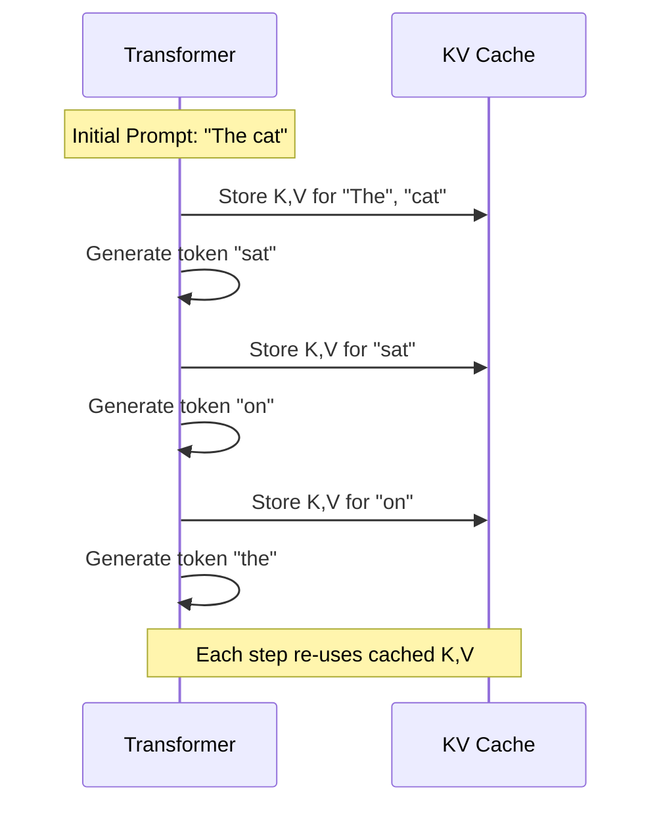
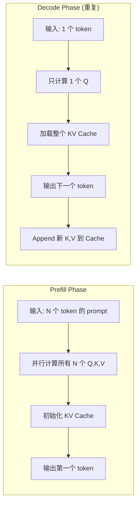
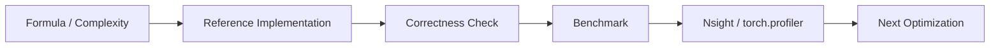

# Chapter 07: KV Cache

## 1. 自回归推理的背景

### 1.1 逐个 Token 生成



**关键问题**：每生成一个新 token，都需要计算它对**所有之前 token** 的 Attention。

如果不缓存，每个 step 都要重新计算所有 token 的 Q、K、V → $O(L^2)$ 的灾难。

### 1.2 解决方案：KV Cache

$$K_{\text{cache}} = \text{concat}(K_1, K_2, ..., K_t)$$
$$V_{\text{cache}} = \text{concat}(V_1, V_2, ..., V_t)$$

每个 decoding step 只需要：
1. 计算当前 token 的 Q（1 个 token）
2. 计算 Attention: $O_{\text{new}} = \text{Attention}(Q_{\text{new}}, K_{\text{cache}}, V_{\text{cache}})$
3. 将新 K、V append 到 cache

**复杂度**：从 $O(L^2)$ 降到 $O(L)$ per step。

## 2. Prefill vs Decode

### 2.1 两个阶段



### 2.2 瓶颈分析

| 阶段 | 瓶颈 | 原因 |
|------|------|------|
| Prefill | **Compute-bound** | N 大，大量并行矩阵乘法 |
| Decode | **Memory-bound** | 每次从 HBM 读取完整 KV Cache |

Decode 阶段：每个 token 需要读取 `2 × L × d × num_layers × sizeof(FP16)` bytes。

例如 Llama-7B（32 layers, d=4096, L=4096）：
- 单层 KV Cache: $2 \times 4096 \times 4096 \times 2 = 67\text{MB}$
- 32 层: $2.1\text{GB}$
- 每个 decode step 要读取 **2.1GB** 数据！

## 3. KV Cache 实现

### 3.1 数据结构

```cpp
struct KVCache {
    float* k_cache;  // [max_seq_len, num_kv_heads, head_dim]
    float* v_cache;  // [max_seq_len, num_kv_heads, head_dim]
    int cur_len;     // current number of cached tokens

    void append(const float* new_k, const float* new_v, int num_tokens);
    void clear();
};
```

### 3.2 Appending 操作

```cuda
__global__ void kv_cache_append_kernel(
    float* k_cache,         // [max_len, n_heads, d_head]
    const float* new_k,     // [n_tokens, n_heads, d_head]
    int cur_len, int n_tokens, int n_heads, int d_head)
{
    int idx = blockIdx.x * blockDim.x + threadIdx.x;
    int total = n_tokens * n_heads * d_head;
    if (idx >= total) return;

    int dst_idx = (cur_len * n_heads * d_head) + idx;
    k_cache[dst_idx] = new_k[idx];
}
```

### 3.3 带 KV Cache 的 Attention

```cuda
__global__ void attention_with_kv_cache(
    const float* Q_new,         // [1, n_heads, d]
    const float* K_cache,       // [cache_len, n_heads, d]
    const float* V_cache,       // [cache_len, n_heads, d]
    float* O,                   // [1, n_heads, d]
    int cache_len, int n_heads, int d)
{
    // Similar to FlashAttention but:
    // - Q is just 1 token × n_heads
    // - K and V are the full cache
    // - This is the decode bottleneck - O(cache_len × d) HBM reads
}
```

## 4. 显存分析

### 4.1 KV Cache 大小公式

$$\text{KV Cache Size} = 2 \times \text{num\_layers} \times \text{num\_kv\_heads} \times \text{seq\_len} \times d_{\text{head}} \times \text{sizeof}(FP16)$$

### 4.2 具体数字

| 模型 | Layers | d_head | Max seq | KV Cache (FP16) |
|------|--------|--------|---------|-----------------|
| Llama-7B | 32 | 128 | 4096 | 2.1 GB |
| Llama-13B | 40 | 128 | 4096 | 2.6 GB |
| Llama-70B | 80 | 128 | 4096 | 5.3 GB |
| Llama-70B | 80 | 128 | 32768 | 42 GB! |

一个 80GB A100 用于服务 Llama-70B 时，KV Cache 占了一半以上！

## 5. 优化方向

| 优化 | 方法 | 效果 |
|------|------|------|
| GQA/MQA | 减少 KV head 数 | 减少 KV Cache 大小 |
| PagedAttention | 分页管理 | 减少显存碎片 |
| KV Cache 量化 | INT8/INT4 存储 | 减少 2-4× 显存 |
| Multi-Query | 共享 K,V | Llama 系列使用 |
| Sliding Window | 限制窗口 | Mistral 使用 |

## 6. 源码实现指南

`kv_cache.cpp` 和 `kv_cache.py` 会实现：
1. 基础 KV Cache 数据结构和 append 操作
2. 带 KV Cache 的 Attention 前向传播
3. Prefill / Decode 两个阶段的 latency 对比
4. 显存使用分析

---

## KV Cache 工业增强

补充 prefill/decode 区分、KV cache bytes 公式和 decode bandwidth 瓶颈。

### 1. 工业视角

优化 attention 不能只看 Big-O。生产环境必须同时记录：`shape`、`dtype`、`batch`、`heads`、`seq_len`、`head_dim`、`causal`、warmup/iters、GPU 型号和 profiler 版本。对于推理系统，还要区分 **prefill** 与 **decode**，因为两者的瓶颈完全不同。

### 2. 复杂度与显存公式

标准 attention 的主要计算量：

$$\mathrm{FLOPs} \approx 2N^2d_k + 2N^2d_v + O(N^2)$$

显式保存 `S` 和 `P` 的中间显存：

$$\mathrm{Bytes}_{S+P} = 2N^2 \times \mathrm{sizeof(dtype)}$$

Roofline 判断：

$$\mathrm{AI}=\frac{\mathrm{FLOPs}}{\mathrm{Bytes\ moved}},\quad
\mathrm{Perf} \le \min(\mathrm{PeakFLOPS},\mathrm{PeakBW}\times\mathrm{AI})$$

### 3. 工程检查清单

| 检查项 | 要求 |
|---|---|
| Correctness | 小 shape 与 CPU/PyTorch reference 对齐。 |
| Benchmark | 固定 warmup、iters、shape、dtype，输出 latency 和吞吐。 |
| Memory | 说明 HBM 读写、中间 tensor、KV cache 或 block table 成本。 |
| Profiling | 至少记录 occupancy、DRAM throughput、SM throughput、stall reason。 |
| Reproducibility | README 中给出构建、运行、profiling 命令。 |

### 4. 本章实现入口

```bash
mkdir -p build
cd build
cmake .. -DCMAKE_CUDA_ARCHITECTURES=80
cmake --build . --target kv_cache -j
./chapters/kv_cache
```

### 5. 示意图


