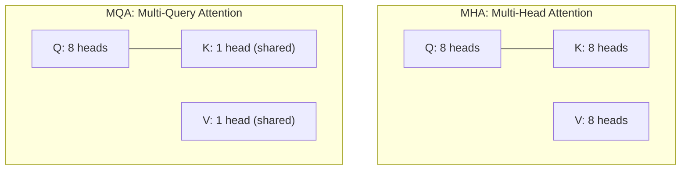
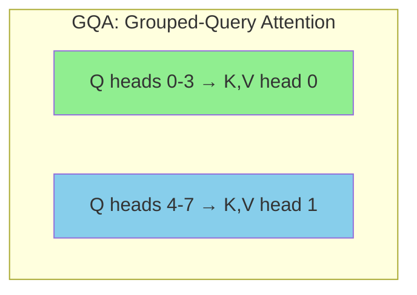
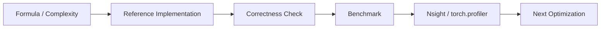

# Chapter 09: MQA / GQA

## 1. 问题背景

### 1.1 Multi-Head Attention (MHA) 的代价

标准 MHA 中，每个 head 有独立的 K 和 V：

$$\text{KV Cache Size} = 2 \times n_{\text{layers}} \times n_{\text{heads}} \times \text{seq\_len} \times d_{\text{head}}$$

对于 Llama-70B（80 layers, 64 KV heads, d_head=128）：
- 单 token 的 KV Cache: $80 \times 2 \times 64 \times 128 \times 2 = 2.5\text{MB/token}$
- 4096 tokens: **10GB** 仅用于 KV Cache！

### 1.2 关键洞察

Attention 的能力主要来自**多个 Query head** 学习不同的关注模式，而 K 和 V 多个 head 的冗余度很高。

## 2. Multi-Query Attention (MQA)



**MQA**: 所有 Q head 共享同一组 K 和 V。

**KV Cache 减少**: $n_{\text{heads}}$ 倍！例如 64 heads → 减少 64×。

**代价**: 模型质量轻微下降（通常在可接受范围内）。

## 3. Grouped-Query Attention (GQA)



**GQA**: 将 Q heads 分成 G 组，每组共享一组 K 和 V。

| 变体 | Q heads | KV heads | KV Cache 大小 |
|------|---------|----------|--------------|
| MHA | 32 | 32 | 1× |
| GQA (G=4) | 32 | 8 | **0.25×** |
| GQA (G=8) | 32 | 4 | **0.125×** |
| MQA | 32 | 1 | **0.031×** |

**GQA 是 MHA 和 MQA 之间的平衡**：
- 比 MHA 大幅减少显存
- 比 MQA 保留更多表达能力

### 3.1 Llama 系列的选择

| 模型 | Q heads | KV heads | 类型 |
|------|---------|----------|------|
| Llama 1 | 32 | 32 | MHA |
| Llama 2 7B | 32 | 32 | MHA |
| Llama 2 70B | 64 | 8 | GQA (G=8) |
| Llama 3 8B | 32 | 8 | GQA (G=4) |
| Llama 3 70B | 64 | 8 | GQA (G=8) |

大模型用 GQA，小模型保持 MHA（因为小模型 KV Cache 不是瓶颈）。

## 4. GQA 的 Attention 计算

### 4.1 算法

```
For each Q head h:
    # Map Q head to its KV group
    kv_head = h // (n_q_heads / n_kv_heads)   # Integer division

    # Standard attention, but K and V come from the shared group
    S_h = Q[h] @ K[kv_head]^T / sqrt(d)
    P_h = softmax(S_h)
    O_h = P_h @ V[kv_head]
```

### 4.2 实现要点

```cuda
// GQA kernel: Q has n_q_heads, K/V have n_kv_heads
// Each Q head knows which KV group it belongs to
__global__ void gqa_attention_kernel(
    const float* Q,  // [batch, n_q_heads, seq, d]
    const float* K,  // [batch, n_kv_heads, seq, d]
    const float* V,  // [batch, n_kv_heads, seq, d]
    float* O         // [batch, n_q_heads, seq, d]
) {
    int q_head = blockIdx.y % n_q_heads;
    int kv_head = q_head * n_kv_heads / n_q_heads;  // Group mapping

    // Load shared K,V for this group
    // Standard attention compute...
}
```

### 4.3 Repeat/Interleave 模式

K 和 V 从 `[n_kv_heads, d]` 扩展到 `[n_q_heads, d]` 有两种方式：

1. **Repeat**: `[K0, K0, K0, K0, K1, K1, K1, K1, ...]`
   - 每组 4 个 Q head 连续

2. **Interleave**: `[K0, K1, K2, K3, K0, K1, K2, K3, ...]`
   - Q heads 交错对应 KV heads

Llama 使用 **Repeat** 模式（每组连续）。

## 5. 性能影响

| 指标 | MHA | GQA (G=8) | MQA |
|------|-----|-----------|-----|
| KV Cache (70B, 4K) | 10 GB | **1.25 GB** | 0.16 GB |
| Decode bandwidth | 100% | **12.5%** | 1.6% |
| 推理吞吐量 | 1× | **~3×** | ~5× |
| 模型质量 | Best | Very close | Slight degradation |

GQA 是当前推理优化的**最佳实践** -- LLama 3, Mistral, Gemma 都使用它。

## 6. 源码实现

`mqa.cpp` 和 `gqa.cpp` 将实现：
1. MQA/GQA 的乘法规则
2. KV head 到 Q head 的映射
3. 与标准 MHA 的 Benchmark 对比
4. 显存节省分析

---

## MQA/GQA 工业增强

补充 KV head 映射公式、KV cache reduction 计算和 MQA/GQA demo。

### 1. 工业视角

优化 attention 不能只看 Big-O。生产环境必须同时记录：`shape`、`dtype`、`batch`、`heads`、`seq_len`、`head_dim`、`causal`、warmup/iters、GPU 型号和 profiler 版本。对于推理系统，还要区分 **prefill** 与 **decode**，因为两者的瓶颈完全不同。

### 2. 复杂度与显存公式

标准 attention 的主要计算量：

$$\mathrm{FLOPs} \approx 2N^2d_k + 2N^2d_v + O(N^2)$$

显式保存 `S` 和 `P` 的中间显存：

$$\mathrm{Bytes}_{S+P} = 2N^2 \times \mathrm{sizeof(dtype)}$$

Roofline 判断：

$$\mathrm{AI}=\frac{\mathrm{FLOPs}}{\mathrm{Bytes\ moved}},\quad
\mathrm{Perf} \le \min(\mathrm{PeakFLOPS},\mathrm{PeakBW}\times\mathrm{AI})$$

### 3. 工程检查清单

| 检查项 | 要求 |
|---|---|
| Correctness | 小 shape 与 CPU/PyTorch reference 对齐。 |
| Benchmark | 固定 warmup、iters、shape、dtype，输出 latency 和吞吐。 |
| Memory | 说明 HBM 读写、中间 tensor、KV cache 或 block table 成本。 |
| Profiling | 至少记录 occupancy、DRAM throughput、SM throughput、stall reason。 |
| Reproducibility | README 中给出构建、运行、profiling 命令。 |

### 4. 本章实现入口

```bash
mkdir -p build
cd build
cmake .. -DCMAKE_CUDA_ARCHITECTURES=80
cmake --build . --target mqa gqa -j
./chapters/mqa
./chapters/gqa
```

### 5. 示意图


