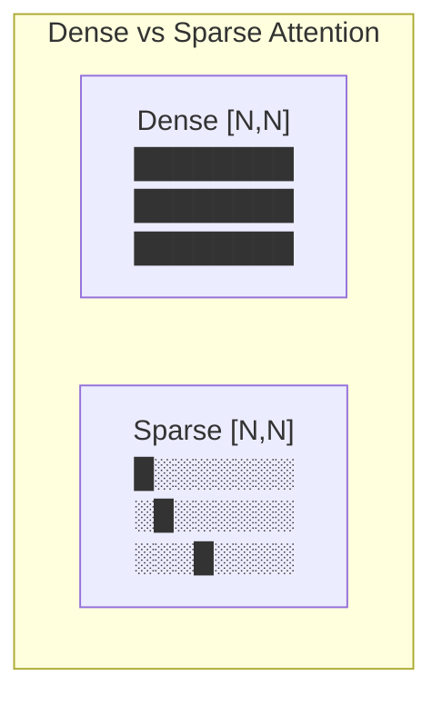
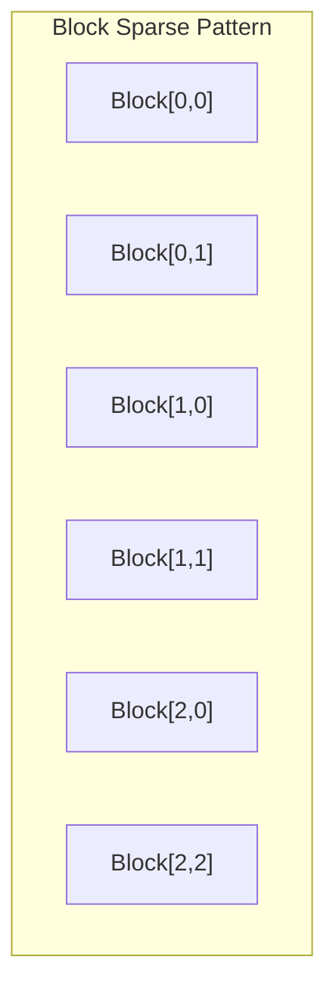
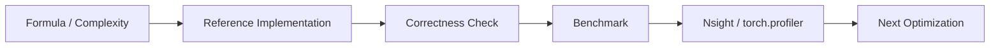

# Chapter 11: Sparse Attention

## 1. Attention 矩阵的稀疏性

研究表明，Attention 矩阵本质上是**稀疏的**：
- 大多数 token 对之间的 attention weight 接近 0
- 只有少数 token 对真正需要关注



## 2. 稀疏 Attention 的主要类型

### 2.1 Block Sparse Attention

将 attention 矩阵分成 block，只计算某些 block。



### 2.2 BigBird Pattern

```
Global tokens: attend to everything
Local (sliding window): attend to neighbors
Random: attend to random tokens
```

$$O(N \cdot (G + W + R)) \text{ complexity, where } G,W,R \ll N$$

### 2.3 Longformer Pattern

- Sliding window + Dilated window + Global tokens

## 3. Block Sparse 实现

```cuda
// Block sparse attention: only compute specified blocks
for (int bi = 0; bi < num_blocks; ++bi) {
    for (int bj : sparse_pattern[bi]) {  // Only specified blocks
        load_tile(Q[bi], K[bj]);
        compute_attention_tile();
    }
}
```

## 4. 性能分析

| Pattern | Complexity | Quality |
|---------|-----------|---------|
| Full | $O(N^2)$ | Best |
| Block Sparse | $O(N^2 \cdot S)$ | Very Good |
| BigBird | $O(N \cdot G \cdot W \cdot R)$ | Good |
| Sliding Window | $O(NW)$ | Good |

## 5. 源码实现

`block_sparse_attention.cpp` 将实现：
1. 稀疏 mask 的生成
2. Block sparse kernel
3. 与 Dense Attention 对比

---

## Sparse Attention 工业增强

补充 block density 复杂度、metadata overhead 和 block sparse pattern demo。

### 1. 工业视角

优化 attention 不能只看 Big-O。生产环境必须同时记录：`shape`、`dtype`、`batch`、`heads`、`seq_len`、`head_dim`、`causal`、warmup/iters、GPU 型号和 profiler 版本。对于推理系统，还要区分 **prefill** 与 **decode**，因为两者的瓶颈完全不同。

### 2. 复杂度与显存公式

标准 attention 的主要计算量：

$$\mathrm{FLOPs} \approx 2N^2d_k + 2N^2d_v + O(N^2)$$

显式保存 `S` 和 `P` 的中间显存：

$$\mathrm{Bytes}_{S+P} = 2N^2 \times \mathrm{sizeof(dtype)}$$

Roofline 判断：

$$\mathrm{AI}=\frac{\mathrm{FLOPs}}{\mathrm{Bytes\ moved}},\quad
\mathrm{Perf} \le \min(\mathrm{PeakFLOPS},\mathrm{PeakBW}\times\mathrm{AI})$$

### 3. 工程检查清单

| 检查项 | 要求 |
|---|---|
| Correctness | 小 shape 与 CPU/PyTorch reference 对齐。 |
| Benchmark | 固定 warmup、iters、shape、dtype，输出 latency 和吞吐。 |
| Memory | 说明 HBM 读写、中间 tensor、KV cache 或 block table 成本。 |
| Profiling | 至少记录 occupancy、DRAM throughput、SM throughput、stall reason。 |
| Reproducibility | README 中给出构建、运行、profiling 命令。 |

### 4. 本章实现入口

```bash
mkdir -p build
cd build
cmake .. -DCMAKE_CUDA_ARCHITECTURES=80
cmake --build . --target block_sparse_attention -j
./chapters/block_sparse_attention
```

### 5. 示意图


