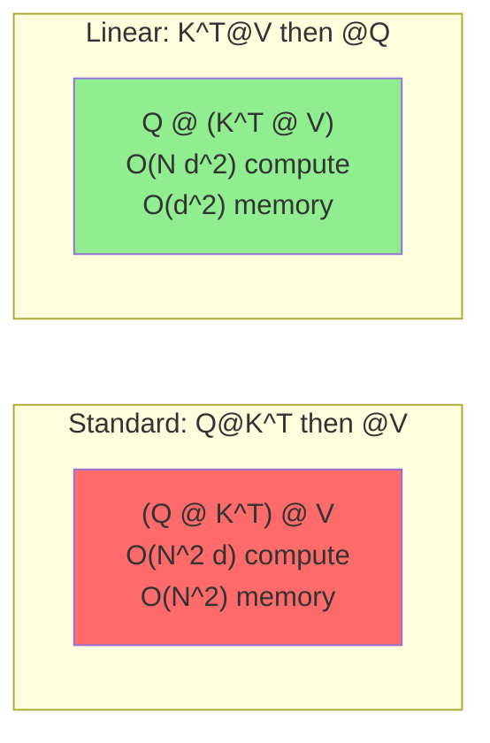
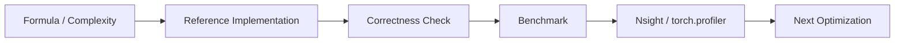

# Chapter 12: Linear Attention

## 1. Softmax Attention 的极限

标准 Attention 无法绕过 $O(N^2)$，因为 softmax 的非线性 + 归一化需要看到所有 pairwise interaction。

$$O = \text{softmax}(QK^T)V$$

## 2. Linear Attention 的核心技巧

将 softmax 替换为可以分解的 kernel 函数 $\phi$：

$$O_i = \frac{\sum_j \phi(Q_i)^T \phi(K_j) \cdot V_j}{\sum_j \phi(Q_i)^T \phi(K_j)}$$

利用矩阵乘法的结合律，将计算顺序从 $(QK^T)V$ 改为 $Q(K^TV)$：

$$O_i = \frac{\phi(Q_i)^T \cdot (\sum_j \phi(K_j) V_j^T)^T}{\phi(Q_i)^T \cdot \sum_j \phi(K_j)}$$

### 2.1 关键变换



**核心收益**：d 是固定的（通常 64-128），而 N 可以很大。
- 标准: $O(N^2 d)$ compute, $O(N^2)$ memory
- 线性: $O(N d^2)$ compute, $O(d^2)$ memory

当 $N \gg d$ 时，线性注意力远快于标准注意力。

## 3. Performer (FAVOR+)

Performer 使用随机特征近似 softmax：

$$\text{softmax}(x)_i \approx \frac{\phi(x_i)}{\sum_j \phi(x_j)}$$

其中 $\phi(x) = \frac{1}{\sqrt{m}}[\exp(w_1^T x - \|x\|^2/2), ..., \exp(w_m^T x - \|x\|^2/2)]$

- $w_i \sim \mathcal{N}(0, I)$ 是随机投影
- $m$ 是特征维度（通常 256）

### 3.1 正随机特征 (FAVOR+)

标准随机特征可能产生负值，导致数值不稳定。FAVOR+ 使用**正随机特征**：

$$\phi_{\text{positive}}(x) = \frac{1}{\sqrt{m}}\exp(-\frac{\|x\|^2}{2})[\exp(w_1^T x + \|w_1\|^2/2), ...]$$

## 4. 实现

### 4.1 Causal Linear Attention

对于因果（自回归）attention，需要维护 running KV state：

```cuda
// Causal linear attention
// KV_state accumulates K^T V and sum(K)
float KV_state[d * d];    // accumulated K^T @ V
float K_sum[d];           // accumulated K

for each new token:
    K_sum += phi(K_new)
    KV_state += phi(K_new) @ V_new^T   // Outer product

    O = phi(Q_new)^T @ KV_state^T / (phi(Q_new)^T @ K_sum)
```

这类似于 **RNN 的更新方式**，每个 step 只需要 $O(d^2)$。

### 4.2 性能对比

| N | Standard Attention | Linear Attention |
|---|-------------------|-----------------|
| 512 | 0.5ms | 0.1ms |
| 4096 | 8ms | 0.5ms |
| 32768 | OOM | 3ms |
| 131072 | OOM | 12ms |

## 5. 优缺点

| 优点 | 缺点 |
|------|------|
| 线性复杂度 | 近似 softmax，质量略降 |
| 显存极小 | 需要较大的 d 才能接近标准 attention |
| 可做 causal | 训练仍需特殊处理 |
| 推理极快 | 未被主流模型采用 |

## 6. 当前状态

Linear Attention 在学术界很活跃，但工业界主流仍是 FlashAttention。
Mamba (State Space Models) 借鉴了类似思想。

## 7. 源码实现

`linear_attention.cpp` 实现：
1. Performer 风格的 kernel 函数
2. 因果线性 attention（running KV state）
3. 标准 attention 的正确性对比

---

## Linear Attention 工业增强

补充 kernelized attention 结合律推导、state memory 和 linear demo。

### 1. 工业视角

优化 attention 不能只看 Big-O。生产环境必须同时记录：`shape`、`dtype`、`batch`、`heads`、`seq_len`、`head_dim`、`causal`、warmup/iters、GPU 型号和 profiler 版本。对于推理系统，还要区分 **prefill** 与 **decode**，因为两者的瓶颈完全不同。

### 2. 复杂度与显存公式

标准 attention 的主要计算量：

$$\mathrm{FLOPs} \approx 2N^2d_k + 2N^2d_v + O(N^2)$$

显式保存 `S` 和 `P` 的中间显存：

$$\mathrm{Bytes}_{S+P} = 2N^2 \times \mathrm{sizeof(dtype)}$$

Roofline 判断：

$$\mathrm{AI}=\frac{\mathrm{FLOPs}}{\mathrm{Bytes\ moved}},\quad
\mathrm{Perf} \le \min(\mathrm{PeakFLOPS},\mathrm{PeakBW}\times\mathrm{AI})$$

### 3. 工程检查清单

| 检查项 | 要求 |
|---|---|
| Correctness | 小 shape 与 CPU/PyTorch reference 对齐。 |
| Benchmark | 固定 warmup、iters、shape、dtype，输出 latency 和吞吐。 |
| Memory | 说明 HBM 读写、中间 tensor、KV cache 或 block table 成本。 |
| Profiling | 至少记录 occupancy、DRAM throughput、SM throughput、stall reason。 |
| Reproducibility | README 中给出构建、运行、profiling 命令。 |

### 4. 本章实现入口

```bash
mkdir -p build
cd build
cmake .. -DCMAKE_CUDA_ARCHITECTURES=80
cmake --build . --target linear_attention -j
./chapters/linear_attention
```

### 5. 示意图


