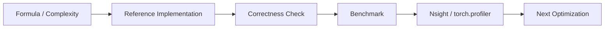

# Chapter 13: Quantized Attention

## 1. 量化的动机

### 1.1 显存与带宽瓶颈

Deep Learning 推理的两大瓶颈：
1. **显存容量**：模型参数量 + KV Cache 超过 GPU 显存
2. **显存带宽**：HBM 带宽跟不上计算需求

量化直接减少数据大小，一举解决两个问题。

### 1.2 精度对比

| 精度 | Bits | 范围 | 用途 |
|------|------|------|------|
| FP32 | 32 | 大 | 训练 |
| FP16 | 16 | 中 | 推理（主流） |
| BF16 | 16 | 中（宽范围） | 训练+推理 |
| FP8 | 8 | 小 | Hopper 推理 |
| INT8 | 8 | 中（固定范围） | 推理加速 |
| INT4 | 4 | 小 | 极致压缩 |
| NF4 | 4 | 非均匀 | QLoRA |

### 1.3 量化公式

线性量化：将浮点值映射到整数范围

$$x_q = \text{round}\left(\frac{x_f}{s}\right) + z$$

其中：
- $s = \frac{x_{\max} - x_{\min}}{2^b - 1}$（scale）
- $z$（zero point，对称量化时为 0）

反量化：
$$x_f \approx s \cdot (x_q - z)$$

## 2. KV Cache 量化

### 2.1 为什么量化 KV Cache？

KV Cache 是推理中**最大的显存消耗者**：

| 模型 | 原始 KV Cache (4K) | INT8 KV Cache | INT4 KV Cache |
|------|-------------------|---------------|---------------|
| Llama-7B | 2.1 GB | **1.05 GB** | **0.53 GB** |
| Llama-70B | 10.5 GB | **5.25 GB** | **2.63 GB** |

### 2.2 Per-Channel 量化

对 K 和 V 按 channel 量化（每个 head 独立）：

$$K_{q}[h, i, j] = \text{round}(K[h, i, j] / s_K[h, j])$$
$$V_{q}[h, i, j] = \text{round}(V[h, i, j] / s_V[h, j])$$

其中 $s_K[h, j]$ 是 head h, dimension j 的 scale。

### 2.3 CUDA 实现

```cuda
// Quantized attention: K and V are INT8 in HBM
// Dequantize on-the-fly in shared memory

__global__ void quantized_attention_kernel(
    const half* Q,             // FP16
    const int8_t* K_quant,    // INT8
    const float* K_scale,     // Per-channel scales
    const int8_t* V_quant,    // INT8
    const float* V_scale,
    half* O,                  // FP16 output
    ...)
{
    // Load K tile as INT8
    int8_t K_tile_q[Bc * d];
    load_from_hbm(K_tile_q, K_quant);

    // Dequantize to FP16 in shared memory
    half K_tile[Bc * d];
    for (int i = 0; i < Bc * d; ++i)
        K_tile[i] = __float2half(K_tile_q[i] * K_scale[i % d]);

    // Compute attention as usual with FP16
    // ...
}
```

## 3. FP8 on Hopper

Hopper (H100) 原生支持 FP8（E4M3 和 E5M2 格式）。

### 3.1 FP8 GEMM

```cuda
// Hopper FP8 matrix multiply
// A in E4M3, B in E4M3, accumulator in FP32

using namespace nvcuda;

// Set up FP8 operands
__nv_fp8_e4m3* A_fp8 = ...;
__nv_fp8_e4m3* B_fp8 = ...;

// FP8 -> FP16 -> FP32 accumulation (handled by hardware)
__nv_bfloat16 C_bf16;
asm volatile(
    "mma.sync.aligned.m16n8k32.row.col.f32.e4m3.e4m3.f32 {...};"
);
```

### 3.2 FP8 with Transformer Engine

NVIDIA Transformer Engine 自动管理 FP8 量化：

```python
import transformer_engine.pytorch as te

# FP8 attention with automatic scaling
layer = te.Linear(in_features, out_features, bias=True)
# Internally uses FP8 GEMM when available
```

## 4. 实现要点

### 4.1 量化粒度选择

| 粒度 | Scale 数量 | 精度 | 开销 |
|------|-----------|------|------|
| Per-Tensor | 1 | 低 | 最小 |
| Per-Channel | d | 中 | 小 |
| Per-Group | 可配置 | 高 | 中 |

### 4.2 反量化的位置

1. **加载时反量化**：从 HBM 加载 INT8 → SMEM 中转为 FP16
   - 优点：后续计算不受影响
   - 缺点：SMEM 占用翻倍

2. **计算时反量化**：直接用 INT8 操作数
   - 优点：SMEM 占用小
   - 缺点：需要 INT8 GEMM 支持

## 5. 源码实现

`quantized_attention.cpp` 实现：
1. Per-channel INT8 量化/反量化
2. 反量化到 FP16 的 Attention kernel
3. 精度损失分析
4. 带宽节省分析

---

## Quantized Attention 工业增强

补充 per-channel INT8 公式、KV bandwidth 收益和量化误差 demo。

### 1. 工业视角

优化 attention 不能只看 Big-O。生产环境必须同时记录：`shape`、`dtype`、`batch`、`heads`、`seq_len`、`head_dim`、`causal`、warmup/iters、GPU 型号和 profiler 版本。对于推理系统，还要区分 **prefill** 与 **decode**，因为两者的瓶颈完全不同。

### 2. 复杂度与显存公式

标准 attention 的主要计算量：

$$\mathrm{FLOPs} \approx 2N^2d_k + 2N^2d_v + O(N^2)$$

显式保存 `S` 和 `P` 的中间显存：

$$\mathrm{Bytes}_{S+P} = 2N^2 \times \mathrm{sizeof(dtype)}$$

Roofline 判断：

$$\mathrm{AI}=\frac{\mathrm{FLOPs}}{\mathrm{Bytes\ moved}},\quad
\mathrm{Perf} \le \min(\mathrm{PeakFLOPS},\mathrm{PeakBW}\times\mathrm{AI})$$

### 3. 工程检查清单

| 检查项 | 要求 |
|---|---|
| Correctness | 小 shape 与 CPU/PyTorch reference 对齐。 |
| Benchmark | 固定 warmup、iters、shape、dtype，输出 latency 和吞吐。 |
| Memory | 说明 HBM 读写、中间 tensor、KV cache 或 block table 成本。 |
| Profiling | 至少记录 occupancy、DRAM throughput、SM throughput、stall reason。 |
| Reproducibility | README 中给出构建、运行、profiling 命令。 |

### 4. 本章实现入口

```bash
mkdir -p build
cd build
cmake .. -DCMAKE_CUDA_ARCHITECTURES=80
cmake --build . --target quantized_attention -j
./chapters/quantized_attention
```

### 5. 示意图


