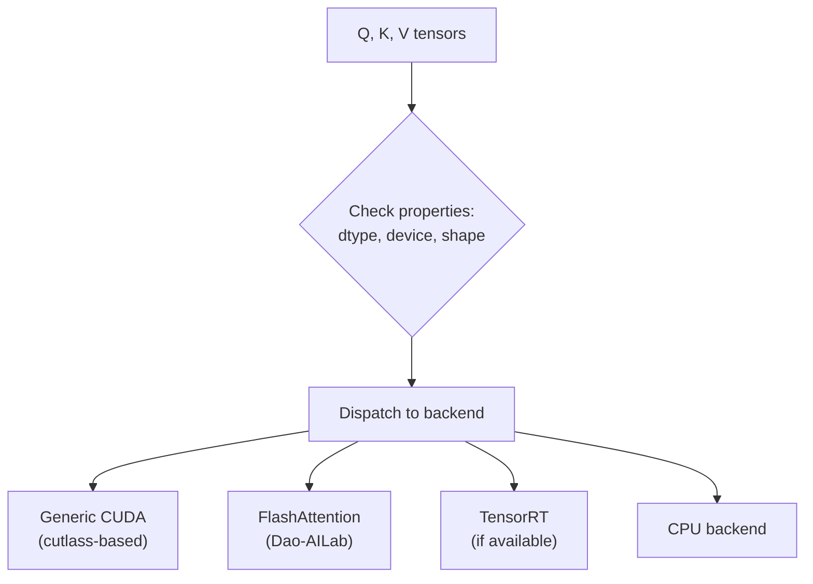

# Chapter 15: xFormers 源码解析

## 1. xFormers 简介

xFormers 是 Meta 开源的 Transformer 优化库，核心组件是 **Memory-Efficient Attention**。

### 1.1 核心 API

```python
import xformers.ops as xops

# Memory-efficient attention (automatically selects best backend)
out = xops.memory_efficient_attention(Q, K, V)
```

## 2. 架构设计

### 2.1 Dispatch 机制



### 2.2 关键文件结构

```
xformers/
├── components/
│   └── attention/
│       ├── csrc/
│       │   └── attention/
│       │       ├── attention_forward_generic.cu    # Generic implementation
│       │       └── flash_attention/                # FlashAttention wrapper
│       ├── _sdp_backend.py                        # SDPA backend dispatch
│       └── attention_patterns.py                  # Attention computation patterns
```

### 2.3 核心优化

| 技术 | 位置 | 效果 |
|------|------|------|
| Tiled Matmul + SMEM | Generic CUDA | 减少 HBM 访问 |
| Online Softmax | Generic CUDA | 消除中间矩阵 |
| FlashAttention V2 | Flash backend | 最高性能 |
| Cutlass GEMM | Generic CUDA | 通用性 |
| FP16/BF16 支持 | 所有 backend | 2× 带宽节省 |

## 3. Memory-Efficient Attention (Generic)

### 3.1 算法

与 FlashAttention V1 类似，但使用 Cutlass 实现 tiled matmul：

```
For each tile of Q:
    For each tile of K, V:
        S = Q_tile @ K_tile^T          (Cutlass GEMM)
        P = online_softmax(S)          (Custom kernel)
        O += P @ V_tile                 (Cutlass GEMM)
```

### 3.2 与 FlashAttention 的对比

| | xFormers Generic | FlashAttention |
|---|-----------------|----------------|
| 基础 | Cutlass GEMM | 手写 CUDA |
| 通用性 | 任意 dtype/shape | 需要特定对齐 |
| 性能 | 较好 | 最优 |
| 维护性 | 高（基于 Cutlass） | 中（手写 kernel） |

## 4. 调用示例

### 4.1 基础用法

```python
import torch
import xformers.ops as xops

B, M, H, K = 1, 4096, 32, 128
Q = torch.randn(B, M, H, K, device="cuda", dtype=torch.float16)
K = torch.randn(B, M, H, K, device="cuda", dtype=torch.float16)
V = torch.randn(B, M, H, K, device="cuda", dtype=torch.float16)

# Bi-directional attention (no mask)
out = xops.memory_efficient_attention(Q, K, V)

# Causal attention
attn_bias = xops.LowerTriangularMask()
out_causal = xops.memory_efficient_attention(Q, K, V, attn_bias=attn_bias)
```

### 4.2 性能

预期比标准 PyTorch 快 2-5×，显存使用减少 10-20×。

## 5. 源码阅读指南

推荐阅读顺序：
1. `_sdp_backend.py` - 了解 dispatch 逻辑
2. `attention_forward_generic.cu` - 理解通用实现
3. `flash_attention/` - 理解 FlashAttention 集成

源码核心注释在 `src/chapter_15/source_reading_notes.md`。

---

## xFormers 工业增强

补充 memory-efficient attention dispatch、backend selection 和源码阅读 checklist。

### 1. 工业视角

优化 attention 不能只看 Big-O。生产环境必须同时记录：`shape`、`dtype`、`batch`、`heads`、`seq_len`、`head_dim`、`causal`、warmup/iters、GPU 型号和 profiler 版本。对于推理系统，还要区分 **prefill** 与 **decode**，因为两者的瓶颈完全不同。

### 2. 复杂度与显存公式

标准 attention 的主要计算量：

$$\mathrm{FLOPs} \approx 2N^2d_k + 2N^2d_v + O(N^2)$$

显式保存 `S` 和 `P` 的中间显存：

$$\mathrm{Bytes}_{S+P} = 2N^2 \times \mathrm{sizeof(dtype)}$$

Roofline 判断：

$$\mathrm{AI}=\frac{\mathrm{FLOPs}}{\mathrm{Bytes\ moved}},\quad
\mathrm{Perf} \le \min(\mathrm{PeakFLOPS},\mathrm{PeakBW}\times\mathrm{AI})$$

### 3. 工程检查清单

| 检查项 | 要求 |
|---|---|
| Correctness | 小 shape 与 CPU/PyTorch reference 对齐。 |
| Benchmark | 固定 warmup、iters、shape、dtype，输出 latency 和吞吐。 |
| Memory | 说明 HBM 读写、中间 tensor、KV cache 或 block table 成本。 |
| Profiling | 至少记录 occupancy、DRAM throughput、SM throughput、stall reason。 |
| Reproducibility | README 中给出构建、运行、profiling 命令。 |

### 4. 本章阅读入口

本章是 source-reading-only，没有本地二进制 target。建议从笔记开始，再沿 README 中的 upstream 文件清单阅读。

```bash
sed -n '1,240p' notes/chapter_15.md
```

### 5. 示意图


