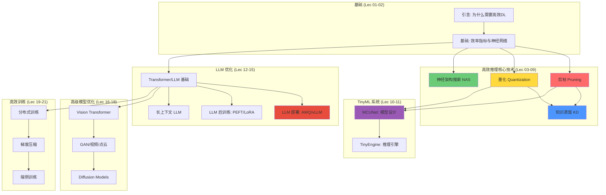
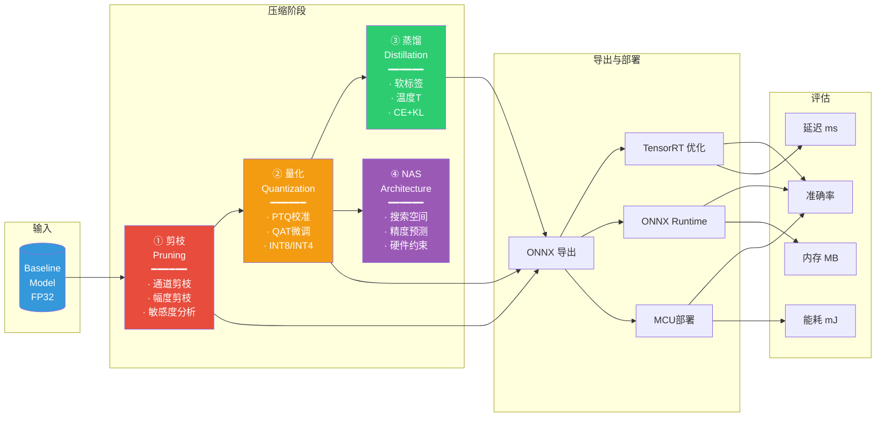
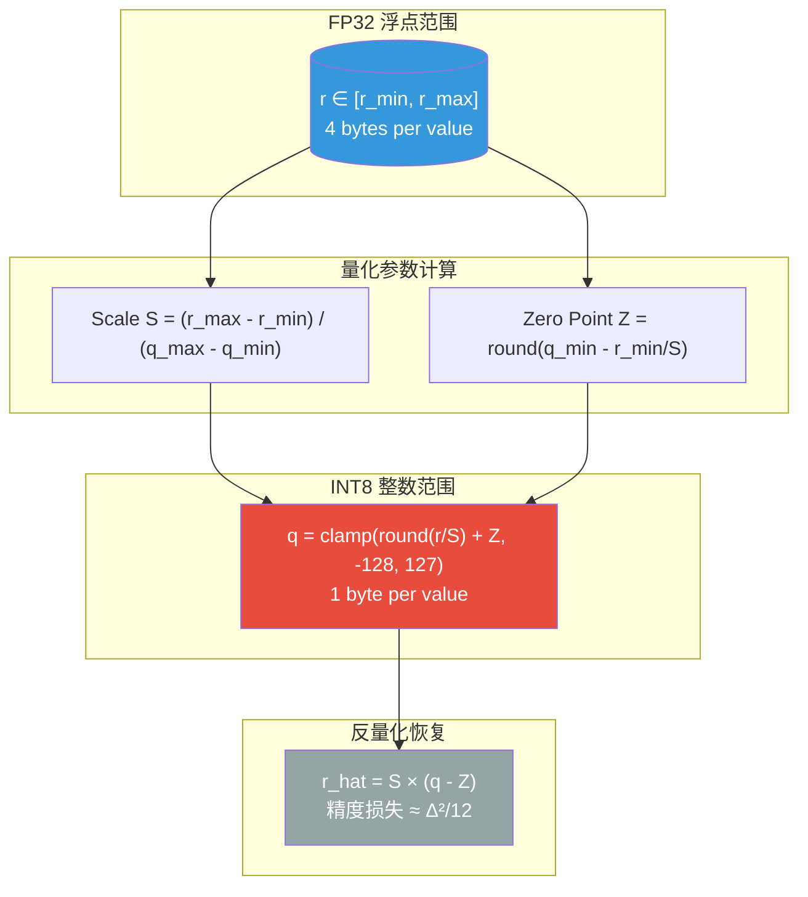
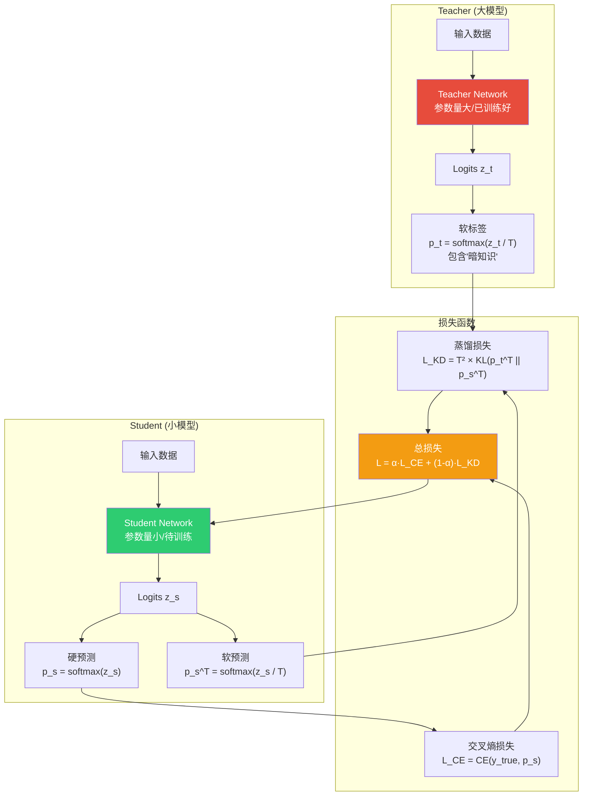
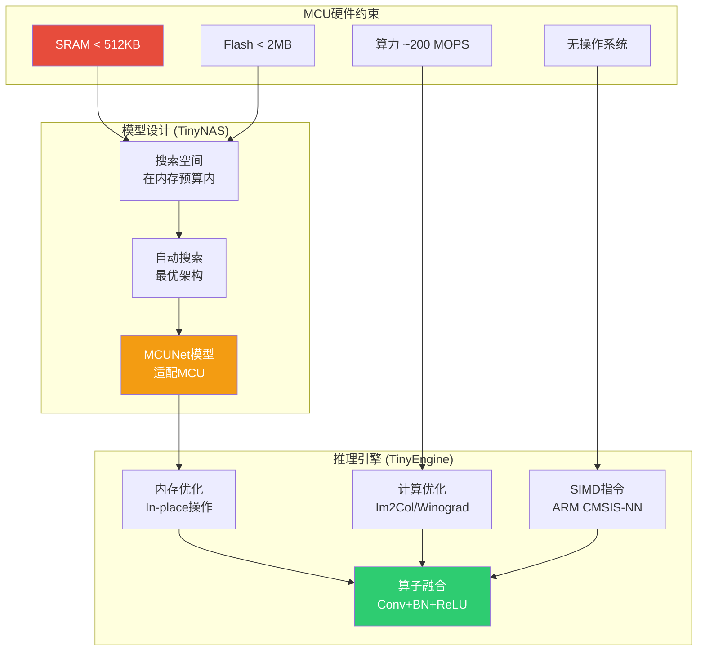

# MIT 6.5940 架构图集合

## 课程整体知识架构



## 模型压缩流水线



## 量化原理: 从浮点到整数



## 知识蒸馏流程



## 端侧AI部署流水线

```mermaid
graph TB
    subgraph "训练阶段 (云端GPU)"
        T1[大规模数据训练]
        T2[Teacher模型训练]
        T3[模型压缩<br/>剪枝+量化+蒸馏]
    end

    subgraph "优化阶段"
        O1[ONNX导出<br/>跨框架互操作]
        O2[TensorRT优化<br/>层融合/精度校准]
        O3[ONNX Runtime<br/>跨平台推理]
    end

    subgraph "部署阶段 (边缘设备)"
        D1[手机/NPU<br/>CoreML/TFLite]
        D2[嵌入式MCU<br/>TinyEngine]
        D3[IoT设备<br/>TFLite Micro]
        D4[浏览器<br/>ONNX Runtime Web]
    end

    subgraph "监控"
        M1[延迟监控]
        M2[准确率漂移]
        M3[模型更新]

    T1 --> T2 --> T3
    T3 --> O1
    O1 --> O2
    O1 --> O3
    O2 --> D1
    O3 --> D1
    O2 --> D2
    O3 --> D3
    O1 --> D4
    
    D1 --> M1
    D1 --> M2
    M2 --> M3
    M3 --> T3

    style T3 fill:#e74c3c,color:white
    style O2 fill:#f39c12,color:white
    style D1 fill:#2ecc71,color:white
    style D2 fill:#9b59b6,color:white
```

## 剪枝粒度层级

```mermaid
graph LR
    subgraph "最细粒度"
        FG["细粒度剪枝<br/>Fine-grained<br/>━━━━━━━<br/>单个权重<br/>非结构化<br/>压缩率最高<br/>需要稀疏硬件"]
    end

    subgraph ""
        VEC["向量级剪枝<br/>Vector-level<br/>━━━━━━━<br/>连续权重块<br/>中等结构化<br/>SIMD友好"]
    end

    subgraph ""
        KERNEL["卷积核级<br/>Kernel-level<br/>━━━━━━━<br/>整个卷积核<br/>部分结构化<br/>直接加速"]
    end

    subgraph "最粗粒度"
        CH["通道剪枝<br/>Channel-level<br/>━━━━━━━<br/>整个通道<br/>完全结构化<br/>任何硬件加速<br/>压缩率最低"]
    end

    FG --> VEC --> KERNEL --> CH

    style FG fill:#e74c3c,color:white
    style CH fill:#2ecc71,color:white
```

## MCU上的TinyML推理


