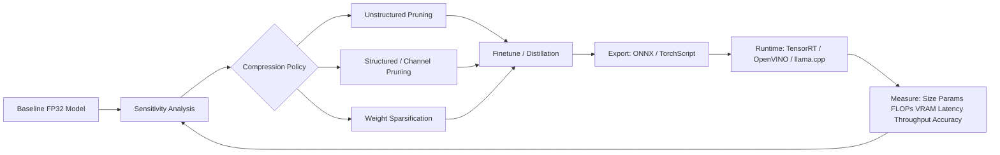

# Lecture 03-04: 剪枝 (Pruning) - 把神经网络的"脂肪"减掉

## 1. 本讲核心问题

> 神经网络中大量权重接近于0，它们真的有用吗？能不能直接删掉？删了会怎样？删多少？怎么删？

## 2. 通俗解释

**生活类比 — 减肥 vs 截肢**:

- **非结构化剪枝**（fine-grained）: 就像抽脂——在全身各处的脂肪细胞中，挑出那些"小的"抽掉。效果很猛（能瘦很多），但身体结构变得稀疏不规则，做运动时反而更累（硬件不友好）。
- **结构化剪枝**（channel pruning）: 就像截掉一整条腿——虽然残忍但身体结构保持完整，行动依然协调（硬件加速效果好）。

这解释了为什么：同样减掉50%的"体重"，结构化剪枝实际加速效果远超非结构化剪枝。

### 2.1 结构化 vs 非结构化剪枝：核心区别速查

两者的根本差异在于**剪枝的“单位”**，它决定了张量形状、硬件加速、精度等一切后续表现。

| 维度 | 非结构化剪枝 (Unstructured) | 结构化剪枝 (Structured) |
|---|---|---|
| 剪枝单位 | **单个权重**（标量），零散置零 | **整个结构块**：输出通道/filter、整行整列、attention head |
| 张量形状 | **不变**，稠密 shape 里散布着 0 | **真的变小**，维度被砍掉 |
| 是否需要 mask | 需要，否则梯度/动量更新会让 0 复活 | 不需要，直接物理删除参数 |
| 同压缩率下精度 | 损失小（粒度细，只删最不重要的单个权重） | 损失更大（粒度粗，一删就是一整块） |
| 能否真加速 | **难**，标准 dense kernel 不会跳过 0 | **能**，FLOPs 真减少，任何 CPU/GPU 直接受益 |
| 存储收益 | 需 CSR/COO，低稀疏度时索引开销可能抵消收益 | 直接变小，无索引开销 |
| 本项目对应代码 | `test4.py` `magnitude_prune_tensor`、`test6.py` | `test10.py` `conv_out_channel_importance` |

**一句话总结**：

- **非结构化** = 灵活、精度高，但软硬件不友好，难落地加速——这正是 `test5.py` 里剪了 50% 权重、latency 却几乎不变的根因（dense kernel 不因为有很多 0 就少算）。
- **结构化** = 粗糙、精度损失大些，但直接让模型变小变快，部署最实在；代价是要**同步改相邻结构**（下一层 `in_channels`、BN 参数、residual/concat 分支）。
- **折中：N:M 半结构化稀疏**（如 2:4），既保留一定灵活性，又能被 NVIDIA Ampere+ 的 Sparse Tensor Core 原生加速（见 `test9.py`）。

> 实践顺序：常先用非结构化探索“能剪多少”，再用结构化 / 2:4 拿到真实的速度收益。

## 3. 关键公式

### 3.1 剪枝的数学定义

$$\min_W \mathcal{L}(W) \quad \text{s.t.} \quad \|W\|_0 \le k$$

- $\|W\|_0$ = 非零权重的个数（L0范数）
- $k$ = 我们希望保留的非零参数量上限
- 我们想让 $\mathcal{L}$ 尽可能小，同时 $W$ 中大部分变成零

### 3.2 幅度剪枝 (Magnitude-based Pruning)

这是最基础、最常用的方法：

$$\text{重要性}(w_i) = |w_i|$$

把所有权重按绝对值排序，最小的那些 → 变成0。

**为什么有效？** 直觉上，如果 $|w_i| \approx 0$，那它乘以任何输入值也接近0，对最终输出贡献极小，删掉影响不大。

### 3.3 敏感度分析

某些层对剪枝特别敏感。我们需要逐层分析：

$$\text{Sensitivity}(l) = \frac{\text{Acc}_{\text{baseline}} - \text{Acc}_{\text{pruned}}(l, s)}{\text{Acc}_{\text{baseline}}}$$

- 剪枝率 $s$ （比如50%）
- 只剪第 $l$ 层，测量准确率下降
- 敏感度高的层 → 少剪一点；不敏感的层 → 多剪一点

### 3.4 结构化剪枝 — 通道剪枝

对卷积层，按通道的重要性排序：

$$\text{Importance}(c_i) = \|W_{:,i,:,:}\|_F = \sqrt{\sum W_{:,i,:,:}^2}$$

即计算每个输入通道的权重矩阵的 Frobenius 范数（L2范数），范数越大的通道 → 越重要。

### 3.5 剪枝后的计算量减少

通道剪枝移除30%通道 → 计算量减少约50%：

$$(1 - 0.3)^2 \approx 0.49 \implies \text{约减少50%}$$

因为卷积的计算量与输入通道数 × 输出通道数成正比。

## 4. 公式背后的直觉

### 为什么稀疏不一定快？

非结构化剪枝产生的是"瑞士奶酪"般的稀疏矩阵：

```
[0.5  0   0   0.3]     ← 零散分布在矩阵中
[0    0.7 0   0  ]
[0.2  0   0   0.8]
[0    0   0.9 0  ]
```

GPU 的 Tensor Core 喜欢**稠密矩阵**。稀疏矩阵需要特殊编码（如 CSR 格式），额外的索引计算和内存跳转反而拖慢速度。

NVIDIA A100 支持 **2:4 结构化稀疏**：每4个连续值中正好有2个是0。这是一种硬件和算法的折中。

### 为什么通道剪枝能真正加速？

```
通道剪枝前: Conv(C_in=64, C_out=128, K=3)
通道剪枝后: Conv(C_in=44, C_out=89, K=3)    ← 移除30%通道
```

卷积核变小了 → 计算量平方级减少 → GEMM 调用直接变快。不需要特殊的稀疏格式。

## 5. 工业界用途

| 应用场景 | 剪枝类型 | 典型效果 |
|----------|----------|----------|
| 手机端人脸检测 | 通道剪枝 | 2x加速, 0.3%精度损失 |
| 自动驾驶模型 | 结构化剪枝+N:M sparsity | 用TensorRT-A100, 2x加速 |
| 服务器推理 | 非结构化+2:4 sparse | 配合A100, 2x peak perf |
| MCU端关键词检测 | 非结构化(pruning重训练) | 模型缩小8x |
| LLM部署 | Wanda/SparseGPT | 50%稀疏, 几乎无损 |

### 大厂剪枝实战数字

- **字节跳动抖音推荐视觉模型**: ResNet50 通道剪枝 + 敏感度分析 → 参数量从 25M 压缩到 5.2M（79% 压缩），FLOPs 从 4.1G 降到 0.73G。配合 TensorRT INT8 量化后线上推理延迟从 42ms 降至 17ms（59% 降幅），单 GPU QPS 从 1200 提升到 3400。过程中发现最关键的一层是 conv5_x 的最后一个 block — 该层被剪超过 40% 后长尾类目（低频品类）的 top-5 准确率暴跌 12%。

- **快手短视频特征提取**: MobileNetV3-Large 在 ARM 端上做结构化剪枝 → 模型从 5.4MB 降到 0.9MB，配合 ncnn FP16 推理，端上首帧耗时从 380ms 降至 110ms。剪枝率分配的关键：前 3 层只剪 10-15%（提取基础纹理，对 compression 敏感），中间 8 层剪 50-60%（冗余通道多），最后 2 层不剪（分类头信息密度高）。

- **Google Waymo 自动驾驶感知**: 感知模型在 NVIDIA Orin 芯片上部署，使用结构化通道剪枝 + 2:4 稀疏。核心挑战不是准确率，而是 **P99.99 尾延迟** — 平均 3.2ms 的推理延迟中，有 0.01% 的帧延迟超过 12ms（因为 OS 调度抖动 + 内存碎片化）。解决方案是在剪枝基础上增加 **固定时间预算的早停机制**（latency budget enforcement）。

- **Meta LLaMA 2 70B 部署优化**: 使用 SparseGPT（一次性剪枝不重训练）对 Attention 的 QKV 和 FFN 做 50% 非结构化稀疏 → 模型显存从 140GB 降到 70GB（理论 50%，实际减少约 45%），推理速度在 batch=1 时仅提升 8%（memory-bound），但在 batch=32 时提升 42%（compute-bound 场景终于受益）。

### 剪枝 vs 量化的成本收益取舍

| 方案 | 模型大小降低 | 延迟降低 | 精度损失 | 工程复杂度 | 适用场景 |
|------|------------|---------|---------|-----------|----------|
| 纯通道剪枝 (50%) | ~50% | ~50% | 0.5-2% | 中（需敏感度分析+重训练） | 通用 CPU/GPU 推理 |
| 纯 INT8 量化 | 75% | 2-4x | 0.5-1% | 低（PTQ一行命令） | 有 INT8 指令的硬件 |
| 剪枝+量化叠加 | ~87% | 4-8x | 1-3% | 高（需两次评估+重训练） | 极致压缩场景 |

### 模型压缩工业落地

工业项目里，剪枝不是“把权重变成 0”这么简单，而是围绕 **accuracy-latency-memory trade-off** 建立一条可验证闭环：



剪枝方案选择：

| 技术 | English Concept | 工业解释 | 硬件收益 |
|---|---|---|---|
| 非结构化剪枝 | Unstructured Pruning | 单个 weight 置零，压缩率高但 sparse pattern 不规则 | 需要 sparse kernel，否则不一定加速 |
| 结构化剪枝 | Structured Pruning | 按 block/filter/head 等结构删除 | 更容易被 TensorRT/OpenVINO/CPU kernel 加速 |
| 通道剪枝 | Channel Pruning | 删除 Conv channel 或 MLP hidden channel | 直接减少 GEMM/Conv shape，端侧最常用 |
| 权重稀疏化 | Weight Sparsification | 形成 N:M、block sparse、CSR/BSR 等格式 | A100/H100 的 2:4 sparsity 可获得硬件收益 |

和剪枝强相关的部署链路：

- **ONNX**: 适合作为 PyTorch 到 TensorRT/OpenVINO/ONNX Runtime 的中间格式，但要检查 dynamic axes、opset 和算子支持。
- **TensorRT**: 适合 NVIDIA GPU 上 FP16/INT8/2:4 sparse 推理，需要真实 engine benchmark，不能只看 PyTorch latency。
- **TorchScript**: 适合 PyTorch 生态内部服务化，优点是集成简单，缺点是跨平台部署能力弱于 ONNX。
- **OpenVINO**: 适合 Intel CPU/iGPU/NPU，结构化剪枝 + INT8 PTQ 更容易得到稳定收益。
- **llama.cpp / GGUF**: 适合 LLM 本地部署，重点不是通道剪枝，而是 INT4/INT5/INT8 weight-only quantization、KV cache 和 batch 调度。

必须同时记录的指标：

$$
\text{Compression Ratio} = \frac{\text{Baseline Model Size}}{\text{Compressed Model Size}}
$$

$$
\text{Speedup} = \frac{\text{Baseline Latency}}{\text{Compressed Latency}}, \quad
\Delta Acc = Acc_{compressed} - Acc_{baseline}
$$

| 指标 | 为什么必须测 | 工业判断 |
|---|---|---|
| 模型大小 / 参数量 | 决定下载、冷启动、端侧存储 | 端侧通常先看 size budget |
| FLOPs / MACs | 估算理论计算量 | 只能解释趋势，不能替代真实 latency |
| 显存占用 / CPU 内存 | 决定并发 batch 和是否 OOM | LLM/VLA 部署常被 KV cache 或 action chunk buffer 卡住 |
| 推理延迟 P50/P95/P99 | 决定用户体验和控制频率 | 机器人控制更关注 P99 deadline |
| 吞吐 QPS/TPS | 决定服务成本 | 数据中心推理必须看 batch 下 throughput |
| 精度下降 / 输出误差 | 决定是否能上线 | VLA 可用 action MSE 或 rollout success rate |


## 6. PyTorch 实现思路

这一节给出一套**可复制运行**的 PyTorch 剪枝代码。它覆盖：

1. 单个 tensor 的幅度剪枝；
2. 全局非结构化剪枝；
3. mask 持久化和微调时保持 mask；
4. 逐层敏感度分析；
5. 通道重要性排序；
6. 剪枝后微调闭环。

> 注意：下面的结构化通道剪枝示例先用“整通道置零”演示重要性排序和敏感度。真正工业级结构化剪枝还需要同步改后续层的 `in_channels`、BN 参数和 residual/concat 依赖，这部分在 Lecture 04 展开。

### 6.1 单个权重张量的幅度剪枝

```python
import copy
import time
from dataclasses import dataclass

import torch
import torch.nn as nn
import torch.nn.functional as F


def magnitude_prune_tensor(weight: torch.Tensor, sparsity: float):
    """Return pruned weight and binary mask for one tensor.

    sparsity=0.5 means pruning the smallest 50% weights by absolute value.
    """
    if not 0.0 <= sparsity <= 1.0:
        raise ValueError(f"sparsity must be in [0, 1], got {sparsity}")
    if sparsity == 0.0:
        mask = torch.ones_like(weight, dtype=torch.bool)
        return weight.clone(), mask
    if sparsity == 1.0:
        mask = torch.zeros_like(weight, dtype=torch.bool)
        return torch.zeros_like(weight), mask

    flat = weight.detach().abs().flatten()
    k = int(sparsity * flat.numel())
    threshold = torch.kthvalue(flat, k).values
    mask = weight.detach().abs() > threshold
    return weight * mask.to(weight.dtype), mask


w = torch.randn(64, 64)
w_pruned, mask = magnitude_prune_tensor(w, sparsity=0.5)
print(f"target sparsity=50%, actual sparsity={(w_pruned == 0).float().mean():.2%}")
```

### 6.2 全局非结构化剪枝

逐层剪 50% 不等于全局剪 50%。全局剪枝会把所有可剪层的权重放在一起排序，自动给“不重要权重更多”的层更高剪枝率。

```python

def prunable_modules(model: nn.Module):
    for name, module in model.named_modules():
        if isinstance(module, (nn.Conv2d, nn.Linear)):
            yield name, module


@torch.no_grad()
def global_magnitude_prune(model: nn.Module, sparsity: float):
    """Apply global unstructured magnitude pruning in-place.

    Returns a dict: module name -> binary mask. Keep this dict during fine-tuning.
    """
    if not 0.0 <= sparsity <= 1.0:
        raise ValueError(f"sparsity must be in [0, 1], got {sparsity}")

    named_modules = list(prunable_modules(model))
    if not named_modules:
        return {}

    all_scores = torch.cat([m.weight.detach().abs().flatten() for _, m in named_modules])
    k = int(sparsity * all_scores.numel())
    if k <= 0:
        return {name: torch.ones_like(m.weight, dtype=torch.bool) for name, m in named_modules}
    if k >= all_scores.numel():
        threshold = torch.inf
    else:
        threshold = torch.kthvalue(all_scores, k).values

    masks = {}
    for name, module in named_modules:
        mask = module.weight.detach().abs() > threshold
        module.weight.mul_(mask.to(module.weight.dtype))
        masks[name] = mask
    return masks


@torch.no_grad()
def apply_masks(model: nn.Module, masks: dict[str, torch.Tensor]):
    """Keep pruned weights exactly zero after optimizer updates."""
    module_dict = dict(model.named_modules())
    for name, mask in masks.items():
        module = module_dict[name]
        module.weight.mul_(mask.to(module.weight.device, module.weight.dtype))


@torch.no_grad()
def sparsity_of_prunable_weights(model: nn.Module):
    total = 0
    zeros = 0
    for _, module in prunable_modules(model):
        w = module.weight.detach()
        total += w.numel()
        zeros += int((w == 0).sum())
    return zeros / max(total, 1)
```

### 6.3 可运行的评估、延迟和微调工具

```python
@torch.no_grad()
def evaluate_accuracy(model: nn.Module, loader, device="cpu"):
    model.eval()
    correct = 0
    total = 0
    for x, y in loader:
        x, y = x.to(device), y.to(device)
        pred = model(x).argmax(dim=1)
        correct += int((pred == y).sum())
        total += y.numel()
    return correct / max(total, 1)


@torch.no_grad()
def benchmark_latency_ms(model: nn.Module, example_input: torch.Tensor, warmup=10, runs=50):
    model.eval()
    for _ in range(warmup):
        model(example_input)
    times = []
    for _ in range(runs):
        t0 = time.perf_counter()
        model(example_input)
        times.append((time.perf_counter() - t0) * 1000)
    t = torch.tensor(times)
    return {
        "mean_ms": float(t.mean()),
        "p50_ms": float(t.quantile(0.50)),
        "p95_ms": float(t.quantile(0.95)),
    }


def finetune_with_masks(model, train_loader, masks, epochs=3, lr=1e-3, device="cpu"):
    """Fine-tune a pruned model while enforcing masks after every step."""
    model.to(device)
    optimizer = torch.optim.SGD(model.parameters(), lr=lr, momentum=0.9)
    criterion = nn.CrossEntropyLoss()

    for epoch in range(epochs):
        model.train()
        total_loss = 0.0
        for x, y in train_loader:
            x, y = x.to(device), y.to(device)
            optimizer.zero_grad()
            loss = criterion(model(x), y)
            loss.backward()

            # 防止被剪掉的权重通过梯度和 momentum 复活。
            for name, module in prunable_modules(model):
                if name in masks and module.weight.grad is not None:
                    module.weight.grad.mul_(masks[name].to(device, module.weight.grad.dtype))

            optimizer.step()
            apply_masks(model, masks)
            total_loss += float(loss)
        print(f"finetune epoch {epoch + 1}: loss={total_loss / len(train_loader):.4f}")
    return model
```

### 6.4 逐层敏感度分析

敏感度分析的做法是：每次只剪一层，测精度下降。敏感层少剪，不敏感层多剪。

```python
@dataclass
class SensitivityPoint:
    layer: str
    sparsity: float
    accuracy: float


def layerwise_sensitivity_scan(model, val_loader, sparsities=(0.1, 0.3, 0.5, 0.7), device="cpu"):
    baseline_acc = evaluate_accuracy(model, val_loader, device=device)
    results = []

    for layer_name, _ in prunable_modules(model):
        for s in sparsities:
            trial = copy.deepcopy(model).to(device)
            module = dict(trial.named_modules())[layer_name]
            with torch.no_grad():
                pruned_w, _ = magnitude_prune_tensor(module.weight, s)
                module.weight.copy_(pruned_w)
            acc = evaluate_accuracy(trial, val_loader, device=device)
            results.append(SensitivityPoint(layer_name, s, acc))
            print(f"layer={layer_name:20s} sparsity={s:.1f} acc={acc:.4f} drop={baseline_acc - acc:.4f}")
    return baseline_acc, results
```

### 6.5 通道重要性排序（结构化剪枝的第一步）

下面代码不会直接改模型结构，只返回应该保留哪些输出通道。真正删除通道时，必须同步改下一层输入通道和 BN 参数。

```python
@torch.no_grad()
def conv_out_channel_importance(conv: nn.Conv2d):
    # Conv2d weight shape: [out_channels, in_channels, kh, kw]
    return conv.weight.detach().flatten(1).norm(p=2, dim=1)


@torch.no_grad()
def select_conv_out_channels(conv: nn.Conv2d, keep_ratio: float):
    if not 0.0 < keep_ratio <= 1.0:
        raise ValueError(f"keep_ratio must be in (0, 1], got {keep_ratio}")
    scores = conv_out_channel_importance(conv)
    keep = max(1, int(scores.numel() * keep_ratio))
    keep_idx = torch.topk(scores, keep).indices.sort().values
    prune_idx = torch.tensor([i for i in range(scores.numel()) if i not in set(keep_idx.tolist())])
    return keep_idx, prune_idx, scores


@torch.no_grad()
def zero_pruned_output_channels(conv: nn.Conv2d, prune_idx: torch.Tensor):
    """Demonstration only: zero whole output channels without changing module shape."""
    conv.weight[prune_idx] = 0
    if conv.bias is not None:
        conv.bias[prune_idx] = 0
```

### 6.6 完整剪枝—微调流水线示例

```python
def prune_and_finetune(model, train_loader, val_loader, sparsity=0.5, device="cpu"):
    model = copy.deepcopy(model).to(device)
    baseline_acc = evaluate_accuracy(model, val_loader, device=device)
    example_x, _ = next(iter(val_loader))
    example_x = example_x[:1].to(device)
    baseline_latency = benchmark_latency_ms(model, example_x)

    masks = global_magnitude_prune(model, sparsity=sparsity)
    pruned_acc = evaluate_accuracy(model, val_loader, device=device)
    pruned_latency = benchmark_latency_ms(model, example_x)

    finetune_with_masks(model, train_loader, masks, epochs=3, lr=1e-3, device=device)
    finetuned_acc = evaluate_accuracy(model, val_loader, device=device)
    finetuned_latency = benchmark_latency_ms(model, example_x)

    report = {
        "baseline_acc": baseline_acc,
        "pruned_acc": pruned_acc,
        "finetuned_acc": finetuned_acc,
        "actual_sparsity": sparsity_of_prunable_weights(model),
        "baseline_latency": baseline_latency,
        "pruned_latency": pruned_latency,
        "finetuned_latency": finetuned_latency,
    }
    return model, report
```

### 6.7 一个最小可运行 Demo

```python
from torch.utils.data import DataLoader, TensorDataset

class TinyCNN(nn.Module):
    def __init__(self):
        super().__init__()
        self.features = nn.Sequential(
            nn.Conv2d(3, 16, 3, padding=1), nn.ReLU(),
            nn.Conv2d(16, 32, 3, padding=1), nn.ReLU(),
            nn.AdaptiveAvgPool2d(1),
        )
        self.classifier = nn.Linear(32, 10)

    def forward(self, x):
        x = self.features(x).flatten(1)
        return self.classifier(x)


def make_synthetic_loader(n=256, batch_size=32):
    x = torch.randn(n, 3, 32, 32)
    y = torch.randint(0, 10, (n,))
    return DataLoader(TensorDataset(x, y), batch_size=batch_size, shuffle=True)

train_loader = make_synthetic_loader(256)
val_loader = make_synthetic_loader(128)
model = TinyCNN()
_, report = prune_and_finetune(model, train_loader, val_loader, sparsity=0.5)
print(report)
```

### 生产级剪枝的关键陷阱与解决方案

**陷阱 1: Mask 应用时机 Bug — 被剪权重"复活"**

这是剪枝中最容易被忽视的 P0 级 bug：

```python
# ❌ WRONG — mask 在 optimizer.step() 之后应用
loss.backward()
optimizer.step()              # 动量更新会修改权重, 包括被剪掉的!
apply_masks(model, masks)     # mask 又把它设回 0, 但动量已经记录了梯度

# ✅ CORRECT — mask 梯度 + step 后都要处理
loss.backward()
for name, module in prunable_modules(model):
    if name in masks and module.weight.grad is not None:
        module.weight.grad.mul_(masks[name].to(module.weight.grad.device))
optimizer.step()
apply_masks(model, masks)
```

**原理**: SGD with momentum 的更新公式是 `v = momentum * v + grad`。如果不清掉被剪权重的梯度，momentum buffer 会持续推动这些权重恢复非零。正确做法是同时 mask 梯度和权重。

**陷阱 2: 错误地存储 mask 为临时变量**

```python
# ❌ WRONG — 只把 mask 放在局部变量里，save/load 后会丢失
masks[name] = mask

# ✅ BETTER — 保存 checkpoint 时显式保存 masks
checkpoint = {
    "model": model.state_dict(),
    "masks": {k: v.cpu() for k, v in masks.items()},
}
torch.save(checkpoint, "pruned_checkpoint.pt")
```

如果使用 PyTorch 官方 pruning API，也可以用：

```python
import torch.nn.utils.prune as prune
prune.custom_from_mask(module, name="weight", mask=mask)
```

此时 mask 会作为 `weight_mask` buffer 进入 `state_dict`，更适合需要继续训练和保存恢复的实验。

## 7. TinyML / Edge AI 部署意义

剪枝在 TinyML 中至关重要：
- MCU的Flash只有几百KB → 必须把模型降到Flash能容下
- 非结构化剪枝配合 **TinyEngine**（后续讲座）可以利用稀疏性
- 结构化剪枝适合有 SIMD 或 DSP 指令的 MCU

### 真实 MCU 部署剪枝约束

- **STM32F746 (320KB SRAM)**: 使用 MCUNet 模型 + 非结构化剪枝 70% 稀疏度 → 模型从 744KB 压缩到 223KB。但用 CSR 稀疏格式存储的开销（col_idx + row_ptr）额外占用约 80KB，总 Flash 占用约 303KB，刚好踩在 1MB Flash 预算内。如果用结构化剪枝（channel pruning），模型可进一步压缩但不能利用 MCUNet 的稀疏 kernel 优化。

- **Arduino Nano 33 BLE Sense (256KB SRAM, 1MB Flash)**: 关键词检测模型 DS-CNN，通过迭代式幅度剪枝（iterative magnitude pruning）从 38KB 压缩到 14KB。配合 INT8 量化后总占用 14KB Flash + 24KB RAM（激活值 buffer），剩余 232KB 给传感器采集代码和 BLE 协议栈。未经剪枝的模型（38KB）会挤占 BLE 缓冲区 → BLE 广播间隔从 100ms 变成 800ms → 手机端连接频繁超时。

- **性能核算**: 在 Cortex-M7 (216MHz) 上，DS-CNN 每帧推理的 MAC 数从 5.6M 经过 70% 非结构化剪枝降到 1.68M。但实际加速只有 1.6x 而非理论 3.3x，原因是非结构化的 CSR 解码（从 col_idx 和 row_ptr 还原稠密索引）消耗了额外 CPU 周期。这再次证明：**在 MCU 上，稀疏解码的 overhead 可能吃掉大部分收益**。结构化剪枝虽然压缩率低一些，但无需 CSR 解码 → 实际加速更接近理论值。

## 8. 常见误区

1. **"剪完就完事了"** — 剪枝后必须微调（fine-tune），否则准确率暴跌
2. **"所有层剪一样多"** — 不同层敏感度差10倍，用统一比例是浪费
3. **"稀疏度越高越好"** — 超过某个拐点，准确率会断崖式下跌
4. **"剪枝只减少计算量"** — 也减少内存占用和IO带宽需求
5. **"一次剪到位"** — 迭代式剪枝（每次剪一点→微调→再剪）效果更好

### 生产环境 P0 级剪枝事故

6. **"测试集精度 OK, 上线长尾爆炸"** — 在 ImageNet 上剪枝后 Top-1 仅降 0.3%，但部署到监控场景后发现：夜间低光照图片的准确率从 82% 暴跌到 61%。原因：剪枝主要去掉了低频特征通道（负责纹理细节和暗光特征），而这些通道在正常光照数据中贡献小但在暗光场景下是唯一可依赖的信息源。**解决方案**: 剪枝后的评估必须覆盖业务的长尾场景（不同光照/角度/遮挡），不能只看整体 Top-1。

7. **"mask 在 optimizer.step() 之前还是之后 apply? Debug 时永远看不出来"** — 这个顺序错误不会导致训练 crash 或 loss NaN。它的表现为：被剪掉的权重在 training/eval 时确实保持为 0（看起来一切正常），但随着训练的进行，被剪权重附近的"幸存"权重会异常分布 — momentum 反复试图"复活"被剪权重，导致幸存权重的更新方向被扭曲。最终效果是：迭代剪枝时，第 3 轮微调的精度恢复远低于预期。**排查方法**: 在每轮微调结束后检查被剪权重的绝对值 — 正确的剪枝流程中它们应该是精确的 0.0。如果出现 1e-7 量级的非零值 → mask 应用时机有问题。

8. **"train mode 下 eval, 结果差 10%"** — 剪枝后在 `model.train()` 模式下跑验证集。因为剪枝 mask 只在 `eval()` 时真正生效（PyTorch 的 `prune.remove()` 后的行为），而 `train()` 模式下的 forward 会 bypass mask 钩子，导致实际上用的是未剪枝的权重。虽然结果"更好"，但这完全是虚假的 — 你验证的不是剪枝后的模型。

## 9. 面试问题

**Q1**: "非结构化剪枝和结构化剪枝的区别？什么时候用哪个？"

**A1**: 
- 非结构化：去单个权重，压缩率更高，但需要稀疏硬件支持才真正加速
- 结构化：去整个通道/卷积核，压缩率低些但能在任何硬件上直接加速
- 选择：部署到通用CPU/GPU → 结构化；有稀疏硬件支持(A100) → 非结构化或2:4

**Q2**: "如何确定每层的最优剪枝率？"

**A2**: 敏感度分析。逐层尝试不同剪枝率，绘制"剪枝率 vs 准确率"曲线，然后用启发式算法（如AMC的RL方法）或简单的搜索（给敏感层少剪，不敏感层多剪）分配。

**Q3 (字节跳动/快手 面试真题)**: "你用敏感度分析确定了 ResNet50 每层的最大剪枝率。但实际部署时发现，按这些剪枝率剪完后，端到端延迟只降低了 18%，而 FLOPs 明明降低了 55%。请从系统层面分析原因并提出解决方案。"

**参考答案**: 

1. **瓶颈转移**: 剪枝把你的模型从 compute-bound 变成了 memory-bound。剪枝前，Conv 层的 GEMM 操作是瓶颈（占 70% 时间）。剪枝后 Conv 变快了，但 element-wise 操作（BN, ReLU, Add shortcut）和 memory copy 变成了新瓶颈（从 30% 升到 60%）。这些操作不受剪枝影响。

2. **Kernel launch overhead**: ResNet50 有 53 个 Conv 层和大量 element-wise 操作。每个小 kernel 的 launch overhead 约 5-10μs。53 个 Conv + BN + ReLU + Shortcut → 约 200+ 个 kernel launch → launch overhead 累计 ~2ms。剪枝前总延迟 10ms，然后 overhead 占 20%；剪枝后计算降为 5ms，overhead 仍为 2ms → overhead 占比升到 40%。

3. **解决方案**: 
   - **Kernel fusion**: 用 TensorRT 或 `torch.jit.freeze` 把 Conv+BN+ReLU 融合成一个 kernel，大幅减少 launch overhead
   - **层融合 (Layer fusion)**: 把多个连续的 Conv3×3 合并为单个等效操作（如 RepVGG 的重参数化技术）
   - **检查 GPU 内存带宽利用率**: 用 `nvprof` 或 Nsight 检查 memory bandwidth utilization。如果 bandwidth 利用率已经 >85%，说明模型是 memory-bound → FLOPs 优化已经到天花板，需要减少内存访问（如用更小的激活值精度）

4. **最终的 tradeoff**: 如果上面的优化都做了还是不够，说明瓶颈已经从计算转移到内存/调度。此时应该考虑进一步压缩模型（降低激活值内存占用）或使用更现代的架构（如 MobileNetV3 的 h-swish 替代 ReLU，可以减少内存访问）。

**Q4 (NVIDIA 面试真题)**: "你为什么推荐在生产环境中用 2:4 结构化稀疏而不是随机的 50% 非结构化稀疏？请从硬件实现（Tensor Core 微架构）和数值稳定性两个角度给出论证。"

**参考答案**: 

**硬件角度**: Tensor Core 的 2:4 稀疏指令（SPMMA）工作原理是：硬件在读取每个 warp 的 4 个连续元素时，通过一个 2-bit 的 metadata（指示哪 2 个位置是 non-zero）直接跳过零值取值。这个 metadata 是硬编码在指令编码中的，零开销。相比之下，随机的 50% 非结构化稀疏需要 CSR/CSC 格式存储 — 每次矩阵乘法都要额外做 index 解码（col_idx 和 row_ptr 的指针追踪），这又引入了不规则内存访问（scatter/gather），在 A100 上可能比稠密计算还慢。

**数值稳定性角度**: 2:4 的约束意味着"每 4 个值中必须有 2 个为零"。这个约束在训练时可以通过"选择每 4 个中 magnitude 最小的 2 个置零"来自然满足，剪枝决策是局部最优的。而随机的非结构化剪枝没有这个局部结构，导致 (1) 剪枝后的权重矩阵条件数变差（condition number 增大），梯度不稳定；(2) 不同行/列的稀疏模式不一致，导致某些输出通道的激活值方差异常大，需要重新校准 BN 层。

**Q5 (快手面试真题)**: "你在手机上部署的剪枝模型在实验室测得好好的，但灰度上线后发现 P99 延迟从 25ms 跳到了 80ms。分析后发现是因为手机在充电时 CPU 降频（热节流）。你会怎么解决？"

**参考答案**: 

1. **问题根因**: 手机在充电时 SoC 温度升高 → DVFS (动态电压频率调节) 触发 → CPU 从 2.84GHz 降到 1.2GHz → 推理延迟飙升。这跟剪枝质量没关系，是硬件热管理导致的 performance regression。

2. **短期方案**: 增加推理超时 fallback — 如果推理超过 40ms，切换到更轻量的模型（如 MobileNetV3-Small），延迟降回 20ms 以内，准确率损失 ~2%。

3. **长期方案**: 
   - 在剪枝时用 **硬件感知的搜索（hardware-aware NAS）** — 不仅在 nominal frequency 下评估延迟，还要在降频模式（1.2GHz）下评估
   - 采用 **多级模型级联（model cascade）**: 极轻的 model 处理简单帧（99% 流量），复杂帧才走剪枝模型
   - 用 on-device profiling 样本训练一个延迟预测器，在运行时根据设备温度动态选择模型大小

4. **面试加分点**: 提到"这个问题反映了剪枝优化的一个根本矛盾 — 剪枝降低的是 nominal 算力需求，但对 worst-case 场景（热节流、后台 app 抢占 CPU）没有保护。系统级的鲁棒性需要**计算预算控制（latency budget enforcement）**，而不只是模型压缩。"

## 10. 本讲总结

- **剪枝的目标**: 减少参数和计算量，同时保持准确率
- **核心矛盾**: 稀疏度 vs 硬件加速效果
- **关键洞察**: 不是所有参数都同等重要——有些层的参数删掉90%都没事，有些删10%就崩了
- **工业实践**: 结构化剪枝是工业界首选，因为硬件友好；非结构化剪枝用于极限压缩场景

剪枝回答了："哪些参数是冗余的？"下一讲量化回答："能不能用更少比特表示参数？"

## 11. 工业落地 Checklist

| 检查项 | 说明 | 不做的后果 |
|--------|------|-----------|
| Mask 应用时机 | `loss.backward() → apply_mask() → optimizer.step()`，这个顺序不能错 | 被剪权重被 momentum 复活，精度恢复异常 |
| Mask 持久化 | 用 `prune.custom_from_mask` 而非 `register_buffer`，确保 save/load 不丢失 mask | 加载模型后 mask 丢失，再训练时权重全量恢复 |
| Train/Eval 模式 | 剪枝后验证时必须用 `model.eval()`，train 模式下 mask 可能不生效 | 虚假的高精度（实际在测未剪枝模型） |
| 敏感度分析覆盖所有层 | 每一层都用多个 ratio 测试敏感度，不能凭经验拍板 | 某些层剪太多导致长尾精度崩溃 |
| 长尾场景专项评估 | 剪枝后不仅看 Top-1，还要看低光照/遮挡/罕见类目的准确率 | 整体指标 OK 但线上关键场景掉点 |
| 迭代剪枝次数 | 至少 3-5 轮"剪一点→微调→再剪" | 一次剪到位 → 精度断崖下跌，微调恢复有限 |
| 剪枝后逐层 Latency Profiling | 确认瓶颈是否从 GEMM 转移到 element-wise / kernel launch | 剪枝降了 FLOPs 但 latency 几乎不变 |
| 稀疏度 vs 实际加速验证 | 非结构化剪枝后，在目标硬件上实测延迟，不计理论 FLOPs 减少 | CSR 解码 overhead 吃光剪枝收益 |
| Finetune LR 策略 | 剪枝后微调的学习率应比原始训练的最终 lr 低 10-100x | lr 太大 → 破坏已学到的特征表示 → 精度下降 |

## 12. 学习闭环补充：非结构化剪枝的工业边界

### 12.1 本讲要补上的关键判断

非结构化剪枝适合证明“模型有冗余”，但不一定适合证明“模型会加速”。工业落地时必须区分三件事：

| 层次 | 含义 | 是否一定加速 |
|---|---|---|
| weight mask | 权重置零，shape 不变 | 否 |
| sparse storage | CSR/COO/BSR/N:M metadata | 不一定 |
| sparse kernel | runtime 真正跳过零计算 | 取决于硬件和 kernel |

因此，Lecture 03 的代码实验应被理解为“稀疏性与敏感度分析”，不是最终部署形态。

### 12.2 工业策略

- GPU 通用推理：优先结构化剪枝或 2:4 sparsity。
- CPU 稀疏推理：必须确认 MKL Sparse、DeepSparse 或 runtime sparse kernel 支持。
- LLM 稀疏：Wanda/SparseGPT 常用于 weight sparsity，但收益取决于 batch、kernel 和内存带宽。
- 端侧模型：单纯 unstructured sparsity 通常只减少压缩后文件大小，不减少标准 Conv/Linear latency。

### 12.3 对应代码实验

```bash
python src/lecture-03/main.py
python src/model_compression/benchmark_compression.py --sparsity 0.5 --runs 5 --warmup 2 --train-steps 1
```

观察点：

- sparsity 是否达到目标？
- sensitivity curve 中哪些层最敏感？
- latency 是否随非结构化稀疏下降？如果没有，为什么？

### 12.4 本讲验收问题

1. 为什么 mask pruning 可能完全不改变 FLOPs？
2. 2:4 sparsity 和随机 50% sparsity 的硬件差异是什么？
3. 为什么第一层和最后一层通常更敏感？
4. 如何设计逐层 sensitivity scan？
5. 如果剪枝后 accuracy 没掉但 latency 没变，你会怎么解释？

## 13. Python 代码补充：全局幅度剪枝与稀疏度检查

这段代码实现真正可运行的全局 magnitude pruning，并输出实际稀疏度。它适合做 sensitivity scan 的基础组件。

```python
import torch
import torch.nn as nn

@torch.no_grad()
def global_magnitude_prune(model: nn.Module, sparsity: float):
    weights = []
    modules = []
    for m in model.modules():
        if isinstance(m, (nn.Conv2d, nn.Linear)):
            weights.append(m.weight.detach().abs().flatten())
            modules.append(m)
    flat = torch.cat(weights)
    k = int(flat.numel() * sparsity)
    if k <= 0:
        return model
    threshold = torch.kthvalue(flat, k).values
    for m in modules:
        mask = (m.weight.detach().abs() > threshold).to(m.weight.dtype)
        m.weight.mul_(mask)
    return model

@torch.no_grad()
def prunable_sparsity(model: nn.Module):
    total = zeros = 0
    for m in model.modules():
        if isinstance(m, (nn.Conv2d, nn.Linear)):
            w = m.weight.detach()
            total += w.numel()
            zeros += int((w == 0).sum())
    return zeros / max(total, 1)

model = nn.Sequential(nn.Linear(128, 64), nn.ReLU(), nn.Linear(64, 10))
global_magnitude_prune(model, sparsity=0.5)
print(f"actual sparsity = {prunable_sparsity(model):.2%}")
```

工业解读：这只会产生 sparse weights；如果 runtime 没有 sparse kernel，延迟不一定下降。

