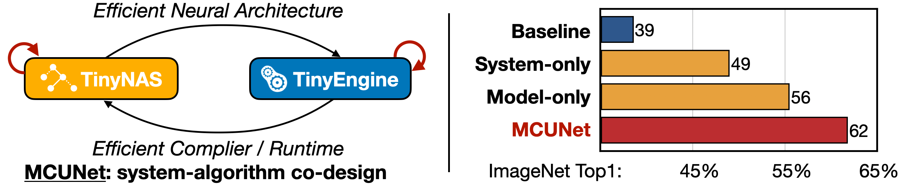
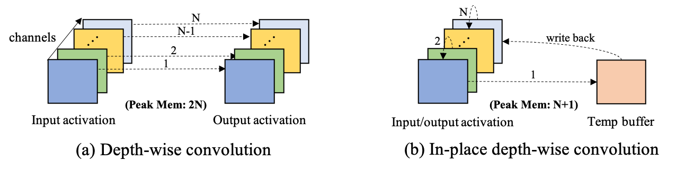
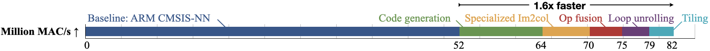
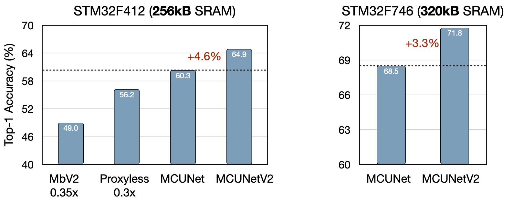

# TinyEngine

TinyEngine 的官方实现 —— 面向微控制器（MCU）的高效低内存推理引擎。

TinyEngine 是 MCUNet 框架的核心组件之一（另一组件为 TinyNAS）。MCUNet 是系统-算法协同设计的微型深度学习框架，TinyEngine 与 TinyNAS 共同设计以适配 MCU 极度受限的内存预算。

**MCUNet / TinyNAS 仓库：[github.com/mit-han-lab/mcunet](https://github.com/mit-han-lab/mcunet)**

### [TinyML 项目主页](https://hanlab.mit.edu/projects/tinyml) | [MCUNetV1](https://hanlab.mit.edu/projects/mcunet) | [MCUNetV2](https://hanlab.mit.edu/projects/mcunetv2) | [MCUNetV3](https://hanlab.mit.edu/projects/mcunetv3)

### [推理 Demo 视频](https://www.youtube.com/watch?v=F4XKn0iDfxg) | [训练 Demo 视频](https://www.youtube.com/watch?v=0pUFZYdoMY8)


---

## 新闻动态

- **(2024/03)** 发布[设备端训练新 Demo 视频](https://www.youtube.com/watch?v=0pUFZYdoMY8)（256KB 内存下的训练）。
- **(2023/10)** [Tiny Machine Learning: Progress and Futures](https://hanlab.mit.edu/projects/tinyml-magazine) 发表于 IEEE CAS Magazine。
- **(2023/02)** 推理教程现在支持不依赖 Arducam 运行。
- **(2023/02)** 开源 [OpenMV 人员检测](examples/openmv_person_detection)、[口罩检测](examples/openmv_face_mask_detection)、[设备端训练](examples/openmv_training_sparse) 三个 Demo。
- **(2022/12)** 更新 STM32H743 上的实测性能数据（使用最新版本推理库）。
- **(2022/12)** 开源 Patch 推理源码，推理教程增加 Patch 推理选项。
- **(2022/11)** 开源 Tiny Training Engine 及对应的[训练教程](tutorial/training)（训练 Visual Wake Words 模型）。
- **(2022/11)** MCUNetV3 的算法与编译部分在[此仓库](https://github.com/mit-han-lab/tiny-training)开源。
- **(2022/10)** [On-Device Training Under 256KB Memory](https://arxiv.org/abs/2206.15472) 登上 [MIT 首页](http://web.mit.edu/spotlight/learning-edge/)。
- **(2022/09)** [设备端训练论文](https://arxiv.org/abs/2206.15472) 被 NeurIPS 2022 接收。
- **(2022/08)** TinyML 与高效深度学习新课程上线：[efficientml.ai](https://efficientml.ai/)。
- **(2022/08)** 增加[推理教程](tutorial/inference)，演示部署 VWW 模型到 MCU。
- **(2022/08)** TinyEngine 仓库正式开源。
- **(2021/10)** MCUNetV2 被 NeurIPS 2021 接收。
- **(2020/10)** MCUNet 被 NeurIPS 2020 接收（**Spotlight**）。

---

## 概述

微控制器（MCU）成本低、功耗低，已广泛应用，但其内存极其有限（比 GPU 小 5 万倍），在 MCU 上部署深度学习极为困难。

MCUNet 是**系统-算法协同设计**框架，由 **TinyNAS**（神经架构搜索）和 **TinyEngine**（推理引擎）组成。两者共同设计以适配 MCU 的严格内存约束，在相同内存预算下大幅提升深度学习性能。



TinyEngine 是一个内存高效推理库。不同于传统的逐层内存优化，TinyEngine 根据**整网拓扑**进行跨层内存调度，显著降低内存占用并加速推理。它的性能优于：
- Google [TF-Lite Micro](https://www.tensorflow.org/lite/microcontrollers)
- Arm [CMSIS-NN](https://arxiv.org/abs/1801.06601)
- STMicroelectronics [X-CUBE-AI](https://www.st.com/en/embedded-software/x-cube-ai.html)

TinyEngine 采用以下优化技术：

- **原地深度卷积（In-place Depthwise Conv）**：输出直接覆写输入，减少峰值 SRAM。
- **Patch 推理（Patch-based Inference）**：将特征图在空间上分块逐块推理，大幅降低中间内存峰值。
- **算子融合（Operator Fusion）**：将多个算子合并执行，消除中间读写往返。
- **SIMD 编程**：单指令多数据，充分利用 ARMv7E-M DSP 指令集。
- **HWC→CHW 权重格式转换**：提高 Cache 命中率，配合 Inplace 深度卷积。
- **Im2Col 卷积**：将卷积转化为通用矩阵乘法（GEMM）。
- **循环重排（Loop Reordering）**：优化循环顺序提升执行速度。
- **循环展开（Loop Unrolling）**：以代码体积换执行速度。
- **循环分块（Loop Tiling）**：减少内存访问延迟，提高 Cache 利用率。



### 性能对比

**计算吞吐量提升（MAC/s）：**


**峰值内存降低：**


总结：相比 TF-Lite Micro、CMSIS-NN、X-CUBE-AI，TinyEngine 将推理速度提升 **1.1-18.6 倍**，峰值内存降低 **1.3-3.6 倍**。

### Patch 推理的内存优势


对 MobileNetV2 使用 Patch 推理可将峰值内存降低 8 倍。


在相同内存预算下，Patch 推理可实现更高精度。



---

## 代码结构

| 目录              | 说明                                                              |
| ----------------- | ----------------------------------------------------------------- |
| `code_generator/` | Python 编译前端：将 TFLite/JSON 模型编译为 C/C++ 源码              |
| `TinyEngine/`     | C/C++ 运行时后端：算子实现与 MCU 推理                              |
| `examples/`       | 使用示例：TFLite 模型转换到 TinyEngine                             |
| `tutorial/`       | 部署教程：推理和训练的 STM32CubeIDE 项目模板                        |
| `assets/`         | 图片、GIF 等静态资源                                               |

---

## 环境要求

- Python 3.6+
- STM32CubeIDE 1.5+
- 硬件：STM32F746G-DISCO 探索板（ARM Cortex-M7）

---

## 安装（用户）

```bash
git clone --recursive https://github.com/mit-han-lab/tinyengine.git
cd tinyengine
pip install -r requirements.txt       # numpy, torch, flatbuffers, tqdm, matplotlib, torchvision
export PYTHONPATH=${PYTHONPATH}:$(pwd)
```

（可选）推荐使用 Conda 虚拟环境：

```bash
conda create -n tinyengine python=3.6 pip
conda activate tinyengine
```

---

## 安装（开发者）

安装 pre-commit 钩子自动格式化代码：

```bash
pre-commit install
```

---

## 部署示例

详见 [`tutorial/`](tutorial)：
- [推理 Demo](tutorial/inference)：部署 Visual Wake Words 模型
- [训练 Demo](tutorial/training)：在 MCU 上训练 VWW 模型

基本流程：

```bash
# 第1步：生成 C 代码
python examples/vww.py

# 第2步：拷贝到 STM32CubeIDE 项目
cp -r ./tutorial/inference ./tutorial/TinyEngine_vww_tutorial
# 将 codegen/ + TinyEngine/include + TinyEngine/src 合并进去

# 第3步：STM32CubeIDE 打开项目 → 编译（-Ofast）→ 烧录
```

---

## 实测数据

- 所有 TFLite 模型来自 [MCUNet 模型库](https://github.com/mit-han-lab/mcunet#model-zoo)。
- 在 **STM32H743** 上测试（限制 512KB SRAM + 2MB Flash）。
- 编译优化级别：`-Ofast`。
- OOM = 内存不足。

### 推理延迟

| 模型 (VWW)       | TF-Lite Micro | CMSIS-NN | X-CUBE-AI v7.3.0 | TinyEngine |
| ---------------- | ------------- | -------- | ---------------- | ---------- |
| mcunet-vww0      | 587ms         | 53ms     | 32ms             | **27ms**   |
| mcunet-vww1      | 1120ms        | 97ms     | 57ms             | **51ms**   |
| mcunet-vww2      | 5310ms        | 478ms    | 269ms            | **234ms**  |

| 模型 (ImageNet)  | TF-Lite Micro | CMSIS-NN | X-CUBE-AI v7.3.0 | TinyEngine |
| ---------------- | ------------- | -------- | ---------------- | ---------- |
| mcunet-in0       | 586ms         | 51ms     | 35ms             | **25ms**   |
| mcunet-in1       | 1227ms        | 103ms    | 63ms             | **56ms**   |
| mcunet-in2       | 6463ms        | 642ms    | 351ms            | **280ms**  |
| mcunet-in3       | 7821ms        | 770ms    | 414ms            | **336ms**  |
| mcunet-in4       | OOM           | OOM      | 516ms            | **463ms**  |

### 峰值内存（SRAM）

| 模型 (VWW)       | TF-Lite Micro | CMSIS-NN | X-CUBE-AI v7.3.0 | TinyEngine |
| ---------------- | ------------- | -------- | ---------------- | ---------- |
| mcunet-vww0      | 163kB         | 163kB    | 88kB             | **59kB**   |
| mcunet-vww1      | 220kB         | 220kB    | 113kB            | **92kB**   |
| mcunet-vww2      | 385kB         | 390kB    | 201kB            | **174kB**  |
| mcunet-in0       | 161kB         | 161kB    | 69kB             | **49kB**   |
| mcunet-in1       | 219kB         | 219kB    | 106kB            | **96kB**   |
| mcunet-in2       | 460kB         | 469kB    | 238kB            | **215kB**  |
| mcunet-in3       | 493kB         | 493kB    | 243kB            | **260kB**  |
| mcunet-in4       | OOM           | OOM      | 342kB            | **416kB**  |

### Flash 占用

| 模型 (VWW)       | TF-Lite Micro | CMSIS-NN | X-CUBE-AI v7.3.0 | TinyEngine |
| ---------------- | ------------- | -------- | ---------------- | ---------- |
| mcunet-vww0      | 627kB         | 646kB    | 463kB            | **453kB**  |
| mcunet-vww1      | 718kB         | 736kB    | 534kB            | **521kB**  |
| mcunet-vww2      | 1016kB        | 1034kB   | 774kB            | **741kB**  |
| mcunet-in0       | 1072kB        | 1090kB   | 856kB            | **842kB**  |
| mcunet-in1       | 937kB         | 956kB    | 737kB            | **727kB**  |
| mcunet-in2       | 1084kB        | 1102kB   | 849kB            | **830kB**  |
| mcunet-in3       | 1091kB        | 1106kB   | 867kB            | **835kB**  |
| mcunet-in4       | OOM           | OOM      | 1843kB           | **1825kB** |

---

## 引用

如果本项目对您有帮助，请引用我们的论文：

```
@article{lin2020mcunet,
  title={Mcunet: Tiny deep learning on iot devices},
  author={Lin, Ji and Chen, Wei-Ming and Lin, Yujun and Gan, Chuang and Han, Song},
  journal={Advances in Neural Information Processing Systems},
  volume={33}, year={2020}
}

@inproceedings{lin2021mcunetv2,
  title={MCUNetV2: Memory-Efficient Patch-based Inference for Tiny Deep Learning},
  author={Lin, Ji and Chen, Wei-Ming and Cai, Han and Gan, Chuang and Han, Song},
  booktitle={NeurIPS}, year={2021}
}

@article{lin2022ondevice,
  title={On-Device Training Under 256KB Memory},
  author={Lin, Ji and Zhu, Ligeng and Chen, Wei-Ming and Wang, Wei-Chen and Gan, Chuang and Han, Song},
  booktitle={NeurIPS}, year={2022}
}
```

---

## 相关项目

- [MCUNetV1: Tiny Deep Learning on IoT Devices](https://mcunet.mit.edu/#mcunetv1) (NeurIPS 2020)
- [MCUNetV2: Memory-Efficient Patch-based Inference for Tiny Deep Learning](https://mcunet.mit.edu/#mcunetv2) (NeurIPS 2021)
- [MCUNetV3: On-Device Training Under 256KB Memory](https://mcunet.mit.edu/#mcunetv3) (NeurIPS 2022)
- [配套学习笔记](../学习计划_每天45分钟.md) — 31 天 × 45 分钟入门计划
