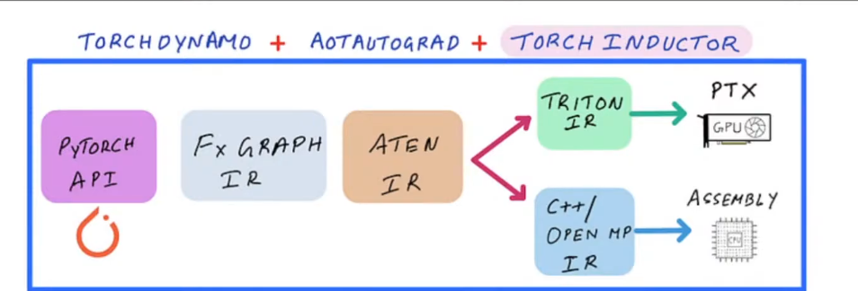

### 如何使用 torch.compile

参考：https://docs.pytorch.org/tutorials/intermediate/torch_compile_tutorial.html

torch.compile 是 2.0 之后加速 PyTorch 代码的方法，使用 JIT 编译，几乎不需要改动代码。任何 Python 函数或 PyTorch 模块都可以传入并被优化版本替换。

torch.compile 在最初几次执行时需要额外时间来编译模型。torch.compile 尽可能复用已编译的代码，所以如果我们多次运行优化后的模型，应该会看到相比 eager 模式的显著提升。参见 ex 03_speedup.py。

#### 编译栈



这是我对 torch compile 栈整体流程的理解：

1. **PyTorch API** - 这是你平时在 torch 中写的 `nn.Module`。
2. **Dynamo** - Dynamo 拦截普通 Python 流程，将 PyTorch 特定操作捕获为图。可以将其理解为 DAG。
3. **FX 图** - FX 图是 PyTorch 的内部图表示。这个 IR 非常容易操作和调试，因为它只是图结构，只有 6 条主要指令。
4. **ATen 运算** - 图中所捕获的所有运算都必须降低到 torch 中用 C++ 编写的原始运算，例如 cos、sin 等。它们全部存在于 `aten/` 库中。
5. **Torch Inductor** - 这是实际的编译器后端，接收这些 ATen 运算，最终将它们降低为 Triton 内核、PTX 等。

#### Graph Break（图断裂）

图断裂是 torch.compile 中最基本的概念之一。它使 torch.compile 能处理任意 Python 代码，通过中断编译、执行不支持的代码、然后恢复编译来实现。"图断裂"这个术语来源于 torch.compile 试图捕获并优化 PyTorch 运算图这一事实。当遇到不支持的 Python 代码时，这个图必须被"断裂"。图断裂会导致优化机会的损失，这可能仍是不理想的，但这比静默错误或硬性崩溃更好。

1. 使用 `fullgraph=True` 来识别和消除图断裂。同时使用 dynamo explain。
2. 你不需要编译所有代码，比如不值得编译数据加载逻辑、磁盘 IO 等。
3. 常见的图断裂原因：
   - 不正确的代码——关闭 compile 检查正确性
   - 数据依赖的代码——如果你的控制流实际上不依赖数据值，考虑修改代码使控制流基于常量。
   - 使用 `torch.cond` 控制流
   - `print()` 日志会导致图断裂。
4. torch.compile 的应用位置：
   - 理想情况下在最高层级，这样有更多机会融合、消除冗余工作、减少内核启动等。
5. 当有一段难以或无法编译的代码，但仍希望程序其余部分受益于 torch.compile 时，使用 `torch_dynamo_disable`。它确实也会导致图断裂，但区别在于不会浪费 Dynamo 重复编译，也没有奇怪的日志和错误。你提前知道不想浪费时间编译这部分。
6. 并非所有运算都能融合。Pointwise 运算可以，reduction 内核也可以但比 pointwise 稍难。
7. 过度融合未必是好事——如果寄存器压力过大。
8. 使用 CUDA 图来减少开销，它进行捕获和重放，在内核数量较多时很有帮助。这是因为每个内核从主机端需要调用设备、设置数据 + CUDA 流 + 传输数据等。

#### ATen vs Core ATen vs Prim 运算

1. **ATen** - ATen 似乎是面向用户的标准 ATen 运算集，如 linear、conv、embedding 等。
   你可以在此列表中快速搜索验证：https://github.com/pytorch/pytorch/blob/main/aten/src/ATen/native/native_functions.yaml

2. **Core ATen** - 一个更小的、更集中的 ATen 运算子集，原生 ATen 运算可被分解为这些运算。问题在于 ATen 有超过 2000 个运算，它们通常只是单个运算的变体。所以我们需要一个标准的最小运算集，每个模型都可以分解为这些运算。
   你可以在此找到列表：https://docs.pytorch.org/docs/2.12/user_guide/torch_compiler/torch.compiler_ir.html
   相关讨论：https://dev-discuss.pytorch.org/t/defining-the-core-aten-opset/1464

3. **Prim 运算** - 这是最低层级，包含原子运算如 prim.add、prim.mul 等。
   你可以在此找到列表：https://docs.pytorch.org/docs/2.12/user_guide/torch_compiler/torch.compiler_ir.html

层级关系大致如下：

```
aten(完整集) → 分解为 core aten(较小子集) → 分解为 prim ops(原子运算)
```
