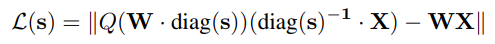
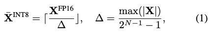
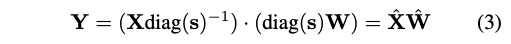
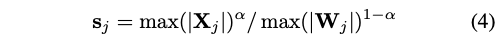

## 量化笔记

关于量化的入门阅读请参考我的博客：https://jino-rohit.github.io/blogs/blog.html

一个很好的量化思维模型：

量化本质上解决的是数据搬运问题。问题在于，与把数据从一个地方搬到另一个地方相比，算术计算本身快得离谱。

那为什么还需要搬运数据呢？

这是因为 SRAM/寄存器与 HBM（存放 LLM 所有权重的地方）相比非常小。在每次 token 生成时，我们把一小块数据从 HBM 搬到 SRAM，计算，然后再搬回去。真正拖慢整体系统的是这个搬运过程，而非计算本身。

当你从较大的 FP16 量化到 FP8 时，这并不意味着计算变快，而是意味着需要搬运的数据变少，因此整体系统现在更快了。

用一个例子来说明：

假设你有一块 A100：
- 内存带宽：2000 GB/s
- 计算能力：312 TFLOPS

你想从一个 100B 参数的模型做推理生成。

**数据传输**

对于 FP16，每个参数需要 16 位即 2 字节。所以总数据量 = 100 × 10^9 × 2 = 200 GB
对于 FP8，每个参数只需 1 字节，所以总数据量 = 100 GB

**实际计算**（我简化为只算矩阵乘法，包含乘法和加法）

总计算量 = 100 × 10^9 × 2 = 200 GFLOPS

现在，在 A100 上生成一个 token 需要多长时间？

**FP16 情况**

加载数据 = 200 GB / 2000 GB/s = 0.1 s
计算 = 200 GFLOPS / 312 TFLOPS = 0.0006 s

看，数据传输比实际计算慢超过 100 倍。

**FP8 情况**

加载数据 = 100 GB / 2000 GB/s = 0.05 s
计算 ≈ 0.0006 s（可能比 FP16 稍快一点）

注意关键变化：虽然计算可能只是略快一点，但加载数据变得显著更快了！

这就是所有量化算法本质上要做的事。

### 1. 对称量化（参考：https://newsletter.maartengrootendorst.com/p/a-visual-guide-to-quantization）

在对称量化中，原始浮点值的范围被映射到量化空间中关于零点对称的范围。这意味着零永远是零。这也被称为 absmax 量化。

假设我们想把以下数字从 FP16 转换为 INT8：

```
5.47 8.21 3.145 10.94
```

这个范围的最大值是 10.94
INT8 范围的最大值是 127

缩放因子 = 10.94 / 127 = 0.086

现在对第一个值 5.47 进行量化：
= round(值 / 缩放因子)
= round(5.47 / 0.086)
= round(63.60)
= 64

进行反量化：
= 缩放因子 × 值
= 0.086 × 64
= 5.50

这里的误差是 (5.50 - 5.47) = 0.03

### 2. 非对称量化

在非对称量化中，浮点范围的最小值和最大值直接映射到量化范围的最小值和最大值（不以零为中心）。

浮点范围 = [r_min, r_max]
整数范围 = [q_min, q_max]

对于 INT8：[−128, 127]

缩放因子：

```
S = (q_max - q_min) / (r_max - r_min)
```

零点：

```
Z = q_min - r_min × S
```

量化公式：q = round(r / S)

反量化公式：r = S × q

### 3. `bitsandbytes` 即 `int8` 论文

- https://arxiv.org/pdf/2208.07339
- https://huggingface.co/blog/hf-bitsandbytes-integration

该技术在 INT8 下做矩阵乘法，性能几乎不下降。

**核心算法：**
1. 从隐藏状态（输入）中，按列找出异常值（超出某个阈值的值）。
2. 异常值用 FP16 做矩阵乘法，其余部分用 INT8。由于异常值通常只占约 1%，这么做是可行的。
3. 对非异常值的结果进行反量化，与 FP16 异常值结果相加，产生最终的 FP16 输出。

bnb 不使用整个张量的单一缩放因子（这样做效果很差，因为一个大值就会扭曲整个表示），而是采用向量级量化。这意味着每行/每列拥有自己的缩放因子，从而在保留 INT8 效率优势的同时，更好地保持信息。

### 4. `AWQ` 量化

论文：https://arxiv.org/pdf/2306.00978

AWQ 是一种对模型权重进行低位量化的方法。用这个方法，模型权重可被量化到 4 位，然后在激活计算时反量化为 FP16（W4A16）。此外，权重也可以基于 AWQ 量化到 3 位或 8 位，然后用 4 位、8 位或 16 位进行运算，产生 W4A4 和 W4A8 等方法。

但作者表示 W4A16 带来的精度损失最小，因此是最推荐的方式。

理解 AWQ 量化有三个要点：

**1）并非所有权重同等重要，只有一小部分影响很大**

作者证明只有极少量的权重（约 0.1%-1%）对模型精度有巨大影响。大多数权重实际上可以容忍激进的低位量化而不会太影响模型。

这引出一个重要思路：

如果我们能以某种方式仅保护重要权重，同时把其余部分量化到 INT4/INT3，就能大幅减少内存占用、提升推理速度，而精度几乎不变。

**如何识别这些重要（显著）权重？**

*(a) 随机选择*

随机选取 0.1%-1% 的权重保留在 FP16。这种方法效果很差，几乎等同于朴素的就近舍入（RTN）量化。

*(b) 基于权重大小的选择*

首先按绝对值排序，把绝对值最大的视为重要的。令人惊讶的是，论文发现这种方法几乎和随机选择一样差。这是一个非常重要的观察，因为许多旧的量化方法假设：权重越大 = 越重要。但 AWQ 显示这对 LLM 来说通常不成立。

*(c) 基于激活分布的选择*

论文不再看权重值本身，而是看激活值的大小。

这里的"激活"指的是矩阵乘法中与权重矩阵相乘的输入张量。

对于线性层 y = Wx，
激活是 x，而不是输出。

论文发现基于激活统计来选择重要权重的效果远好于基于权重大小的选择。事实上，仅保留 0.1%-1% 的激活重要权重在 FP16，就能获得非常接近全 FP16 推理的精度。

他们还使用通道级而非元素级方法：
- 每个输入通道（权重矩阵的一列）被视为一个单元
- 激活大小按通道取平均
- 激活平均值最大的通道被视为显著的

**这个方法的难题：** 如果权重矩阵中有些元素以 FP16 存储，有些以 INT4 存储，存储和读取都会变得复杂且慢。因此他们提出了缩放方法。

**2）在量化过程中放大重要权重可以减少量化误差**

具体数学公式参见论文。

**3）计算缩放因子的算法**

目标是让以下两者的差异最小化：
- 原始 FP16 层的输出
- 缩放后量化层的输出



直接优化这个公式面临两个困难：

1. 量化不可微——量化包含 round() 舍入操作，这是不可微的。权重的微小变化可能突然跳到不同的整数桶，使基于梯度的优化不稳定。

2. 优化问题非凸

AWQ 通过观察到激活值较大的通道通常更重要来简化问题。

因此，重要通道应获得较大的缩放因子，不重要通道应获得较小的缩放因子。所以 AWQ 不再独立优化每个缩放因子，而是直接从激活统计中推导缩放因子。

**基于激活的缩放：**

对于每个输入通道：
- 计算平均激活大小
- 将其作为基础重要度评分

缩放因子变为：

s = sX^α

sX 是每个通道的平均激活大小
α ∈ [0,1] 控制缩放强度

现在我们只需搜索 α。在 [0,1] 区间内大约取 20 个值（如 0, 0.05, 0.10, 0.15），然后对每个值计算损失，使 MSE 损失最小化的 α 就是最优值。

`group_size` 是唯一的超参数。

- 较大的 group_size 使每组权重更多、量化参数更少，可能降低量化模型精度，但也降低计算和存储成本。
- 较小的 group_size 使每组权重更少、量化参数更多，可能提高模型精度，但也增加计算和存储成本。
- 标准默认值是 128。

引自此 issue：https://github.com/vllm-project/llm-compressor/issues/1522

我们发现对于较小模型（如 8B 级别），随机生成的 token 就足够好用了；对于大模型（如 70B 和 405B），则需要使用合适的数据集才能获得准确的量化模型。这与前面的直觉一致：在量化过程中，我们想要触发异常值/激活值以正确捕获其行为。

### 5. `SmoothQuant` 量化

量化的通用公式是：



这个公式的问题是，与 CNN 不同，LLM 的激活值中有太多的异常值，因此如果直接用这个公式，大多数异常值最终都会被置为零。

通常模型权重的分布更均匀，因此量化更容易。但仅量化权重几乎不会带来性能提升——实际上可能更差，因为在计算时你需要将权重重化为 FP16 再与激活值相乘。

另一方面，激活值中的异常值非常难处理。

作者发现异常值通常出现在激活值的少数特定通道中。而且对于一个 token，如果某个特定通道有较大的激活值，其他通道也会有较大的激活值。

他们思考也许应该对异常值 token 采用不同的量化方式：
1. 在运行时检测异常值 token
2. 对特殊通道使用更大的量化缩放因子
3. 其他地方使用正常缩放因子

但这确实对硬件不友好。

如果每个 token 都有不同的缩放因子、不同的量化规则、不同的通道处理方式，GPU 会产生大量分支和内存访问，造成速度下降。

**如果我们将异常值从激活值转移到权重呢？**

他们放大模型权重，缩小激活值，但数学上缩放因子互相抵消，结果保持不变。



这样，激活值的"异常值"通道被平滑了，异常值部分被"转移"到了权重中。经过这个操作后：
1. 激活值的整体方差减小，降低了量化难度。
2. 权重的整体方差增加了，但它们原本的方差很小，即使增加了，量化难度仍在可接受范围内。

现在需要找到的超参数是 `scale` 因子。

1. 场景一：s = max(X)——这将使激活值的所有异常值都转移到权重中，激活值变得容易量化，但权重很难量化。

2. 场景二：s = 1 / max(X)——这会使原本方差较小的权重方差更小，而激活值的方差更大。



通过引入超参数 α 来平衡这两种极端情况，他们发现 α = 0.5 是最佳选择。

平滑因子——异常值从激活值平衡转移到权重的程度，或者说激活值分布的平滑程度。

1. 使用较大的因子可以大幅平滑激活值中的异常值，减少激活值的整体方差，使激活值更容易量化；副作用是权重方差增大，使权重量化更难。
2. 使用较小的因子对平滑异常值作用不大，激活值难以量化。
3. 一般推荐 0.5。

SmoothQuant 通常是 W8A8。

### 6. `GPTQ` 量化

理解 GPTQ 需要大量前置知识（主要是微积分，但要在应用层面而非纯理论理解）：

1. 高阶导数
2. 这直接关联到 Hessian 矩阵的使用（然后是为什么 Hessian 矩阵会很慢的问题）
3. 开始理解 Taylor 级数如何近似函数
4. 阅读 Lagrange 乘数法
5. 阅读 OBS（一种网络剪枝方法）
6. 阅读 OBQ（一种建立在 OBS 之上的量化方法，理解了 OBS 就很容易理解）

之后，阅读 GPTQ 论文应该就能理解了，因为 GPTQ 将 OBQ 精简并目标在于让它更快。

**OBS 算法的粗略直觉：**

假设你有一个训练好的神经网络，你想删除一个权重（将其设为零），但不希望模型的精度下降。怎么做？

w = [w1, w2, w3] = [0.8, 0.05, 0.6]

**步骤 1**：使用 Taylor 展开近似损失函数的变化

假设我们用向量 ΔW 扰动权重，损失的变化是：

```
δL = (∂L/∂w)ᵀ Δw + ½ ΔwᵀH Δw + O(||Δw||³)
```

（回忆 Taylor 展开：f(x) + f'(x)δ + ½f''(x)δ² + ...，将其应用到 L(w + Δw)）

一阶导数 (∂L/∂w)ᵀ Δw——这是表示损失随权重微小变化而变化的斜率。

二阶导数 ½ ΔwᵀH Δw——这表示斜率本身如何变化。

三次项 O(||Δw||³)

现在去掉第一项。为什么？如果模型已训练好且损失已收敛，则没有梯度残存。
同时去掉三次项，因为 Δ 变化非常小，整体项可忽略。

所以我们只剩下：

```
δL ≈ ½ ΔwᵀH Δw
```

**步骤 2**：理解 Hessian 矩阵 H

H 是一个二阶导数矩阵，对于我们的 3 权重例子是 3×3：
H[i,j] = ∂²L / (∂wi ∂wj)

对角线 H[i,i] 告诉我们——如果改变权重 i，损失曲线的弯曲程度（曲率）有多大？
非对角线 H[i,j] 告诉我们——如果同时改变 wi 和 wj，它们如何相互作用？

假设我们的 Hessian 如下：

H = [ 4.0   0.5   0.2 ]
    [ 0.5   0.1   0.1 ]
    [ 0.2   0.1   3.0 ]

对角线说明：w1 曲率 4.0（陡峭），w2 曲率 0.1（平坦），w3 曲率 3.0（陡峭）

**步骤 3**：将"删除权重 q"表示为一个约束

wq 是需要修改的权重。

假设我们要删除 w2（q=2）。我们需要 wq 变为 0，所以位置 q 处的变化是 Δwq = -wq。

我们用单位向量 eq 来简洁表达：

对于 q=2：e2 = [0, 1, 0]

约束变为：
Δw + w2 = 0

展开：[0,1,0] [Δw1, Δw2, Δw3] + 0.05 = 0

所以：Δw2 = -0.05（位置 2 处的变化抵消了 w2）

w1 和 w3 是自由的，它们会被调整来补偿。

**步骤 4**：用 Lagrange 乘数法求解约束优化

我们希望：
- 最小化：δL = ½ ΔwᵀH Δw（使损失增加尽量小）
- 满足约束：Δw + wq = 0（权重 q 变为零）

Lagrange 乘数法将这些合并为一个问题：
最小化：F(Δw, λ) = ½ ΔwᵀH Δw + λ(eqᵀ Δw + wq)

对 Δw 求导并设为零：
H Δw + λeq = 0
Δw = -λ H⁻¹ eq

代入约束求解 λ：
eqᵀ(-λ H⁻¹ eq) + wq = 0
λ = wq / [H⁻¹]qq

[H⁻¹]qq 只是逆 Hessian 的 (q,q) 项，一个单一数值。

代入 λ 得到：
Δw = -(wq / [H⁻¹]qq) · H⁻¹ eq    （权重更新公式）

这精确告诉我们如何微调每个剩余的权重来补偿删除 wq。

**步骤 5**：显著性得分（我们应该真正剪掉哪个权重？）

将 Δw 代回 δL = ½ ΔwᵀH Δw：
δL = ½ · wq² / [H⁻¹]qq    （显著性得分）

对每个权重计算，剪掉得分最低（损失最小）的那个。

对于我们的例子，假设 H⁻¹ 对角线 ≈ [0.27, 11.1, 0.34]：
- w1: ½ · 0.64 / 0.27  = 1.19
- w2: ½ · 0.0025 / 11.1 = 0.00011  ← 最小，剪掉这个
- w3: ½ · 0.36 / 0.34  = 0.53

w2 胜出，因为它值很小且处于平坦区域（[H⁻¹]qq 很大）。

**[H⁻¹]qq 与 H[q,q] 的关系：**
- 大的 H[q,q] = 陡峭曲率，意味着小的 [H⁻¹]qq，所以显著性得分大，剪枝危险
- 小的 H[q,q] = 平坦曲率，意味着大的 [H⁻¹]qq，所以显著性得分小，剪枝安全

因此 [H⁻¹]qq 相当于平坦度度量。显著性公式平衡了两个因素：
- 权重是否小？(wq²)
- 区域是否平坦？([H⁻¹]qq)

两者都成立时，权重才是好的剪枝候选。

### 7. `OBQ` 算法

OBQ 迅速将这种方法扩展到量化。

剪枝可以看作是量化的特例——将值近似为 0，可以称为 0 位量化。

所以扩展这个方程：

```
δL = ½ · wq² / [H⁻¹]qq
```

变为：

```
δL = ½ · (wq - quant(wq))² / [H⁻¹]qq
```

### 8. `QuIP：LLM 的 2 位量化`

很好的讲解视频：https://www.youtube.com/watch?v=6wEVz0wkhCM
