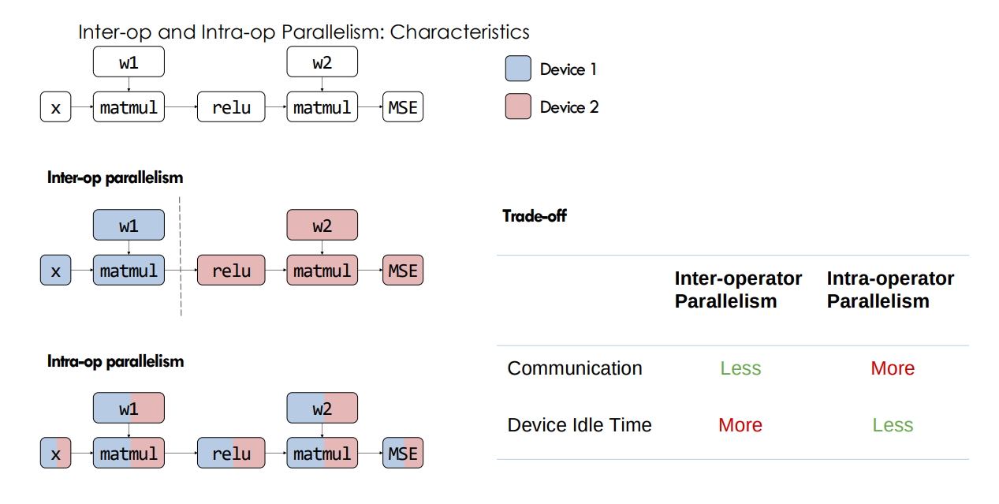
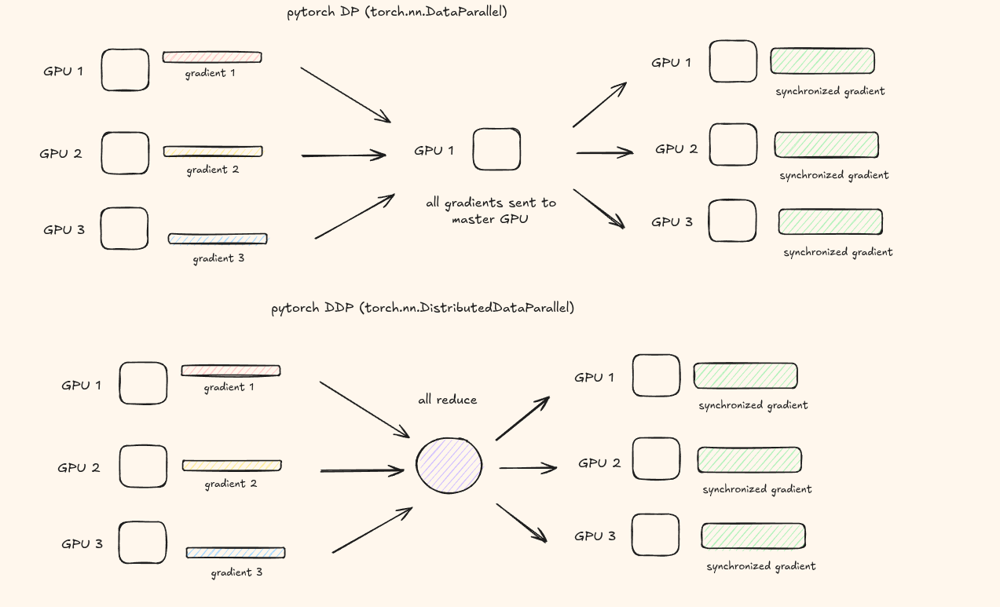
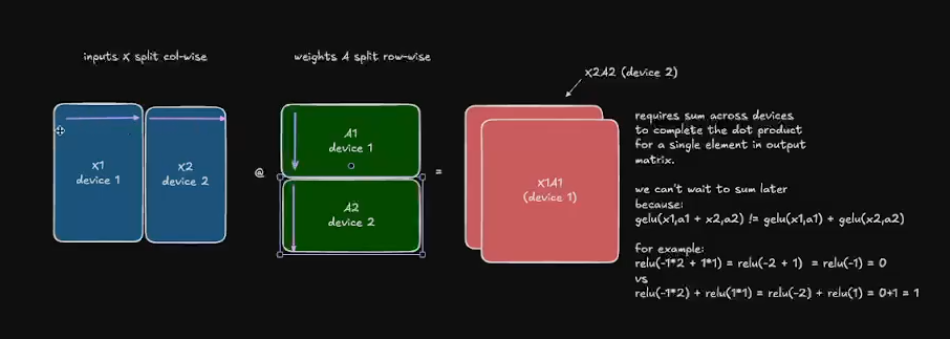
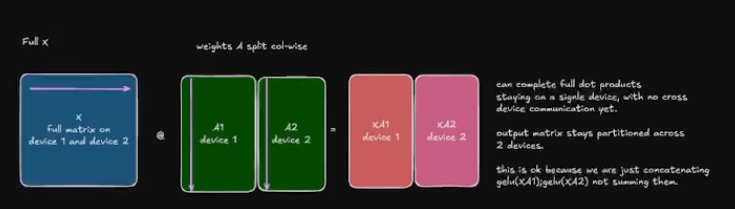
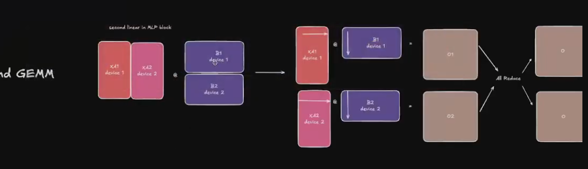
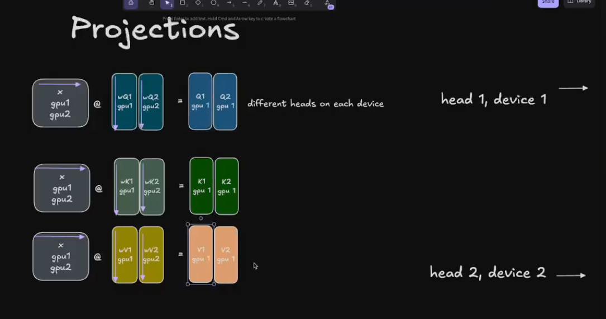
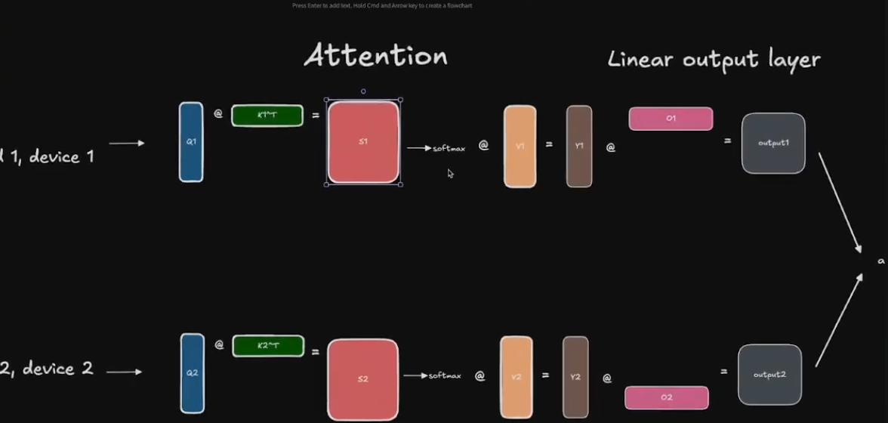
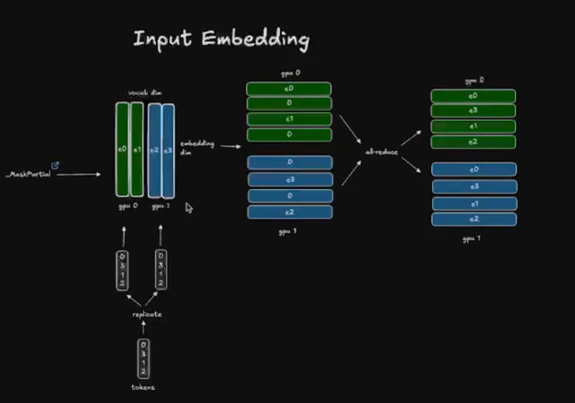
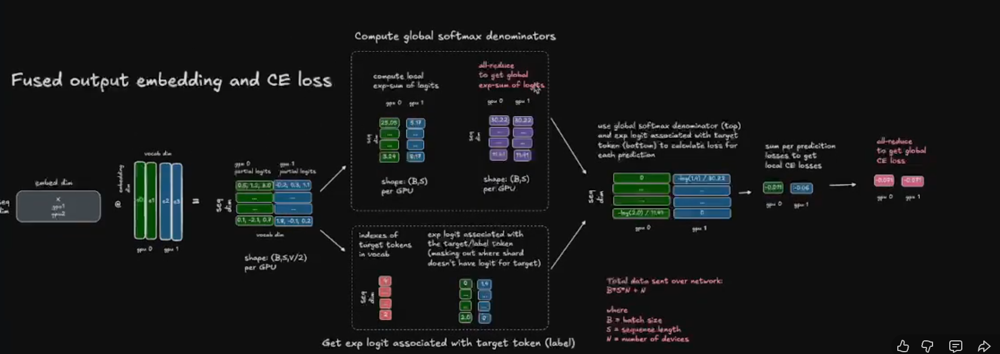

# LLM 的并行化技术

有时 LLM 无法装入单个 GPU，或者你有多个 GPU 想要利用来加速训练等。为了跨多个 GPU 扩展 LLM，我们使用并行化技术。

## 算子间并行（Inter-Op）vs 算子内并行（Intra-Op）

**算子间并行（Inter-Op Parallelism）：**
- 将不同的算子分配到不同的设备。第二个算子依赖第一个算子的输出。
- 通常需要连续算子之间的点对点通信（比如将输出从 Device 1 发送到 Device 2）。
- 当一个算子提前完成但必须等待其他算子完成才能进入下一阶段时，可能出现设备空闲时间。

**算子内并行（Intra-Op Parallelism）：**
- 将单个算子拆分到多个设备（例如大矩阵乘法）。
- 通常依赖集合通信（all-reduce、all-gather、broadcast 等）来合并部分结果。
- 实现良好时吞吐量高，但如果算子不够大或网络较慢，通信开销可能显著。

如何衡量并行化的效率？

我们可以用算术强度即 ops / 数据移动量来衡量。但这仅与单个算子相关。

### MFU（模型 FLOPs 利用率）

直觉上，了解我们能实现 GPU 峰值利用率百分之多少是很有用的。

MFU = (FLOPs / t) / 峰值 FLOPS

- FLOPs - 总浮点运算数
- t - 完成运算所需时间
- 峰值 FLOPS - 硬件能提供的最大理论 FLOPs

影响 MFU 的一些因素：
- **计算图中的运算类型**：ML 模型中运算的类型和形状会影响 MFU。例如不同的运算（如矩阵乘法、卷积）有不同的 FLOPs 量。
- **精度、核心数和 GPU 类型**：硬件的精度（如 FP32、FP16）、核心数和 GPU 类型（如 V100、A100、H100）影响峰值 FLOPs 从而影响 MFU。
- **网络通信**：网络通信可能引入延迟，降低 MFU。
- **优化**：优化不佳的代码或硬件资源使用低效会降低 MFU。精度降低、核心利用率、内存高效内核、更好的调度和 GPU 类型选择等技术会影响 MFU。

**MFU 友好和 MFU 不友好的运算：**
- MFU 友好的运算：最大化 FLOPs 利用率的运算，如高算术强度的矩阵乘法（matmul）。
- MFU 不友好的运算：涉及更多数据移动或内存受限而非计算受限的运算，如逐元素运算（如 ReLU）或数据重排。

## DP vs DDP

**PyTorch 数据并行（DP）：**

`torch.nn.DataParallel` 是 PyTorch 提供的最早的数据并行方法。它基于单进程实现。它使用单个进程计算模型权重，并在每个 batch 将数据分发到每个 GPU。流程如下：
1. 输入从主 GPU 拆分到所有 GPU。
2. 模型从主 GPU 复制到所有 GPU。
3. 每个 GPU 执行前向 + 反向传播，计算梯度。
4. 这些梯度发送到主 GPU，使用梯度更新模型权重。
5. 新权重从主 GPU 复制到所有 GPU。
6. 继续。

是的，单进程设计受到 Python GIL 开销的影响，但主要问题是主 GPU 成为瓶颈。所有梯度都需要发送到主 GPU，聚合只发生在该 GPU 上，而其他 GPU 处于空闲。随着 GPU 数量增加，这会导致非常差的扩展性。

**PyTorch 分布式数据并行（DDP）：**

`torch.nn.DistributedDataParallel` 基于多进程，比之前的方案更高效。
1. 每个 GPU 启动一个进程。
2. 初始化期间，模型参数被同步，使所有副本从相同状态开始。
3. 每个进程接收数据集的不同分片。
4. 每个 GPU 执行前向 + 反向传播，计算梯度。
5. 不是将梯度仅发送到主 GPU，而是与所有其他 GPU 执行 all-reduce，这样每个 GPU 都拥有真正的 reduce 后的梯度。
6. 每个 GPU 现在使用相同梯度更新权重，因此所有进程的新模型权重完全相同。
7. 继续。

这不再有主 GPU 瓶颈问题，相比 DP 扩展性极好。

## DDP vs FSDP（待补充笔记）

## 数据并行（Data Parallelism）

思路是如果你有 5 个 GPU：
1. 在所有 5 个 GPU 中复制 LLM。
2. 将数据划分为 micro-batch，在 5 个 GPU 上并行运行。
3. 每个 GPU 独立计算自己的前向和反向传播。
4. 现在为了获得 LLM 的最终更新状态，对梯度执行 NCCL all-reduce 操作，这样每个 GPU 都拥有相同的平均梯度，每个 GPU 完全相同地更新自己的权重。

一种朴素的方法是等待所有反向传播完成后再 reduce，但这会让 GPU 空闲，我们不想要这样。

需要重叠计算和通信。主要有两种技术：

1. **将通信与反向传播重叠** - 思路是当最后一层的反向传播一完成，就可以对该梯度应用 reduce，而更早的层继续它们的反向传播。由于反向传播从最后一层到第一层，这可以很好地流水线化。
2. **梯度打包（Bucketing Gradient）** - 不是对每个梯度步骤都执行一次通信，我们可以将它们分组后再应用。这节省了通信成本。

数据并行有其局限性。超过一定的 DP 并行度后，由于通信开销随 GPU 数量增长，吞吐量会下降。而且整个方法假设模型能装入单个 GPU。如果不能，仅靠 DP 无法帮助你。

DP 只是通过跨 GPU 并行处理多个数据 batch 来提高吞吐量，模型本身根本没有被拆分。

## ZeRO（零冗余优化器）

ZeRO 的核心思想是将模型参数和梯度在 DP 并行组之间分片，每个节点只存储数据的一部分。这些分片在需要时按需重建，从而将内存使用量除以数据并行度 Nd。

**1. ZeRO-1 - 分区优化器状态**

在传统 DP 中，所有进程收集相同的梯度并执行相同的优化器步骤。这有大量重复工作。

核心思想是：不是每个 GPU 持有完整的优化器状态，而是将它们跨 N 个 GPU 分区。所以每个 GPU 只持有 1/N 的优化器状态，在优化器步骤中只更新 1/N 的权重。但在前向传播期间，每个副本仍需要完整参数集。所以在优化器步骤之后，需要一个 all-gather 将更新后的权重重新分发到所有 GPU。

单步训练的运算序列：

1. 前向传播期间，每个副本使用完整参数集，但在不同的 micro-batch 上运行。
2. 反向传播期间，使用每个副本本地计算的完整梯度。
3. 对梯度执行 reduce-scatter，这里每个 GPU 最终只获得 1/N 的梯度。这替代了普通 DP 的 all-reduce。
4. 每个 GPU 对其本地优化器状态分片执行优化器步骤，产生 1/N 的更新后参数。
5. 然后对参数执行 all-gather，每个 GPU 重新获得完整的更新后权重集。

这样，不是持有完整优化器状态，我们只持有其中的一部分，节省了大量内存。

**2. ZeRO-2 - 进一步分区梯度**

在 ZeRO-1 中，由于只使用一部分优化器状态，你只需要一部分梯度，不需要完整的。因此我们不做 all-reduce，而是对梯度执行 reduce-scatter 来获得一部分。这又是额外的内存节省，因为现在我们与优化器一起只存储一部分梯度。

**3. ZeRO-3 - 同时分区模型层**

在 ZeRO-3 中，假设你有 10 层，对于每次前向和反向传播，你保留 1/N DP 并行度的层分片，在每一步执行 all-gather 获取完整层，计算然后丢弃。

这听起来有大量通信开销，但 ZeRO-3 使用重叠技术：当第 N 层正在计算时，第 N+1 层正在预取，因此 GPU 从不空闲。

尽管通过分片优化器、梯度和模型参数取得了显著的节省，你仍然无法分片激活值。

## Transformer 中的内存使用

让我们回头看看激活值如何影响内存使用。

训练 LLM 时，你在内存中存储以下几种东西：
- 模型权重
- 模型梯度
- 优化器状态
- 计算梯度所需的激活值

如果 N 是参数数量，且使用 FP32（4 字节）：
- 参数内存 = 4N
- 梯度内存 = 4N
- 优化器状态内存 = (4 + 4)N

关于激活值内存请参阅：https://huggingface.co/spaces/nanotron/ultrascale-playbook?section=memory_for_activations
但总体思路是它会随着批次大小和序列长度的增加而失控增长。

由于激活值依赖于输入，很难用我们上面看到的数据并行技术来分片它们。

## 张量并行（Tensor Parallelism）

参考：https://huggingface.co/spaces/nanotron/ultrascale-playbook?section=tensor_parallelism_in_a_transformer_block

这项技术对权重、梯度和优化器状态以及激活值都进行分片。它之所以有效，是因为矩阵乘法中既可以按行也可以按列拆分的数学性质。

具体来说，对于矩阵乘法 Y = XA，你可以将 A 按列跨 GPU 拆分，这样每个 GPU 计算一部分输出；或者将 X 按行拆分且 A 按行拆分，这样每个 GPU 做部分点积，最后求和。通过这种方式，你可以将线性和注意力头按列或按行分片。

问题在于 dropout、layernorm 等仍然需要完整的激活值，因为你需要完整的隐藏维度。

标准做法是 Megatron-LM 风格，交替排列列并行和行并行的线性层，使列并行输出的 all-gather 结果直接输入到行并行的输入。这样每个 Transformer 块只需要 2 次通信操作——一次在行并行线性之后的 all-reduce，一次在 MLP 之后。

对于注意力机制，每个 GPU 获得一部分注意力头。所以如果你有 32 个头分布在 4 个 GPU 上，每个 GPU 处理 8 个头。这很干净，因为注意力头之间是互相独立的。对于 MLP 块，列并行将权重矩阵垂直拆分，每个 GPU 计算一部分中间隐藏维度。然后行并行水平拆分，每个 GPU 持有一部分输入并做部分矩阵乘法，然后 all-reduce 求和部分结果。

通信成本是主要的权衡点。每次前向和反向传播都需要在张量并行组内进行 all-reduce 调用。这意味着张量并行对互联带宽非常敏感。它基本上只在单节点内有 NVLink 的情况下才有意义，不能跨节点通过 InfiniBand 使用，因为延迟太大。另一个权衡是增加张量并行度会缩小每个 GPU 的计算块，到了某个点矩阵乘法太小无法有效利用 GPU，你会因为利用不足而失去比内存节省更多的收益。

## 序列并行（待补充）
## 上下文并行（待补充）

## 流水线并行（Pipeline Parallelism）

流水线并行是一种更简单的技术，将模型层拆分到多个 GPU 上。例如第 1-5 层在 GPU1，第 6-10 层在 GPU2 等。这节省了大量内存，因为每个 GPU 上只驻留模型的一部分。

**技术 1：全前向全反向（All Forward All Backward）**

朴素地将层跨 GPU 分布有一个问题：当 GPU 1 计算第 1-5 层时，其他 GPU 在等待，因为它们有后面的层，需要前面层的激活值。这看起来是串行的，太慢了。

解决方法是用微批次（micro-batching）。不是一次发送一个大批次，而是拆分成小块。这样当 GPU 2 处理 micro-batch 1 时，GPU 1 已经可以开始处理 micro-batch 2。这样 GPU 更忙碌。

但现在有新问题。你必须把所有 micro-batch 的所有激活值保留在内存中，直到反向传播到达它们。如果有很多 micro-batch，这导致内存爆炸，因为你同时持有所有阶段的中间激活值。

**技术 2：一次前向一次反向（One Forward One Backward）**

核心思想很简单：不是做完全部前向再做全部反向，而是尽快开始反向传播。这里交替进行：一次前向、一次反向、一次前向、一次反向。

在之前的技术中，你需要同时存储所有 m 个微批次的激活值。这里你只需要存储 pp 个微批次（流水线深度）的激活值，因为你会在反向传播追上后立即释放它们。如果你有 32 个微批次但只有 4 个流水线阶段，这是巨大的差异。由于内存现在更便宜，你可以承受使用更多微批次。

**技术 3：交错阶段（Interleaving Stages）**

之前技术的问题在于你不能无限叠加微批次，因为全局批次大小有限制。

思路是停止将模型切成大的连续块，而是交错每个 GPU 拥有的层。不是 GPU 1 得到第 1-4 层、GPU 2 得到第 5-8 层，而是 GPU 1 得到第 1,3,5,7 层、GPU 2 得到第 2,4,6,8 层。每个 GPU 现在拥有模型的多个不连续块，而不是一个大块。这创建了一个循环流水线，一个微批次必须多次遍历所有 GPU 才能完成前向传播，每次一块。回合次数更多，但每次传递更短，并且可以更紧密地交错它们。

代价是通信量按你将模型拆分的块数增长。每个额外的块意味着一次额外的边界跨越，所以微批次命中网络的次数是之前的 N 倍。

### Megatron V1（分布式训练）
（参考：https://www.youtube.com/watch?v=ImKyR1tsPPE）

论文的核心要点是使用带有少量同步原语的模型并行。

**MLP 块：**
这包含 GEMM + GELU（某种激活函数）。

并行化 GEMM 的一种选择是按行拆分权重矩阵 A，按列拆分输入 X（不好的选择）。

更好的做法是按列拆分，这样 GELU 可以独立应用：

通过这种拆分，我们不需要立即应用 all-reduce。

对于第二个 GEMM，我们按行拆分，做 all-reduce，然后做 dropout。

**注意力块：**
思路是每个注意力头互相独立，所以我们跨 GPU 拆分它们。

**嵌入层：**

假设词表大小为 50k，跨 GPU 并行化它们更有益。但这稍微棘手一些，因为如果拆分嵌入层，我们不会在一个 GPU 中拥有所有索引，如何处理？

如果索引存在，则检索它，否则为零。最终在 all-reduce 中获得所有值。虽然我们使用 all-reduce 原语。

**最终输出层：**

