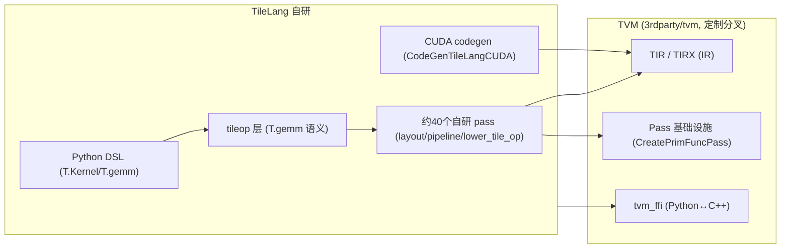
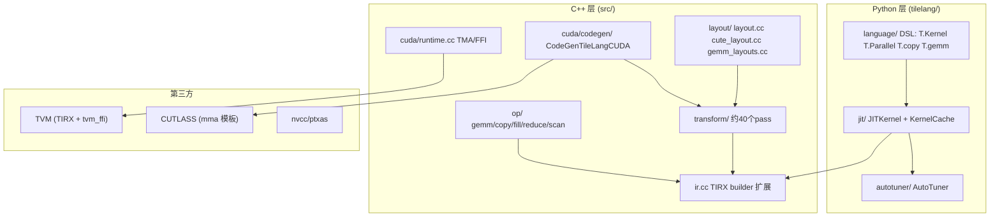

# 01 TileLang 是什么（深度版）

> 本文目标：在概览基础上，深入理解 TileLang 的设计动机、技术选型，以及与 CUDA/TVM/Triton/PyTorch 的本质差异，为后续源码阅读建立正确的思维模型。

## 1. 核心定位

TileLang（tile language）是 tile-ai 组织开源的 **tile 级 GPU 编程语言**。核心承诺一句话：

> 用 Python 写"分块（tile）算法"，编译器自动做布局推断、软件流水线、mma/wgmma 降级，产出接近**手写 CUDA** 的性能。

它不是一个通用编程语言，而是一个**面向高性能算子开发的领域专用语言（DSL）**，目标受众是写 GEMM、FlashAttention、Mamba 等算子的系统/AI 工程师。

## 2. 设计动机：为什么还要一个新的 GPU 语言

| 现有方案 | 痛点 | TileLang 的回应 |
| --- | --- | --- |
| 手写 CUDA | 线程/布局/共享内存/pipeline 全要手工，开发慢、易错 | DSL 自动推断布局与同步 |
| Triton | 性能天花板有限、pass 不可定制、无共享内存控制 | 显式 shared/fragment + 自研 pass 链 |
| cuBLAS/库 | 无法自定义算子、融合受限 | 语言级自由组合 |
| torch 算子 | 性能浪费、启动开销大 | JIT 编译出高效 kernel |

TileLang 的关键主张：**通过可编程的编译器（pass 链可注入），在保持易用性的同时达到手写 CUDA 的性能**。

## 3. 技术选型：为什么基于 TVM

这是理解 TileLang 的**分水岭**。TileLang 不是自研编译器，而是站在 TVM 的肩膀上：

**要点（已确认）**：
- `3rdparty/tvm` 是 TileLang 自己的定制分叉（`git submodule status` 中 commit `8df8ebd6`，分支 `heads/tilelang_main`），带 TIRX 扩展。
- 复用了 TVM 的 **IR 体系**（PrimExpr/Buffer/Stmt）、**Pass 框架**（`CreatePrimFuncPass`，见 `src/transform/layout_inference.cc:1266`）、**FFI 绑定**（tvm_ffi）。
- **自研部分**：tile DSL、tileop 语义层、约 40 个 transform pass、CUDA codegen。

> 对比：Triton 走的是 **MLIR 技术栈**（自研 ttir/ttgir dialect）。所以 Triton 学 MLIR，TileLang 学 TVM。这是两者最本质的区别（详见 `18_与Triton对比.md`）。

## 4. 三层架构

## 5. 关键思维模型

### 5.1 "eager builder" 而不是 "AST 解释器"

TileLang 的 DSL 是**即时构建**（eager）的：`@tilelang.jit` 修饰的函数首次调用时，`tilelang/language/eager/builder.py` 逐语句执行 Python 代码，每执行一个 `T.xxx` 就向当前 IR 追加对应节点（`tilelang/language/ast/` 定义节点）。这区别于 Triton 的 `ast.NodeVisitor`（整体解析 AST）。

### 5.2 "编译期常量" 决定 kernel 身份

`T.const("n")` 创建的符号、`compile(n=1024)` 绑定的值，都是编译期常量。它们参与：
- IR 生成（`n` 决定循环上界）；
- 缓存键（`kernel_cache.py:241` 的 `_generate_key`）；
- 特化（同一源码 + 不同 `n` → 不同 kernel）。

### 5.3 "layout 是一切" 

TileLang 的布局系统（fragment/shared/swizzle）是性能核心。详见 `08` 与 `20` 深度解读：一个 m16n8k16 的 mma 片段，每个线程精确持有哪些元素，是由 `tilelang/cuda/intrinsics/layout/mma_layout.py` 的显式公式决定的。

## 6. 与 CUDA 的对应（预览）

| TileLang | CUDA 硬件概念 |
| --- | --- |
| `T.Kernel(grid, threads)` | grid + block |
| `T.Parallel` | 线程级并行（编译器分配 threadIdx） |
| `T.alloc_shared` | shared memory |
| `T.alloc_fragment` | 寄存器（配合 mma） |
| `T.gemm` | mma.sync / wgmma / tcgen05 |
| `T.copy` | cp.async / TMA / ldg/stg |
| `T.Pipelined` | 软件流水线 |

详细映射见 `19_CUDA与GPU概念映射.md`。

## 7. 版本与环境

- 仓库版本：`0.1.13`（`VERSION`），commit `9d5f81b7`。
- 支持后端：CUDA/HIP(ROCm)/Metal/WebGPU/CPU/LLVM（见 `tilelang/` 各后端目录）。
- 支持 dtype：fp16/bf16/fp32/fp64/int8-64/fp8（e4m3/e5m2，`tilelang/language/fp8.py`）。

## 8. 深入自测

1. TileLang 为什么基于 TVM 而非自研？复用与自研的分界线在哪？
2. eager builder 与 Triton 的 AST 遍历有何本质区别？
3. "编译期常量"影响了哪三件事？
4. layout 系统为什么是性能核心？
5. 如果用一句话向同事介绍 TileLang，你会怎么说？

## 9. 下一步

进入 `02_仓库整体架构.md`（深度版）。
