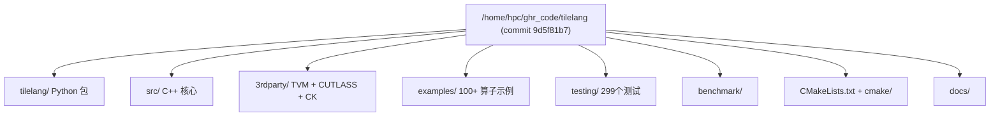
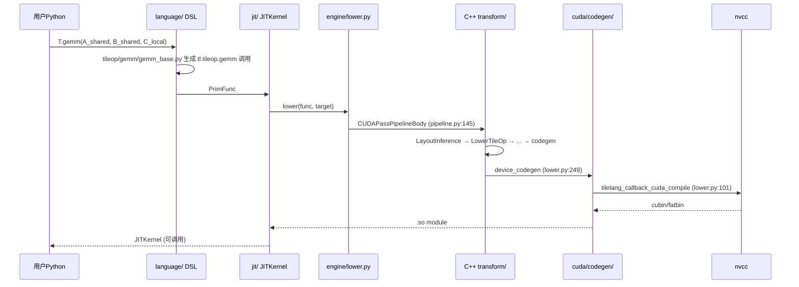

# 02 仓库整体架构（深度版）

> 本文目标：从"目录清单"升级为"源码地图"——每个目录的真实职责、代码规模、关键文件入口，以及数据如何在这些目录间流动。

## 1. 顶层目录全景

## 2. Python 包：tilelang/

| 目录 | 代码规模(约) | 职责 | 关键入口 |
| --- | --- | --- | --- |
| `tilelang/__init__.py` | ~130行 | 顶层 API + lib 加载 + FFI 初始化 | `_init_ffi` |
| `tilelang/language/` | 最大 | DSL 原语（kernel/loop/copy/gemm/allocate） | `kernel.py` `gemm_op.py` |
| `tilelang/language/eager/` | 中 | eager builder：AST→IR | `builder.py` |
| `tilelang/language/ast/` | 中 | IR 节点定义 | `ir.py` |
| `tilelang/language/parser/` | 小 | `T.xxx` 调用解析 | `parser.py` |
| `tilelang/jit/` | 中 | JITKernel + compile | `kernel.py:41` |
| `tilelang/engine/` | 中 | lower 主流程 | `lower.py:297` |
| `tilelang/cache/` | 中 | KernelCache + CUDABinaryCache | `kernel_cache.py:284` |
| `tilelang/backend/` | 中 | pass_pipeline 注册 + device_codegen | `pass_pipeline/pipeline.py:57` |
| `tilelang/cuda/` | 大 | CUDA pipeline + codegen 注册 | `pipeline.py:145` `codegen.py` |
| `tilelang/transform/` | 中 | Python 侧 pass 包装 | `_ffi_api.py` |
| `tilelang/layout/` | 中 | 布局 Python 前端 | `layout.py` `fragment.py` |
| `tilelang/tileop/` | 中 | tile 算子语义（gemm 等） | `gemm/` |
| `tilelang/autotuner/` | 大 | 自动调优 | `tuner.py:230` |
| `tilelang/profiler/` | 小 | do_bench | `bench.py` |
| `tilelang/analysis/` | 小 | IR 分析辅助 | `nested_loop_checker.py` |
| `tilelang/tools/` | 小 | lower_trace / pass_visualizer | |
| `tilelang/utils/` | 小 | 工具函数 | |

## 3. C++ 核心：src/

| 目录 | 职责 | 关键文件 |
| --- | --- | --- |
| `src/ir.cc` | TIRX builder 扩展（`T.Pipelined` 等生成 For+annotation） | `PipelinedFor`（ir.cc:99-132） |
| `src/transform/` | 约40个 pass | `layout_inference.cc`(1266行) `pipeline_planning.cc`(1381行) `inject_pipeline.cc`(4048行) `lower_tile_op.cc`(1592行) |
| `src/op/` | tile 算子 C++ 载体 | `gemm.cc` `copy.cc` `fill.cc` `reduce.cc` `scan.cc` |
| `src/layout/` | 布局数学 | `layout.cc` `gemm_layouts.cc` `cute_layout.cc` |
| `src/backend/common/` | 跨后端工具 | `target_utils.cc` |
| `src/cuda/` | CUDA 后端 | `codegen/codegen_cuda.cc`(6166行) `codegen/rt_mod_cuda.cc` `runtime.cc` |
| `src/tl_templates/` | CUDA 头文件模板 | `cuda/instruction/mma.h` 等 |

## 4. 代码数据流：一次编译的跨层流动

## 5. 后端注册机制（重点）

TileLang 的"目标→实现"映射全部通过**注册表**完成（这是源码导航的关键）：

| 注册表 | 注册点 | 含义 |
| --- | --- | --- |
| `PassPipeline` | `tilelang/backend/pass_pipeline/pipeline.py:40` `register_pipeline` | target → pass 序列 |
| CUDA pipeline | `tilelang/cuda/pipeline.py:145` `CUDAPassPipelineBody` | CUDA 具体 pass 链 |
| `DeviceCodegen` | `tilelang/cuda/codegen.py:16-35` | cuda → `target.build.tilelang_cuda` |
| 执行后端 | `tilelang/cuda/execution_backend.py:34-57` | tvm_ffi/cython/nvrtc/torch |
| tile 算子 | `src/op/gemm.cc:267-295` `TVM_REGISTER_OP` | `tl.tileop.gemm` 等 |

**理解方式**：想找"某个 target 如何编译"→ 顺着 `resolve_pipeline`（pipeline.py:57）追；想找"某个算子如何降级"→ 顺着 `ParseOperator`（layout_inference.cc:530）追到各 op 的 `Lower`。

## 6. 测试与示例的组织

- `testing/python/`：算子级 pytest（如 `test_tilelang_transform_pipeline_planning.py`，流水线行为的重要佐证）。
- `examples/<op>/`：每个算子目录含 `example_*.py` + `test_*.py`。
- `examples/` 总量超 100 个算子（gemm/flash_attention/moe/deepseek 系列等）。

## 7. 深入自测

1. `src/` 下 5 大目录各做什么？各举一个关键文件。
2. `register_pipeline` 与 `CUDAPassPipelineBody` 的关系？
3. 想加一个 pass，改哪里？想加一个算子，改哪里？
4. 数据从 DSL 到 nvcc 经过哪些层？
5. 如何快速定位"某个后端如何编译"？

## 8. 下一步

进入 `03_源码阅读顺序.md`（深度版）。
