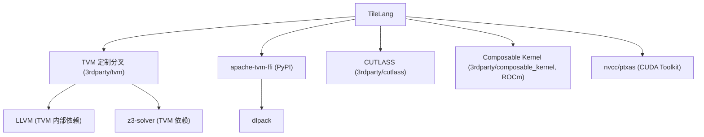
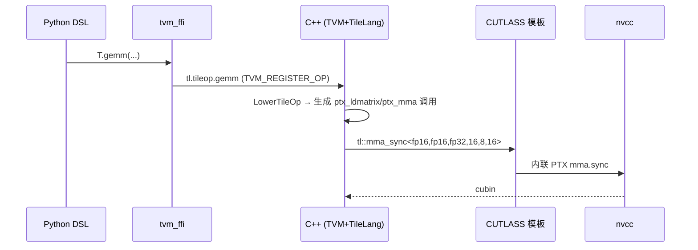

# 04 第三方依赖说明（深度版）

> 本文目标：从"依赖清单"升级为"依赖角色分析"——每个依赖在编译链中到底提供什么、TileLang 如何与它交互、哪些是源码构建必需。

## 1. 依赖全景



## 2. 依赖角色详解

### 2.1 TVM（最核心）—— "编译器基础设施即服务"

TileLang 复用 TVM 的：
- **IR**：`PrimExpr`/`Buffer`/`Stmt`/`PrimFunc`/`IRModule`。
- **Pass 框架**：`tvm::transform::Pass`、`CreatePrimFuncPass`（`src/transform/layout_inference.cc:1266`）、`PassContext`。
- **算术分析**：`arith::Analyzer`、`arith::DetectIterMap`、`arith::InverseAffineIterMap`（布局 inverse 用，`src/layout/layout.cc:790-844`）。
- **codegen 基类**：`CodeGenC`（`codegen_cuda.cc` 继承它）。

> 注意：这是 **TileLang 的 TVM 分叉**（带 TIRX 扩展），不是官方 apache/tvm。`3rdparty/tvm` commit `8df8ebd6`。

### 2.2 tvm_ffi —— "Python↔C++ 的血管"

- PyPI 依赖 `apache-tvm-ffi>=0.1.11,<0.1.13`。
- 提供：FFI 函数注册/调用、`tvm_ffi.init_ffi_api("tl.transform", __name__)`（`tilelang/transform/_ffi_api.py:6`）。
- 提供 dlpack 零拷贝张量交换（`JITKernel.__call__` 传 torch 张量，`tilelang/jit/adapter/tvm_ffi.py:224-284`）。
- `torch-c-dlpack-ext` 提供预编译 torch 扩展，避免首次导入 JIT 编译。

### 2.3 CUTLASS —— "mma 指令模板库"

- 用于 codegen 最终发射 mma 指令：`tl::mma_sync<...>` → `cute::SM80_16x8x16_F32F16F16F32_TN` → 内联 PTX `mma.sync.aligned.m16n8k16...`（`src/tl_templates/cuda/instruction/mma.h:196-197` → `3rdparty/cutlass/include/cute/arch/mma_sm80.hpp:172-181`）。
- 也用于 `ldmatrix.sync` 模板（`ldsm.h`）。
- 结论：**CUTLASS 主要提供"最后一跳"的指令模板**，不是提供算子库。

### 2.4 Composable Kernel —— ROCm 后端

- 仅 AMD 后端使用，本机（RTX 4090）不参与 CUDA 链路。

### 2.5 nvcc/ptxas —— 离线编译

- `tilelang_callback_cuda_compile`（`lower.py:101`）拼 nvcc 命令：
  ```python
  options = ["-std=c++20", "-I"+TILELANG_TEMPLATE_PATH, "-I"+CUTLASS_INCLUDE_DIR]
  cmd = [nvcc, f"-ccbin={g++}", f"--{target_format}", "-O3", "-lineinfo", arch, "-o", out, temp_code]
  ```
- 单 arch → `--cubin`；多 arch → `--fatbin`（`lower.py:110`）。
- 可传 `--use_fast_math`（pass_config `tl.enable_fast_math`）、`--ptxas-options` 等。

### 2.6 LLVM —— TVM 的内部依赖

- 用于 TVM 的 CPU codegen、一些分析。
- 构建时由 `3rdparty/tvm` 内部处理，通常不需要单独装。

### 2.7 z3 —— 约束求解

- TVM 的 `arith` 分析可能用到。构建脚本里有 `cmake/pypi-z3/FindZ3.cmake`。

## 3. 依赖与编译链的关系



## 4. 依赖版本锁定（已确认）

| 依赖 | 版本 | 来源 |
| --- | --- | --- |
| tvm | 定制分叉 commit 8df8ebd6 | 3rdparty/tvm |
| cutlass | b2dd65dc (v4.1.0-31) | 3rdparty/cutlass |
| composable_kernel | b38bb492 | 3rdparty/composable_kernel |
| apache-tvm-ffi | >=0.1.11,<0.1.13 | PyPI |
| Python | >=3.10 | pyproject.toml:5 |
| CMake | >=3.26 | CMakeLists.txt |

## 5. 深入自测

1. TVM 在 TileLang 中提供哪四类能力？
2. CUTLASS 是"算子库"还是"指令模板库"？证据是什么？
3. nvcc 命令由哪个函数拼装？产物何时是 cubin、何时是 fatbin？
4. tvm_ffi 的两个核心作用？
5. 如果去掉 CUTLASS，TileLang 还能生成 mma 吗？为什么？

## 6. 下一步

进入 `05_Python包架构.md`（深度版）。
