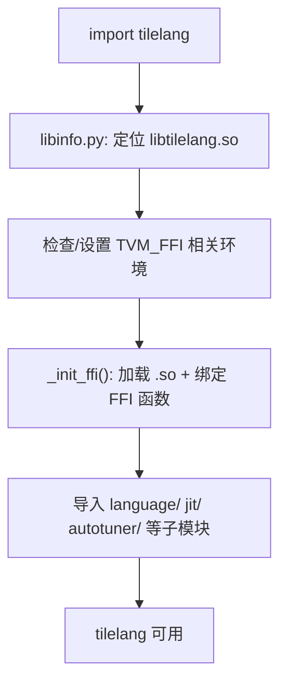
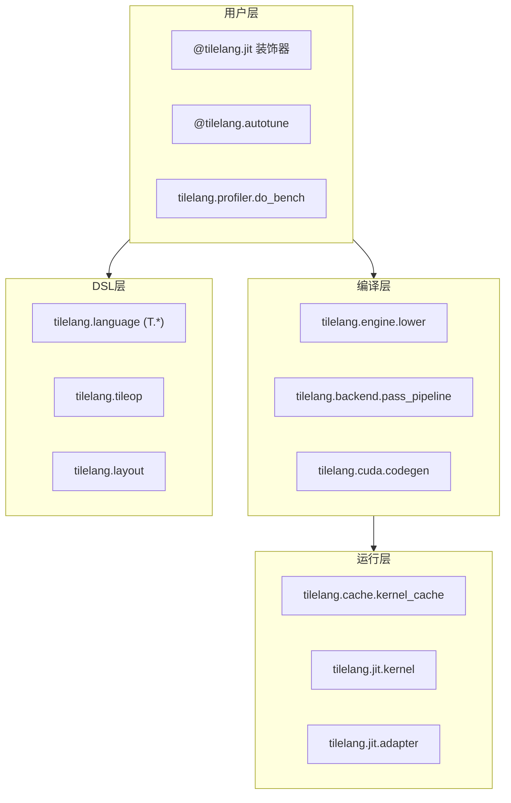

# 05 Python 包架构（深度版）

> 本文目标：深入 Python 包的导入时序、API 分层、以及"Python 如何与 C++ 握手"，特别是 FFI 初始化和 `@tilelang.jit` 的包级入口。

## 1. 导入时序：import tilelang 发生了什么

`tilelang/__init__.py`（约130行）按顺序执行：



关键点：
- `libinfo.py` 找到 `libtilelang.so` 路径（编译产物或 wheel 内）。
- `_init_ffi` 通过 `tvm_ffi` 注册所有 `tl.*` 全局函数。
- 子模块导入顺序敏感（`__init__.py` 注释明确说明）。

## 2. API 分层



## 3. `@tilelang.jit` 的包级实现

入口在 `tilelang/jit/__init__.py`：

```python
@tilelang.jit
def add(...): ...

k = add.compile(n=1024)   # 显式
out = add(n=1024, ...)    # 隐式（首调编译）
```

关键类：
- `JITImpl`：装饰器包装，管理编译参数。
- `JITKernel`（`jit/kernel.py:41`）：编译好的可调用对象。
- `KernelCache`（`cache/kernel_cache.py`）：单例缓存。

调用链（详细见 `21_关键调用链追踪.md`）：
```
add(n=1024) → JITImpl.__call__ → KernelCache.cached(key) 
  → miss → lower() → codegen → nvcc → JITKernel
```

## 4. FFI 初始化机制（深度）

`tilelang/transform/_ffi_api.py:6` 的机制是所有 `tl.*` Python API 的真相来源：
```python
tvm_ffi.init_ffi_api("tl.transform", __name__)
```
- 这行把 C++ 注册的所有 `tl.transform.Xxx` 全局函数，批量绑定为 Python 可调用对象。
- 例如 `tilelang.transform.LayoutInference()` 实际调用 C++ 的 `tl.transform.LayoutInference`。
- C++ 侧注册模式（`src/transform/layout_inference.cc:1278-1281`）：
  ```cpp
  TVM_FFI_STATIC_INIT_BLOCK("tl.transform") {
    refl::GlobalDef().def("tl.transform.LayoutInference", LayoutInference);
  }
  ```

**结论**：Python API ≈ C++ 全局函数名的薄封装。这是"Python 层没有实现、只有转发"的典型模式。

## 5. 关键模块职责（升级版）

### tilelang/engine/lower.py —— 编译主流程
- `lower(func, target, pass_configs)`（:297）：总入口。
- `lower_to_host_device_ir`（:259）：host/device IR 分离。
- `device_codegen`（:249）：调用 `target.build.tilelang_cuda`。
- `tilelang_callback_cuda_compile`（:101-175）：nvcc 编译回调。

### tilelang/backend/pass_pipeline/pipeline.py —— pass 注册表
- `PassPipeline.lower`（:22）。
- `register_pipeline`（:40）。
- `resolve_pipeline`（:57）：按 target 选流水线。

### tilelang/cuda/pipeline.py —— CUDA pass 序列
- `CUDAPassPipelineBody`（:145）：具体 pass 链（见 `08`）。

### tilelang/jit/adapter/ —— 执行后端适配
- `tvm_ffi.py`：dlpack 传参 + 输出分配（`func` 闭包 :224）。
- `cython/`、`nvrtc/`、`cutedsl/`：其他后端。

## 6. Python 侧没有但很关键的"隐藏层"

- `tilelang/language/eager/`：DSL 真正构造 IR 的地方。
- `tilelang/language/ast/`：IR 节点 Python 定义。
- `tilelang/language/parser/`：`T.xxx` 解析。
这三者构成"Python 语法 → IR"的完整翻译链（详见 `09`）。

## 7. 深入自测

1. `import tilelang` 的初始化顺序？
2. `init_ffi_api("tl.transform", __name__)` 的作用与对应 C++ 注册模式？
3. `tilelang.engine.lower` 的四个关键函数？
4. `JITKernel` 与 `KernelCache` 的关系？
5. 为什么说 Python API 是 C++ 全局函数的薄封装？

## 8. 下一步

进入 `06_C++核心架构.md`（深度版）。
