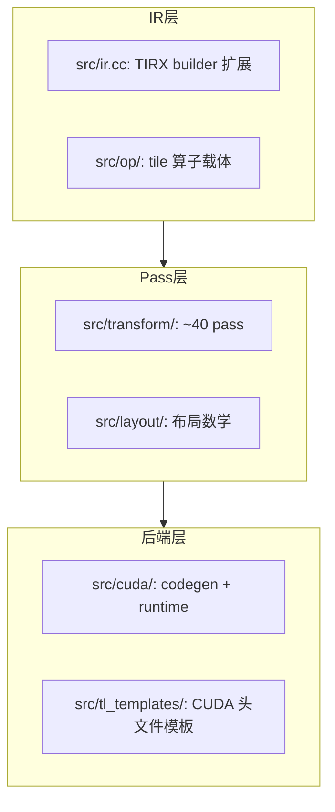

# 06 C++ 核心架构（深度版）

> 本文目标：深入 C++ 侧的三大支柱——IR 扩展、Pass 机制、注册系统，理解它们如何协同产生"从 tile 语义到指令"的变换。

## 1. C++ 目录职责细化



## 2. IR 扩展：src/ir.cc 做了什么

TVM 的 TIR 对 tile 级编程不够用，TileLang 在 C++ 侧扩展。典型例子 `PipelinedFor`（`src/ir.cc:99-132`）：

```cpp
// T.Pipelined(num_stages=3) 生成的 For 循环带 annotation
Map<String, Any> anno;
if (num_stages > 0) anno.Set("num_stages", PrimExpr(num_stages));
...
body = For(vars[0], doms[0]->min, doms[0]->extent, ForKind::kSerial, body,
           /*thread_binding=*/std::nullopt, /*annotations=*/anno, ...);
```

**结论（已确认）**：`T.Pipelined` 在 IR 层就是一个**带 `num_stages` annotation 的普通 `kSerial` For**。真正的流水线是后面 pass 读这个 annotation 才做的。这是"DSL 轻量标记、pass 重量实现"的典型模式。

## 3. Pass 机制：从注册到执行

### 3.1 Pass 工厂

每个 pass 是一个返回 `tvm::transform::Pass` 的工厂函数。例 `LayoutInference`（`layout_inference.cc:1266-1275`）：

```cpp
tvm::transform::Pass LayoutInference() {
  auto pass_func = [=](PrimFunc f, const IRModule &m, const PassContext &ctx) {
    f = LayoutInferencer::Substitute(std::move(f));
    ParallelLoopLayoutValidator::Validate(f->body);
    return f;
  };
  return CreatePrimFuncPass(pass_func, 0, "tl.LayoutInference", {});
}
```

- `CreatePrimFuncPass` 是 TVM 提供的包装：把"PrimFunc→PrimFunc"函数变成完整 Pass。
- 第三参 `"tl.LayoutInference"` 是 pass 名，用于调试/序列化。

### 3.2 注册（FFI 暴露）

```cpp
TVM_FFI_STATIC_INIT_BLOCK("tl.transform") {
  refl::GlobalDef().def("tl.transform.LayoutInference", LayoutInference);
}
```
- `TVM_FFI_STATIC_INIT_BLOCK`：静态初始化，`.so` 加载时执行。
- `refl::GlobalDef().def`：注册全局函数。
- Python 侧 `init_ffi_api("tl.transform", __name__)` 绑定。

### 3.3 执行（PassContext 驱动）

- 所有 pass 在 `tvm.transform.PassContext(opt_level=3, config=pass_configs, ...)` 中运行（`tilelang/jit/kernel.py:274`）。
- pass 内部可用 `PassContext::Current()` 读配置（如 `tl.enable_fast_math`）。

## 4. pass_configs 的读取（深度）

`PassConfigKey`（`tilelang/transform/pass_config.py`）定义所有配置。C++ pass 读取示例：
- `tl.enable_fast_math` → `lower.py` 里传给 nvcc `--use_fast_math`。
- `tl.disable_wgmma` → `src/cuda/op/gemm.cc` 的 `AllowWgmma` 判断。
- `tl.disable_data_race_check` → 数据竞争检查开关。

## 5. 算子载体：src/op/gemm.cc

C++ 侧 tile 算子是**参数载体 + 控制转发器**：
- `TIR_REGISTER_TL_TILE_OP(Gemm, gemm)`（:262）注册 `tl.tileop.gemm`。
- `Gemm` 构造器（:82-143）解析 22 个参数（A/B/C region、transpose、m/n/k、policy 等）。
- `GemmNode::Lower`（:177-220）把控制权**回交给 Python**：调用全局函数 `tl.gemm.lower`。

```cpp
if (const auto f = Function::GetGlobal("tl.gemm.lower")) {
  auto prim_func = Downcast<PrimFunc>((*f)(GetRef<Gemm>(this), ...));
  return SBlockRealize(..., SBlock(..., prim_func->body, ...));
}
```

**重要结论（已确认）**：GEMM 的**指令级 IR 生成在 Python 后端类**（`tilelang/cuda/intrinsics/gemm/gemm_mma.py` 等），C++ 只做参数传递和 pass 驱动。这是一个"Python 实现算法、C++ 提供基础设施"的混合架构。

## 6. 布局数学：src/layout/

- `layout.cc`：`LayoutNode`（input_size + forward_index），offset function 表示。
- `gemm_layouts.cc`：swizzle 三级（32B/64B/128B）、gemm fragment。
- `cute_layout.cc`：CUTLASS/CuTe 兼容表示与互转。

（详见 `20_核心数据结构.md` 深度版，含 XOR 数学表格。）

## 7. CUDA codegen：src/cuda/

- `CodeGenTileLangCUDA`（继承 TVM `CodeGenC`）：TIR→CUDA 文本。
- `rt_mod_cuda.cc`：`BuildTileLangCUDA`（:97）+ `target.build.tilelang_cuda` 注册（:175）。
- `runtime.cc`：TMA 描述符 FFI（`tvm_tensormap_create_tiled` :536）、L2 持久化。

（详见 `22_生成代码深入分析.md` 深度版。）

## 8. 深入自测

1. `T.Pipelined` 在 IR 层是什么？真正的流水线在哪做？
2. Pass 注册的三要素？
3. `GemmNode::Lower` 把控制权交给谁？为什么？
4. `src/layout/` 三个文件各做什么？
5. `CodeGenTileLangCUDA` 继承谁？

## 9. 下一步

进入 `07_从Python_DSL到GPU_Kernel.md`（深度版）。
