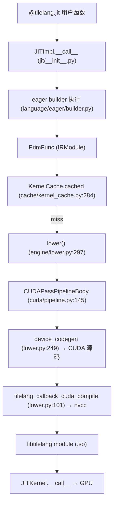

# 07 从 Python DSL 到 GPU Kernel（深度版）

> 本文目标是整套文档的心脏。在前一版基础上，深入每个阶段的**内部机制**：不仅知道"做了什么"，还知道"怎么做的、在哪行代码、IR 长什么样"。

## 1. 端到端链路全景



## 2. 阶段 1：DSL 执行——eager builder

### 机制（已确认）
`tilelang/language/eager/builder.py` 维护一个当前 IR 构建栈。用户函数被逐语句执行，每个 `T.xxx` 调用：
1. 经 `tilelang/language/parser/` 解析；
2. 在 `tilelang/language/ast/` 中生成 IR 节点；
3. 由 builder 追加到当前 IR。

`T.Kernel` 入口（`language/kernel.py:277-340`）：
```python
def Kernel(grid_x, grid_y=None, threads=...):
    return _ffi_api.KernelLaunch(grid_x, grid_y, ..., threads)
```
- `KernelLaunch` 构建一个带 `kThreadBinding` 的 launch frame（`kernel.py:277-340` 已确认）。

### IR 长什么样（伪代码）
```
PrimFunc(A, B, C) with:
  A: Buffer(global, [n], fp32)
  B: Buffer(global, [n], fp32)
  C: Buffer(global, [n], fp32)
  for bx in thread_binding(grid):          # T.Kernel 的 block 循环
    for i in parallel(256):                 # T.Parallel
      C[bx*256+i] = A[bx*256+i] + B[bx*256+i]
```

## 3. 阶段 2：缓存检查

`KernelCache.cached`（`kernel_cache.py:284`）：
- 用 `_generate_key`（:241）算缓存键。
- 命中 → 直接加载 `.so`，跳过全部编译。
- miss → 编译后存盘。

**缓存键组成（已确认，`kernel_cache.py:241-282`）**：
```python
key_data = {
  "func": sha256(func.script(show_meta=True)).hexdigest(),   # IR 脚本
  "out_idx": ...,
  "args_repr": tuple(repr(arg) for arg in args),             # 示例参数
  "target": str(target), "target_host": ...,
  "execution_backend": ...,
  "pass_configs": ..., "compile_flags": ...,
  **self._get_base_key(),   # 版本号 + 可选 libtilelang.so 指纹
}
key = sha256(json.dumps(key_data, sort_keys=True)).hexdigest()
```

## 4. 阶段 3：lower 主流程

`engine/lower.py:297` `lower()` 内部：
```python
# :259 lower_to_host_device_ir
# :249 device_codegen
```

**device_codegen**（:249-251）：
```python
def device_codegen(mod, target, compile_device):
    return resolve_device_codegen(target).lower(mod, target, compile_device)
```
- `resolve_device_codegen` → `tilelang/cuda/codegen.py:16-35` 的 `DeviceCodegen("cuda", build=global_func_device_codegen("target.build.tilelang_cuda"), ...)`。
- 最终调用 C++ `BuildTileLangCUDA`（`src/cuda/codegen/rt_mod_cuda.cc:97`）。

## 5. 阶段 4：pass 流水线（核心）

`CUDAPassPipelineBody`（`tilelang/cuda/pipeline.py:145`）顺序（简版）：
```
MaterializeKernelLaunch → PipelinePlanning → InjectSoftwarePipeline
→ LayoutInference → LowerTileOp → VectorizeLoop → StorageRewrite
→ LowerThreadAllreduce → SplitHostDevice → MergeSharedMemoryAllocations
→ ThreadSync → MakePackedAPI → LowerDeviceKernelLaunch
```

每个 pass 的精确行为见 `08` 深度版。此处以流水线为例展示"pass 改变了什么"。

### 例：`T.Pipelined` 的完整旅程
1. **DSL 层**：`T.Pipelined(32, num_stages=3)` → 带 `num_stages:3` annotation 的 `kSerial` For（`src/ir.cc:116`）。
2. **PipelinePlanning**（`pipeline_planning.cc:1182-1340`）：分析 body 的拷贝/消费，输出：
   ```
   software_pipeline_stage: [0, 2]      # copy→stage0, gemm→stage2
   software_pipeline_order: [0, 1]
   tl_pipelined_num_stages: 3
   software_pipeline_async_producers: [1, 0]
   ```
   （测试 `test_tilelang_transform_pipeline_planning.py:606-609` 确认。）
3. **InjectSoftwarePipeline**（`inject_pipeline.cc:3370-3803`）：
   - 多缓冲：`A_shared[128,32]` → `A_shared[3,128,32]`（shape 前插 num_stages，`:1537-1546`）。
   - 三段式：prologue（展开）+ body（稳态）+ epilogue（排水）。
   - cp.async：`async_commit_queue_scope` → `ptx_commit_group`；`async_wait_queue_scope` → `ptx_wait_group(n)`（`:348-387`）。
4. **LowerCPAsync**（`src/cuda/op/copy.cc:865`）：`tl.ptx_cp_async` 指令。

### 例：`T.gemm` 的降级
`GemmNode::Lower`（`src/op/gemm.cc:177-220`）→ `tl.gemm.lower`（`tileop/gemm/__init__.py:18`）→ `GemmMMA.lower`（`tilelang/cuda/intrinsics/gemm/gemm_mma.py:111` `_gemm_ssr`）：
```python
@T.prim_func
def _gemm_ssr() -> None:
    A_local = T.alloc_local((warp_rows * local_size_a), a_dtype)
    B_local = T.alloc_local((warp_cols * local_size_b), b_dtype)
    if clear_accum: T.clear(C_buf)
    for ki in T.serial(0, (block_K // micro_size_k)):
        mma_emitter.ldmatrix_a(A_local, A_region, ki)
        mma_emitter.ldmatrix_b(B_local, B_region, ki)
        mma_emitter.mma(A_local, B_local, C_buf, ki)
```

## 6. 阶段 5：CUDA codegen

`BuildTileLangCUDA`（`rt_mod_cuda.cc:97-138`）：
1. `cg.Init(false)` 关闭 SSA。
2. 逐函数 `cg.AddFunction(gvar, f)`。
3. `cg.Finish()` 得到 CUDA 源码。
4. 调 `tilelang_callback_cuda_compile` 编译。

**codegen 核心机制（`codegen_cuda.cc`）**：
- `VisitStmt_(ForNode)`（:749）：`kUnrolled` → `#pragma unroll`；区间化简。
- `VisitStmt_(BufferStoreNode)`（:5287）：int4/fp4 打包、向量 `PrintVecStore`。
- `Finish()`（:640-747）：按标志注入头文件（`need_mma_h_` → `<mma.h>` 等）。
- `VisitExpr_(CallNode)`（:2439）：大派发器——cp.async/mma/ldmatrix/TMA 全在这。

## 7. 阶段 6：nvcc 编译

`tilelang_callback_cuda_compile`（`lower.py:101-175`）：
```python
arch = [f"-arch=sm_{target_arch}"]  # 或 -gencode
compile_format = "fatbin" if len(target_code_list) > 1 else "cubin"
options = ["-std=c++20", "-I"+TILELANG_TEMPLATE_PATH, "-I"+CUTLASS_INCLUDE_DIR, ...]
# nvcc.py:compile_cuda 拼最终命令
cmd = [nvcc, f"-ccbin={g++}", f"--{target_format}", "-O3", "-lineinfo", arch, "-o", out, temp]
```
- 产物通过 `CUDABinaryCache`（`tilelang/cache/cuda_binary_cache.py`）缓存（key 含源码 hash + target + options）。

## 8. 阶段 7：JITKernel 执行

`JITKernel.__call__`（`jit/kernel.py:188`）→ `adapter.func`（`tvm_ffi.py:224-284`）：
```python
for i in range(len(self.params)):
    if i in self.result_idx:
        tensor = torch.empty(*shape, dtype=dtype, device=out_device)  # 分配输出
    else:
        tensor = inputs[ins_idx]; ins_idx += 1
executable(*tensor_list)   # dlpack 零拷贝进 C++
```

## 9. 完整示例：vector add 逐阶段

| 阶段 | 输入 | 输出 | 位置 |
| --- | --- | --- | --- |
| DSL | `@jit def add(A,B)` | PrimFunc | eager/builder.py |
| 缓存 | PrimFunc | key | kernel_cache.py:241 |
| lower | PrimFunc | host+device IR | engine/lower.py:297 |
| pass | IR | 变换后 IR | cuda/pipeline.py:145 |
| codegen | IR | `extern "C" __global__ void add_...` | rt_mod_cuda.cc:97 |
| nvcc | .cu | cubin | lower.py:101 |
| 调用 | torch 张量 | GPU 结果 | tvm_ffi.py:224 |

## 10. 深入自测

1. `T.Pipelined` 从 DSL 到 PTX 的完整旅程涉及哪 4 个文件？
2. 缓存键的 6+ 个组成？
3. `GemmNode::Lower` 交给 Python 哪个全局函数？
4. codegen 的 `Finish()` 根据什么注入头文件？
5. `tilelang_callback_cuda_compile` 何时产物是 cubin、何时是 fatbin？
6. JITKernel 如何分配输出张量？

## 11. 下一步

进入 `08_IR与编译Pass.md`（深度版）。
