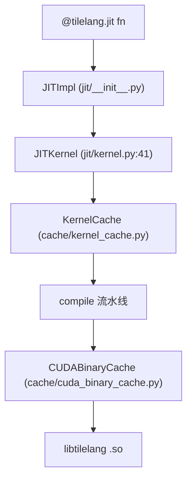

# 10 运行时与 JIT 机制（深度版）

> 本文目标：深入 JIT 的缓存键计算、两层缓存分工、JITKernel 的 dlpack 传参与输出分配，以及 out_idx 机制。

## 1. JIT 架构



## 2. KernelCache 深入

### 2.1 单例
`KernelCache`（`kernel_cache.py:173-189`）：`__new__` 双检锁单例。

### 2.2 缓存键 `_generate_key`（:241-282）逐行
```python
func_binary = func.script(show_meta=True).encode()   # IR 脚本
key_data = {
    "func": sha256(func_binary).hexdigest(),         # IR 哈希
    "out_idx": (tuple(out_idx) if ... else [out_idx]),
    "args_repr": tuple(repr(arg) for arg in args),   # 示例参数 repr
    "target": str(target),
    "target_host": ...,
    "execution_backend": ...,
    "pass_configs": ..., "compile_flags": ...,
    **self._get_base_key(),   # version + 可选 lib 指纹
}
key_string = json.dumps(key_data, sort_keys=True)    # 稳定序列化
return sha256(key_string.encode()).hexdigest()
```
- `_get_base_key()`（:136-147）：`version` + `tilelang_lib`（对 .so 内容 sha256，`env.should_use_kernel_cache_lib_stamp()` 时）——保证 C++ 改动失效。
- `args_repr` 携带 shape/dtype/device——用于区分动态 shape。

### 2.3 磁盘布局
```
TILELANG_CACHE_DIR/<version>/<platform-machine>/kernels/<key>/
├── device_kernel.cu
├── host_kernel.cu
├── kernel_lib.so
└── params.pkl
```
- 写入用 staging + 原子 rename（:476-548）。
- 命中加载走 `JITKernel.from_database`（:749）→ `TVMFFIKernelAdapter.from_database`（tvm_ffi.py:286）→ `runtime.load_module(kernel_lib_path)`。

## 3. CUDABinaryCache 深入

`cache/cuda_binary_cache.py`：
- 位置：`TILELANG_CACHE_DIR/<version>/cuda-binaries/{key}.{cubin|fatbin}`。
- key（`make_key` :89-118）：`tilelang_version` + `code_hash`(CUDA源码) + target + compile_format + options。
  - **注释明确**：fast_math 等选项必须进 key，因为它们改变 SASS 但不改变源码。
- 作用：跳过 nvcc（编译回调内，`lower.py:152-173`）。

### 两层分工

| 维度 | KernelCache | CUDABinaryCache |
| --- | --- | --- |
| 粒度 | 整个 kernel（源码+.so+参数） | 单个二进制 |
| key 输入 | IR脚本+args+target+backend+configs | 源码hash+target+options |
| 复用路径 | 跳过整个编译 | 跳过 nvcc |

**嵌套关系**：KernelCache 命中 → 全跳过；未命中 → 编译流程内先查 CUDABinaryCache 跳过 nvcc。

## 4. JITKernel.__call__ 深入

### 4.1 调用链
`JITKernel.__call__`（`kernel.py:188`）→ `self.torch_function`（`adapter.func`）。

### 4.2 TVMFFIKernelAdapter.func（`tvm_ffi.py:224-284`）
```python
expected_inputs = len(self.params) - len(self.result_idx)
if len(inputs) != expected_inputs: raise ValueError(...)
out_device = next((i.device for i in inputs if isinstance(i, torch.Tensor)), None)
for i in range(len(self.params)):
    if i in self.result_idx:
        tensor = torch.empty(*shape, dtype=dtype, device=out_device)  # 输出分配
    else:
        tensor = inputs[ins_idx]; ins_idx += 1
executable(*tensor_list)   # dlpack
```

### 4.3 动态 shape 解析
输出 shape 中的 `tirx.Var` 通过 `dynamic_symbolic_map`（:145-175）解析：
- 标量参数（`ref_id==2`）：直接取输入值。
- shape 维度（`ref_id==0`）：取已构造输入张量的 `.shape[j]`。
- stride（`ref_id==1`）：`.stride()[j] * stride_scale`（补偿 fp4 亚字节）。

### 4.4 dlpack 传递
`executable(*tensor_list)` → `tvm.runtime.Executable.__call__` → FFI → torch 张量通过 `__dlpack__` 零拷贝转 `DLTensor` → C++ `CUDAWrappedFunc` 打包成 `void*` → `cuLaunchKernel`。

## 5. out_idx 机制（深度）

`out_idx` 在 `compile(out_idx=[2])` 时设置：
- `_legalize_result_idx`（`adapter/base.py:33-53`）：归一化（负索引转正）。
- 运行时，`result_idx` 中的位置**不消费输入**，由 adapter 用 `torch.empty` 分配。
- 输入数必须 = `len(params) - len(result_idx)`。
- 单输出返回单个张量，多输出返回列表。

## 6. 环境变量

| 变量 | 作用 |
| --- | --- |
| `TILELANG_CACHE_DIR` | 缓存根目录 |
| `TILELANG_ENABLE_CACHE` | 缓存开关 |
| `TILELANG_DEFAULT_TARGET` | 默认 target |
| `TILELANG_EXECUTION_BACKEND` | 执行后端 |
| `TILELANG_VERBOSE` | verbose |
| `TL_*` | pass 相关（见 `08`） |

## 7. 动手实验（深度）

```bash
mkdir -p /home/hpc/ghr_code/cuda_pytorch/TileLang/experiments/10_jit
# 运行 test_cache.py：观察缓存目录、rebuild、get_kernel_source
```

## 8. 深入自测

1. 缓存键的完整输入列表？
2. KernelCache 与 CUDABinaryCache 的分工？
3. `_get_base_key` 为什么包含 libtilelang.so 指纹？
4. out_idx 如何影响运行时参数解析？
5. 动态 shape 的三个 ref_id 分支？
6. 磁盘缓存原子写入如何保证？

## 9. 下一步

进入 `11_自动调优Autotune.md`（深度版）。
