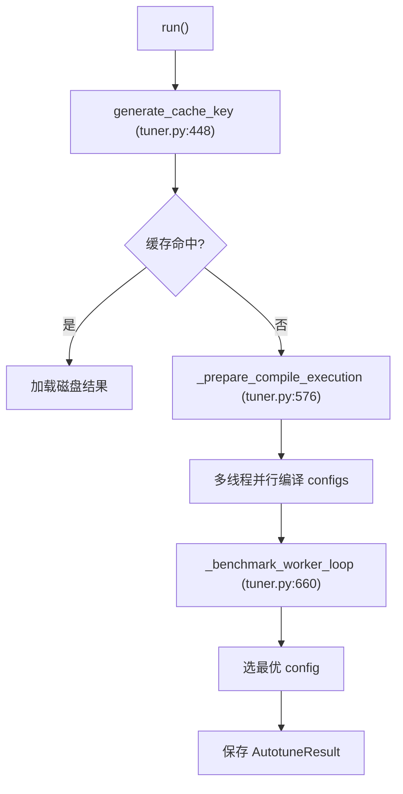

# 11 自动调优 Autotune（深度版）

> 本文目标：深入 AutoTuner 的并行编译、benchmark 流程、缓存键、超时保护、多 GPU 支持。

## 1. 核心文件与类

| 文件 | 内容 |
| --- | --- |
| `tilelang/autotuner/__init__.py` | 导出 `autotune`/`AutoTuner`/`set_autotune_inputs` |
| `tilelang/autotuner/tuner.py` | `AutoTuner`（:230）、主流程 |
| `tilelang/autotuner/param.py` | `CompileArgs`/`ProfileArgs`/`AutotuneResult` |
| `tilelang/autotuner/capture.py` | `set_autotune_inputs` 上下文 |
| `tilelang/autotuner/grouped_compile.py` | 批量编译 |

## 2. 使用方式

```python
@tilelang.autotune(configs=[{"block_M":128, ...}, {...}])
@tilelang.jit
def matmul(...): ...

k = matmul(M=4096, N=4096, K=4096, stages=3)   # 自动搜 block_M 等
```

## 3. AutoTuner 主流程 `run`（`tuner.py:940`）



### 3.1 编译并行
`_resolve_num_compile_workers`（:555）：
```python
num_workers = int(available_cpu_count * cpu_utilizations)  # TILELANG_AUTO_TUNING_CPU_UTILITES
```
- `ThreadPoolExecutor` 并行编译（:590）。
- 每个 worker 绑定 `torch.cuda.set_device(device)`（:594-599）。

### 3.2 benchmark worker
`_benchmark_worker_loop`（:660）：
- 每个 worker 绑定 GPU。
- 超时保护：`_run_benchmark_target` 在 daemon 线程跑，`join(timeout)`。
- 结果通过 queue 收集。

### 3.3 正确性校验
`_benchmark_target`（:771）：
```python
profiler.assert_allclose(ref_prog, input_tensors=..., rtol=..., atol=..., max_mismatched_ratio=...)
latency = profiler.do_bench(n_warmup=warmup, n_repeat=rep, backend=backend, early_stop_baseline=...)
```

## 4. 缓存键（深度）

`generate_cache_key`（:448-486）：
```python
key_data = {
    "version": __version__,
    "op_parameters": 函数默认参数,
    "extra_parameters": 闭包变量,     # 外层 M/N/K
    "func_source": inspect.getsource(self.fn),
    "configs": self.configs,
    "compile_args": hash(self.compile_args),
    "profile_args": hash(self.profile_args),
}
key = sha256(json.dumps(key_data, sort_keys=True)).hexdigest()
```
- 缓存位置：`<cache_root>/autotuner/<key>/`。
- **回调函数（ref_prog/supply_prog/manual_check_prog）不可序列化 → 返回 None 跳过缓存**（:455-463）。

## 5. 超时保护（深度）

`run_with_timeout`（:165-178）：
- POSIX 主线程 → `SIGALRM`（真正中断）。
- 其他 → 看门狗线程 + `PyThreadState_SetAsyncExc`（只在 Python 字节码边界生效）。

## 6. early_stop 与 grouped_compile

- **early_stop**（:949）：当前 config 估算 latency > best × factor 就跳过完整测速。
- **grouped_compile**（:537）：CUDA + tvm_ffi 时，把多个 config 合并成一次编译（`compile_grouped_unit_tvm_ffi`）。

## 7. set_autotune_inputs

`capture.py`：在 `with set_autotune_inputs(a, b)` 内捕获 torch 张量作为调优输入。
- 解决"标量输入无法自动生成"问题（否则 `_validate_input_supply_requirements` 抛 ValueError，:426）。

## 8. 参数速查

`set_profile_args`（:338）：`warmup/rep/timeout/supply_type/ref_prog/rtol/atol/backend`。
`run`（:940）：`use_pipeline/enable_grouped_compile/benchmark_multi_gpu/early_stop`。

## 9. 深入自测

1. AutoTuner 编译与 benchmark 如何并行？
2. 缓存键包含哪些信息？何时跳过缓存？
3. 超时保护的两种机制？
4. early_stop 的公式？
5. set_autotune_inputs 解决什么问题？

## 10. 下一步

进入 `12_编译与安装指南.md`（深度版）。
