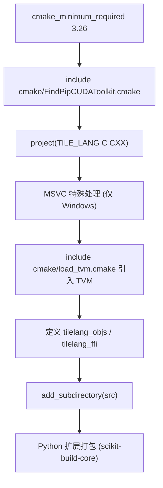
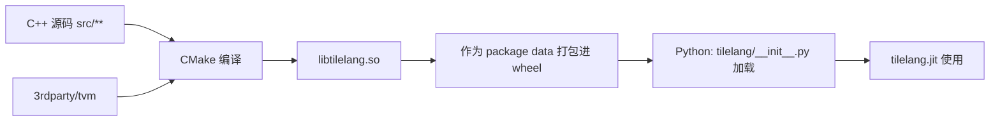

# 13 构建系统解析

## 1. 本文目标

- 理解 TileLang 的 CMake 构建结构：第三方依赖如何引入（TVM、TVM_FFI）。
- 理解 `pyproject.toml` 的打包流程。
- 理解构建产物（`libtilelang.so`）如何被 Python 加载。
- 掌握修改源码后如何重编译。

## 2. 前置知识

- `12_编译与安装指南.md`（操作步骤）。
- `04_第三方依赖说明.md`（依赖角色）。

## 3. 顶层 CMakeLists 结构

`/home/hpc/ghr_code/tilelang/CMakeLists.txt`（已确认）：



### 关键模块
| 文件 | 作用 |
| --- | --- |
| `cmake/FindPipCUDAToolkit.cmake` | 查找 CUDA Toolkit：优先系统安装，其次 pip 包内 | 
| `cmake/load_tvm.cmake` | 引入随源码分发的 TVM（3rdparty）子目录 |
| `cmake/pypi-z3/FindZ3.cmake` | z3（TVM 依赖）查找 |
| `cmake/find_pip_cuda.py` | 辅助脚本，探测 pip 里的 CUDA 工具链 |
| `cmake/ccache_strip_pep517.py` | PEP517 打包辅助 |
| `version_provider.py` | 动态版本号（setuptools_scm 风格） |
| `pyproject.toml` | 打包元数据 + build 配置 |

### 关键 CMake 细节
- `FindPipCUDAToolkit.cmake` **必须在 `project()` 之前 include**（注释明确），这样才能提前设 `CMAKE_CUDA_COMPILER`。
- MSVC 块（Windows）：设 `CMAKE_POLICY_DEFAULT_CMP0141 NEW`、`/Z7` 嵌入式调试信息（避免 C1041 并行写 PDB 竞争）、`/EHsc` 异常、`/bigobj`。
- CMake 4.x 注意：`CMAKE_CURRENT_LIST_DIR` 在 function() 内会解析到调用者，因此用 `set(TILELANG_CMAKELISTS_DIR ...)` 缓存根目录（顶部注释说明）。
- `src/transform/*.cc` 用 `file(GLOB ...)` 自动收集——**新增 pass 文件无需改 CMake**（见 `24`）。

## 4. TVM 与 TVM_FFI 如何进来

- **TVM（TIR 库）**：源码分发的子模块，位于 `3rdparty/tvm`，通过 `cmake/load_tvm.cmake` 引入，构建进同一个 `libtilelang.so`。
- **TVM_FFI（Python 绑定层）**：Python 依赖 `apache-tvm-ffi`（纯 Python + C 扩展），提供 `tvm_ffi` 模块做函数注册与调用（见 `04`）。TileLang 的 `libinfo.py` 检测已编译扩展，`tilelang/__init__.py` 负责加载。

## 5. pyproject.toml 打包细节

`/home/hpc/ghr_code/tilelang/pyproject.toml`（已确认）：
- `[build-system]`：`requires = ["cython>=3.1.0", "scikit-build-core", "z3-solver>=4.13.0,<4.15.5", "patchelf", "ninja", ...]`，**`build-backend = "scikit_build_core.build"`**。
- `[tool.scikit-build]`：`wheel.py-api = "cp38"`、`cmake.version = ">=3.26.1"`、`build-dir = "build"`。
  - `metadata.version.provider = "version_provider"`（读 `VERSION`/git）。
- Windows 覆盖：`cmake.args = ["-G", "Ninja"]`；Linux/macOS 用 scikit-build-core 默认（Makefiles）。

> **关键机制（深度）**：`scikit-build-core` 是"setuptools + CMake"的混合后端——它先跑 CMake 编译 C++ 产出 `libtilelang.so`，再按 `[tool.setuptools]` 的 package-data 配置把它装进 Python 包。**这就是"`pip install -e .` 自动触发 C++ 编译"的根源**。

## 6. 构建产物与加载



- `libtilelang.so` 是所有 C++ 功能（IR 构造、pass、codegen、runtime）的宿主。
- Python 侧通过 `tilelang/libinfo.py` 找到 `.so` 路径，`tilelang/__init__.py` 里 `_init_ffi` 调用 `_ffi_api` 完成函数绑定。
- 单独改 Python 源码不需要重编译；改 C++ 需要重编 `.so`。

## 7. 编译目标（target）在构建时的角色

- **构建期**：`libtilelang.so` 是"通用"的，不绑定具体 GPU arch。
- **运行期**：JIT 用 nvcc/nvrtc 按 `target`（默认 auto 探测）生成该 GPU 的 cubin。
- 因此换 GPU 不需要重编库，只需 JIT 重新编译 kernel（缓存按 target 区分）。

## 8. 如何增量重编译 C++

```bash
cd /home/hpc/ghr_code/tilelang
pip install -e . --no-build-isolation   # 重新触发 CMake 增量编译
```
或手动：
```bash
mkdir -p build && cd build
cmake .. -G Ninja -DCMAKE_BUILD_TYPE=Release
ninja
```
然后把新的 `libtilelang.so` 替换到 Python 包目录（`-e` 安装会自动处理）。

## 9. 如何验证"修改的 C++ 生效"

- 改一个 pass，加一个 `printf`/`LOG(INFO)`。
- 重编译，跑一个用到该 pass 的 kernel。
- 看到打印即生效。

## 10. 常见问题

- **Q：`libtilelang.so` 在哪？** A：`-e` 安装后位于包目录（`tilelang/_lib/libtilelang.so` 或按平台路径）；wheel 内为 package data。
- **Q：只改 Python 需要重编译吗？** A：不需要。
- **Q：改 C++ 后为什么没生效？** A：确保 `-e` 安装且 CMake 增量检测到改动；必要时 `ninja clean` 或删 `build/` 重来。
- **Q：TVM 与 TileLang 版本兼容？** A：子模块由仓库锁定（`git submodule status` 确认无缺失）；pip 依赖只约束 `apache-tvm-ffi` 版本区间。
- **Q：如何 debug 链接问题？** A：`pip install -e . --verbose` 看完整日志；检查 `LD_LIBRARY_PATH`。

## 11. 动手实验

```bash
# 查看构建相关的环境变量与当前包状态
python -c "import tilelang.libinfo as li; print(li.find_lib_path() if hasattr(li,'find_lib_path') else dir(li))"
pip show tilelang 2>/dev/null || echo "tilelang 未以 pip 安装"
```

（如果已编译安装，检查 `import tilelang` 是否正常。）

## 12. 自测题

1. TVM 如何进入构建？
2. `libtilelang.so` 承载什么？
3. 改 Python 与改 C++ 的重编译策略有何不同？
4. `pyproject.toml` 里 `-G Ninja` 如何覆盖？
5. GPU 换了为什么要不要重编译库？

## 13. 本文总结

构建系统 = 顶层 CMake（引入 TVM 子模块）+ `pyproject.toml`（打包/版本）+ `libtilelang.so`（宿主运行时）。区分"构建期通用库"与"运行期 JIT 按 target 编译"是关键心智模型。

## 14. 掌握检查

- [ ] 能画出构建依赖图（CMake → libtilelang.so → Python）
- [ ] 能完成一次 C++ 修改后的增量重编译
- [ ] 能定位 `libtilelang.so` 位置

## 15. 下一步

进入 `14_示例代码研读.md`。
