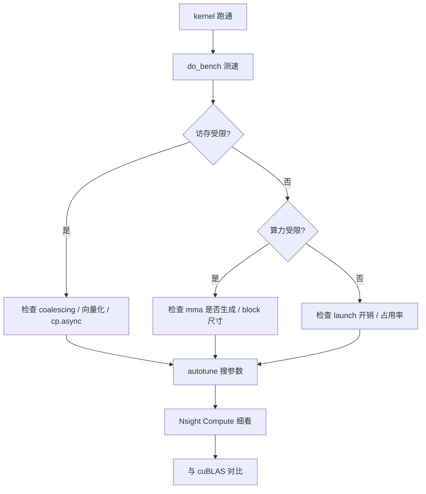

# 17 性能优化（深度版）

> 本文目标：从"列优化手段"升级为"性能调优的决策树"——每个优化开关的收益、成本、适用场景，以及如何量化判断。

## 1. 调优决策树



## 2. 正确测速

```python
from tilelang.profiler import do_bench
lat = do_bench(lambda: k(a, b), warmup=25, rep=100)
tflops = 2 * M * N * K / (lat * 1e-3) / 1e12
```
- 基于 CUDA event。
- 测前 `torch.cuda.synchronize()`。

## 3. 瓶颈判断（Roofline）

RTX 4090 理论峰值：
- fp16：~330 TFLOPS（tensor core）。
- HBM：~1 TB/s。

判断：
- `有效算术强度 = flops / bytes`，与 roofline 斜线对比。
- GEMM fp16 4096³：flops≈1.37e11，bytes≈96MB → 强度≈1428 → 算力受限。

## 4. 关键优化开关（深度）

| 开关 | 收益 | 成本 | 何时开 |
| --- | --- | --- | --- |
| `T.Pipelined(stages≥2)` | 隐藏访存延迟 | 多倍 shared 内存 | GEMM/Attention 必开 |
| `tl.enable_async_copy` | cp.async | 无 | 默认 True |
| `tl.enable_fast_math` | 浮点吞吐 | 精度 | 可接受精度损失时 |
| `tl.disable_safe_memory_legalize` | 去分支 | 越界 UB | 确定不越界时 |
| 向量化（自动） | 宽访存 | - | 对齐保证时 |
| 256-bit 向量化 | LDG/STG.256 | - | 连续访问 |
| `tl.enable_lower_ldgstg` | 非 predicated ldg/stg | - | 全局连续访问 |

## 5. 从生成代码判断优化质量（深度）

看 `get_kernel_source()`：
1. **有 `cp.async`？** → 流水线生效。
2. **有 `mma.sync`/`wgmma`？** → tensor core 生效。
3. **有 `__syncthreads`？** → 同步正确。
4. **有 `float4`/`longlong4` 向量访问？** → 向量化生效。
5. **`__launch_bounds__`？** → block 配置正确。

## 6. autotune 搜索空间

```python
@tilelang.autotune(configs=[
    {"block_M": 128, "block_N": 128, "block_K": 64, "threads": 256, "stages": 2},
    {"block_M": 128, "block_N": 256, "block_K": 64, "threads": 256, "stages": 3},
    ...
])
```
- 维度：block_M/N/K、threads、stages。
- 依赖 `AutoTuner` 并行编译 + 测速（`11`）。

## 7. Nsight 分析

```bash
nsys profile -o /tmp/prof python my_kernel.py     # 时间线
ncu --kernel-name regex python my_kernel.py        # kernel 内部
```
关键指标：Memory Throughput、Compute (SM) Throughput、Achieved Occupancy、stall reasons。

## 8. 常见性能陷阱

1. **mask 过多**：非整除 shape 大量边界判断 → 尽量 padding。
2. **shared 内存 bank conflict**：swizzle 布局错误。
3. **寄存器溢出**：fragment 过大 → spills。
4. **launch 开销**：kernel 太小，host 侧开销主导。

## 9. 深入自测

1. 如何判断访存受限 vs 算力受限？
2. 5 个判断生成代码质量的信号？
3. fast_math 的取舍？
4. 常见性能陷阱 4 个？
5. 调优决策树的完整路径？

## 10. 下一步

进入 `18_与Triton对比.md`（深度版）。
