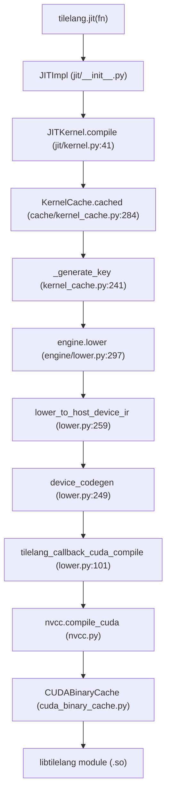
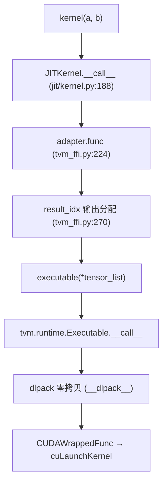
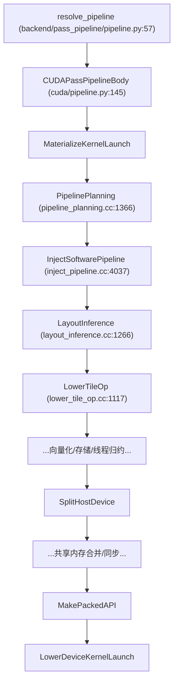
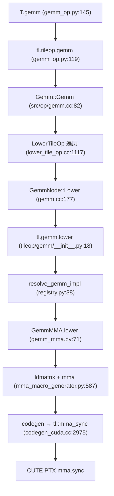

# 21 关键调用链追踪（深度版）

> 本文目标：把 4 条调用链细化到"每个环节的函数、行号、输入输出"，作为源码导航的精确索引。

## 1. 调用链 1：JIT 编译链（源码 → kernel 对象）

**每环节职责**：
- `KernelCache.cached`：查磁盘缓存，命中直接加载。
- `lower`：总入口，host/device IR 分离。
- `device_codegen`：`resolve_device_codegen(target).lower(...)` → `target.build.tilelang_cuda`。
- `tilelang_callback_cuda_compile`：拼 nvcc 命令，先查 CUDABinaryCache。

## 2. 调用链 2：Kernel 执行链

## 3. 调用链 3：Pass 流水线链

## 4. 调用链 4：T.gemm 降级链（深度）

## 5. C++ 注册点汇总（深度）

| 注册点 | 位置 | 内容 |
| --- | --- | --- |
| `CreatePrimFuncPass` | `layout_inference.cc:1266` | pass 工厂 |
| `TVM_FFI_STATIC_INIT_BLOCK` | `layout_inference.cc:1278-1281` | FFI 注册 |
| `TIR_REGISTER_TL_TILE_OP` | `src/op/gemm.cc:262` | `tl.tileop.gemm` |
| `TVM_REGISTER_OP` | `gemm.cc:267-295` | wgmma/tcgen05 变体 |
| `target.build.tilelang_cuda` | `rt_mod_cuda.cc:175-180` | CUDA codegen |
| `tvm_tensormap_create_tiled` | `runtime.cc:536-560` | TMA FFI |
| `register_pipeline` | `pipeline.py:40` | pass 流水线注册 |
| `register_device_codegen` | `cuda/codegen.py:16-35` | device codegen 注册 |
| `register_execution_backend` | `cuda/execution_backend.py:34-57` | 执行后端注册 |

## 6. 深入自测

1. 4 条链各是什么？
2. `device_codegen` 如何找到实现？
3. `tl.gemm.lower` 到 `tl::mma_sync` 经过哪几步？
4. 9 个注册点各注册什么？

## 7. 下一步

进入 `22_生成代码深入分析.md`（深度版）。
