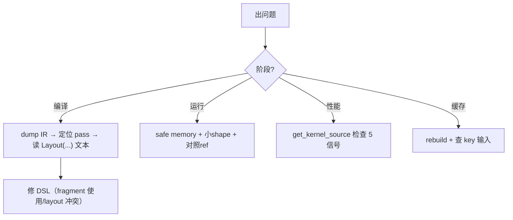

# 23 常见问题排查（深度版）

> 本文目标：深入 6 类问题的根因链，每类给出"机制级"解释（为什么错、哪行代码抛出），而不仅是表面解法。

## 1. 错误分类与根因链

| # | 类别 | 抛出位置 |
| --- | --- | --- |
| 1 | 安装/加载 | `libtilelang.so` 加载 |
| 2 | 编译期 | pass 断言（`LOG(FATAL)`/`ICHECK`） |
| 3 | 运行期 | CUDA runtime error |
| 4 | 性能 | 生成代码质量 |
| 5 | 缓存 | `_generate_key` 键未变 |
| 6 | 环境 | target/arch 不匹配 |

## 2. 编译期 TVMError（深度）

**典型错误**：`The layout for fragment C_local can not be inferred correctly.`
- 根因：`layout_inference.cc:422-429` 的 `ICHECK_NE(layout_map.count(buffer), 0)`。
- 机制：某个 fragment buffer 没有被任何 tileop 的 `InferLayout` 覆盖，且不在漂浮 buffer 集合。
- 排查：
  1. dump IR 看 buffer 的使用。
  2. 检查是否所有 fragment 都参与某个 `T.gemm/T.copy/T.reduce`。
  3. 检查是否在 `if` 条件里访问 fragment（会成"漂浮"）。

**典型错误**：`Get different layout for acc`
- 根因：`layout_inference.cc:259-263` 的 `LOG(FATAL)`。
- 机制：两个 op 对同一 buffer 推了不同布局，无法 merge。
- 排查：看错误里两个 `Layout(...)`/`Fragment(...)` 文本，找出哪个属性冲突（thread_range/shape）。

## 3. 布局错误格式解读（深度）

```cpp
// layout.cc:1128-1147
ss << "Layout(" << InputShape() << " -> " << OutputShape()
   << ", transform: " << GetForwardVars() << " -> " << GetForwardIndex() << ")";
ss << "Fragment(" << ... << ", replicate: " << ReplicateExtent()
   << ", thread: " << ThreadExtent() << ", forward_thread: " << forward_thread_ << ...);
```

**会读这个输出** = 能定位布局冲突。

## 4. 流水线相关错误

- `loopHasDistGreaterThanOne` 拒绝流水：循环携带距离>1 的依赖。
- `isOuterLoop` 拒绝：外层循环。
- 含 `AssertOp/PrintOp` 拒绝流水（Triton 类似，TileLang 也有对应检查）。
- 排查：检查 `T.Pipelined` 的循环是否满足前置条件。

## 5. 运行期错误（深度）

**非法内存访问**：
- 根因：越界、悬垂指针。
- 排查：开 safe memory、小 shape、`torch.cuda.synchronize()` 定位。

**结果错误（全零/NaN）**：
- `T.clear` 缺失 → 累加器未初始化。
- dtype 不匹配 → mma 累加错误。
- 布局错误 → 数据错位。

## 6. 性能差（深度）

- 看 `get_kernel_source()`：无 `mma.sync`、无 `cp.async`、有 `__syncthreads` 过多。
- 布局问题：bank conflict。
- 参数问题：block 尺寸/stages。

## 7. 缓存不生效（深度）

- `_generate_key` 键含 IR 脚本、参数、target、configs、版本、lib 指纹。
- 改 Python DSL → `func.script` 变 → 键变。
- 改 C++ → 需 `libtilelang.so` 指纹参与（`env.should_use_kernel_cache_lib_stamp()`）。
- 强制：删缓存 / `rebuild=True`。

## 8. 环境问题（深度）

- target 不匹配：`TILELANG_DEFAULT_TARGET` 或显式 `{"kind":"cuda","arch":"sm_89"}`。
- CUDA 版本不一致：驱动 vs toolkit。

## 9. 排查 SOP（升级）



## 10. 深入自测

1. `can not be inferred correctly` 的根因与抛出位置？
2. 如何读 `Layout(...)` 错误文本？
3. `Get different layout` 的两步排查？
4. 流水线被拒的三个前置条件？
5. 缓存键为何改 C++ 不自动失效？

## 11. 下一步

进入 `24_源码修改入门.md`（深度版）。
