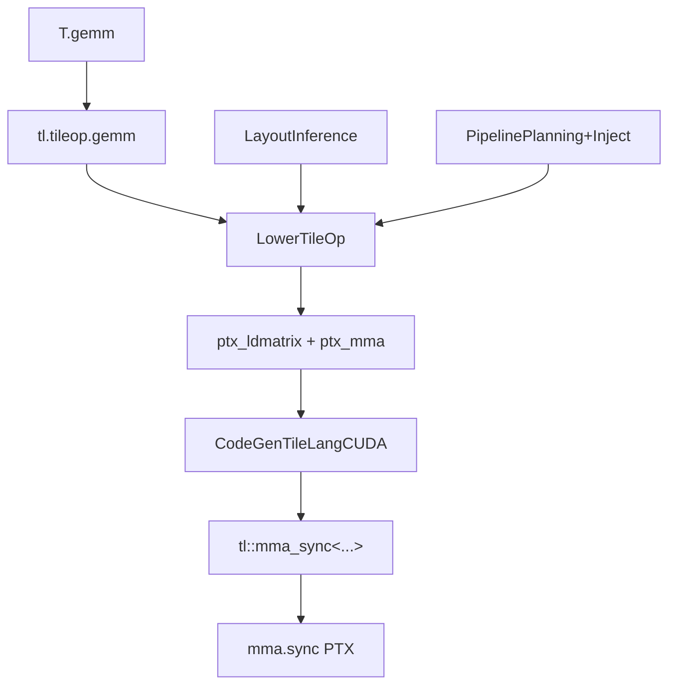

# 26 术语表（深度版）

> 本文目标：每个术语给"一句话定义 + 机制级解释 + 源码位置 + 关联概念"，使之成为查漏工具而非单词表。

## 1. 核心术语

| 术语 | 机制级解释 | 源码位置 |
| --- | --- | --- |
| **Layout** | `input_size + forward_index`（逻辑→物理映射函数），可含 floordiv/xor | `src/layout/layout.cc:499` |
| **Fragment** | Layout + `forward_thread`（线程映射）+ `replicate_size`；local index 由 DivideUnusedIterators 反解 | `layout.cc:966-999` |
| **Forward** | 把占位符 `_i0..` 代入实参求物理坐标 | `layout.cc:591` |
| **Inverse** | DetectIterMap + InverseAffineIterMap 构造反向 Layout（要求双射） | `layout.cc:790-844` |
| **Swizzle** | 128B/64B/32B 三级 XOR（c⊕s），消除 bank conflict | `gemm_layouts.cc:442-528` |
| **InferLevel** | kFree/kCommon/kStrict 三级推断 | `src/op/operator.h:85` |
| **TileOp** | tile 级算子调用（T.copy/T.gemm），IR 里是函数调用节点 | `src/transform/lower_tile_op.cc:1117` |
| **Lower** | 高层表示→低层表示（tileop→指令） | `lower_tile_op.cc` |
| **num_stages** | 软件流水线级数，多缓冲份数 = stage 差 | `pipeline_planning.cc:1182` |
| **Pipeline** | Planning(分析)+Inject(改写 prologue/body/epilogue) | `pipeline_planning.cc` / `inject_pipeline.cc` |
| **cp.async** | global→shared 异步拷贝，`ptx_commit_group/wait_group` 管理 | `copy.cc:865` |
| **mma.sync** | m16n8k16 等矩阵指令，每线程 A4/B2/C4 寄存器 | `codegen_cuda.cc:2975` |
| **wgmma** | Hopper 矩阵指令，B 必须在 shared | `gemm.cc` AllowWgmma |
| **tcgen05** | Blackwell 矩阵指令，C 在 TMEM | `tcgen5_meta.h` |
| **CUDABinaryCache** | 编译回调内缓存 nvcc 产物（跳 nvcc） | `cuda_binary_cache.py:17` |
| **KernelCache** | 整 kernel 缓存（源码+.so+参数） | `kernel_cache.py:33` |
| **out_idx** | 输出张量位置，运行时 torch.empty 分配 | `tvm_ffi.py:270` |
| **execution_backend** | tvm_ffi/cython/nvrtc/torch/cutedsl | `execution_backend.py:34` |
| **PassContext** | pass 配置载体（opt_level + config） | `jit/kernel.py:274` |
| **thread_extent** | 线程绑定属性（MaterializeKernelLaunch 产生） | `materialize_kernel_launch.cc` |

## 2. 概念关系图

## 3. 深入自测

1. Fragment 的三要素？local index 怎么来？
2. Swizzle 消除 bank conflict 的原理？
3. 流水线多缓冲份数 = 什么？
4. mma.sync 每线程寄存器数？
5. 两个缓存的嵌套关系？

## 4. 下一步

进入 `27_学习清单.md`。
